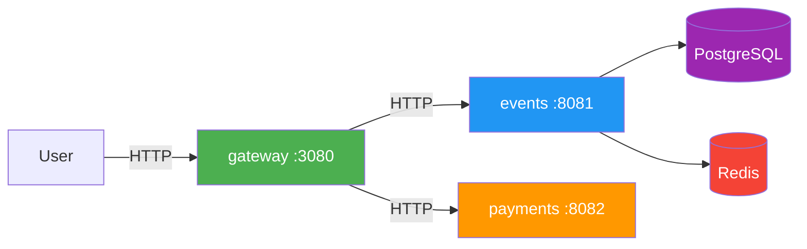
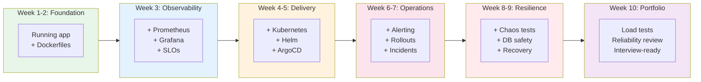

# SRE Intro — Site Reliability Engineering Fundamentals


Welcome to **SRE Intro** — a hands-on elective course that teaches you how to build and operate reliable systems using Site Reliability Engineering practices. You will work with a provided microservice application (**QuickTicket**) and progressively add observability, SLOs, CI/CD, GitOps, progressive delivery, chaos experiments, and database resilience — ending with an interview-ready portfolio project.

> *"Hope is not a strategy."* — Google SRE motto

---

## Course Roadmap

The course follows a **build → observe → define → automate → deliver → alert → break → recover → review** progression. Each week builds on the previous one.

| Week | Lab | Module | Key Topics & Technologies |
|------|-----|--------|---------------------------|
| 1 | Lab 1 | SRE Philosophy & Systems Thinking | SRE vs DevOps, reliability as a feature, error budgets, toil, Docker Compose, failure exploration |
| 2 | Lab 2 | Containerization | Dockerfiles, image layers, container lifecycle, Docker Compose with custom images |
| 3 | Lab 3 | Monitoring, Observability & SLOs | Prometheus, Grafana, Tempo, Loki, four golden signals, SLIs, SLOs, error budgets, recording rules |
| 4 | Lab 4 | Kubernetes & Helm | minikube/k3s, Deployments, Services, Helm charts, kube-prometheus-stack, pod lifecycle |
| 5 | Lab 5 | CI/CD & GitOps | GitHub Actions, container registry, ArgoCD, GitOps workflow, automated deployments |
| 6 | Lab 6 | Alerting & Incident Response | Grafana Alerting, SLO-based alerts, notification channels, runbooks, blameless postmortems |
| 7 | Lab 7 | Progressive Delivery | Argo Rollouts, canary deployments, auto-rollback, AnalysisTemplates, deployment strategies |
| 8 | Lab 8 | Chaos Engineering & Resilience | Hypothesis-driven experiments, fault injection, failure modes, resilience patterns |
| 9 | Lab 9 | Stateful Services & DB Reliability | Alembic migrations, backup/restore, zero-downtime migrations, data resilience |
| 10 | Lab 10 | SRE Portfolio & Reliability Review | Locust load testing, reliability review, toil identification, portfolio assembly |
| -- | Lab 11 | Advanced Microservice Patterns | 4th service, inter-service retries, timeouts, fallback, rate limiting |
| -- | Lab 12 | Advanced Resilience | Multi-replica failover, PodDisruptionBudgets, pod anti-affinity, zero-downtime DB migrations |

---

## The Project: QuickTicket

Throughout the course you work with **QuickTicket** — a 3-service ticket reservation system provided as starter code. You don't build the app; you make it reliable.



| Service | Role | State | Lines |
|---------|------|-------|-------|
| **gateway** | API router, enforces timeouts | Stateless | ~80 |
| **events** | Ticket CRUD, reservations | PostgreSQL + Redis | ~150 |
| **payments** | Mock payment processor | Stateless, tunable failures | ~50 |

**Built-in fault injection** via environment variables:

| Variable | Service | Effect |
|----------|---------|--------|
| `PAYMENT_FAILURE_RATE=0.3` | payments | 30% of charges return 500 |
| `PAYMENT_LATENCY_MS=2000` | payments | Every charge takes 2s+ |
| `DB_MAX_CONNS=3` | events | Tiny connection pool, exhausts under load |
| `GATEWAY_TIMEOUT_MS=3000` | gateway | Gateway gives up after 3s |

All services are pre-instrumented with **OpenTelemetry** (metrics + traces + logs). You deploy the observability stack, not instrument the code.

---

## Lecture Slide Overview

> Slides are extracted from `lectures/lec*.md`. Each lecture targets 17-25 slides, under 1000 lines.

<details>
<summary>📌 Lecture 1 — SRE Philosophy: From Hope to Engineering (23 slides)</summary>

- 📍 Slide 1 – 💥 When Hope Fails (CrowdStrike 2024)
- 📍 Slide 2 – 🎯 Learning Outcomes
- 📍 Slide 3 – 🗺️ Lecture Overview
- 📍 Slide 4 – 🔥 The Problem SRE Solves
- 📍 Slide 5 – 📜 The Birth of SRE (Ben Treynor Sloss, 2003)
- 📍 Slide 6 – 🤝 SRE Meets DevOps (Patrick Debois, 2009)
- 📍 Slide 7 – 🔍 SRE vs DevOps vs Platform Engineering
- 📍 Slide 8 – 🧱 The Old World vs SRE
- 📍 Slide 9 – 💎 Reliability Is a Feature
- 📍 Slide 10 – 📊 SLIs, SLOs, and SLAs
- 📍 Slide 11 – 💰 Error Budgets: The Key Insight
- 📍 Slide 12 – 🌡️ The Four Golden Signals
- 📍 Slide 13 – 🔑 Error Budget In Practice
- 📍 Slide 14 – ❌ What SLOs Are NOT
- 📍 Slide 15 – 🤖 Toil: The Enemy of SRE
- 📍 Slide 16 – ⚖️ The 50% Rule
- 📍 Slide 17 – 🛠️ Toil vs Engineering Work
- 📍 Slide 18 – 💥 When SRE Fails: Real Outages (GitLab, AWS)
- 📍 Slide 19 – 💥 More Real Outages (Facebook, Knight Capital)
- 📍 Slide 20 – 🧪 Your Project: QuickTicket
- 📍 Slide 21 – 🧠 Key Takeaways
- 📍 Slide 22 – 🔄 Mindset Shift
- 📍 Slide 23 – 🚀 What's Next

</details>

<details>
<summary>Lectures 2-10 will be added as the course is developed</summary>

Lecture summaries will appear here as each lecture is created.

</details>

---

## SRE Learning Journey

### Skill Tree

```mermaid
graph TB
    SRE["SRE Mastery"]

    SRE --> F["Foundation"]
    SRE --> O["Observability"]
    SRE --> D["Delivery"]
    SRE --> R["Resilience"]
    SRE --> P["Portfolio"]

    F --> L1["Lab 1: SRE Philosophy<br/>Systems thinking, failure modes"]
    F --> L2["Lab 2: Containerization<br/>Dockerfiles, images, lifecycle"]

    O --> L3["Lab 3: Monitoring & SLOs<br/>Prometheus, Grafana, Tempo, Loki<br/>SLIs, SLOs, error budgets"]
    O --> L6["Lab 6: Alerting & Incidents<br/>Grafana Alerting, runbooks<br/>Postmortems"]

    D --> L4["Lab 4: Kubernetes & Helm<br/>minikube, Helm charts<br/>Pod lifecycle"]
    D --> L5["Lab 5: CI/CD & GitOps<br/>GitHub Actions, ArgoCD"]
    D --> L7["Lab 7: Progressive Delivery<br/>Argo Rollouts, canary<br/>Auto-rollback"]

    R --> L8["Lab 8: Chaos Engineering<br/>Failure experiments<br/>Resilience patterns"]
    R --> L9["Lab 9: DB Reliability<br/>Migrations, backup/restore<br/>Data resilience"]

    P --> L10["Lab 10: Portfolio<br/>Load testing, reliability review<br/>Toil identification"]

    classDef foundation fill:#4CAF50,color:#fff
    classDef observability fill:#2196F3,color:#fff
    classDef delivery fill:#FF9800,color:#fff
    classDef resilience fill:#F44336,color:#fff
    classDef portfolio fill:#9C27B0,color:#fff

    class L1,L2 foundation
    class L3,L6 observability
    class L4,L5,L7 delivery
    class L8,L9 resilience
    class L10 portfolio
```



### Progressive Project Layers



---

## Lab-Based Learning Experience

Labs account for **80% of your grade**. Each lab has up to 4 tasks:

| Task | Points | Description | Required? |
|------|--------|-------------|-----------|
| **Task 1** | 6 pts | Core step that advances the project. Future labs depend on this. | Yes |
| **Task 2** | 3 pts | Deeper dive into the week's topic. Skippable — won't affect future labs. | No |
| **Task 3** | 1 pt | Small task (varies per lab). | Varies |
| **Bonus Task** | 2.5 pts | Challenging enhancement for motivated students. | No |

**Cap: 10 pts main + 2.5 pts bonus = 12.5 per lab.** A student who only completes Task 1 across all 10 labs still has a fully working SRE portfolio project.

### Lab Structure

- Each lab practices concepts from the corresponding lecture
- Tasks have clear deliverables — mostly **CLI output** pasted into `submissions/labN.md`
- Labs build progressively — each week adds a new layer to your QuickTicket deployment
- Collapsible hint sections provide a safety net without hand-holding

### Submission Workflow


<details>
<summary>Detailed Submission Process</summary>

1. **Fork** the course repository to your GitHub account
2. **Clone** your fork locally
3. **Create a feature branch**: `git checkout -b feature/labN`
4. **Complete lab tasks** and create `submissions/labN.md` with:
   - CLI outputs (pasted as code blocks)
   - Brief analysis where requested
   - Screenshots only when there is no CLI alternative
5. **Push and open a PR** from `feature/labN` to the course repo's `main` branch
6. **Submit the PR URL** via Moodle before the deadline

> **Important:** Do not copy QuickTicket source code into your submissions. Only lab reports belong in the `submissions/` directory.

</details>

---

## Grading Policy

<details>
<summary>Lab Grading Breakdown</summary>

**Per-lab scoring (10 required labs):**

| Performance | Points | Description |
|-------------|--------|-------------|
| Perfect | 12.5/12.5 | All tasks + bonus completed with thorough documentation |
| Strong | 8-10/12.5 | Task 1 + Task 2 complete, minor issues |
| Passing | 6/12.5 | Task 1 complete, meets requirements |
| Below Passing | <6/12.5 | Task 1 incomplete or insufficient |

**Minimum passing:** 6 pts per lab (Task 1 completed).

**Late submissions:** Maximum 6/12.5 if submitted within 1 week after deadline. No credit after 1 week.

</details>

<details>
<summary>Exam Exemption Policy</summary>

**Path 1: Exam Replacement**
Complete **both** bonus labs (Lab 11 AND Lab 12) with passing scores. Their combined points replace the exam's 20 points.

**Path 2: Maximum Score**
Complete bonus labs AND take the exam. Best combination applies, capped at 100%.

</details>

---

## Evaluation Framework

### Grade Composition

| Component | Points | Details |
|-----------|--------|---------|
| Required Labs (1-10) | 80 pts | 10 labs, up to 12.5 pts each (10 main + 2.5 bonus), scaled to 8 pts per lab for final grade |
| Final Exam | 20 pts | Comprehensive, or replaced by bonus labs |
| Bonus Labs (11-12) | +20 pts max | Can replace exam |
| **Total Base** | **100 pts** | 60+ required to pass |

<details>
<summary>Performance Tiers</summary>

| Grade | Range | Description |
|-------|-------|-------------|
| **A** | 90-100 | Exceptional — strong portfolio, thorough analysis |
| **B** | 75-89 | Good — main + extra tasks consistently completed |
| **C** | 60-74 | Satisfactory — main tasks completed |
| **D** | 0-59 | Below expectations |

**Example scenarios:**

1. **Task 1 only:** 10 labs x 6 pts = 60 → scaled to 80% → C range + exam needed for B
2. **Task 1 + Task 2:** 10 labs x 10 pts avg = 100 → A range before exam
3. **All tasks + bonus labs:** Maximum achievement, exam exemption

</details>

---

## Success Path

> **Your goal:** By Week 10, have a complete SRE portfolio you can show at interviews — a microservice app with observability, SLOs, GitOps, progressive delivery, chaos experiments, and a reliability review.

<details>
<summary>Tips for Success</summary>

**Lab Completion Strategy:**
- Start each lab within 24 hours of the lecture
- Complete Task 1 first — it's the foundation for everything
- Task 2 deepens understanding; do it if time allows
- Bonus tasks are challenging — for those who want extra experience

**SRE-Specific Tips:**
- Think in terms of **failure modes** — what can go wrong, and how will you know?
- Read the provided QuickTicket source code early — it's only 300 lines
- Keep your monitoring dashboards open while working on every lab
- Every lab after Week 3 should start with "check your SLO dashboard"

**Documentation Best Practices:**
- Paste CLI output, not screenshots (CLI is harder to fake and easier to grade)
- Keep analysis concise — 2-3 sentences per question
- Document surprises — "I expected X but saw Y because Z" is excellent SRE reasoning

**Git Workflow:**
- One branch per lab: `feature/labN`
- Meaningful commit messages: `docs(lab3): add SLO recording rules and dashboard`
- Keep lab reports in `submissions/labN.md`

**Time Management:**
- Main task: ~2-2.5 hours
- Extra task: ~1-1.5 hours
- Bonus task: ~0.5-1 hour
- Don't spend more than 4 hours per week total

</details>

<details>
<summary>Recommended Study Schedule</summary>

**Per-Lab Pattern (weekly):**
- **Day 1-2:** Attend lecture, review slides, skim the lab
- **Day 3-4:** Complete main task
- **Day 5:** Complete extra task (if doing it)
- **Day 6:** Bonus task + polish submission
- **Day 7:** Submit PR via Moodle

**Before Each Lab:**
- Re-read the corresponding lecture slides
- Verify your QuickTicket deployment is healthy
- Check your monitoring dashboards

**After Each Lab:**
- Review PR feedback from TAs
- Make sure your setup is clean for next week
- Note any issues to ask about in office hours

</details>

---

## Technology Stack

All tools are **free and open-source** (or have a free tier).

### Core Stack

| Category | Tool | Introduced |
|----------|------|------------|
| Application | Python 3.12, FastAPI | Week 1 (provided) |
| Containers | Docker, Docker Compose | Week 1 |
| Metrics | Prometheus | Week 3 |
| Dashboards | Grafana | Week 3 |
| Tracing | Grafana Tempo | Week 3 |
| Logging | Loki | Week 3 |
| Telemetry | OpenTelemetry Collector | Week 3 (provided) |
| Orchestration | Kubernetes (minikube/k3s) | Week 4 |
| Packaging | Helm 3 | Week 4 |
| CI/CD | GitHub Actions | Week 5 |
| GitOps | ArgoCD | Week 5 |
| Alerting | Grafana Alerting | Week 6 |
| Progressive Delivery | Argo Rollouts | Week 7 |
| DB Migrations | Alembic | Week 9 |
| Load Testing | Locust | Week 10 |

### Tool Introduction Cadence

```
Week 1:  Docker Compose (already installed)
Week 2:  (Docker — deeper, writing Dockerfiles)
Week 3:  Prometheus + Grafana + Tempo + Loki  ← observability week
Week 4:  Kubernetes + Helm                     ← infrastructure week
Week 5:  GitHub Actions + ArgoCD               ← delivery week
Week 6:  Grafana Alerting (already have Grafana)
Week 7:  Argo Rollouts                         ← one new tool
Week 8:  (none — kubectl + env vars)
Week 9:  Alembic                               ← one new tool
Week 10: Locust                                ← one new tool
```

---

## Required Software

<details>
<summary>Core Tools (all weeks)</summary>

- **Git** — version control
- **Docker** + **Docker Compose** — container runtime
- **Text editor** with Markdown support (VS Code recommended)
- **Web browser** (Chrome or Firefox)
- **Terminal** (bash/zsh)

</details>

<details>
<summary>Week-Specific Tools</summary>

| Week | Additional Tools |
|------|-----------------|
| 3 | Prometheus, Grafana, Tempo, Loki (all via Docker Compose) |
| 4 | minikube or k3s, kubectl, Helm 3 |
| 5 | GitHub account (free), ArgoCD (installed on K8s) |
| 7 | Argo Rollouts kubectl plugin |
| 9 | Python 3.12 + pip (for running Alembic locally) |
| 10 | Locust (`pip install locust`) |

Most tools run inside Docker or Kubernetes — minimal local installation required.

</details>

---

## Key Books & Resources

These are the foundational texts referenced throughout the course:

| Book | Author(s) | Why |
|------|-----------|-----|
| **Site Reliability Engineering** | Beyer, Jones, Petoff, Murphy (Google, 2016) | The original SRE book. Free at [sre.google](https://sre.google/sre-book/table-of-contents/) |
| **The Site Reliability Workbook** | Google (2018) | Practical companion with exercises. Free at [sre.google](https://sre.google/workbook/table-of-contents/) |
| **Implementing Service Level Objectives** | Alex Hidalgo (O'Reilly, 2020) | The definitive guide to SLIs, SLOs, and error budgets |
| **Accelerate** | Forsgren, Humble, Kim (2018) | DORA metrics research — how to measure engineering performance |
| **Chaos Engineering** | Rosenthal, Jones (O'Reilly, 2020) | Principles of controlled failure injection |

<details>
<summary>Additional Resources</summary>

**SRE Fundamentals:**
- [Google SRE Book (free online)](https://sre.google/sre-book/table-of-contents/)
- [Google SRE Workbook (free online)](https://sre.google/workbook/table-of-contents/)
- [SRE Weekly Newsletter](https://sreweekly.com/)

**Monitoring & Observability:**
- [Prometheus Documentation](https://prometheus.io/docs/)
- [Grafana Documentation](https://grafana.com/docs/)
- [OpenTelemetry Documentation](https://opentelemetry.io/docs/)

**Kubernetes:**
- [Kubernetes Official Tutorials](https://kubernetes.io/docs/tutorials/)
- [Helm Documentation](https://helm.sh/docs/)

**GitOps & Delivery:**
- [ArgoCD Documentation](https://argo-cd.readthedocs.io/)
- [Argo Rollouts Documentation](https://argoproj.github.io/argo-rollouts/)

**Incident Management:**
- [PagerDuty Incident Response Guide (free)](https://response.pagerduty.com/)
- [Postmortem Templates Collection](https://github.com/danluu/post-mortems)

**Load Testing:**
- [Locust Documentation](https://docs.locust.io/)

</details>

---

## Repository Structure

```
SRE-Intro/
├── README.md                         # This file
├── app/                              # QuickTicket application code (provided)
│   ├── gateway/                      # API gateway service
│   ├── events/                       # Ticket management service
│   ├── payments/                     # Mock payment service
│   ├── docker-compose.yaml           # Local development stack
│   ├── seed.sql                      # Database seed data
│   └── loadgen/                      # Load generator script
├── monitoring/                       # Monitoring stack (students build from Lab 3)
│   ├── docker-compose.yaml           # Prometheus + Grafana services
│   ├── prometheus/                   # prometheus.yml, recording rules
│   └── grafana/                      # Dashboards, provisioning
├── k8s/                              # Kubernetes manifests (students write from Lab 4)
├── lectures/                         # Lecture slides (provided)
├── labs/                             # Lab specifications (provided)
└── submissions/                      # Student reports — CLI outputs + analysis only
```

> **By Week 10**, your fork is a real SRE portfolio project: application code, K8s manifests, monitoring configs, CI/CD pipelines, and documentation — not just a folder of reports.

---

## Course Completion

Upon completing this course, you will have:

- An understanding of SRE philosophy, principles, and how it differs from traditional operations
- Hands-on experience with the Grafana observability stack (Prometheus, Grafana, Tempo, Loki)
- Defined and measured SLIs, SLOs, and error budgets for a real service
- Deployed applications to Kubernetes using Helm charts
- Built a CI/CD pipeline with GitHub Actions and GitOps via ArgoCD
- Configured SLO-based alerting and practiced incident response with blameless postmortems
- Implemented progressive delivery with Argo Rollouts canary deployments
- Designed and executed chaos experiments to test system resilience
- Managed database migrations and disaster recovery procedures
- A **complete SRE portfolio project** you can demonstrate at interviews

**Bonus achievements (Labs 11-12):**
- Extended a microservice architecture with inter-service resilience patterns
- Implemented advanced Kubernetes resilience (PDB, anti-affinity, zero-downtime migrations)
