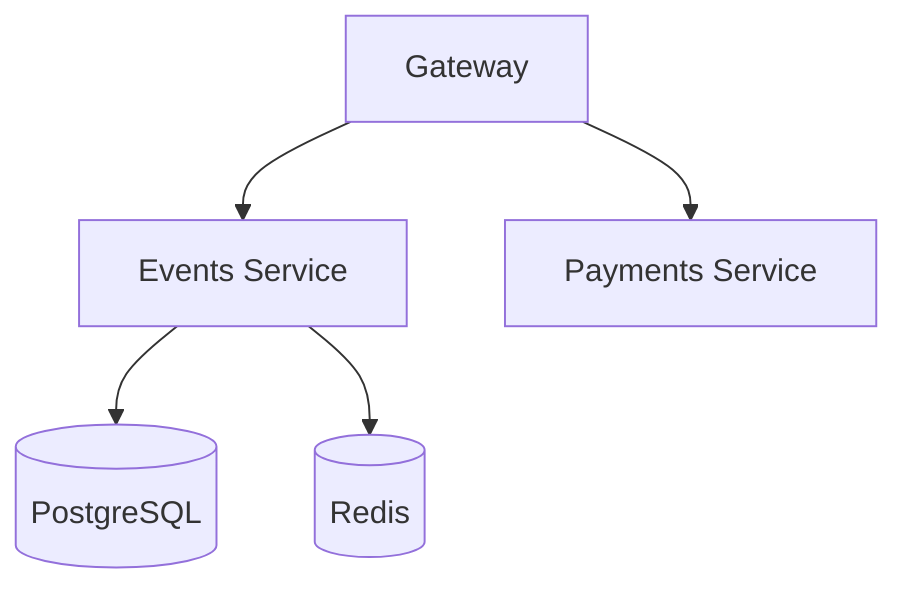

# Lab 1 — SRE Philosophy: Deploy, Break, Understand

## Task 1 — Deploy & Break QuickTicket

### 1. docker compose ps (all 5 services running)

docker compose ps

NAME             IMAGE                COMMAND                  SERVICE    CREATED          STATUS                       PORTS
app-events-1     app-events           "uvicorn main:app --…"   events     11 seconds ago   Up 6 seconds                 0.0.0.0:8081->8081/tcp, [::]:8081->8081/tcp
app-gateway-1    app-gateway          "uvicorn main:app --…"   gateway    8 seconds ago    Up 6 seconds                 0.0.0.0:3080->8080/tcp, [::]:3080->8080/tcp
app-payments-1   app-payments         "uvicorn main:app --…"   payments   11 seconds ago   Up 7 seconds                 0.0.0.0:8082->8082/tcp, [::]:8082->8082/tcp
app-postgres-1   postgres:17-alpine   "docker-entrypoint.s…"   postgres   12 hours ago     Up About an hour (healthy)   0.0.0.0:5432->5432/tcp, [::]:5432->5432/tcp
app-redis-1      redis:7-alpine       "docker-entrypoint.s…"   redis      12 hours ago     Up About an hour (healthy)   0.0.0.0:6379->6379/tcp, [::]:6379->6379/tcp

### 2. Critical path: list → reserve → pay

curl -s http://localhost:3080/events | python3 -m json.tool

[
    {
        "id": 1,
        "name": "Go Conference 2026",
        "venue": "Main Hall A",
        "date": "2026-09-15T09:00:00+00:00",
        "total_tickets": 100,
        "price_cents": 5000,
        "available": 97
    },
    {
        "id": 4,
        "name": "Python Workshop",
        "venue": "Lab 301",
        "date": "2026-09-22T14:00:00+00:00",
        "total_tickets": 25,
        "price_cents": 2000,
        "available": 23
    },
    {
        "id": 2,
        "name": "SRE Meetup",
        "venue": "Room 204",
        "date": "2026-10-01T18:00:00+00:00",
        "total_tickets": 30,
        "price_cents": 0,
        "available": 25
    },
    {
        "id": 5,
        "name": "Kubernetes Deep Dive",
        "venue": "Auditorium B",
        "date": "2026-10-10T10:00:00+00:00",
        "total_tickets": 80,
        "price_cents": 8000,
        "available": 77
    },
    {
        "id": 3,
        "name": "Cloud Native Summit",
        "venue": "Expo Center",
        "date": "2026-11-20T10:00:00+00:00",
        "total_tickets": 500,
        "price_cents": 15000,
        "available": 498
    }
]

curl -s -X POST http://localhost:3080/events/1/reserve \
  -H "Content-Type: application/json" \
  -d '{"quantity": 1}' | python3 -m json.tool

{
    "reservation_id": "696a43ee-e77d-4445-8c79-a07e060c2e7e",
    "event_id": 1,
    "quantity": 1,
    "total_cents": 5000,
    "expires_in_seconds": 300
}

curl -s -X POST http://localhost:3080/reserve/696a43ee-e77d-4445-8c79-a07e060c2e7e/pay | python3 -m json.tool

{
    "order_id": "696a43ee-e77d-4445-8c79-a07e060c2e7e",
    "event_id": 1,
    "quantity": 1,
    "total_cents": 5000,
    "status": "confirmed"
}

### 3. Health check (everything healthy)

curl -s http://localhost:3080/health | python3 -m json.tool

{
    "status": "healthy",
    "checks": {
        "events": "ok",
        "payments": "ok",
        "circuit_payments": "CLOSED"
    }
}

### 4. Dependency map

Scheme:



In text:

gateway → events → postgres
gateway → events → redis
gateway → payments

### 5. Failure table

```
| Component Killed | Events List | Reserve | Pay | Health Check | User Impact |
|-----------------|-------------|---------|-----|--------------|-------------|
| payments        | ✅ Works | ✅ Works | ❌ Fails (502/503) | degraded (payments down) | Can browse & reserve, but cannot pay |
| events          | ❌ Events service timeout | ❌ Events service timeout | ❌ Fails | degraded (events down) | System completely unavailable |
| redis           | ❌ Events service unavailable | ❌ Events service unavailable | ❌ Fails | degraded (events down) | System completely unavailable |
| postgres        | ❌ Events service unavailable | ❌ Events service unavailable | ❌ Fails | degraded (events down) | System completely unavailable |
```

### 6. Load generator output (payments killed mid-run)

./loadgen/run.sh 5 30 &
sleep 5
docker compose stop payments
wait
docker compose start payments

[1] 13378
QuickTicket Load Generator
Target: http://localhost:3080 | RPS: 5 | Duration: 30s
---
[+] Stopping 1/1
 ✔ Container app-payments-1  Stopped                                                      0.0s
[20s] requests=37 success=31 fail=6 error_rate=16.2%
[20s] requests=38 success=32 fail=6 error_rate=15.7%
[20s] requests=39 success=33 fail=6 error_rate=15.3%
---
Done. total=55 success=45 fail=10 error_rate=18.1%
[1]+  Done                       ./loadgen/run.sh 5 30
[+] Running 1/1

Observation: The error rate reached only ~18% because the load generator’s “full purchase” flow (which calls /pay) accounts for only 10% of the traffic; the remaining requests (list events, reserve) continued to succeed even with the payments service down.

## Task 2 — Graceful Degradation

### Diff of gateway change

git diff gateway/main.py > /tmp/task2.diff
cat /tmp/task2.diff
diff --git a/app/gateway/main.py b/app/gateway/main.py

```diff
index c86db33..8cc580c 100644
--- a/app/gateway/main.py
+++ b/app/gateway/main.py
@@ -332,6 +332,16 @@ async def pay_reservation(reservation_id: str):
     except CircuitOpenError:
         log.error("circuit open, skipping payments call")
         raise HTTPException(503, "Payment service temporarily unavailable (circuit open)")
+    except (httpx.ConnectError, httpx.ConnectTimeout):
+        log.warning(f"payments unreachable for reservation {reservation_id}")
+        return JSONResponse(
+            status_code=503,
+            content={
+            "error": "payments_unavailable",
+            "message": "payment service is temporarily down. Your reservation is held - try again in a few minutes.",
+            "reservation_id": reservation_id,
+            },
+        )
     except httpx.TimeoutException:
         raise HTTPException(504, "Payment service timeout")
     except httpx.HTTPStatusError as e:
```

### Verification

curl -s -X POST http://localhost:3080/reserve/8accde3b-a6ec-4240-8113-52606f82895c/pay

{"error":"payments_unavailable","message":"payment service is temporarily down. Your reservation is held - try again in a few minutes.","reservation_id":"8accde3b-a6ec-4240-8113-52606f82895c"}

## Task 3 — GitHub Community Engagement

- ✅ Starred course repo (`inno-devops-labs/SRE-Intro`)
- ✅ Starred [simple-container-com/api](https://github.com/simple-container-com/api)
- ✅ Followed @Cre-eD, @Naghme98, @pierrepicaud
- ✅ Followed 3+ classmates

**Why stars matter:** Starring a repository lets you bookmark useful projects for later, signals popularity/trust to others, and shows up on your profile as a record of your interests.

**Why following matters:** Following developers helps you keep track of teammates' and collaborators' activity, discover new projects through their work, and build professional connections that extend beyond the course.

---

## Bonus Task — Resource Usage Under Load

### Idle

NAME             CPU %     MEM USAGE / LIMIT     NET I/O         PIDS
app-payments-1   0.24%     34.38MiB / 7.427GiB   796B / 126B     1
app-gateway-1    0.26%     38.52MiB / 7.427GiB   483kB / 484kB   2
app-events-1     0.23%     41.25MiB / 7.427GiB   430kB / 558kB   2
app-postgres-1   0.00%     24.27MiB / 7.427GiB   331kB / 376kB   8
app-redis-1      0.80%     3.5MiB / 7.427GiB     90.4kB / 36kB   6

### Under load (10 rps)

NAME             CPU %     MEM USAGE / LIMIT     NET I/O           PIDS
app-payments-1   0.28%     34.85MiB / 7.427GiB   3.7kB / 2.22kB    2
app-gateway-1    6.11%     38.58MiB / 7.427GiB   552kB / 553kB     2
app-events-1     3.51%     41.27MiB / 7.427GiB   491kB / 638kB     2
app-postgres-1   1.24%     24.26MiB / 7.427GiB   365kB / 413kB     8
app-redis-1      0.88%     3.516MiB / 7.427GiB   98.5kB / 39.4kB   6

### Under stress (payments failure_rate=0.3, latency=500ms)

NAME             CPU %     MEM USAGE / LIMIT     NET I/O          PIDS
app-payments-1   0.30%     34.78MiB / 7.427GiB   1.43kB / 866B    2
app-gateway-1    5.23%     38.88MiB / 7.427GiB   805kB / 808kB    2
app-events-1     3.14%     41.33MiB / 7.427GiB   717kB / 929kB    2
app-postgres-1   1.00%     24.38MiB / 7.427GiB   489kB / 558kB    8
app-redis-1      0.76%     3.5MiB / 7.427GiB     122kB / 49.4kB   6

### Analysis
- **Most memory:** events service (~41.25MiB idle, ~41.27MiB under load) — does not change significantly under load.
- **Most CPU under load:** gateway (6.11%) — because it handles all incoming requests, performs JSON parsing, and proxies calls to events and payments.
- **Effect of payments fault injection on gateway:** gateway CPU remained similar (~5.23%) and memory stable (~38.9MiB). The increased latency (500ms) and failure rate did not cause a noticeable resource increase, likely because the gateway returns a 503 quickly for failed payment attempts without waiting for the full timeout.


