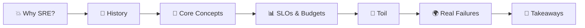
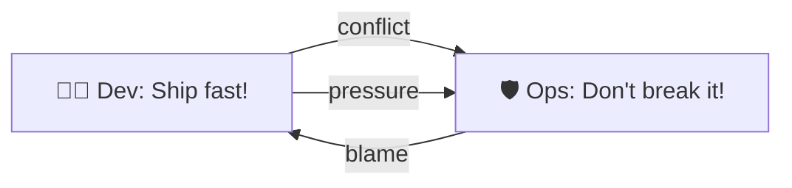
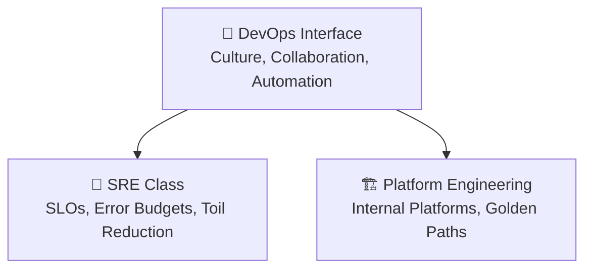
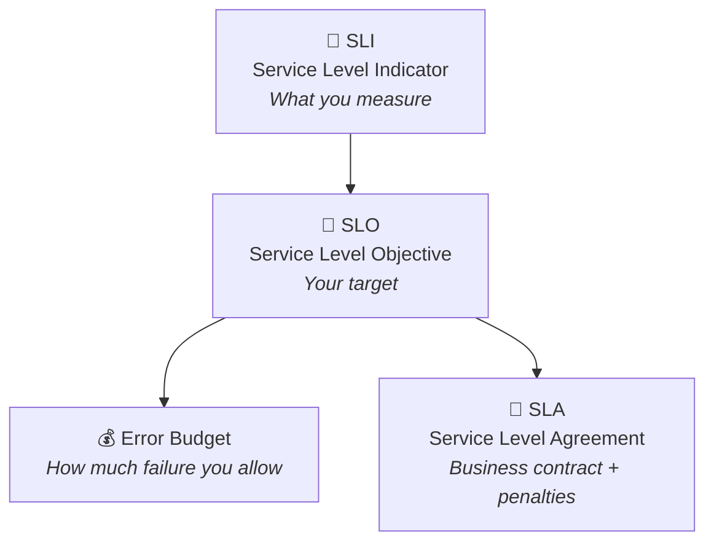
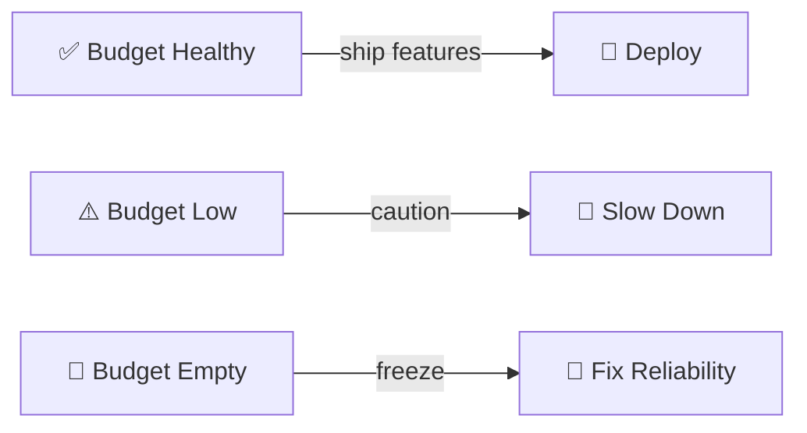
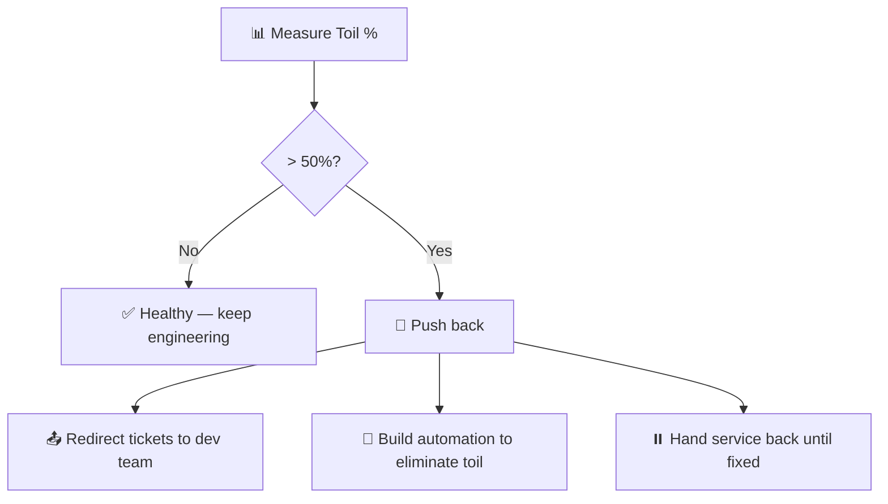
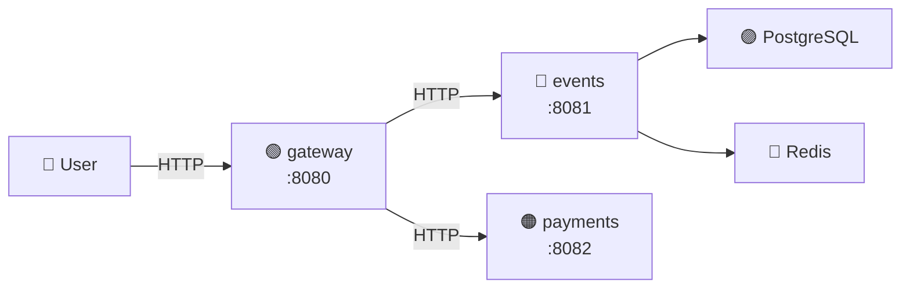
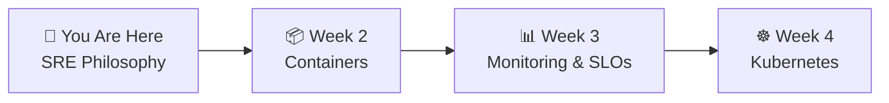

# 📌 Lecture 1 — SRE Philosophy: From Hope to Engineering

---

## 📍 Slide 1 – 💥 When Hope Fails

* 🗓️ **July 19, 2024** — CrowdStrike pushes a faulty update to its Falcon agent
* 💻 **8.5 million Windows machines** enter a boot loop — Blue Screen of Death
* ✈️ Delta cancels 5,000+ flights. Hospitals switch to paper records. Banks go offline.
* 💰 Estimated damage: **$10+ billion** in a single day
* 🔧 Recovery required **manual intervention** on every single affected machine

> 🤔 **Think:** How do you prevent something like this? You can't just "hope" your updates work.

---

## 📍 Slide 2 – 🎯 Learning Outcomes

By the end of this lecture you will:

| # | 🎓 Outcome |
|---|-----------|
| 1 | ✅ Explain what SRE is and how it started at Google |
| 2 | ✅ Distinguish SRE from DevOps and traditional operations |
| 3 | ✅ Define reliability, SLIs, SLOs, and error budgets |
| 4 | ✅ Recognize toil and why eliminating it matters |
| 5 | ✅ Understand why systems fail and how SRE addresses it |

---

## 📍 Slide 3 – 🗺️ Lecture Overview

* 📍 Slides 1-4 — Why does SRE exist?
* 📍 Slides 5-8 — History: from Google to the industry
* 📍 Slides 9-14 — Core concepts: reliability, SLOs, error budgets
* 📍 Slides 15-17 — Toil and the 50% rule
* 📍 Slides 18-20 — Real-world failures
* 📍 Slides 21-23 — Reflection and what's next

---

## 📍 Slide 4 – 🔥 The Problem SRE Solves

> 💬 *"Everything fails all the time."* — Werner Vogels, CTO of Amazon

* 😱 Systems are getting more complex every year
* 🏢 Dev teams want to **ship fast** — new features, experiments, releases
* 🛡️ Ops teams want **stability** — don't break production
* 💥 These goals **conflict** — faster releases mean more risk

> 🤔 **Think:** Who is right — Dev or Ops? What if neither is wrong?

---

## 📍 Slide 5 – 📜 The Birth of SRE

* 🏢 **2003** — **Ben Treynor Sloss** joins Google to run a production team
* 💡 His idea: staff the operations team with **software engineers** who automate everything
* 🛠️ Instead of manual runbooks → write code to fix problems
* 📈 The team started with ~7 engineers. By 2016 → **5,000+ SREs** at Google

> 💬 *"SRE is what happens when you ask a software engineer to design an operations team."*
> — Ben Treynor Sloss

* 📖 In **2016**, Google published *"Site Reliability Engineering"* — the book that defined the discipline
* 🌍 Free to read at [sre.google](https://sre.google/sre-book/table-of-contents/)

---

## 📍 Slide 6 – 🤝 SRE Meets DevOps

* 🗓️ **June 2009** — John Allspaw & Paul Hammond present *"10+ Deploys Per Day"* at Velocity
* 🗓️ **October 2009** — **Patrick Debois** organizes the first **DevOpsDays** in Ghent, Belgium
* 🏷️ The term "DevOps" is born — **Dev**elopment + **Op**erations

> 💡 SRE existed 6 years before DevOps had a name!

* 🔗 Google later published: **"class SRE implements DevOps"**
* 🧩 If DevOps is an **interface** (principles), SRE is a **concrete class** (implementation)

---

## 📍 Slide 7 – 🔍 SRE vs DevOps vs Platform Engineering

| 🏷️ Aspect | 🤝 DevOps | 🔧 SRE | 🏗️ Platform Engineering |
|-----------|----------|--------|------------------------|
| 📋 Type | Culture / movement | Engineering discipline | Product discipline |
| 🎯 Focus | Collaboration | Reliability | Developer experience |
| 📊 Key metric | Deployment frequency | Error budget, SLOs | Developer satisfaction |
| 🗓️ Origin | 2009 (Debois) | 2003 (Treynor/Google) | ~2022 (named) |
| 📖 Key text | *The Phoenix Project* | *Google SRE Book* | Team Topologies |

> 💬 **Simple version:** DevOps says *"work together."* SRE says *"here's exactly how to measure and budget reliability."* Platform Engineering says *"here's a self-service platform so you don't need us."*

---

## 📍 Slide 8 – 🧱 The Old World vs SRE

| 🔥 Traditional Ops | ✅ SRE Approach |
|--------------------|----------------|
| 😰 "Don't touch production!" | 🧪 Change is normal — manage the risk |
| 📋 Manual runbooks | 🤖 Automate everything possible |
| 🎯 100% uptime goal | 📊 Error budgets — perfection is wasteful |
| 🤷 "It works on my machine" | 🔄 Same tools, same environments |
| 😱 Fear of deployments | 🚀 Deploy often, deploy safely |
| 🔎 Blame the person | 📝 Blameless postmortems |

> 🤔 **Think:** Have you seen the "old world" pattern in any team or company? What went wrong?

---

## 📍 Slide 9 – 💎 Reliability Is a Feature

> 💬 *"Reliability is the most important feature of any system."* — Google SRE Book, Chapter 3

* 🎯 Users don't care about your cool new feature if the app is **down**
* 💡 But 100% reliability is the **wrong goal** — here's why:

| 🎯 Target | ⏱️ Allowed Downtime/Month | 💰 Cost to Achieve |
|-----------|--------------------------|-------------------|
| 99% (two nines) | 7.3 hours | 💵 Low |
| 99.9% (three nines) | 43.8 minutes | 💵💵 Moderate |
| 99.99% (four nines) | 4.4 minutes | 💵💵💵 High |
| 99.999% (five nines) | 26.3 seconds | 💵💵💵💵💵 Extreme |

* 📉 Each additional "nine" costs **10x more** but users barely notice the difference
* 🌐 Your users' ISP and WiFi introduce more downtime than the gap between 99.99% and 99.999%

---

## 📍 Slide 10 – 📊 SLIs, SLOs, and SLAs

* 📏 **SLI** — a quantitative measure: *"what % of requests succeed?"*
* 🎯 **SLO** — your target: *"99.9% of requests should succeed"*
* 💰 **Error Budget** — derived from SLO: *"we can afford 0.1% failures"*
* 📜 **SLA** — the legal contract: *"if we drop below X, customer gets credits"*

> 💬 **"SLOs are for engineers. SLAs are for lawyers."**

---

## 📍 Slide 11 – 💰 Error Budgets: The Key Insight

* 🧮 **Error Budget = 1 - SLO**
* 📊 If SLO = 99.9% → Error Budget = 0.1% → **~43 minutes of downtime per month**

> 💡 The error budget is not a target for downtime — it's a **budget for risk-taking**.

* ✅ Budget healthy → ship fast, experiment, take risks
* ⚠️ Budget low → slow down, focus on reliability, reduce risk
* 🚫 Budget exhausted → **freeze** feature launches, fix reliability first

> 🤔 **Think:** Why does this solve the Dev vs Ops conflict? Both teams share the same number.

---

## 📍 Slide 12 – 🌡️ The Four Golden Signals

From the Google SRE Book (Chapter 6) — the four metrics every service should measure:

| 🏷️ Signal | 📏 What it measures | 📊 Example |
|-----------|--------------------|-----------| 
| ⏱️ **Latency** | How long requests take | p50, p95, p99 response time |
| 🚦 **Traffic** | How much demand | Requests per second |
| ❌ **Errors** | How many requests fail | 5xx rate, timeout rate |
| 📈 **Saturation** | How full the system is | CPU %, memory %, queue depth |

> 💬 **"If you can only measure four things, measure these."** — Google SRE Book

* 🔗 In your **QuickTicket** project, you'll measure all four for each service starting in Lab 3

---

## 📍 Slide 13 – 🔑 Error Budget In Practice

**Scenario:** Your SLO is 99.9% availability (43 min/month budget)

| 🗓️ Week 1 | 🗓️ Week 2 | 🗓️ Week 3 | 🗓️ Week 4 |
|-----------|-----------|-----------|-----------|
| ✅ 0 min used | ⚠️ 15 min outage | ✅ 0 min used | ❓ 28 min remaining |

* 📊 After the Week 2 outage: 28 minutes left for the month
* 🚀 Dev team wants to deploy a risky migration in Week 4
* 🤔 **Question:** Should they? They have 28 minutes of budget left.
* 💡 **Answer:** It depends on the risk. If the migration could cause 5 min of downtime → probably fine. If it could cause 60 min → wait until next month.

> 🎯 Error budgets turn "should we deploy?" from a **political debate** into a **math problem**.

---

## 📍 Slide 14 – ❌ What SLOs Are NOT

| ❌ Myth | ✅ Reality |
|---------|----------|
| 😰 "SLOs mean we need 100% uptime" | 📊 SLOs explicitly allow failure — that's the point |
| 🤖 "SLOs are only for big companies" | 🏢 Any team with users benefits from SLOs |
| 📝 "SLOs are set once and never change" | 🔄 SLOs evolve as you learn what users actually need |
| 📏 "More metrics = better SLOs" | 🎯 Fewer, meaningful SLIs beat many vague ones |
| 📜 "SLOs = SLAs" | 💡 SLOs are internal targets; SLAs are external contracts |

> 💬 *"Nines don't matter if users aren't happy."* — the SLO must reflect **user experience**, not just server metrics.

---

## 📍 Slide 15 – 🤖 Toil: The Enemy of SRE

**Google's definition (SRE Book, Chapter 5):** Toil is work that is:

1. 🖐️ **Manual** — a human must do it
2. 🔁 **Repetitive** — done over and over
3. 🤖 **Automatable** — a machine could do it
4. ⚡ **Tactical** — interrupt-driven, reactive
5. 🚫 **No enduring value** — doesn't permanently improve the service
6. 📈 **Scales with service size** — double the users = double the toil

> ⚠️ **Toil is not "work I don't like."** It has a precise definition. A one-time migration is valuable work, not toil.

---

## 📍 Slide 16 – ⚖️ The 50% Rule

* 📏 At Google, SREs must spend **no more than 50%** of their time on toil
* 🔧 The other **50%+ is engineering** — automation, tooling, design
* 🚨 If toil exceeds 50% → the SRE team pushes back:

> 💬 *"If a human has to do it more than twice, write a script. If a script has to do it more than twice, write a service."*

---

## 📍 Slide 17 – 🛠️ Toil vs Engineering Work

| 🤖 Toil (≤ 50%) | 🔧 Engineering (≥ 50%) |
|-----------------|----------------------|
| 🔄 Restarting crashed services | 🤖 Building auto-restart with backoff |
| 📋 Manual deployments | 🚀 CI/CD pipeline |
| 🔍 Checking dashboards by hand | ⚡ SLO-based alerting |
| 📝 Copying config between envs | 📦 Helm charts with values per env |
| 🗃️ Manual database backups | ⏰ Automated CronJob backups |

> 🤔 **Think:** In your own experience (school, work, personal projects) — can you identify something that fits the toil definition?

---

## 📍 Slide 18 – 💥 When SRE Fails: Real Outages

### 🗃️ GitLab — January 31, 2017
* 👨‍💻 Engineer ran `rm -rf` on the **wrong database directory** (production instead of staging)
* 💾 **5 out of 5 backup strategies had failed** or were misconfigured
* ⏱️ **6 hours of data lost**
* 📺 GitLab **live-streamed their recovery** on YouTube — unprecedented transparency
* 🎓 **Lesson:** Test your backups. Defense in depth. Fatigue = risk.

### 🌐 AWS S3 — February 28, 2017
* ⌨️ Engineer typed a command to remove a few S3 servers — **typo removed far more**
* 🌍 Half the internet went down (S3 is everywhere)
* 😂 The **AWS status dashboard** couldn't report the outage — it depended on S3!
* 🎓 **Lesson:** Blast radius control. Don't let your recovery tools depend on the broken thing.

---

## 📍 Slide 19 – 💥 More Real Outages

### 📱 Facebook — October 4, 2021
* 🌐 Routine BGP maintenance → accidentally **removed Facebook from the internet**
* ⏱️ **6 hours** — Facebook, Instagram, WhatsApp, Messenger all down
* 🔒 Engineers couldn't remotely fix it — remote access tools **also depended on Facebook's network**
* 🚗 They had to **physically drive to data centers** — badge readers were also down!
* 🎓 **Lesson:** Out-of-band access. Never let recovery depend on the thing that's broken.

### 💸 Knight Capital — August 1, 2012
* 🧟 Deployment error activated **old, dead code** on trading servers
* ⏱️ In **45 minutes**, lost **$440 million**
* 🏦 Company had to be rescued and was eventually acquired
* 🎓 **Lesson:** Deployment safety. Kill switches. The cost of "just ship it."

> 🤔 **Think:** What do all these incidents have in common? Could SRE practices have prevented them?

---

## 📍 Slide 20 – 🧪 Your Project: QuickTicket

In this course, you'll operate **QuickTicket** — a 3-service ticket reservation system:

* 🟢 **gateway** — routes requests, enforces timeouts
* 🔵 **events** — ticket CRUD, reservations (PostgreSQL + Redis)
* 🟠 **payments** — mock processor with **tunable failure rate**
* 🛠️ You don't build the app — you make it **reliable**
* 📈 Week by week, you add: monitoring → SLOs → K8s → CI/CD → alerting → rollouts → chaos → backups

---

## 📍 Slide 21 – 🧠 Key Takeaways

1. 💡 **SRE is an engineering discipline** — not just "ops with a fancy title"
2. 🎯 **Reliability is a feature** — budget for it like any other feature
3. 📊 **Error budgets** turn Dev vs Ops conflicts into shared math
4. 🤖 **Toil is the enemy** — automate it or it will consume you
5. 📝 **Blame systems, not people** — blameless postmortems drive learning

> 💬 *"Hope is not a strategy."* — Google SRE motto

---

## 📍 Slide 22 – 🔄 Mindset Shift

| 🔥 Old Mindset | ✅ SRE Mindset |
|---------------|---------------|
| 😰 "Failure is unacceptable" | 📊 "Failure is budgeted" |
| 🤞 "Hope it doesn't break" | 🧪 "Test how it breaks" |
| 👤 "Who caused this?" | 🔍 "What caused this?" |
| 🛡️ "Protect production at all costs" | 🚀 "Ship safely within error budget" |
| 📋 "Follow the runbook" | 🤖 "Automate the runbook" |

> 🤔 **Which mindset do you want to operate in?**

---

## 📍 Slide 23 – 🚀 What's Next

* 📍 **Next lecture:** Containerization — packaging apps for reliable deployment
* 🧪 **Lab 1:** Deploy QuickTicket, break it on purpose, map the failure modes
* 📖 **Reading:** Google SRE Book, Chapters 1-3 (free at sre.google)

> 🎯 **Remember:** You're not just learning tools. You're learning to think about **reliability as an engineering problem**.

---

## 📚 Resources

* 📖 [Google SRE Book — Chapters 1-3](https://sre.google/sre-book/table-of-contents/) (free online)
* 📖 [Google SRE Workbook](https://sre.google/workbook/table-of-contents/) (free online)
* 🎥 [Allspaw & Hammond — "10+ Deploys Per Day" (2009)](https://www.youtube.com/watch?v=LdOe18KhtT4)
* 📝 [Facebook outage postmortem (2021)](https://engineering.fb.com/2021/10/05/networking-traffic/outage-details/)
* 📝 [GitLab database incident (2017)](https://about.gitlab.com/blog/2017/02/01/gitlab-dot-com-database-incident/)
* 📖 *The Phoenix Project* — Gene Kim, Kevin Behr, George Spafford (2013) — novel about DevOps transformation
