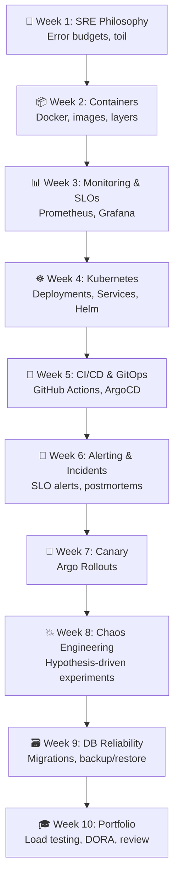

# 📌 Lecture 10 — SRE Portfolio: Pulling It All Together

---

## 📍 Slide 1 – 🎓 The Interview Question

> 💬 *"Tell me about a system you've operated. How did you ensure its reliability?"*

* 🤔 Most students answer: "I deployed it and it worked"
* 🏆 **SRE answer:** "Here's my SLO, here's the alert that fires when I'm burning budget, here's the canary deployment that auto-rolls back, here's the chaos experiment that proved my circuit breaker works, here's the postmortem from when it didn't."
* 📋 That's what you've built over 9 weeks. This week: package it as a portfolio.

---

## 📍 Slide 2 – 🎯 Learning Outcomes

| # | 🎓 Outcome |
|---|-----------|
| 1 | ✅ Run load tests and identify the system's breaking point |
| 2 | ✅ Measure and calculate DORA metrics for your project |
| 3 | ✅ Identify toil and propose automation |
| 4 | ✅ Write a reliability review that demonstrates SRE thinking |
| 5 | ✅ Assemble a portfolio-ready project you can show at interviews |

---

## 📍 Slide 3 – 📊 Load Testing: Find the Breaking Point

* 🔧 **Locust** — Python-native load testing tool
* 📈 Gradually increase load until SLOs are violated
* 🎯 The question: "At what RPS does my system stop meeting 99.5% availability?"

```python
# locustfile.py
from locust import HttpUser, task, between

class QuickTicketUser(HttpUser):
    wait_time = between(1, 3)

    @task(7)
    def list_events(self):
        self.client.get("/events")

    @task(2)
    def reserve(self):
        self.client.post("/events/1/reserve",
            json={"quantity": 1})

    @task(1)
    def health(self):
        self.client.get("/health")
```

* 📊 Run: `locust -f locustfile.py --host=http://localhost:3080`
* 📈 Open Locust UI at `http://localhost:8089`
* 🔍 Watch: at what user count does p99 latency exceed 500ms? At what point does error rate breach SLO?

---

## 📍 Slide 4 – 📊 DORA Metrics

**DORA** = DevOps Research and Assessment (Nicole Forsgren, Jez Humble, Gene Kim — *Accelerate*, 2018)

| 📊 Metric | 📋 What it measures | 🎯 Elite Target |
|----------|-------------------|-----------------| 
| 🚀 **Deployment Frequency** | How often you deploy to production | On-demand (multiple/day) |
| ⏱️ **Lead Time for Changes** | Commit → production time | < 1 hour |
| ❌ **Change Failure Rate** | % of deploys causing failures | < 5% |
| 🔧 **Failed Deployment Recovery Time** | Time to restore after failure | < 1 hour |

> 💡 You can calculate these from YOUR project's Git history and CI/CD pipeline.

---

## 📍 Slide 5 – 🤖 Toil Identification

Recall from Lecture 1 — **toil** is: manual, repetitive, automatable, tactical, no enduring value, scales with service.

| 🤖 Toil You Encountered | 🔧 How to Automate |
|-------------------------|-------------------|
| Running `docker compose up` manually | ArgoCD GitOps (Week 5) ✅ already done |
| Checking dashboards by hand | SLO-based alerting (Week 6) ✅ already done |
| Running pg_dump manually | CronJob backup (Lab 9 bonus) |
| Manually promoting canary | Automated analysis (Lab 7 bonus) |
| Restarting events after postgres | Init container or readiness probe |

> 🤔 **Think:** What repetitive tasks did you do during this course that you could automate?

---

## 📍 Slide 6 – 📋 Reliability Review

A **reliability review** is an SRE document that assesses the current state of a service:

| 📋 Section | 📝 What to write |
|-----------|----------------|
| 📊 **SLO Compliance** | Are we meeting our SLOs? Error budget status? |
| 🔍 **Top Risks** | What are the 3 biggest reliability risks? |
| 🔧 **Improvements** | What would you fix first and why? |
| 📈 **Monitoring Gaps** | What are we NOT monitoring that we should? |
| 🎯 **Capacity** | At what load does the system break? |

> 💡 This is the document you'd present to a team lead or interviewer to demonstrate SRE thinking.

---

## 📍 Slide 7 – 🏢 SRE Career Paths

| 🏢 Role | 🎯 Focus | 🛠️ Key Skills |
|---------|---------|-------------|
| 🔧 **SRE** | Reliability of production services | SLOs, monitoring, incident response, automation |
| 🏗️ **Platform Engineer** | Internal developer platform | K8s, CI/CD, self-service tooling |
| 🔄 **DevOps Engineer** | Delivery pipeline + operations | CI/CD, IaC, containers, cloud |
| 📊 **Production Engineer** (Meta) | Reliability at massive scale | Systems programming, performance |

* 📈 All of these roles value: **monitoring, SLOs, incident response, automation**
* 🎓 Your QuickTicket portfolio demonstrates all of them

---

## 📍 Slide 8 – 🧠 Course Recap



---

## 📍 Slide 9 – 💼 Your Portfolio

By the end of this lab, your GitHub fork contains:

```
SRE-Intro/
├── app/                    # QuickTicket application
├── k8s/                    # Kubernetes manifests you wrote
├── monitoring/             # Prometheus config, recording rules
├── .github/workflows/      # CI/CD pipeline
├── migrations/             # Alembic database migrations
└── submissions/            # Your analysis and reports
    ├── lab1-10.md          # Failure tables, SLOs, postmortems...
    └── reliability-review.md  # Capstone document
```

> 🎯 An interviewer can browse your fork and see: architecture understanding, monitoring, SLOs, GitOps, canary deployments, chaos experiments, incident response, database reliability.

---

## 📍 Slide 10 – 🚀 What's Next (After This Course)

* 📖 Keep reading: Google SRE Book (free), SRE Workbook (free), Alex Hidalgo's SLO book
* 🔧 Explore: service mesh (Istio/Linkerd), distributed tracing (Tempo), platform engineering
* 🏆 Certifications: Google Cloud Professional SRE, AWS DevOps Engineer
* 🎓 Bonus Labs 11-12: microservice patterns + advanced resilience (can replace exam!)
* 💼 Interviews: walk through your QuickTicket portfolio — tell the reliability story

> 💬 *"SRE is not about tools. It's about thinking about reliability as an engineering problem."*

---

## 📚 Resources

* 📖 [Google SRE Book (free)](https://sre.google/sre-book/table-of-contents/)
* 📖 *Accelerate* — Forsgren, Humble, Kim (2018) — DORA metrics
* 📖 [Locust Documentation](https://docs.locust.io/)
* 📖 [DORA Metrics](https://dora.dev/research/)
* 📖 [SREcon talks (free)](https://www.usenix.org/conferences/byname/925)
