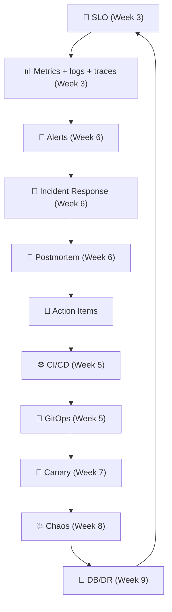
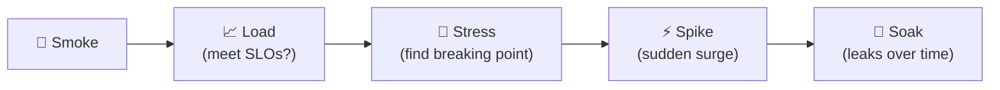
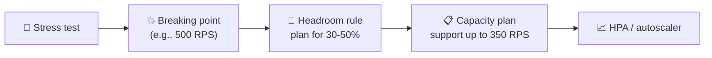
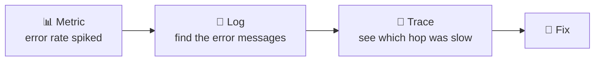
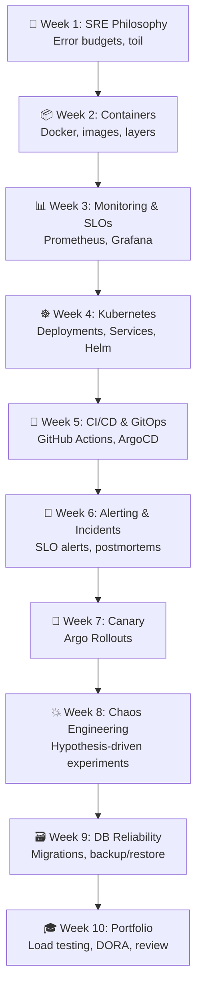
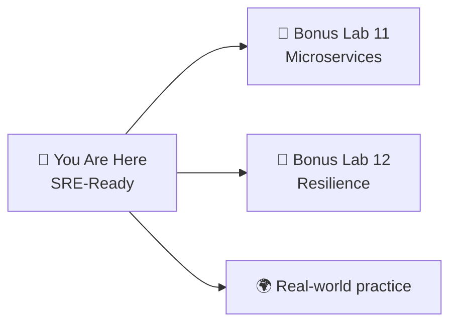

# 📌 Lecture 10 — SRE Portfolio: Pulling It All Together

---

## 📍 Slide 1 – 🎓 The Interview Question

> 💬 *"Tell me about a system you've operated. How did you ensure its reliability?"*

* 🤔 Most students answer: **"I deployed it and it worked."**
* 🏆 **SRE answer:** *"Here's my SLO. Here's the alert that fires when I'm burning budget. Here's the canary deployment that auto-rolls back. Here's the chaos experiment that proved my circuit breaker works. Here's the postmortem from when it didn't."*
* 📋 That's what you've built over 9 weeks. This week: package it as a portfolio.

> 💬 *"Hope is not a strategy."* — Google SRE motto. This course has been teaching you the alternative.

---

## 📍 Slide 2 – 🎯 Learning Outcomes

| # | 🎓 Outcome |
|---|-----------|
| 1 | ✅ Run load tests and identify the system's breaking point |
| 2 | ✅ Classify load tests: smoke, load, stress, spike, soak |
| 3 | ✅ Measure and calculate DORA metrics for your project |
| 4 | ✅ Write an error budget policy |
| 5 | ✅ Identify toil and propose automation |
| 6 | ✅ Write a reliability review that demonstrates SRE thinking |
| 7 | ✅ Assemble a portfolio-ready project you can show at interviews |

---

## 📍 Slide 3 – 🔄 The Full SRE Loop

Everything you learned connects:



* 🧠 Each week extended the loop — **week 10 is where you show you can operate it**.

---

## 📍 Slide 4 – 📊 Load Testing: Types

Not all load tests are the same. Each answers a different question:

| 🏷️ Test | ❓ Question | ⏱️ Duration | 📈 Pattern |
|---------|-----------|-------------|-----------|
| 💨 **Smoke** | Does it start? Basic endpoints work? | 1-2 min | Minimal load |
| 📈 **Load** | Does it meet SLOs at expected peak? | 15-30 min | Steady at peak |
| 🔨 **Stress** | Where does it break? | 30-60 min | Ramp until failure |
| ⚡ **Spike** | Does it survive sudden traffic bursts? | 10-15 min | 0 → peak in seconds |
| 🛌 **Soak / Endurance** | Any leaks or drift over hours? | 4-24 hours | Sustained moderate load |



> 💡 **Fun fact:** Soak tests catch memory leaks that only show after hours. Most load-testing scripts stop at 30 min — leaks go unnoticed until prod.

---

## 📍 Slide 5 – 🦗 Locust: Load Testing in Python

* 🛠️ **Locust** — Python-native load testing tool, open source since 2011
* 👥 Written for **behavioral** load tests (users doing things, not single URL hammering)
* 📊 Built-in web UI at port 8089 showing real-time stats

```python
# locustfile.py
from locust import HttpUser, task, between

class QuickTicketUser(HttpUser):
    wait_time = between(1, 3)

    @task(7)                                # 7x more likely than other tasks
    def list_events(self):
        self.client.get("/events")

    @task(2)
    def reserve(self):
        self.client.post("/events/1/reserve",
            json={"quantity": 1})

    @task(1)
    def health(self):
        self.client.get("/health")
```

```bash
locust -f locustfile.py --host=http://localhost:3080
# Open http://localhost:8089 → set users + spawn rate → watch
```

---

## 📍 Slide 6 – 🔧 Locust vs Alternatives

| 🏷️ Tool | 🎯 Language | 💡 Best for |
|---------|-------------|------------|
| 🦗 **Locust** | Python | Pythonic shops, behavioral tests (chosen for this course) |
| ⚡ **k6** (Grafana Labs) | JavaScript | SaaS-friendly, built-in Grafana dashboards |
| 🧑‍🔬 **JMeter** (Apache) | GUI / XML | Legacy enterprise, tons of plugins |
| 🌊 **Gatling** | Scala/Kotlin DSL | High throughput, great reports |
| 🏹 **Artillery** | YAML / JS | Simple, smoke/load |
| 🐹 **Vegeta** | Go | Constant-rate load on one endpoint |

> 💡 We pick Locust because QuickTicket is Python/FastAPI — one-language course. k6 is equally valid in a JS/TS shop.

---

## 📍 Slide 7 – 📐 Capacity Planning from Load Tests

Load tests become **capacity planning** when you connect results to SLOs:



| 🎯 Metric | 📋 What to record |
|-----------|-------------------|
| 🔨 **Knee** | RPS where latency p99 starts rising steeply |
| 💥 **Breaking point** | RPS where SLO (error or latency) is violated |
| 📊 **Headroom** | Knee ÷ current peak — how much buffer you have |
| 💰 **Unit cost** | CPU / memory per RPS — for forecasting infra spend |

> 🤔 **Think:** Your peak prod is 100 RPS and your system breaks at 200 RPS. What's your headroom factor? Is that enough for Black Friday?

---

## 📍 Slide 8 – 📊 DORA Metrics (Revisited)

**DORA** = DevOps Research and Assessment (Nicole Forsgren, Jez Humble, Gene Kim — *Accelerate*, 2018)

| 📊 Metric | 📋 What it measures | 🏆 Elite (2023 report) |
|----------|-------------------|-------------------------|
| 🚀 **Deployment Frequency** | How often you deploy to production | On-demand (multiple/day) |
| ⏱️ **Lead Time for Changes** | Commit → production time | < 1 day |
| ❌ **Change Failure Rate** | % of deploys causing failures | 0-15% |
| 🔧 **Failed Deployment Recovery Time** | Time to restore after failure | < 1 hour |

**Calculate YOUR numbers from git + CI:**
```
deploys_per_week  = count(merges to main / week)
lead_time         = median(merge_time - first_commit_time)
change_failures   = count(reverts + hotfixes) / total deploys
recovery_time     = median(fix merge_time - incident_start)
```

> 💡 **Compound effect:** Elite teams deploy **973x** more often and recover **6570x** faster than low performers (2021 DORA).

---

## 📍 Slide 9 – 📜 Error Budget Policy

You defined SLOs in Week 3 and alerted on burn rate in Week 6. The **policy** is the written agreement: *what happens when the budget runs out?*

```markdown
# QuickTicket Error Budget Policy

SLO: 99.5% availability over 30 days (budget: 216 min downtime / 30d)

If budget remaining < 25%:
- Freeze non-critical deploys
- On-call priority on reliability work
- Root-cause past incidents before new features

If budget exhausted:
- Full deploy freeze (only rollbacks + SEV fixes)
- Leadership escalation
- Reliability-focused sprint

Reset: at the start of every 30-day window.
```

> 💬 *"An error budget policy without enforcement is just a wish list."* — Google SRE Workbook, Ch. 4

---

## 📍 Slide 10 – 🤖 Toil Identification

Recall from Lecture 1 — **toil** is: manual, repetitive, automatable, tactical, no enduring value, scales with service.

Google's target: **< 50%** of SRE time on toil; the rest is engineering work that reduces future toil.

| 🤖 Toil You Encountered | 🔧 How to Automate |
|-------------------------|-------------------|
| Running `docker compose up` manually | ArgoCD GitOps (Week 5) ✅ already done |
| Checking dashboards by hand | SLO-based alerting (Week 6) ✅ already done |
| Running `pg_dump` manually | CronJob + object storage (Lab 9 bonus) |
| Manually promoting canary | Automated analysis (Lab 7 bonus) |
| Restarting events after postgres | Init container or readiness probe |
| Rotating CI secrets | OIDC federation (Lec 5) |

> 🤔 **Think:** Of all the `kubectl` / `docker compose` commands you ran in labs, which ones did you run *more than 5 times*? Those are candidates to automate.

---

## 📍 Slide 11 – 📋 Reliability Review

A **reliability review** is an SRE document that assesses the current state of a service — and it's exactly the kind of artifact an interviewer loves to see:

| 📋 Section | 📝 What to write |
|-----------|----------------|
| 📊 **SLO Compliance** | Are we meeting our SLOs? Current error budget burn? |
| 🔍 **Top 3 Risks** | Biggest reliability risks, ranked, with impact/likelihood |
| 🔧 **Improvements** | What would you fix first and why? |
| 📈 **Monitoring Gaps** | What are we NOT monitoring that we should? |
| 🎯 **Capacity** | At what load does the system break? Headroom factor? |
| 🧪 **Chaos Findings** | What did experiments reveal? |
| 📖 **Runbook Coverage** | Which alerts have runbooks? Which don't? |

> 💡 This is the document you'd present to a team lead or interviewer to demonstrate SRE thinking.

---

## 📍 Slide 12 – 🔍 The Three Pillars of Observability

You've used all three this course:

| 🏷️ Pillar | 📋 Answers | 🛠️ Tool |
|-----------|-----------|---------|
| 📊 **Metrics** | "What is happening?" (aggregate numbers) | Prometheus |
| 📝 **Logs** | "What happened for this specific request?" | Loki |
| 🔗 **Traces** | "Where was time spent across services?" | Tempo |



> 💡 **Modern term:** some argue for **Observability 2.0** — one wide-event store replacing the three pillars (Honeycomb, OpenTelemetry direction). For now, the three pillars remain the most common framing.

---

## 📍 Slide 13 – 🏢 SRE Career Paths

| 🏢 Role | 🎯 Focus | 🛠️ Key Skills |
|---------|---------|-------------|
| 🔧 **SRE** | Reliability of production services | SLOs, monitoring, incident response, automation |
| 🏗️ **Platform Engineer** | Internal developer platform | K8s, CI/CD, self-service tooling |
| 🔄 **DevOps Engineer** | Delivery pipeline + operations | CI/CD, IaC, containers, cloud |
| 📊 **Production Engineer** (Meta) | Reliability at massive scale | Systems programming, performance |
| 🔐 **DevSecOps** | Delivery with security built in | SAST/DAST, supply chain, IAM |
| 🎯 **Incident Commander / TPM** | Large-scale incident coordination | Leadership, communication |

**What all SRE-adjacent roles value:**
* 📊 Monitoring + SLOs
* 🚒 Incident response
* 🤖 Automation (reduce toil)
* 🔧 Engineering judgment under pressure

> 💡 Your QuickTicket portfolio demonstrates all of these. That's why it works for multiple roles.

---

## 📍 Slide 14 – 🪜 The SRE Level Ladder

Most companies have 4-6 SRE levels. A rough mapping:

| 📈 Level | 🧠 Core skill |
|---------|---------------|
| L1 — Junior | Follows runbooks, handles SEV-3/4, learns the stack |
| L2 — Mid | Designs alerts/dashboards, writes runbooks, leads SEV-2 |
| L3 — Senior | Owns services end-to-end, leads SEV-1 as IC, mentors |
| L4 — Staff | Shapes platform direction, influences org-wide reliability |
| L5 — Principal | Sets strategy, writes "laws of physics" for the company |

**This course** targets **L1 ready** — you can be on-call for QuickTicket. L2+ comes from real production scars.

> 💬 *"You don't become a senior SRE by reading books. You become one by surviving incidents and writing postmortems about them."*

---

## 📍 Slide 15 – 🧠 Course Recap



---

## 📍 Slide 16 – 💼 Your Portfolio

By the end of this lab, your GitHub fork contains:

```
SRE-Intro/
├── app/                    # QuickTicket application
├── k8s/                    # Kubernetes manifests you wrote
├── monitoring/             # Prometheus config, recording rules
├── .github/workflows/      # CI/CD pipeline
├── migrations/             # Alembic database migrations
├── locust/                 # Load test scripts
└── submissions/            # Your analysis and reports
    ├── lab1-10.md          # Failure tables, SLOs, postmortems...
    └── reliability-review.md  # Capstone document
```

> 🎯 An interviewer can browse your fork and see: architecture understanding, monitoring, SLOs, GitOps, canary deployments, chaos experiments, incident response, database reliability.

---

## 📍 Slide 17 – 🎤 The Interview Walkthrough

How to present the portfolio in **5 minutes**:

1. **30s — What it is:** "3-service ticket app I operated for 10 weeks."
2. **60s — Reliability story:** "Defined 99.5% SLO, burn-rate alerts at 14.4x, error budget policy."
3. **60s — Delivery story:** "CI to ghcr, ArgoCD GitOps, canary with Argo Rollouts + automated analysis."
4. **60s — Chaos story:** "Ran N experiments, found X weakness, fixed it, verified with re-run."
5. **60s — Incident story:** "Had an incident when Y, followed runbook, wrote blameless postmortem, action items Z landed."
6. **30s — What's next:** "Gaps I'd close with more time: multi-replica + PDB, anti-affinity, service mesh."

> 💬 **Tip:** Keep a **one-page summary** at the top of your repo README. Interviewers skim.

---

## 📍 Slide 18 – 🧠 Key Takeaways

1. 📈 **Load test every quarter** — find breaking points before customers do; know your headroom
2. 📊 **DORA metrics reveal delivery health** — measure, don't guess
3. 📜 **Error budget policy > SLO alone** — policy is what changes behavior
4. 🤖 **Toil < 50%** — if more, invest in automation
5. 📋 **Reliability review = interview gold** — show SRE thinking, not just tool usage
6. 🎤 **Tell the story** — the portfolio is only as good as your ability to walk through it

> 💬 *"SRE is not about tools. It's about thinking about reliability as an engineering problem."*

---

## 📍 Slide 19 – 🚀 What's Next (After This Course)

* 📖 Keep reading: *SRE Book*, *SRE Workbook*, *Implementing SLOs* (Alex Hidalgo), *Seeking SRE*
* 🔧 Explore: service mesh (Istio/Linkerd), distributed tracing, platform engineering, eBPF
* 🏆 Certifications: CKA, CKAD, GCP Professional SRE, AWS DevOps Engineer Pro
* 🎓 Bonus Labs 11-12: microservice patterns + advanced resilience (can replace exam!)
* 🗣️ Conferences: SREcon (free videos), KubeCon, DevOpsDays
* 💼 Interviews: walk through your QuickTicket portfolio — tell the reliability story



> 💬 *"You don't graduate from SRE. You enter a career of continuous operation."*

---

## 📚 Resources

**Books:**
* 📖 [Google SRE Book (free)](https://sre.google/sre-book/table-of-contents/)
* 📖 [Google SRE Workbook (free)](https://sre.google/workbook/table-of-contents/)
* 📖 *Implementing Service Level Objectives* — Alex Hidalgo (O'Reilly, 2020)
* 📖 *Seeking SRE* — David Blank-Edelman (O'Reilly, 2018)
* 📖 *Accelerate* — Forsgren, Humble, Kim (2018)
* 📖 *Database Reliability Engineering* — Campbell & Majors (2017)
* 📖 *Chaos Engineering* — Rosenthal & Jones (2020)
* 📖 *The Phoenix Project* / *The Unicorn Project* — Gene Kim (the SRE story, told as novels)

**Communities + Conferences:**
* 🗣️ [SREcon talks (free)](https://www.usenix.org/conferences/byname/925)
* 📰 [SRE Weekly newsletter](https://sreweekly.com/)
* 💬 r/sre subreddit
* 🎙️ Podcasts: Google SRE Prodcast, Corecursive, Software Engineering Daily

**Tools:**
* 📖 [Locust Documentation](https://docs.locust.io/)
* 📖 [DORA research homepage](https://dora.dev/research/)
* 📊 [Grafana Learn (free courses)](https://grafana.com/go/webinar/)
* 📖 [CNCF Landscape](https://landscape.cncf.io/) — explore the cloud-native ecosystem

**Practice:**
* 🧩 [Wheel of Misfortune (Google)](https://sre.google/workbook/training/) — incident response exercise
* 🎯 [Linux Foundation Training — LFS101 / LFS158 (free)](https://training.linuxfoundation.org/)
