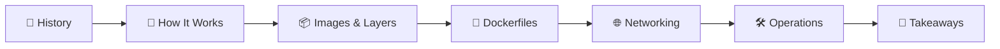
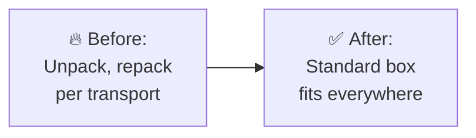
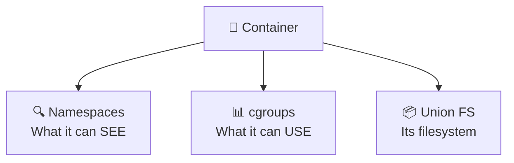
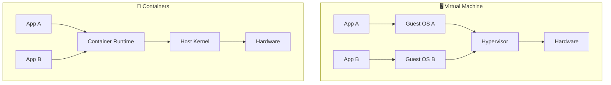
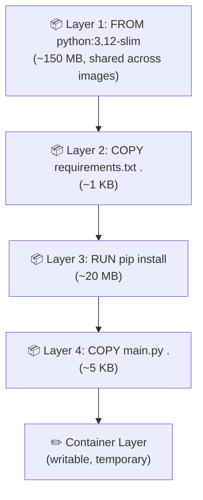
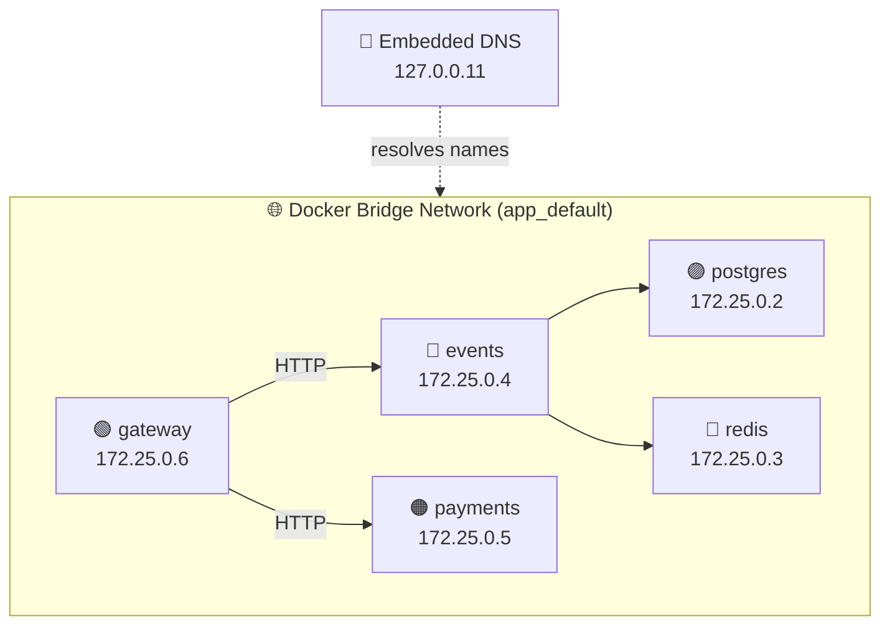
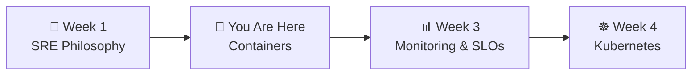

# 📌 Lecture 2 — Containerization: Packaging for Reliability

---

## 📍 Slide 1 – 📦 The Problem Before Containers

> 💬 *"It works on my machine." — "Then we'll ship your machine."*
> And that is basically how Docker was born.

* 😱 **The classic nightmare:** App works in dev, breaks in staging, explodes in production
* 🔧 Different OS versions, different Python versions, different library versions
* 📋 "Install guide" documents that are 40 pages long and still wrong
* 💡 Last week you ran `docker compose up` and QuickTicket just worked — **how?**

---

## 📍 Slide 2 – 🎯 Learning Outcomes

| # | 🎓 Outcome |
|---|-----------|
| 1 | ✅ Explain what a container actually is (namespaces + cgroups + union fs) |
| 2 | ✅ Read a Dockerfile and understand each instruction |
| 3 | ✅ Understand image layers, caching, and why order matters |
| 4 | ✅ Use Docker operational commands: stats, logs, exec, inspect |
| 5 | ✅ Explain how Docker Compose networking enables service discovery |

---

## 📍 Slide 3 – 🗺️ Lecture Overview



* 📍 Slides 4-6 — History: from chroot to Docker
* 📍 Slides 7-9 — How containers actually work
* 📍 Slides 10-12 — Images, layers, caching
* 📍 Slides 13-15 — Dockerfiles and anti-patterns
* 📍 Slides 16-17 — Docker networking and service discovery
* 📍 Slides 18-20 — Operational commands for SREs
* 📍 Slides 21-22 — Reflection and what's next

---

## 📍 Slide 4 – 📜 A Brief History of Isolation

| 🗓️ Year | 🏷️ What | 💡 Key Idea |
|---------|---------|------------|
| 1979 | 🔒 `chroot` (Unix V7) | Isolate filesystem view — Bill Joy used it to build 4.2BSD |
| 2000 | 🏗️ FreeBSD Jails | Process + network + filesystem isolation |
| 2004 | ☀️ Solaris Zones | Full OS-level virtualization |
| 2006 | 🔧 cgroups (Google) | Resource limits — Paul Menage & Rohit Seth |
| 2008 | 📦 LXC (Linux Containers) | First standalone container runtime |
| 2013 | 🐳 Docker | Made containers accessible to everyone |
| 2015 | 📋 OCI Standard | Open Container Initiative — vendor-neutral specs |

> 💡 Containers aren't new — the **idea** is from 1979. Docker's genius was making it **easy**.

---

## 📍 Slide 5 – 🐳 The Docker Origin Story

* 🏢 **dotCloud** — a PaaS company founded in Paris by **Solomon Hykes** (2010)
* 🔧 Hykes built an internal tool to run customer containers
* 💡 Realized the tool was more valuable than the PaaS itself
* 🎤 **March 15, 2013** — 5-minute lightning talk at PyCon: *"The Future of Linux Containers"*
* 👀 Expected 10 people in a back room — got hundreds on the main stage
* 🚀 dotCloud renamed to **Docker, Inc.** — the rest is history

> 🤔 **Think:** Docker wasn't a new technology — it was a new **UX** on top of existing Linux features. Sometimes the breakthrough is usability, not invention.

---

## 📍 Slide 6 – 🚢 The Shipping Container Analogy

* 🚛 **1937** — trucker **Malcom McLean** waits all day to unload cotton bales at a pier
* 💡 His idea: what if the entire truck body could be lifted onto the ship?
* 🚢 **April 26, 1956** — SS Ideal-X sails from Newark to Houston with 58 containers
* 💰 Loading cost dropped from **$5.86/ton** to **$0.16/ton** — a **36x reduction**
* 🌍 McLean made his patents **royalty-free** for ISO standardization → global adoption



> 💬 Docker containers do the same for software: **standard packaging that runs anywhere** — your laptop, CI, staging, production.

---

## 📍 Slide 7 – 🔧 What IS a Container?

A container is a **regular Linux process** with three layers of isolation:



* 🔍 **Namespaces** — isolate what a process can *see*:
  * 🔢 PID: own process tree (PID 1 inside the container)
  * 🌐 NET: own IP address, routing table, ports
  * 📁 MNT: own filesystem view
  * 🏷️ UTS: own hostname
* 📊 **cgroups** — limit what a process can *use*:
  * 🖥️ CPU: max cores or percentage
  * 🧠 Memory: hard limit (OOM kill if exceeded)
  * 💾 Disk I/O: read/write bandwidth
* 📦 **Union filesystem** — layered, copy-on-write root filesystem

> 💬 *"A container is a process with some configuration applied to it using namespaces and cgroups."* — Julia Evans

---

## 📍 Slide 8 – 🐄 Pets vs Cattle

> 💬 Coined by **Bill Baker** (Microsoft, ~2012), popularized by Randy Bias

| 🐱 Pets | 🐄 Cattle |
|---------|----------|
| 🏷️ Named (db-master-01, app-prod-3) | 🔢 Numbered (pod-7f8d4, container-a3b2) |
| 🏥 When sick → nurse back to health | 💀 When sick → kill and replace |
| ❄️ Unique snowflake configuration | 📦 Identical, built from same image |
| 🔧 SSH in and fix things | 🚫 Never SSH — redeploy |
| 😰 Losing one is a disaster | 🤷 Losing one is normal |

* 🐳 **Containers are cattle by design** — you don't fix them, you replace them
* 🔗 This connects directly to SRE: **immutable infrastructure** means no configuration drift
* 💡 In Lab 1, when you killed a container and restarted it — that's cattle thinking

> 🤔 **Think:** Are any of your personal computers "pets"? What would it take to make them "cattle"?

---

## 📍 Slide 9 – 🏗️ Containers vs VMs



| 🏷️ Aspect | 🖥️ VM | 🐳 Container |
|-----------|--------|------------|
| 🧠 Overhead | Full OS per VM (GB) | Shared kernel (MB) |
| ⏱️ Startup | Minutes | Seconds |
| 📊 Density | 10-20 per host | 100s per host |
| 🔒 Isolation | Hardware-level | Process-level |
| 💡 Use case | Different OS kernels | Same OS, different apps |

> 💡 Google runs **billions** of containers per week. That density is only possible because containers share the kernel.

---

## 📍 Slide 10 – 📦 Image Layers

Every Dockerfile instruction creates a **layer**. Layers are stacked using a **union filesystem** (OverlayFS):



* 📖 Image layers are **read-only** — shared between all containers from the same image
* ✏️ Each container gets one **writable layer** on top — dies when the container dies
* 🔄 **Copy-on-write**: reading from lower layers is free; writing copies the file up first

---

## 📍 Slide 11 – ⚡ Layer Caching: Why Order Matters

```dockerfile
# ❌ Bad: code change invalidates pip install cache
COPY . /app
RUN pip install -r requirements.txt

# ✅ Good: requirements change rarely, code changes often
COPY requirements.txt .
RUN pip install -r requirements.txt
COPY main.py .
```

* 🔄 Docker caches each layer. If a layer hasn't changed, it reuses the cache
* ⚠️ But **every layer after a change is rebuilt** — order matters!
* 💡 **Rule:** copy things that change **rarely** first, things that change **often** last
* 📋 Your QuickTicket Dockerfiles already follow this pattern — check `app/gateway/Dockerfile`

> 🤔 **Think:** If you add a new endpoint to `main.py`, which layers get rebuilt? What about adding a new dependency to `requirements.txt`?

---

## 📍 Slide 12 – 🏷️ Image Sizes: Why They Matter

| 🐳 Base Image | 📊 Size | 🎯 Use Case |
|---------------|---------|-------------|
| `python:3.12` | ~1 GB | Full Debian — has gcc, make, dev headers |
| `python:3.12-slim` | ~150 MB | Minimal Debian — no dev tools |
| `python:3.12-alpine` | ~50 MB | Alpine Linux — smallest, but musl libc quirks |

* ✅ QuickTicket uses `python:3.12-slim` — good balance of size and compatibility
* 📉 Smaller images = faster pulls = faster deployments = faster rollbacks
* 🔒 Smaller images = fewer packages = fewer potential vulnerabilities
* 🚀 In Week 7, when you do canary deployments, image pull time directly affects rollout speed

---

## 📍 Slide 13 – 📝 Reading a Dockerfile

Your QuickTicket `app/gateway/Dockerfile`:

```dockerfile
FROM python:3.12-slim          # 📦 Base image

WORKDIR /app                   # 📁 Set working directory
COPY requirements.txt .        # 📋 Dependencies first (cache!)
RUN pip install --no-cache-dir -r requirements.txt  # 📥 Install deps
COPY main.py .                 # 📄 App code last (changes often)

EXPOSE 8080                    # 📖 Document the port (doesn't publish it!)
CMD ["uvicorn", "main:app", "--host", "0.0.0.0", "--port", "8080"]  # 🚀 Start command
```

* 🔑 Every line creates a layer (except EXPOSE which is just metadata)
* 📋 `--no-cache-dir` saves ~30% on pip layer size
* ⚠️ `EXPOSE` is documentation — you still need `ports:` in docker-compose to publish it
* 🏃 `CMD` runs when the container starts — can be overridden with `docker run ... <command>`

---

## 📍 Slide 14 – ⚠️ Dockerfile Anti-Patterns

| ❌ Anti-Pattern | 💥 Impact | ✅ Fix |
|----------------|----------|--------|
| 🔓 Running as root | Container escape = host root | `USER appuser` |
| 📁 No `.dockerignore` | `.git/`, `__pycache__`, `.env` sent to build | Create `.dockerignore` |
| 🏷️ `FROM python:latest` | Build breaks randomly when tag moves | Pin version: `python:3.12-slim` |
| 📦 Dev deps in production | pytest, mypy in production image | Separate build/runtime stages |
| 🔀 COPY before pip install | Every code change rebuilds deps | Copy requirements first |

* 🔍 **Your QuickTicket Dockerfiles** run as root and have no `.dockerignore` — you'll fix this in the lab!

> 🤔 **Think:** Why is running as root inside a container a risk if the container is "isolated"? (Hint: container escapes exist)

---

## 📍 Slide 15 – 📋 .dockerignore

Like `.gitignore` but for Docker build context:

```
__pycache__
*.pyc
.git
.env
*.md
.vscode
```

* 🚀 Without it, `COPY . .` sends **everything** — `.git/` alone can be 100s of MB
* 🔒 Prevents accidentally baking secrets (`.env`) into the image
* ⚡ Smaller build context = faster builds

---

## 📍 Slide 16 – 🌐 Docker Networking



* 🔗 Docker Compose creates a **bridge network** automatically for all services
* 📡 Docker runs an **embedded DNS server** at `127.0.0.11`
* 🏷️ Service names become hostnames: `events` resolves to `172.25.0.4`
* 🔧 That's how `EVENTS_URL=http://events:8081` works in the gateway — pure DNS

> 💡 No IP addresses in config files — just service names. Docker DNS handles the rest.

---

## 📍 Slide 17 – 🔗 Docker Compose Deep Dive

Your `docker-compose.yaml` has SRE patterns built in:

```yaml
events:
  depends_on:
    postgres:
      condition: service_healthy  # ⏳ Wait for DB to be ready
    redis:
      condition: service_healthy  # ⏳ Wait for Redis to be ready

postgres:
  healthcheck:
    test: ["CMD-SHELL", "pg_isready -U quickticket"]
    interval: 5s                  # 📊 Check every 5 seconds
```

* ⏳ **`depends_on` + `service_healthy`** = don't start events until postgres is actually ready
* 💊 **`healthcheck`** = Docker periodically checks if the service is alive
* 📦 **`volumes`** = postgres data persists across restarts (stateful = pet, but in a cattle world)

> 🤔 **Think:** In Lab 1, when you killed Redis and restarted it — did Redis remember its data? Why or why not?

---

## 📍 Slide 18 – 🛠️ Docker Commands for SREs

| 🛠️ Command | 📊 What It Shows | 🎯 When to Use |
|------------|------------------|----------------|
| `docker stats` | CPU, memory, network, I/O per container | Performance investigation |
| `docker logs -f <name>` | stdout/stderr, follow live | Debugging errors |
| `docker exec -it <name> sh` | Shell inside container | Inspect running state |
| `docker inspect <name>` | Full JSON config dump | Check networking, env vars, mounts |
| `docker compose ps` | Status of all services | Quick health overview |
| `docker system df` | Disk usage by images, containers, volumes | Disk space issues |

* 📊 `docker stats --no-stream` is the "one-shot top" for containers — you used it in Lab 1 bonus
* 🔍 `docker inspect --format '{{.State.Health.Status}}'` checks health programmatically

---

## 📍 Slide 19 – 🔍 docker inspect in Practice

```bash
# What IP does the events service have?
$ docker inspect app-events-1 --format '{{.NetworkSettings.Networks.app_default.IPAddress}}'
172.25.0.4

# What environment variables are set?
$ docker inspect app-payments-1 --format '{{.Config.Env}}'
[PAYMENT_FAILURE_RATE=0.0 PAYMENT_LATENCY_MS=0]

# Is the container healthy?
$ docker inspect app-postgres-1 --format '{{.State.Health.Status}}'
healthy
```

* 🎯 `--format` uses Go templates — saves you from parsing huge JSON
* 🔧 Essential for debugging: "why can't events reach redis?" → check the IP, check the network

---

## 📍 Slide 20 – 💎 Why Containers Matter for SRE

| 🎯 SRE Concern | 🐳 How Containers Help |
|----------------|----------------------|
| 🔄 **Reproducibility** | Same image in dev, staging, prod — no "works on my machine" |
| 🧊 **Immutability** | Image never changes after build — no configuration drift |
| ⏪ **Fast rollback** | Redeploy previous image tag — seconds, not hours |
| 📊 **Resource isolation** | cgroups enforce CPU/memory limits per service |
| 🐄 **Cattle mindset** | Kill and replace, never SSH and patch |
| ⚡ **Density** | 100s of containers per host vs 10-20 VMs |

* 🔗 Connects to Lecture 1: **error budgets** depend on fast rollback → containers enable that
* 🔗 Connects to Week 4: **Kubernetes** manages these containers at scale

---

## 📍 Slide 21 – 🧠 Key Takeaways

1. 📦 **A container is just a process** with namespaces, cgroups, and a union filesystem
2. 📋 **Dockerfile order matters** — copy things that change rarely first for better caching
3. 🌐 **Docker Compose networking** is DNS-based — service names become hostnames
4. 🐄 **Containers are cattle** — replace, don't repair
5. 🛠️ **`docker stats`, `logs`, `exec`, `inspect`** are your daily debugging tools

> 💬 *"Docker didn't invent containers. Docker made containers usable."*

---

## 📍 Slide 22 – 🚀 What's Next

* 📍 **Next lecture:** Monitoring & Observability — Prometheus, Grafana, SLOs
* 🧪 **Lab 2:** Deep dive into your QuickTicket containers — inspect, optimize, explore networking
* 📖 **Reading:** [Docker overview](https://docs.docker.com/get-started/docker-overview/)



> 🎯 You now understand **what** containers are. Next week you'll learn to **observe** what's happening inside them.

---

## 📚 Resources

* 📖 [Docker overview — official docs](https://docs.docker.com/get-started/docker-overview/)
* 📖 [Dockerfile reference](https://docs.docker.com/reference/dockerfile/)
* 📖 [What even is a container? — Julia Evans](https://jvns.ca/blog/2016/10/10/what-even-is-a-container/)
* 🎥 [Solomon Hykes at PyCon 2013 — "The Future of Linux Containers"](https://pyvideo.org/pycon-us-2013/the-future-of-linux-containers.html)
* 📖 [The History of Pets vs Cattle — Randy Bias](https://cloudscaling.com/blog/cloud-computing/the-history-of-pets-vs-cattle/)
* 📖 [How containers work: overlayfs — Julia Evans](https://jvns.ca/blog/2019/11/18/how-containers-work--overlayfs/)
