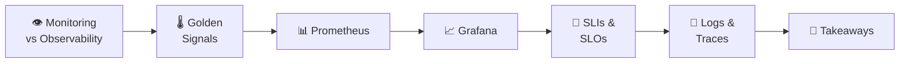
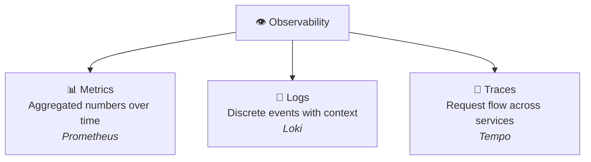
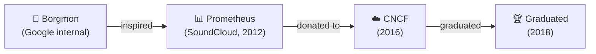
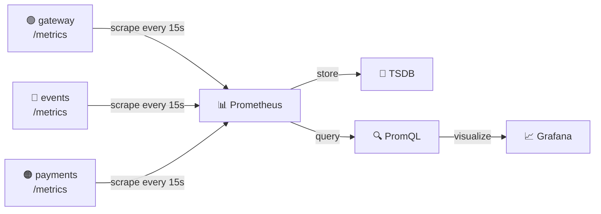
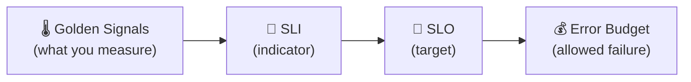
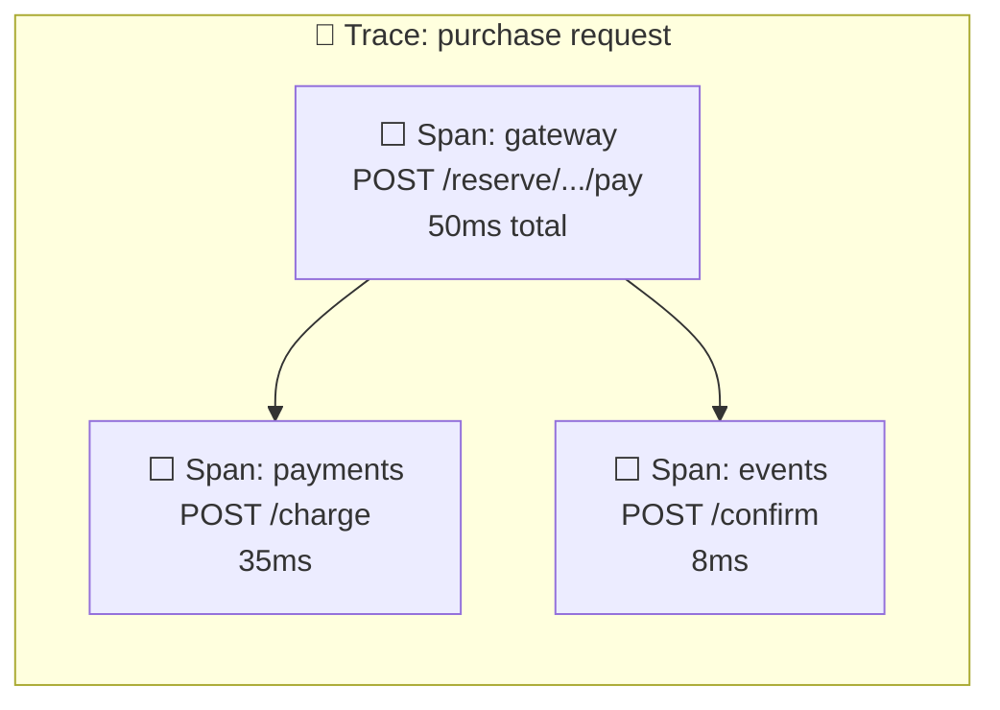
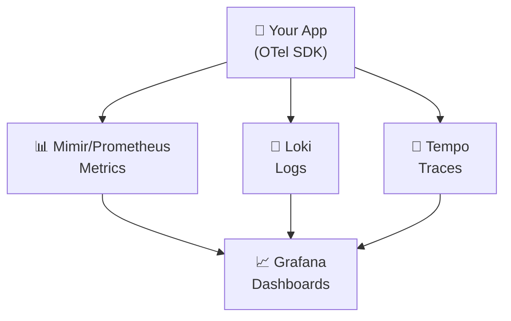
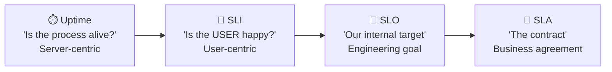
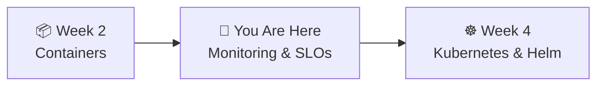

# 📌 Lecture 3 — Monitoring, Observability & SLOs

---

## 📍 Slide 1 – 🔥 Flying Blind

* 🗓️ **October 21, 2018** — routine network maintenance at GitHub disconnects a data center for **43 seconds**
* 🧠 MySQL clusters auto-elect new primaries → **split-brain** — two data centers both think they're the leader
* ⏱️ A 43-second blip cascaded into **24 hours 11 minutes** of degraded service
* 😱 Engineers couldn't tell which data was correct on which side

> 🤔 **Think:** If you can't see what your system is doing, you can't fix it. How would you detect a split-brain in 43 seconds, not 43 minutes?

---

## 📍 Slide 2 – 🎯 Learning Outcomes

| # | 🎓 Outcome |
|---|-----------|
| 1 | ✅ Distinguish monitoring from observability |
| 2 | ✅ Name the four golden signals and when to use each |
| 3 | ✅ Explain how Prometheus scrapes metrics and why pull beats push |
| 4 | ✅ Define SLIs, create SLOs, and calculate error budgets with real numbers |
| 5 | ✅ Build a Grafana dashboard that shows golden signals and SLO compliance |

---

## 📍 Slide 3 – 🗺️ Lecture Overview



---

## 📍 Slide 4 – 👁️ Monitoring vs Observability

> 💬 *"Monitoring tells you WHAT is broken. Observability tells you WHY."*

| 🏷️ Aspect | 📊 Monitoring | 👁️ Observability |
|-----------|-------------|-----------------|
| 🎯 Answers | Known questions: "Is the error rate high?" | Unknown questions: "Why is this one user seeing 500s?" |
| 🔧 Approach | Predefined checks + thresholds | Explore any dimension, any time |
| 📋 Analogy | Dashboard with warning lights | X-ray machine — look inside anything |
| 🗓️ Emerged | Traditional ops (2000s) | Popularized by **Charity Majors** (~2016-2018) |

* 🔬 The term "observability" comes from **control theory** — Rudolf Kalman, 1960
* 💡 Charity Majors (Honeycomb CEO) brought it to software: *"You should be able to ask any question about your systems without having predicted that question in advance"*

---

## 📍 Slide 5 – 📐 Three Pillars of Observability



| 📐 Pillar | 🎯 What it captures | ❓ Question it answers | 🛠️ Tool |
|-----------|--------------------|-----------------------|---------|
| 📊 **Metrics** | Numeric aggregates over time | "What's the error rate?" | Prometheus |
| 📝 **Logs** | Individual events with context | "What exactly happened at 10:23?" | Loki |
| 🔗 **Traces** | Request journey across services | "Where did this request slow down?" | Tempo |

> 💡 **Peter Bourgon** formalized this framework in his 2017 blog post *"Metrics, tracing, and logging"*

---

## 📍 Slide 6 – 🌡️ The Four Golden Signals

From the **Google SRE Book, Chapter 6**:

> 💬 *"If you can only measure four metrics of your user-facing system, focus on these four."*

| 🏷️ Signal | 📏 What | 📊 QuickTicket Example |
|-----------|---------|----------------------|
| ⏱️ **Latency** | How long requests take | p50, p95, p99 response time |
| 🚦 **Traffic** | How much demand | Requests per second per endpoint |
| ❌ **Errors** | How many requests fail | 5xx rate (%) |
| 📈 **Saturation** | How full the system is | DB connection pool usage, memory % |

> ⚠️ **Important from the book:** *"Distinguish between latency of successful requests and failed requests. An HTTP 500 served instantly shouldn't lower your latency numbers."*

---

## 📍 Slide 7 – 📊 Alternative Methods: USE and RED

| 🏷️ Method | 👤 Creator | 🎯 Focus | 📏 Measures |
|-----------|-----------|---------|------------|
| 🌡️ **Golden Signals** | Google SRE Book | User-facing services | Latency, Traffic, Errors, Saturation |
| 🔧 **USE** | **Brendan Gregg** (Netflix) | Infrastructure | **U**tilization, **S**aturation, **E**rrors |
| 🔴 **RED** | **Tom Wilkie** (Grafana Labs) | Service requests | **R**ate, **E**rrors, **D**uration |

> 💬 Tom Wilkie: *"RED is about caring about your users. USE is about caring about your machines. They're complementary."*

* 🔗 **Golden Signals = RED + Saturation** — that's why we teach Golden Signals
* 💡 In the lab, your dashboard will cover all four

---

## 📍 Slide 8 – 📊 Prometheus: History

* 🏢 Created by **Matt Proud** and **Julius Volz** at **SoundCloud** in **2012**
* 🔧 Both were **ex-Google SREs** — inspired by Google's internal monitoring: **Borgmon**
* 📅 Public release: **January 2015**
* 🏆 **2nd project to join CNCF** (after Kubernetes) — May 2016
* 🏆 **2nd project to graduate CNCF** — August 2018



---

## 📍 Slide 9 – 🔄 Prometheus Architecture: Pull Model



* 🔄 **Pull model:** Prometheus sends HTTP GET to `/metrics` endpoints on each service
* 💡 **Why pull, not push?**
  * 🏥 If a scrape fails → you know the service is **down** (push: silence is ambiguous)
  * 🔍 You can `curl localhost:8080/metrics` to debug from any machine
  * ⚖️ Load is distributed evenly — no thundering herd from simultaneous pushers

> 🤔 **Think:** In Lab 2 you ran `curl localhost:3080/metrics` — that's exactly what Prometheus does every 15 seconds.

---

## 📍 Slide 10 – 📏 Prometheus Metric Types

| 🏷️ Type | 📈 Behavior | 📊 Example | 🔍 Key PromQL |
|---------|------------|-----------|---------------|
| 📈 **Counter** | Only goes up (resets on restart) | `gateway_requests_total` | `rate()` for per-second change |
| 🌡️ **Gauge** | Goes up and down | `events_db_pool_size` | Direct value |
| 📊 **Histogram** | Counts in buckets + sum + count | `gateway_request_duration_seconds` | `histogram_quantile()` for percentiles |

```promql
# Traffic: requests per second
rate(gateway_requests_total[5m])

# Errors: 5xx percentage
rate(gateway_requests_total{status=~"5.."}[5m]) / rate(gateway_requests_total[5m]) * 100

# Latency: p99
histogram_quantile(0.99, rate(gateway_request_duration_seconds_bucket[5m]))
```

---

## 📍 Slide 11 – 📈 Grafana: The Dashboard Standard

* 👨‍💻 Created by **Torkel Ödegaard** — engineer at eBay Sweden, frustrated with Graphite's clunky UI
* 🔀 Started by modifying **Kibana 3** to work with Graphite (December 2013)
* 🏷️ Name: **Gra**phite + Ki**bana** = **Grafana**
* 🚀 **v1 released January 2014** — quickly outgrew both parents
* 📊 **20+ million users** as of 2024
* 🔌 Works with 100+ data sources (Prometheus, Loki, Tempo, MySQL, PostgreSQL, etc.)

> 💡 In the lab, you'll use a **pre-built dashboard** that shows all four golden signals for QuickTicket.

---

## 📍 Slide 12 – 🎯 From Signals to SLOs

Now we connect monitoring to SRE. Recall from Lecture 1:



* 📏 **SLI** = "What % of requests succeed?" → a golden signal turned into a ratio
* 🎯 **SLO** = "99.5% of requests should succeed" → your target
* 💰 **Error Budget** = 0.5% = ~3.6 hours/month of allowed failure

> 💬 Alex Hidalgo (*"Implementing SLOs"*): *"SLIs are the most important part — if you're not measuring the right things, the rest doesn't matter."*

---

## 📍 Slide 13 – 📏 Choosing Good SLIs

> 💬 *"Measure from the user's perspective. Your CPU can be at 100% yet the actual output might be timely and correct."* — Alex Hidalgo

| 🎯 SLI Type | 📏 What to Measure | 📊 QuickTicket Example |
|-------------|-------------------|----------------------|
| ✅ **Availability** | % of requests returning non-5xx | `rate(requests{status!~"5.."}[5m]) / rate(requests[5m])` |
| ⏱️ **Latency** | % of requests under threshold | `rate(duration_bucket{le="0.5"}[5m]) / rate(duration_count[5m])` |
| 🎯 **Correctness** | % of requests returning right data | Business logic check (harder to automate) |

* ✅ **Good SLI:** "99.5% of gateway requests return non-5xx"
* ❌ **Bad SLI:** "CPU stays under 80%" — users don't care about your CPU

---

## 📍 Slide 14 – 🔥 Error Budget Math

**SLO: 99.5% availability over 30 days**

| 📏 Metric | 📊 Value |
|----------|---------|
| 🎯 SLO | 99.5% |
| 💰 Error budget | 0.5% |
| ⏱️ Minutes in 30 days | 43,200 |
| 🔥 Allowed downtime | **216 minutes** (~3.6 hours) |
| 📊 At 1000 req/day | **~150 failed requests** allowed per month |

```promql
# Error budget burn rate — how fast are we consuming budget?
# >1 means burning faster than sustainable
(1 - job:sli_availability:ratio_rate5m) / (1 - 0.995)
```

> 🤔 **Think:** You deploy on Monday and 50 requests fail. Your budget is now at 100 failures remaining. Ship another risky feature on Friday?

---

## 📍 Slide 15 – 📝 Prometheus Recording Rules

Recording rules **pre-compute expensive queries** and save them as new time series:

```yaml
groups:
  - name: slo_rules
    rules:
      - record: gateway:sli_availability:ratio_rate5m
        expr: |
          sum(rate(gateway_requests_total{status!~"5.."}[5m]))
          / sum(rate(gateway_requests_total[5m]))

      - record: gateway:sli_latency_500ms:ratio_rate5m
        expr: |
          sum(rate(gateway_request_duration_seconds_bucket{le="0.5"}[5m]))
          / sum(rate(gateway_request_duration_seconds_count[5m]))
```

* ⚡ Without recording rules: Grafana recalculates the full query every refresh
* ✅ With recording rules: Prometheus stores the result — dashboards are instant
* 🎯 In the lab, you'll write these rules for QuickTicket

---

## 📍 Slide 16 – 📝 Structured Logging

```
# ❌ Useless log
2026-04-16 10:23:45 INFO something happened

# ✅ Structured log (JSON)
{"time":"2026-04-16T10:23:45Z","level":"ERROR","service":"events",
 "method":"POST","path":"/events/1/reserve","status":500,
 "duration_ms":1234,"msg":"Database connection timeout"}
```

* 🔍 **Structured = queryable** — filter by service, status, user, request ID
* 🔗 **Correlation IDs** — same request ID across gateway → events → payments
* 📦 **Grafana Loki** — *"Like Prometheus, but for logs"* — created by **Tom Wilkie** (2018)
* 💡 Loki indexes only labels, not content → **10x cheaper** than Elasticsearch

> 💡 Your QuickTicket services already emit structured JSON logs — check `docker compose logs events`

---

## 📍 Slide 17 – 🔗 Distributed Tracing



* 🔗 **Trace** = the full journey of one request across all services
* ⬜ **Span** = one unit of work (one service call)
* 🔑 **Trace context propagation** = HTTP headers carry trace ID between services
* 📋 **W3C Trace Context** standard: `traceparent: 00-{trace-id}-{span-id}-01`
* 📦 **OpenTelemetry** (2019) = merger of OpenTracing + OpenCensus — the universal standard
* 📦 **Grafana Tempo** = trace backend, uses only object storage — no Elasticsearch needed

> 💡 In Lab 2 bonus, you traced a request via logs. With Tempo, this happens **automatically**.

---

## 📍 Slide 18 – 🏗️ The Grafana LGTM Stack

**L**oki + **G**rafana + **T**empo + **M**imir = **LGTM** (also: "Looks Good To Me" 😄)



| 🏷️ Component | 📐 Signal | 👤 Created by | 🗓️ Year |
|-------------|----------|-------------|---------|
| 📝 **Loki** | Logs | Tom Wilkie | 2018 |
| 📈 **Grafana** | Visualization | Torkel Ödegaard | 2014 |
| 🔗 **Tempo** | Traces | Joe Elliott | 2020 |
| 📊 **Mimir** | Metrics | Grafana Labs (fork of Cortex) | 2022 |

* 🔗 **The killer feature:** click a log entry → jump to trace → see the metrics at that moment

---

## 📍 Slide 19 – 💬 Monitoring Wisdom

> 💬 *"If it moves, graph it. If it doesn't move, graph it anyway, just in case it does."* — Etsy engineering culture

> 💬 *"Every time the pager goes off, I should be able to react with a sense of urgency. I can only react with a sense of urgency a few times a day before I become fatigued."* — Google SRE Book

> 💬 *"Every page should be actionable. If a page merely merits a robotic response, it shouldn't be a page."* — Google SRE Book

* 🚨 **Alert fatigue** is real — too many alerts = all alerts get ignored
* 🎯 Only page for things that are **urgent, actionable, and user-visible**
* 📋 We'll build proper SLO-based alerting in **Week 6**

---

## 📍 Slide 20 – 🚨 SLI vs SLO vs SLA vs Uptime — Stop Confusing Them

People say "our SLA is 99.9%" when they mean completely different things. Let's fix that forever:

| 🏷️ Term | 📋 What it is | 👤 Who cares | 📊 Example |
|---------|--------------|-------------|-----------|
| ⏱️ **Uptime** | % of time the server process is running | Ops / infra | "Server was up 99.99% of the month" |
| 📏 **SLI** | A metric measuring user experience | Engineers | "98.7% of requests returned non-5xx" |
| 🎯 **SLO** | Internal target for an SLI | Engineering team | "We aim for 99.5% availability" |
| 📜 **SLA** | Legal contract with financial penalties | Business / customers | "If we drop below 99.9%, client gets 10% credit" |

> ⚠️ **The common mistake:** "Our SLA is 99.9%" — but they mean uptime, not a contract. And uptime ≠ user experience!

**Why uptime is NOT enough:**
* ✅ Server is "up" (process running) but returning 500 errors → uptime = 100%, availability SLI = 80%
* ✅ Server is "up" but responding in 30 seconds → uptime = 100%, latency SLI = terrible
* ✅ Server is "up" but the database behind it is down → uptime = 100%, users see errors



> 💡 **Rule of thumb:** SLOs are always **stricter** than SLAs. If your SLA promises 99.9%, your SLO should be 99.95% — so you have a buffer before you breach the contract.

> 🤔 **Think:** Your manager says "we need 99.99% SLA." Ask: "Do you mean uptime, availability SLI, latency SLI, or a contractual commitment? They require very different engineering effort."

---

## 📍 Slide 21 – 🧠 Key Takeaways

6. 🚨 **SLI ≠ SLO ≠ SLA ≠ Uptime** — know the difference, correct people who confuse them

1. 📊 **Monitor the four golden signals** — latency, traffic, errors, saturation
2. 📏 **SLIs from the user's perspective** — "did the request succeed and was it fast enough?"
3. 💰 **Error budgets turn arguments into math** — deploy decisions based on budget, not politics
4. 📝 **Structured logs + traces** enable debugging across services
5. 🛠️ **Prometheus + Grafana** = the industry-standard observability stack

> 💬 *"You can't improve what you can't measure."* — Peter Drucker (maybe)

---

## 📍 Slide 22 – 🚀 What's Next

* 📍 **Next lecture:** Kubernetes & Helm — from Docker Compose to a real orchestrator
* 🧪 **Lab 3:** Deploy Prometheus + Grafana, build golden signals dashboard, define SLOs
* 📖 **Reading:** [Google SRE Book, Chapter 6](https://sre.google/sre-book/monitoring-distributed-systems/) + [SRE Workbook, Chapter 2](https://sre.google/workbook/implementing-slos/)



---

## 📚 Resources

* 📖 [Google SRE Book, Ch 6 — Monitoring Distributed Systems](https://sre.google/sre-book/monitoring-distributed-systems/)
* 📖 [Google SRE Workbook, Ch 2 — Implementing SLOs](https://sre.google/workbook/implementing-slos/)
* 📖 [Google SRE Workbook, Ch 5 — Alerting on SLOs](https://sre.google/workbook/alerting-on-slos/)
* 📖 *Implementing Service Level Objectives* — Alex Hidalgo (O'Reilly, 2020)
* 📖 [Prometheus documentation](https://prometheus.io/docs/)
* 📖 [Peter Bourgon — Metrics, tracing, and logging (2017)](https://peter.bourgon.org/blog/2017/02/21/metrics-tracing-and-logging.html)
* 📖 [Tom Wilkie — The RED Method](https://grafana.com/blog/the-red-method-how-to-instrument-your-services/)
* 📖 [GitHub Oct 2018 post-incident analysis](https://github.blog/2018-10-30-oct21-post-incident-analysis/)
