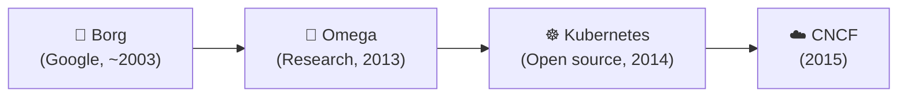
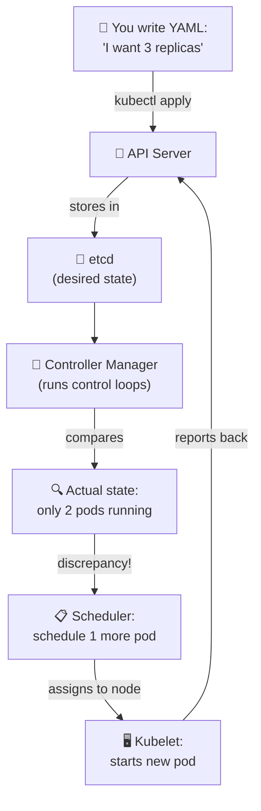
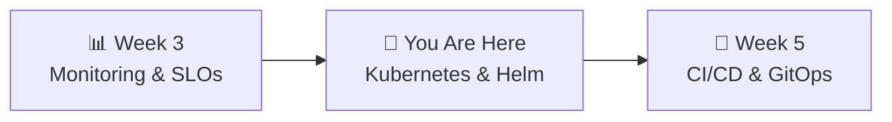

# 📌 Lecture 4 — Kubernetes & Helm: From Compose to a Cluster

---

## 📍 Slide 1 – 💀 When One Machine Isn't Enough

* 🖥️ Docker Compose runs everything on **one machine**
* 💀 That machine dies → **everything dies**
* 📈 Traffic doubles → you can't just "add another docker-compose"
* 🤔 Who restarts crashed containers at 3 AM?

> 💬 *"We wanted to give the world the software that Google has been using internally for over a decade."* — Craig McLuckie, Kubernetes co-founder

---

## 📍 Slide 2 – 🎯 Learning Outcomes

| # | 🎓 Outcome |
|---|-----------|
| 1 | ✅ Explain why Kubernetes exists and what it provides over Docker Compose |
| 2 | ✅ Describe core K8s objects: Pod, Deployment, Service |
| 3 | ✅ Understand the reconciliation loop — desired state vs actual state |
| 4 | ✅ Write K8s manifests and use kubectl to deploy and debug |
| 5 | ✅ Explain what Helm does and why it's the K8s package manager |

---

## 📍 Slide 3 – 📜 The Origin: From Borg to Kubernetes

* 🏢 **~2003** — Google builds **Borg** internally to manage production workloads
* 📊 Borg manages **tens of thousands of machines** per cell, runs **billions of containers per week**
* 📝 **2015** — Google publishes the Borg paper (Verma et al., EuroSys '15)
* 🐳 **June 10, 2014** — **Joe Beda, Brendan Burns, Craig McLuckie** announce Kubernetes at DockerCon
* 🏆 **July 21, 2015** — Kubernetes 1.0 released, **CNCF founded** on the same day



> 💡 The name **Kubernetes** (κυβερνήτης) is Greek for "helmsman" — the person who steers the ship.
> The abbreviation **K8s** = K + 8 letters + s (like i18n = internationalization).

---

## 📍 Slide 4 – 🔀 Docker Compose vs Kubernetes

| 🏷️ Capability | 🐳 Docker Compose | ☸️ Kubernetes |
|--------------|-------------------|--------------|
| 🖥️ Multi-host | No — single machine | Yes — cluster of nodes |
| 🔄 Self-healing | Restart policy only | Controllers auto-restart, reschedule |
| 📈 Auto-scaling | No | HPA (Horizontal Pod Autoscaler) |
| 🔁 Rolling updates | Recreate only | Zero-downtime rolling updates + rollback |
| 🌐 Service discovery | DNS within compose network | Built-in Services + DNS + load balancing |
| 💊 Health checks | Basic HEALTHCHECK | Liveness + readiness + startup probes |
| 📊 Resource governance | None | Requests, limits, quotas |

> 🤔 **Think:** In Lab 1, when you killed a container, you had to manually restart it. In K8s, what happens?

---

## 📍 Slide 5 – 🔄 The Reconciliation Loop

**The most important concept in Kubernetes.** You declare the desired state, K8s makes it real:



* 📋 **Desired state** = what you wrote in YAML
* 🔍 **Actual state** = what's really running
* 🔄 **Control loop** = constantly comparing and correcting
* 💡 This is not a one-time script — it runs **continuously**

> 💬 This IS "cattle not pets" (from Lecture 2) made automatic. K8s kills and replaces without asking.

---

## 📍 Slide 6 – 📦 Core Objects: Pod

* 📦 **Pod** = smallest deployable unit (NOT a container!)
* 🐳 Contains **one or more containers** sharing:
  * 🌐 Network (same `localhost`, same IP)
  * 💾 Storage (shared volumes)
* 💀 Pods are **ephemeral** — they are born, they run, they die. Never repaired.
* 📋 In practice: **1 pod = 1 container** (99% of cases)

```yaml
# You almost NEVER create bare Pods
# Instead, use a Deployment (next slide)
apiVersion: v1
kind: Pod
metadata:
  name: gateway
spec:
  containers:
    - name: gateway
      image: app-gateway:latest
      ports:
        - containerPort: 8080
```

---

## 📍 Slide 7 – 🔁 Core Objects: Deployment

* 🔁 **Deployment** = "keep N identical pods running at all times"
* 📈 Manages a **ReplicaSet** under the hood
* 🔄 **Rolling updates:** change the image → K8s gradually replaces old pods with new
* ⏪ **Rollback:** `kubectl rollout undo` → reverts to previous version

```yaml
apiVersion: apps/v1
kind: Deployment
metadata:
  name: gateway
spec:
  replicas: 2                    # ← Keep 2 pods running
  selector:
    matchLabels:
      app: gateway               # ← How to find "my" pods
  template:                      # ← Pod template
    metadata:
      labels:
        app: gateway
    spec:
      containers:
        - name: gateway
          image: app-gateway:latest
          ports:
            - containerPort: 8080
```

> 🤔 **Think:** You set `replicas: 3`. A node dies, leaving 2 pods. What does K8s do? (Hint: reconciliation loop)

---

## 📍 Slide 8 – 🌐 Core Objects: Service

* 🌐 **Service** = stable endpoint for a set of pods
* 🔄 Pod IPs change on restart — Services provide a **fixed DNS name**
* ⚖️ Built-in **load balancing** across pods

| 🏷️ Type | 📋 Accessible from | 🎯 Use case |
|---------|-------------------|------------|
| **ClusterIP** | Inside cluster only | Service-to-service (gateway → events) |
| **NodePort** | External via node IP:port | Development, testing |
| **LoadBalancer** | External via cloud LB | Production |

```yaml
apiVersion: v1
kind: Service
metadata:
  name: gateway               # ← This becomes the DNS name!
spec:
  selector:
    app: gateway               # ← Routes to pods with this label
  ports:
    - port: 8080               # ← Service port
      targetPort: 8080         # ← Container port
  type: ClusterIP
```

> 💡 In docker-compose, service names were DNS names. In K8s, **Service objects** create DNS names. Same concept, explicit declaration.

---

## 📍 Slide 9 – 💊 Liveness & Readiness Probes

| 💊 Probe | ❓ Question | 💥 On Failure |
|----------|-----------|--------------|
| **Liveness** | "Is the container alive?" | **Kill and restart** the container |
| **Readiness** | "Can it serve traffic?" | **Remove from load balancer** (no restart) |
| **Startup** | "Has it finished starting?" | Disables other probes until success |

```yaml
livenessProbe:
  httpGet:
    path: /health
    port: 8080
  initialDelaySeconds: 10     # Wait before first check
  periodSeconds: 10           # Check every 10s
  failureThreshold: 3         # Kill after 3 failures

readinessProbe:
  httpGet:
    path: /health
    port: 8080
  periodSeconds: 5
  failureThreshold: 2         # Remove from LB after 2 failures
```

> ⚠️ **SRE trap:** A liveness probe that checks a downstream database will restart your pods when the DB has a blip — turning a partial outage into a **full outage**. Probe your own health, not dependencies.

---

## 📍 Slide 10 – 📊 Resource Requests & Limits

```yaml
resources:
  requests:           # 📋 Guaranteed minimum (affects scheduling)
    cpu: 100m         # 0.1 CPU core (1000m = 1 full core)
    memory: 128Mi     # 128 MiB
  limits:             # 🚫 Maximum allowed
    cpu: 500m         # 0.5 CPU core
    memory: 256Mi     # 256 MiB
```

| ⚡ What happens when... | 🖥️ CPU | 🧠 Memory |
|------------------------|--------|----------|
| Exceeds **limit** | Throttled (slower) | **OOM-killed** (container dies) |
| No limits set | Uses all node CPU (noisy neighbor) | Uses all node RAM (kills other pods) |

* 🔗 Connects to **Saturation** (Golden Signal #4, Week 3)
* 📊 Use `kubectl top pods` to see actual usage
* 💡 **Start conservative, tune later** — observe real usage before setting tight limits

> 🤔 **Think:** You set `memory: 128Mi` limit but your Python app uses 200Mi at peak. What happens?

---

## 📍 Slide 11 – 📦 Helm: The Package Manager

* 🏢 Created by **Deis** (2015), later acquired by Microsoft
* 🏆 Graduated as **CNCF project** in April 2020
* 📦 **Helm 3** (November 2019) — current version, client-only (no Tiller)

**What Helm solves:**

| ❌ Without Helm | ✅ With Helm |
|----------------|-------------|
| 10-20 YAML files to manage | One `helm install` command |
| Copy-paste values per environment | `values.yaml` + overrides per env |
| No versioning of config | Chart versions, rollback with `helm rollback` |
| Installing Prometheus = write 50 YAMLs | `helm install prometheus prometheus-community/kube-prometheus-stack` |

---

## 📍 Slide 12 – 📁 Helm Chart Structure

```
quickticket-chart/
├── Chart.yaml           # 📋 Name, version, description
├── values.yaml          # ⚙️ Default configuration
├── templates/           # 📝 K8s manifests with {{ .Values.x }} templating
│   ├── deployment.yaml
│   ├── service.yaml
│   └── _helpers.tpl     # 🔧 Reusable template snippets
```

```yaml
# values.yaml
gateway:
  replicas: 2
  image: app-gateway:latest

# templates/deployment.yaml uses:
replicas: {{ .Values.gateway.replicas }}
image: {{ .Values.gateway.image }}
```

```bash
# Install with defaults
helm install quickticket ./chart

# Override for staging
helm install quickticket ./chart -f values-staging.yaml

# Override a single value
helm install quickticket ./chart --set gateway.replicas=5
```

---

## 📍 Slide 13 – 🛠️ Essential kubectl Commands

```bash
# 👀 Observe
kubectl get pods                 # List pods
kubectl get pods -o wide         # + node, IP
kubectl describe pod <name>      # Full details + events
kubectl logs <pod> -f            # Stream logs
kubectl top pods                 # CPU/memory usage

# 🔧 Debug
kubectl exec -it <pod> -- sh    # Shell into container
kubectl port-forward svc/gateway 3080:8080  # Access locally

# 🚀 Deploy
kubectl apply -f manifest.yaml  # Create/update
kubectl delete -f manifest.yaml # Remove

# 🔁 Rollouts
kubectl rollout status deployment/gateway
kubectl rollout undo deployment/gateway     # Rollback!
```

---

## 📍 Slide 14 – 🐳 Translating Compose to K8s

Your docker-compose `gateway` becomes **two** K8s objects:

| 🐳 docker-compose | ☸️ Kubernetes |
|-------------------|-------------|
| `services: gateway:` | **Deployment** (manages pods) + **Service** (network endpoint) |
| `image: app-gateway` | `spec.containers[].image` in the Deployment |
| `ports: "3080:8080"` | Service `port: 8080` + `kubectl port-forward` for local access |
| `environment:` | **ConfigMap** or `env:` in the Deployment |
| `depends_on:` | No direct equivalent — use readiness probes + init containers |
| `volumes:` | **PersistentVolumeClaim** for stateful data |

> 💡 **Key shift:** Compose is imperative ("start this, then that"). K8s is declarative ("this should exist"). K8s figures out the order.

---

## 📍 Slide 15 – 🧠 Key Takeaways

1. ☸️ **K8s exists because one machine isn't enough** — scheduling, self-healing, scaling across a fleet
2. 🔄 **The reconciliation loop** is the core concept — desired state vs actual state, continuously
3. 📦 **Pod + Deployment + Service** = 99% of what you deploy
4. 💊 **Probes prevent cascading failures** — readiness removes broken pods from traffic
5. 📊 **Requests/limits prevent noisy neighbors** — connects to saturation monitoring
6. 📦 **Helm packages K8s manifests** — `values.yaml` per environment, one command to install

> 💬 *"Kubernetes is the open-source version of what Google ran for 15 years."*

---

## 📍 Slide 16 – 🚀 What's Next

* 📍 **Next lecture:** CI/CD & GitOps — automate deployments with GitHub Actions + ArgoCD
* 🧪 **Lab 4:** Write K8s manifests from scratch, deploy QuickTicket to k3d, use kubectl to debug
* 📖 **Reading:** [K8s official concepts](https://kubernetes.io/docs/concepts/) + [Helm quickstart](https://helm.sh/docs/intro/quickstart/)



---

## 📚 Resources

* 📖 [Kubernetes official concepts](https://kubernetes.io/docs/concepts/)
* 📖 [Kubernetes interactive tutorial](https://kubernetes.io/docs/tutorials/kubernetes-basics/) — browser-based, no install
* 📖 [Helm quickstart](https://helm.sh/docs/intro/quickstart/)
* 📖 [Borg paper (2015)](https://research.google/pubs/pub43438/) — the system that inspired K8s
* 📖 [kubectl cheat sheet](https://kubernetes.io/docs/reference/kubectl/cheatsheet/)
* 🎥 [Brendan Burns — The History of Kubernetes](https://www.youtube.com/watch?v=BE77h7dmoQU)
