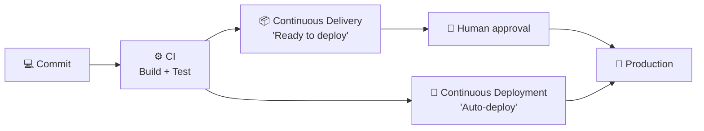
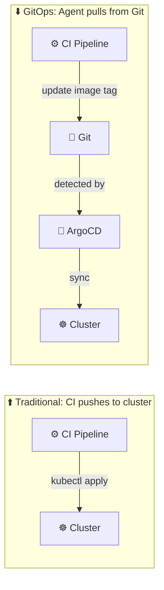
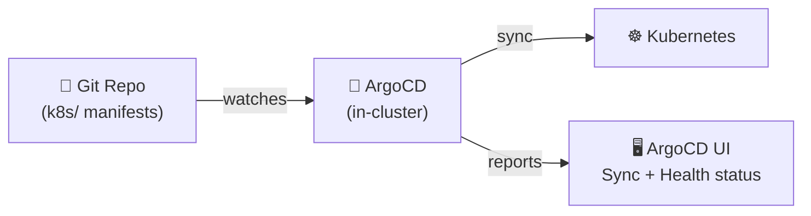
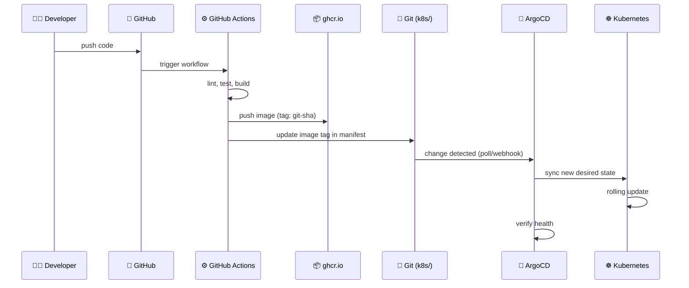
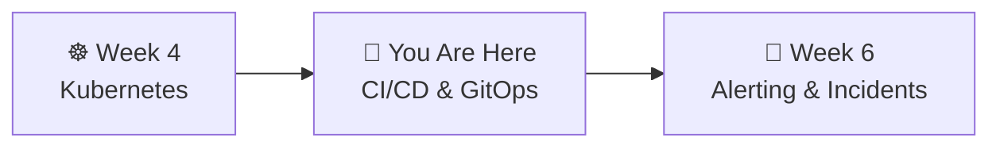

# 📌 Lecture 5 — CI/CD & GitOps: Automating the Path to Production

---

## 📍 Slide 1 – 🔥 The Friday Deploy

* 🕐 Friday 5 PM — developer runs `kubectl apply` from their laptop
* 💥 Typo in the image tag — deploys a 3-month-old version
* 😱 Nobody knows what's actually running in production
* 📋 "Who deployed what, when?" — no answer
* 🔄 Rollback? Re-run which commands? From whose laptop?

> 💬 *"How long would it take your organization to deploy a change that involves just one single line of code?"* — Mary Poppendieck

---

## 📍 Slide 2 – 🎯 Learning Outcomes

| # | 🎓 Outcome |
|---|-----------|
| 1 | ✅ Distinguish CI, Continuous Delivery, and Continuous Deployment |
| 2 | ✅ Write a GitHub Actions workflow that builds and pushes container images |
| 3 | ✅ Explain GitOps principles and why pull beats push |
| 4 | ✅ Deploy ArgoCD and create an Application that syncs from Git |
| 5 | ✅ Perform a rollback using `git revert` instead of manual commands |

---

## 📍 Slide 3 – 📜 A Brief History

| 🗓️ Year | 🏷️ Milestone | 👤 Who |
|---------|-------------|--------|
| 1999 | 🔧 CI described as XP practice | Kent Beck |
| 2006 | 📝 "Continuous Integration" article | **Martin Fowler** |
| 2010 | 📖 *Continuous Delivery* book | **Jez Humble & David Farley** |
| 2011 | 🔧 Jenkins forked from Hudson | Community |
| 2017 | 🔄 "GitOps" coined | **Alexis Richardson** (Weaveworks) |
| 2018 | 🚀 ArgoCD open-sourced | **Intuit** (Jesse Suen) |
| 2019 | 🐙 GitHub Actions GA | GitHub |
| 2024 | 🏆 ArgoCD graduates CNCF | Community |

> 💬 *"If it hurts, do it more frequently, and bring the pain forward."* — Martin Fowler on CI

---

## 📍 Slide 4 – 🔀 CI vs CD vs CD

| 🏷️ Term | 📋 What it does | 🎯 Key difference |
|---------|----------------|-------------------|
| ⚙️ **CI** (Continuous Integration) | Build + test on every commit | Validates code quality, no deployment |
| 📦 **Continuous Delivery** | Every commit is *ready* to deploy | Human decides when to release |
| 🚀 **Continuous Deployment** | Every passing commit auto-deploys | No human gate — fully automated |



> 💡 Most teams do **Continuous Delivery** (human approval before prod). Continuous Deployment requires high test confidence.

---

## 📍 Slide 5 – 🐙 GitHub Actions

* 🗓️ **November 2019** — GitHub Actions GA
* 📋 Workflows defined in `.github/workflows/*.yml`
* 🔧 Triggered by events: `push`, `pull_request`, `schedule`, `workflow_dispatch`
* 🏃 Runs on GitHub-hosted runners (Ubuntu, macOS, Windows) or self-hosted

```yaml
# .github/workflows/ci.yml
name: CI
on:
  push:
    branches: [main]

jobs:
  build:
    runs-on: ubuntu-latest
    steps:
      - uses: actions/checkout@v4        # Clone repo
      - run: echo "Hello from CI!"       # Run command
      - run: docker build -t myapp .     # Build image
```

| 🏷️ Concept | 📋 What it is |
|-----------|-------------|
| **Workflow** | YAML file defining the automation |
| **Event** | What triggers it (push, PR, cron) |
| **Job** | Set of steps that run on one runner |
| **Step** | Single command or action |
| **Action** | Reusable step from Marketplace |
| **Secret** | Encrypted env var (`${{ secrets.NAME }}`) |

---

## 📍 Slide 6 – 🐙 Why GitHub Actions Won

| 🏷️ Factor | 🐙 GitHub Actions | 🔧 Jenkins | 🔵 Travis CI |
|-----------|-------------------|---------|-----------|
| ⚙️ Setup | Zero — lives in repo | Install + maintain server | SaaS (separate) |
| 💰 Pricing | Free for public repos | Free but ops cost | Free tier removed 2020 |
| 🔌 Integration | Native GitHub (PRs, packages) | Plugins for everything | Good but external |
| 📦 Marketplace | 20,000+ reusable actions | 1800+ plugins | Limited |

> 💡 Travis CI was dominant 2012-2018. Acquisition in 2019 + removal of free tier in 2020 → mass migration to GitHub Actions.

---

## 📍 Slide 7 – 📦 Container Registries

After CI builds your image — where does it go?

| 📦 Registry | 💰 Price (public) | 🎯 Best for |
|------------|-------------------|-------------|
| 🐳 Docker Hub | Free (rate limited) | Official images |
| 🐙 **ghcr.io** | **Free, unlimited** | GitHub projects, students |
| ☁️ AWS ECR | $0.10/GB/mo | AWS workloads |
| ☁️ Google AR | $0.10/GB/mo | GCP workloads |

* 🐙 **ghcr.io** (GitHub Container Registry) — free, authenticated with `GITHUB_TOKEN`, zero setup
* ⚠️ Docker Hub has pull rate limits since 2020 (100/6hr anonymous) — use ghcr.io instead
* 🏷️ **Never use `latest` tag in production:**

```
# ❌ Bad — what version is this? Can't rollback.
image: myapp:latest

# ✅ Good — immutable, traceable, rollbackable
image: ghcr.io/myorg/myapp:a1b2c3d
```

---

## 📍 Slide 8 – 🔄 GitOps: Git as Source of Truth

> 💬 Coined by **Alexis Richardson** (Weaveworks CEO), August 2017

**Four principles** (OpenGitOps, CNCF):

1. 📋 **Declarative** — entire system described in YAML/Helm
2. 📝 **Versioned & Immutable** — stored in Git with full history
3. 🔄 **Pulled Automatically** — agent pulls desired state from Git
4. 🔁 **Continuously Reconciled** — agent detects and corrects drift

> 💬 *"If you can do `git revert` and your system rolls back, you have GitOps. If you can't, you have a YAML repository."*

---

## 📍 Slide 9 – ⬆️ Push vs Pull Deployment



| 🏷️ Aspect | ⬆️ Push (CI → cluster) | ⬇️ Pull (GitOps) |
|-----------|----------------------|-------------------|
| 🔑 Credentials | CI needs cluster access | Only in-cluster agent does |
| 📋 Audit trail | CI logs (may expire) | Git history (permanent) |
| 🔍 Drift detection | None | Continuous — auto-corrects |
| ⏪ Rollback | Re-run old pipeline | `git revert` — instant |
| 🔒 Security | CI compromise = cluster compromise | CI has no cluster access |

> 🤔 **Think:** In Lab 4 you ran `kubectl apply` from your machine. What if someone else applies different manifests? Who wins?

---

## 📍 Slide 10 – 🚀 ArgoCD

* 🏢 Created at **Intuit** (TurboTax, QuickBooks) — open-sourced **2018**
* 🏆 **CNCF Graduated** — December 2024
* 🔄 Watches a Git repo, syncs K8s resources to match



**Key concepts:**
* 📋 **Application** — CRD that defines: source (Git repo + path) → destination (cluster + namespace)
* 🟢 **Synced** — cluster matches Git
* 🟡 **OutOfSync** — cluster differs from Git
* 💊 **Healthy / Degraded / Progressing** — health status of deployed resources
* 🔧 **Self-heal** — auto-reverts manual cluster changes to match Git

---

## 📍 Slide 11 – 🔄 The Full GitOps Pipeline



* 📍 Steps 1-4 = **CI** (build and publish)
* 📍 Steps 5-7 = **GitOps** (deploy and verify)
* ⏪ **Rollback** = `git revert` the tag update → ArgoCD syncs the old version

---

## 📍 Slide 12 – 🔒 Supply Chain Security

> 🗓️ **January 2021** — Codecov Bash Uploader compromised for ~2.5 months. Attackers stole CI secrets from ~29,000 organizations including Twitch and HashiCorp.

* 🔒 CI pipelines are **high-value targets** — they have credentials, secrets, deploy access
* 📋 **Pin dependencies** to versions/SHAs, not `latest` or `@main`
* 🔑 **Minimize secrets** — GitOps means CI doesn't need cluster credentials
* 🏷️ **Immutable tags** — never overwrite an image tag

```yaml
# ❌ Risky — action could change without notice
- uses: some-action@main

# ✅ Safe — pinned to specific version
- uses: actions/checkout@v4
```

---

## 📍 Slide 13 – 🧠 Key Takeaways

1. ⚙️ **CI catches bugs before deployment** — build + test on every commit
2. 📦 **Immutable image tags** — `myapp:a1b2c3d`, never `:latest`
3. 🔄 **GitOps = Git as source of truth** — deploy by merging, rollback by reverting
4. 🔒 **Pull beats push** — ArgoCD needs no CI credentials, detects drift
5. ⏪ **Rollback = `git revert`** — not "find the person who deployed"

> 💬 *"If you want to move fast with confidence, invest in your release engineering infrastructure."* — Google SRE Book

---

## 📍 Slide 14 – 🚀 What's Next

* 📍 **Next lecture:** Alerting & Incident Response — SLO-based alerting, runbooks, postmortems
* 🧪 **Lab 5:** Write a GitHub Actions workflow, install ArgoCD, deploy via GitOps
* 📖 **Reading:** [ArgoCD docs](https://argo-cd.readthedocs.io/) + [GitHub Actions docs](https://docs.github.com/en/actions)



---

## 📚 Resources

* 📖 [Martin Fowler — Continuous Integration (2006)](https://martinfowler.com/articles/continuousIntegration.html)
* 📖 *Continuous Delivery* — Jez Humble & David Farley (Addison-Wesley, 2010)
* 📖 [Alexis Richardson — GitOps (2017)](https://www.weave.works/blog/gitops-operations-by-pull-request)
* 📖 [GitHub Actions documentation](https://docs.github.com/en/actions)
* 📖 [ArgoCD Getting Started](https://argo-cd.readthedocs.io/en/stable/getting_started/)
* 📖 [OpenGitOps Principles](https://opengitops.dev/)
* 📖 [Google SRE Book, Ch 8 — Release Engineering](https://sre.google/sre-book/release-engineering/)
* 📝 [Codecov incident post-mortem](https://about.codecov.io/security-update/)
