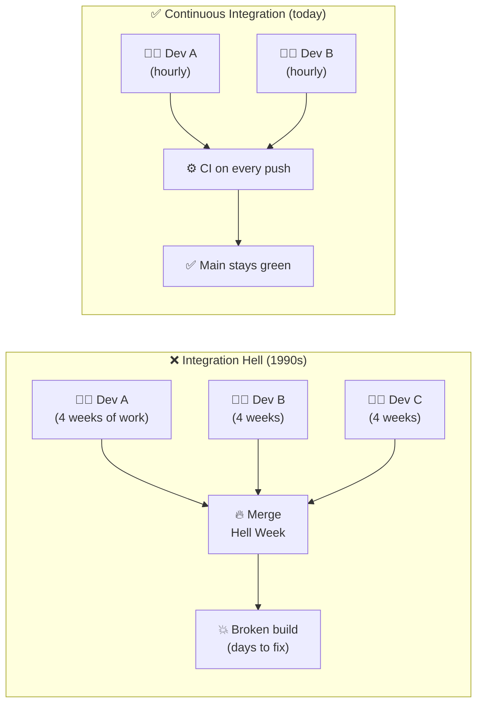
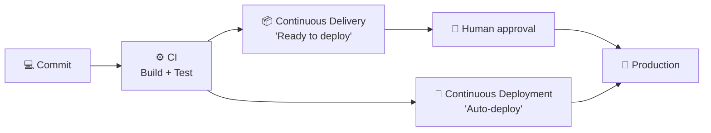
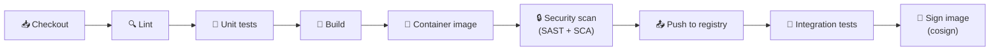
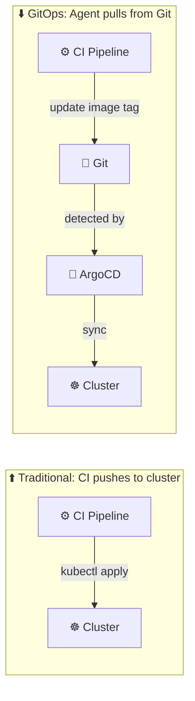
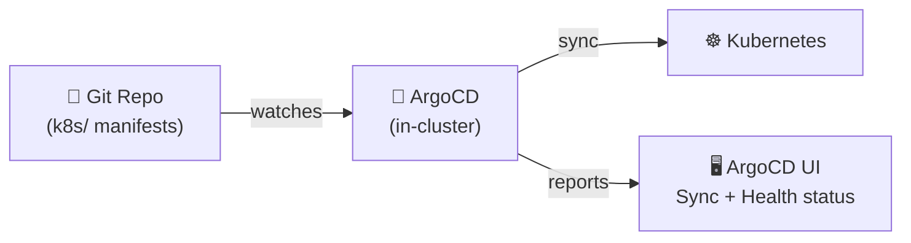
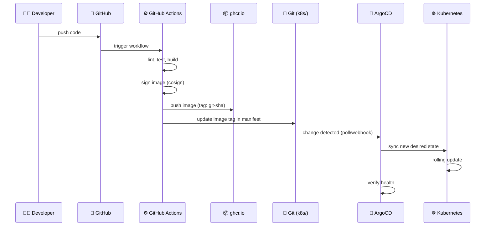
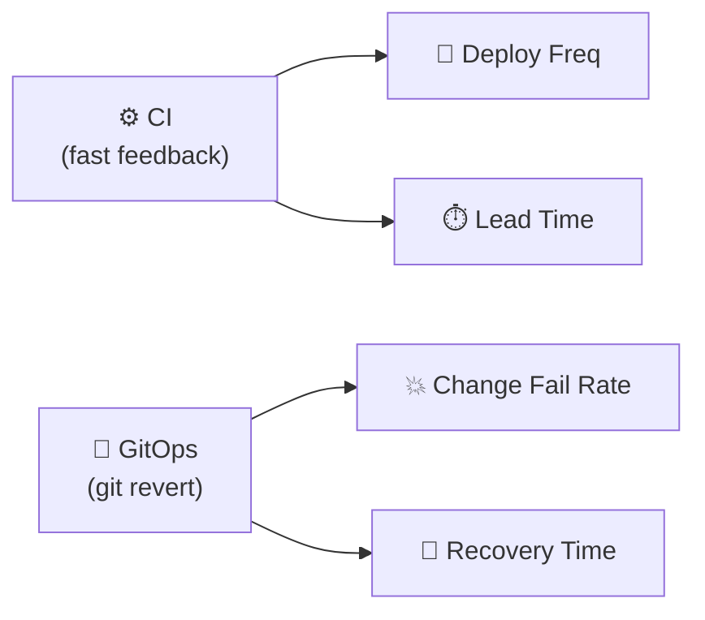
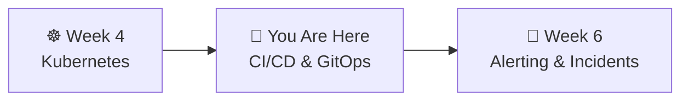

# 📌 Lecture 5 — CI/CD & GitOps: Automating the Path to Production

---

## 📍 Slide 1 – 🔥 The Friday Deploy

* 🕐 Friday 5 PM — developer runs `kubectl apply` from their laptop
* 💥 Typo in the image tag — deploys a 3-month-old version
* 😱 Nobody knows what's actually running in production
* 📋 "Who deployed what, when?" — no answer
* 🔄 Rollback? Re-run which commands? From whose laptop?

> 💬 *"How long would it take your organization to deploy a change that involves just one single line of code? Do you do this on a repeatable, reliable basis?"* — **Mary Poppendieck**, *Implementing Lean Software Development* (2006)

---

## 📍 Slide 2 – 🎯 Learning Outcomes

| # | 🎓 Outcome |
|---|-----------|
| 1 | ✅ Distinguish CI, Continuous Delivery, and Continuous Deployment |
| 2 | ✅ Write a GitHub Actions workflow that builds and pushes container images |
| 3 | ✅ Explain GitOps principles and why **pull beats push** |
| 4 | ✅ Deploy ArgoCD and create an Application that syncs from Git |
| 5 | ✅ Perform a rollback using `git revert` instead of manual commands |
| 6 | ✅ Name the four DORA metrics and what elite performance looks like |
| 7 | ✅ Identify common CI/CD supply-chain risks and defenses |

---

## 📍 Slide 3 – 📜 A Brief History

| 🗓️ Year | 🏷️ Milestone | 👤 Who |
|---------|-------------|--------|
| 1991 | 📖 Term "continuous integration" first published | **Grady Booch** (*Object-Oriented Analysis and Design*) |
| 1999 | 🔧 CI codified as an XP practice | **Kent Beck** (*Extreme Programming Explained*) |
| 2005 | 🔨 Hudson released by Kohsuke Kawaguchi at Sun | Community CI server |
| 2006 | 📝 "Continuous Integration" essay (revised) | **Martin Fowler** |
| 2010 | 📖 *Continuous Delivery* book | **Jez Humble & David Farley** |
| 2011 | 🍴 Jenkins forks from Hudson (Oracle trademark dispute) | Community |
| 2014 | 🐙 GitHub ships Travis CI integration, CircleCI grows | SaaS era begins |
| 2017 | 🔄 "GitOps" coined | **Alexis Richardson** (Weaveworks) |
| 2018 | 🚀 ArgoCD open-sourced | **Intuit** (Jesse Suen) |
| 2019 | 🐙 GitHub Actions GA (November) | GitHub |
| 2021 | 🔐 GitHub Actions OIDC support | GitHub (October) |
| 2022 | 🏆 Argo (incl. ArgoCD) & Flux both **graduate CNCF** | Community |
| 2023 | 🔒 SLSA v1.0 released (supply-chain framework) | OpenSSF |

> 💬 *"If it hurts, do it more frequently, and bring the pain forward."* — Martin Fowler on CI

> 💡 **Fun fact:** Booch's 1991 "CI" was nothing like today's — he meant *incremental system integration* by humans. Beck automated it. Fowler made it famous. Jenkins made it universal.

---

## 📍 Slide 4 – 💥 The Problem CI Solves: Integration Hell

Before CI, teams practiced **"integration phase"** — weeks where developers merged branches and **nothing compiled**:



> 🤔 **Think:** Fowler's rule — "Commit to mainline at least once a day." Why *daily*, not weekly?

---

## 📍 Slide 5 – 🔀 CI vs CD vs CD

| 🏷️ Term | 📋 What it does | 🎯 Key difference |
|---------|----------------|-------------------|
| ⚙️ **CI** (Continuous Integration) | Build + test on every commit | Validates code quality, no deployment |
| 📦 **Continuous Delivery** | Every commit is *ready* to deploy | Human decides when to release |
| 🚀 **Continuous Deployment** | Every passing commit auto-deploys | No human gate — fully automated |



> 💡 Most teams practice **Continuous Delivery** (human approval before prod). Continuous Deployment requires very high test confidence, progressive delivery (Week 7), and good observability.

---

## 📍 Slide 6 – 🏗️ The Modern CI Pipeline

A CI run isn't one step — it's a **pipeline of stages**, each a quality gate:



| 🏷️ Stage | ⏱️ Typical time | 💥 Fails fast? |
|---------|----------------|----------------|
| Lint | <30s | Yes — cheapest gate |
| Unit tests | 1-5 min | Yes |
| Build | 1-3 min | Yes |
| Container scan | 30s-2 min | Sometimes (CVE thresholds) |
| Integration tests | 5-20 min | Yes |
| Sign & publish | <1 min | Rarely |

> 💡 **Principle:** Put fast gates first. A 10-second linter failing saves a 20-minute integration test.

---

## 📍 Slide 7 – 🐙 GitHub Actions

* 🗓️ **November 2019** — GitHub Actions GA
* 📋 Workflows defined in `.github/workflows/*.yml`
* 🔧 Triggered by events: `push`, `pull_request`, `schedule`, `workflow_dispatch`, `release`
* 🏃 Runs on GitHub-hosted runners (Ubuntu, macOS, Windows) or self-hosted

```yaml
# .github/workflows/ci.yml
name: CI
on:
  push:
    branches: [main]

jobs:
  build:
    runs-on: ubuntu-latest
    steps:
      - uses: actions/checkout@v4        # Clone repo
      - run: echo "Hello from CI!"       # Run command
      - run: docker build -t myapp .     # Build image
```

| 🏷️ Concept | 📋 What it is |
|-----------|-------------|
| **Workflow** | YAML file defining the automation |
| **Event** | What triggers it (push, PR, cron) |
| **Job** | Set of steps that run on one runner |
| **Step** | Single command or action |
| **Action** | Reusable step from Marketplace |
| **Secret** | Encrypted env var (`${{ secrets.NAME }}`) |
| **Runner** | VM executing the job |

---

## 📍 Slide 8 – 🧰 Advanced GitHub Actions

Things you'll meet in real projects:

**🎲 Matrix builds** — run the same job across N combinations:

```yaml
strategy:
  matrix:
    python: ["3.10", "3.11", "3.12"]
    os: [ubuntu-latest, macos-latest]
steps:
  - run: pytest      # 6 jobs run in parallel
```

**♻️ Reusable workflows** — call one workflow from another:

```yaml
jobs:
  deploy:
    uses: myorg/.github/.github/workflows/deploy.yml@v1
    with: { environment: staging }
```

**💾 Caching** — skip rebuilding dependencies:

```yaml
- uses: actions/cache@v4
  with:
    path: ~/.cache/pip
    key: pip-${{ hashFiles('requirements.txt') }}
```

**🧩 Composite actions** — bundle steps into a reusable action (your own or on Marketplace).

> 💡 **Fun fact:** The Marketplace has **20,000+ actions**. You rarely write `run:` commands from scratch in production workflows.

---

## 📍 Slide 9 – 🏆 Why GitHub Actions Won

| 🏷️ Factor | 🐙 GitHub Actions | 🔧 Jenkins | 🔵 Travis CI |
|-----------|-------------------|---------|-----------|
| ⚙️ Setup | Zero — lives in repo | Install + maintain server | SaaS (separate) |
| 💰 Pricing | Free for public repos | Free but ops cost | Free tier removed 2020 |
| 🔌 Integration | Native GitHub (PRs, packages) | Plugins for everything | Good but external |
| 📦 Marketplace | 20,000+ reusable actions | 1800+ plugins | Limited |
| 🔐 OIDC → cloud | ✅ Native (2021) | ✅ via plugins | ❌ |

> 💡 Travis CI was dominant 2012-2018. Acquisition in 2019 + removal of free tier in 2020 → mass migration to GitHub Actions and CircleCI.

> 🤔 **Think:** Jenkins is still the #1 CI in large enterprises. Why might a bank prefer self-hosted Jenkins over GitHub Actions?

---

## 📍 Slide 10 – 📦 Container Registries

After CI builds your image — where does it go?

| 📦 Registry | 💰 Price (public) | 🎯 Best for |
|------------|-------------------|-------------|
| 🐳 Docker Hub | Free (rate limited) | Official images |
| 🐙 **ghcr.io** | **Free, unlimited** | GitHub projects, students |
| ☁️ AWS ECR | $0.10/GB/mo | AWS workloads |
| ☁️ Google AR | $0.10/GB/mo | GCP workloads |
| 🐙 GitLab Registry | Bundled with GitLab | GitLab shops |

* 🐙 **ghcr.io** — free, authenticated with `GITHUB_TOKEN`, zero setup
* ⚠️ Docker Hub has pull rate limits (100/6hr anonymous) since November 2020 — many teams mirror to a private registry
* 🏷️ **Never use `latest` tag in production:**

```
# ❌ Bad — what version is this? Can't rollback.
image: myapp:latest

# ✅ Good — immutable, traceable, rollbackable
image: ghcr.io/myorg/myapp:a1b2c3d
```

---

## 📍 Slide 11 – 🔐 Image Signing & SLSA

You just pulled `ghcr.io/foo/bar:v1`. How do you know **this is the image CI built** and not tampered en route?

**Sigstore** (Linux Foundation, 2021) → `cosign` signs images:

```bash
cosign sign ghcr.io/myorg/myapp:a1b2c3d        # CI signs
cosign verify --certificate-identity=...        # Runtime verifies
```

**SLSA** — *Supply-chain Levels for Software Artifacts* (Google, now OpenSSF, v1.0 in April 2023):

| 🏷️ Level | 🔒 What it guarantees |
|----------|----------------------|
| **L0** | No guarantees |
| **L1** | Provenance exists (CI emitted a build record) |
| **L2** | Signed provenance from a hosted build platform |
| **L3** | Hardened, non-forgeable provenance, isolated builds |

GitHub Actions supports SLSA L3 via the official `slsa-github-generator`.

> 💡 **Fun fact:** "SLSA" is pronounced like the dance — **"salsa"**. Google Security announced it that way.

---

## 📍 Slide 12 – 🔄 GitOps: Git as Source of Truth

> 💬 Coined by **Alexis Richardson** (Weaveworks CEO), August 2017

**Four principles** (OpenGitOps, CNCF Sandbox project):

1. 📋 **Declarative** — entire system described in YAML/Helm/Kustomize
2. 📝 **Versioned & Immutable** — stored in Git with full history
3. 🔄 **Pulled Automatically** — agent pulls desired state from Git
4. 🔁 **Continuously Reconciled** — agent detects and corrects drift

> 💬 *"If you can do `git revert` and your system rolls back, you have GitOps. If you can't, you have a YAML repository."*

> 🤔 **Think:** Docker Compose in Week 1 was already declarative. What's missing to make it GitOps?

---

## 📍 Slide 13 – ⬆️ Push vs Pull Deployment



| 🏷️ Aspect | ⬆️ Push (CI → cluster) | ⬇️ Pull (GitOps) |
|-----------|----------------------|-------------------|
| 🔑 Credentials | CI needs cluster access | Only in-cluster agent does |
| 📋 Audit trail | CI logs (may expire) | Git history (permanent) |
| 🔍 Drift detection | None | Continuous — auto-corrects |
| ⏪ Rollback | Re-run old pipeline | `git revert` — instant |
| 🔒 Security | CI compromise = cluster compromise | CI has no cluster access |

> 🤔 **Think:** In Lab 4 you ran `kubectl apply` from your machine. What if someone else applies different manifests? Who wins?

---

## 📍 Slide 14 – 🚀 ArgoCD

* 🏢 Created at **Intuit** (TurboTax, QuickBooks) — open-sourced **2018**
* 🏆 **CNCF Graduated** — **December 2022** (along with the whole Argo project)
* 🔄 Watches a Git repo, syncs K8s resources to match



**Key concepts:**
* 📋 **Application** — CRD: source (Git repo + path) → destination (cluster + namespace)
* 🎭 **ApplicationSet** — one template generates many Applications (e.g., per-env)
* 🧱 **App-of-Apps** — an Application that installs *more* Applications (bootstrap pattern)
* 🌊 **Sync waves** — order resources (CRDs before controllers, DB before app)
* 🟢 **Synced** / 🟡 **OutOfSync** — cluster vs Git match
* 💊 **Healthy / Degraded / Progressing** — runtime health
* 🔧 **Self-heal** — auto-reverts manual cluster changes to match Git

---

## 📍 Slide 15 – 🔀 ArgoCD vs Flux

Both **CNCF Graduated** (2022), both implement OpenGitOps. Different philosophies:

| 🏷️ Aspect | 🚀 ArgoCD | 🌊 Flux |
|-----------|-----------|---------|
| 🎨 Primary interface | UI-first, rich dashboard | CLI-first, no built-in UI |
| 🧩 Architecture | Monolithic controller | GitOps Toolkit — composable controllers (source, kustomize, helm, notification) |
| 👥 Multi-tenancy | Built-in RBAC + Projects | Via Flux tenants + Kubernetes RBAC |
| 🔧 Config model | Application CRD | Kustomization + HelmRelease CRDs |
| 🏢 Typical shop | "We want a UI to manage apps" | "Pure GitOps, everything as code" |

> 💡 **Pick by culture:** If your engineers love CLI + code, pick Flux. If you need a dashboard SREs and devs share, pick ArgoCD. Neither is "better."

---

## 📍 Slide 16 – 🔄 The Full GitOps Pipeline



* 📍 Steps 1-5 = **CI** (build, sign, publish)
* 📍 Steps 6-8 = **GitOps** (deploy and verify)
* ⏪ **Rollback** = `git revert` the tag update → ArgoCD syncs the old version

---

## 📍 Slide 17 – 📊 DORA Metrics: How We Measure CI/CD

From Forsgren, Humble & Kim's **Accelerate** (2018) — the research behind the annual **State of DevOps Report**.

| 📊 Metric | ❓ Measures | 🏆 Elite (2023 report) |
|-----------|------------|-------------------------|
| 🚀 **Deployment Frequency** | How often you ship | Multiple per day (on demand) |
| ⏱️ **Lead Time for Changes** | Commit → production | Less than 1 day |
| 💥 **Change Failure Rate** | % deploys that break prod | 0-15% |
| 🔄 **Failed Deployment Recovery Time** | How fast you recover | Less than 1 hour |



> 💡 **The compound effect:** Elite teams deploy **973x more frequently** and recover **6570x faster** than low performers (2021 DORA report).

> 🤔 **Think:** Your team deploys once a quarter. Which DORA metric improves fastest if you adopt CI? Which if you adopt GitOps?

---

## 📍 Slide 18 – 🔒 Supply Chain Attacks: A Recent Tour

CI pipelines are **high-value targets** — they hold credentials, signing keys, and deploy access.

| 🗓️ Year | 💥 Incident | 🎯 What happened |
|---------|-------------|------------------|
| 2020 | **SolarWinds / Orion** | Nation-state injected backdoor into the build process. 18,000+ orgs, including US agencies. |
| 2021 | **Codecov Bash Uploader** | Malicious one-line edit in a script. ~2.5 months undetected. Secrets stolen from ~29,000 orgs. |
| 2021 | **Log4Shell** (CVE-2021-44228) | Not a CI attack, but showed how deep transitive dependencies go — many couldn't list where log4j was used. |
| 2023 | **CircleCI breach** (Jan) | Malware on an engineer's laptop stole a session cookie → customer CI secrets. Forced global rotation. |
| 2023 | **3CX cascade** (Mar) | Trojanized 3CX installer compromised via trojanized *upstream* Trading Technologies software — **first public cascading supply-chain attack**. |

> 💬 *"Your CI is more privileged than your production — it creates production."*

---

## 📍 Slide 19 – 🛡️ Defenses: Pinning, OIDC, Least Privilege

**1. Pin everything:**

```yaml
# ❌ Risky — action could change without notice
- uses: some-action@main

# ✅ Safer — pinned to tag
- uses: actions/checkout@v4

# ✅ Safest — pinned to SHA (tag can be moved!)
- uses: actions/checkout@11bd71901bbe5b1630ceea73d27597364c9af683 # v4.2.2
```

**2. Short-lived creds via OIDC** (GitHub Actions, October 2021):

```yaml
permissions:
  id-token: write          # ← lets workflow request an OIDC JWT
  contents: read
steps:
  - uses: aws-actions/configure-aws-credentials@v4
    with:
      role-to-assume: arn:aws:iam::123:role/deploy
      # NO aws_access_key_id — assumed via trust policy on repo/ref!
```

Cloud IdP (AWS STS, GCP WIF, Azure federated) validates the JWT's `repo`, `ref`, `workflow` claims against a trust policy → returns 15-minute creds.

**3. Minimize permissions:** every workflow should set `permissions:` explicitly at the top. Default is too broad.

---

## 📍 Slide 20 – ❌ Common CI/CD Anti-patterns

| ❌ Anti-pattern | 💥 Why it hurts | ✅ Do instead |
|----------------|----------------|--------------|
| `image: myapp:latest` | No rollback target; deploys are non-reproducible | Immutable SHA tags |
| Long-lived CI secrets | Leaked cookies = cluster compromise (see CircleCI 2023) | OIDC + short-lived tokens |
| `kubectl apply` from laptops | No audit trail, no drift detection | GitOps pull model |
| One giant monolithic workflow | Failures cascade, slow feedback | Split into matrixed / reusable workflows |
| Tests only in the deploy job | Bugs caught after build & push wastes 5-10 min | Fast gates first (lint → test → build) |
| Ignoring CI failures ("I'll fix it later") | Broken main blocks everyone | **Stop the line** rule — fix or revert immediately |

> 💬 *"A broken build is a team emergency."* — Jez Humble, *Continuous Delivery*

---

## 📍 Slide 21 – 🧠 Key Takeaways

1. ⚙️ **CI catches bugs before deployment** — build + test on every commit, fast gates first
2. 📦 **Immutable image tags** — `myapp:a1b2c3d`, never `:latest`; sign with cosign
3. 🔄 **GitOps = Git as source of truth** — deploy by merging, rollback by reverting
4. 🔒 **Pull beats push** — ArgoCD/Flux need no CI credentials, detect drift, self-heal
5. ⏪ **Rollback = `git revert`** — not "find the person who deployed"
6. 📊 **DORA metrics** measure CI/CD effectiveness — deploy freq, lead time, change failure rate, recovery time
7. 🛡️ **CI is production** — pin actions, use OIDC, set minimal `permissions:`

> 💬 *"If you want to move fast with confidence, invest in your release engineering infrastructure."* — **Google SRE Book**, Ch. 8

---

## 📍 Slide 22 – 🚀 What's Next

* 📍 **Next lecture:** Alerting & Incident Response — SLO-based alerting, runbooks, postmortems
* 🧪 **Lab 5:** Write a GitHub Actions workflow, install ArgoCD, deploy via GitOps, rollback via `git revert`
* 🧪 **Lab 7 preview:** Progressive Delivery — ArgoCD + Argo Rollouts for canary deployments
* 📖 **Reading:** [ArgoCD docs](https://argo-cd.readthedocs.io/) + [GitHub Actions docs](https://docs.github.com/en/actions)



---

## 📚 Resources

* 📖 [Martin Fowler — Continuous Integration (2006)](https://martinfowler.com/articles/continuousIntegration.html) — the foundational essay
* 📖 *Continuous Delivery* — Jez Humble & David Farley (Addison-Wesley, 2010) — the definitive book
* 📖 *Accelerate* — Forsgren, Humble & Kim (IT Revolution, 2018) — the DORA research
* 📖 [Alexis Richardson — GitOps (2017)](https://www.weave.works/blog/gitops-operations-by-pull-request) — the original blog post
* 📖 [OpenGitOps Principles](https://opengitops.dev/) — CNCF Sandbox, the 4 principles
* 📖 [GitHub Actions documentation](https://docs.github.com/en/actions) + [Security hardening guide](https://docs.github.com/en/actions/security-guides/security-hardening-for-github-actions)
* 📖 [ArgoCD Getting Started](https://argo-cd.readthedocs.io/en/stable/getting_started/) + [Flux docs](https://fluxcd.io/flux/)
* 📖 [Google SRE Book, Ch 8 — Release Engineering](https://sre.google/sre-book/release-engineering/)
* 📖 [SLSA framework](https://slsa.dev/) + [Sigstore / cosign](https://www.sigstore.dev/)
* 📝 [Codecov incident post-mortem (2021)](https://about.codecov.io/security-update/)
* 📝 [CircleCI January 2023 incident report](https://circleci.com/blog/jan-4-2023-incident-report/)
* 📊 [2023 Accelerate State of DevOps Report (DORA)](https://cloud.google.com/devops/state-of-devops) — annual PDF
