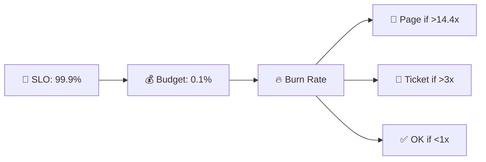
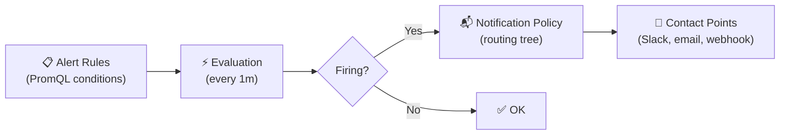
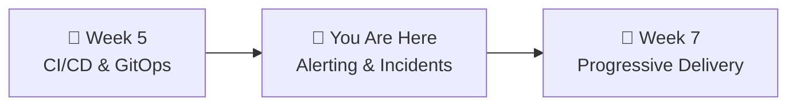

# 📌 Lecture 6 — Alerting & Incident Response

---

## 📍 Slide 1 – 🚨 The Alert That Cried Wolf

* 🔔 Team gets **200+ alerts per week** — OpsGenie 2019 survey
* 😴 Engineers create email filters to hide noisy alerts
* 🔥 Real incident happens at 3 AM — nobody responds because "it's probably another false positive"
* 💀 Result: **4-hour outage** that could have been caught in 5 minutes

> 💬 *"When everything is urgent, nothing is urgent."*

> 🤔 **Think:** Your smoke detector goes off every time you cook toast. What do you do? (Remove the battery.) That's alert fatigue.

---

## 📍 Slide 2 – 🎯 Learning Outcomes

| # | 🎓 Outcome |
|---|-----------|
| 1 | ✅ Explain why alert fatigue is dangerous and how to prevent it |
| 2 | ✅ Create SLO-based alerts using multi-window burn rates |
| 3 | ✅ Configure Grafana Alerting with contact points and notification policies |
| 4 | ✅ Describe incident management roles (IC, Comms, Scribe, SME) |
| 5 | ✅ Write a blameless postmortem that drives learning, not blame |

---

## 📍 Slide 3 – 🔕 Alert Fatigue

From the **Google SRE Book, Chapter 11**:

> 💬 *"Every time the pager goes off, I should be able to react with a sense of urgency. I can only react with a sense of urgency a few times a day before I become fatigued."*

* 📊 Google's target: **max 2 events per 12-hour shift**
* 📋 Three valid monitoring outputs (Ch 6):
  * 🚨 **Page** — needs immediate human action
  * 🎫 **Ticket** — needs action, not immediately
  * 📝 **Log** — for diagnostics only
* ⚠️ Everything else is **noise**

> 💬 *"Every page should be actionable. If a page merely merits a robotic response, it shouldn't be a page."* — Google SRE Book

---

## 📍 Slide 4 – 🎯 SLO-Based Alerting

**The old way:** Alert when error rate > 1% ← arbitrary threshold, constant tuning

**The SRE way:** Alert when you're burning error budget too fast

> 💡 From **Google SRE Workbook, Chapter 5**: alert on **burn rate**, not raw thresholds.

* 📊 **Burn rate 1x** = consuming budget at exactly the sustainable pace (30 days)
* 🔥 **Burn rate 14.4x** = will exhaust the entire 30-day budget in ~2 days
* ⚠️ **Burn rate 6x** = will exhaust in ~5 days



---

## 📍 Slide 5 – 🪟 Multi-Window, Multi-Burn-Rate

| 🚨 Severity | ⏱️ Long Window | ⏱️ Short Window | 🔥 Burn Rate | 💰 Budget Consumed |
|------------|--------------|---------------|-------------|-------------------|
| 🚨 Page (critical) | 1 hour | 5 min | 14.4x | 2% in 1h |
| 🚨 Page | 6 hours | 30 min | 6x | 5% in 6h |
| 🎫 Ticket | 1 day | 2 hours | 3x | 10% in 1d |
| 📝 Log | 3 days | 6 hours | 1x | 10% in 3d |

**Why TWO windows?**
* ⏱️ **Long window** = confirms the problem is real (not a brief spike)
* ⚡ **Short window** = clears quickly once fixed (don't alert for hours after recovery)

```promql
# Alert fires when BOTH are true:
(error_rate[1h] > 14.4 * 0.001)   # Long: sustained problem
AND
(error_rate[5m] > 14.4 * 0.001)   # Short: still happening now
```

---

## 📍 Slide 6 – 📊 Grafana Unified Alerting

Since **Grafana 9 (June 2022)** — unified alerting is the default:



| 🏷️ Component | 📋 What it does |
|-------------|---------------|
| **Alert Rule** | PromQL query + threshold + evaluation interval |
| **Contact Point** | Where notifications go (Slack, webhook, email, Discord) |
| **Notification Policy** | Routes alerts to contact points based on labels |

* 🔧 Grafana embeds **Alertmanager** internally — no separate deployment needed
* 📊 Rules live alongside dashboards — same Grafana UI

---

## 📍 Slide 7 – 🚒 Incident Management

> 💬 Modeled after the **Incident Command System (ICS)** — used by fire departments since the 1970s.

| 👤 Role | 📋 Responsibility | ❌ Does NOT |
|---------|-------------------|-----------|
| 🎖️ **Incident Commander (IC)** | Coordinates response, makes decisions, delegates | Fix the problem |
| 📢 **Communications Lead** | Updates status page, notifies stakeholders | Debug systems |
| 📝 **Scribe** | Documents timeline in real-time | Make decisions |
| 🔧 **Subject Matter Expert (SME)** | Diagnoses and fixes the actual issue | Coordinate |

> 💡 **Key insight:** The IC doesn't hold the hose. They coordinate the team. Without an IC, everyone debugs different things simultaneously and nobody communicates.

* 📖 Based on the **PagerDuty Incident Response** framework — [open source](https://response.pagerduty.com/)

---

## 📍 Slide 8 – 🏥 Severity Levels

| 🏥 Severity | 📋 Description | 🚨 Response | 📊 Example |
|------------|---------------|------------|-----------|
| **SEV-1** | Critical, revenue impact | All hands, IC immediately | Complete outage |
| **SEV-2** | Major, many users affected | IC assigned, core team | Degraded for many users |
| **SEV-3** | Minor, limited impact | Team lead notified | Feature partially broken |
| **SEV-4** | Informational | Ticket created | UI glitch |

> 🏥 **ER triage analogy:** SEV-1 = cardiac arrest (all hands). SEV-2 = broken arm (urgent, stable). SEV-3 = sprained ankle (can wait). SEV-4 = papercut (next appointment).

---

## 📍 Slide 9 – 📝 Blameless Postmortems

> 💬 *"Having a blameless postmortem means engineers can give a detailed account of what actions they took... without fear of punishment or retribution."*
> — **John Allspaw**, Etsy CTO, 2012

**Sidney Dekker's "New View" of safety:**
* 🔍 Human error is a **symptom**, not a cause
* 🧠 People's actions made **sense to them at the time** given what they knew
* 🔒 Blame prevents learning — people stop reporting problems
* 🔧 Fix the **system**, not the person

> ❌ "Bob deleted the production database" → Bob gets fired → same thing happens again
> ✅ "Why was it possible to delete production from a dev laptop?" → fix the system → it can't happen again

---

## 📍 Slide 10 – 📋 Postmortem Structure

| 📋 Section | 📝 What to write |
|-----------|----------------|
| 📄 **Summary** | What happened, 2-3 sentences, impact |
| ⏱️ **Timeline** | Chronological events with timestamps |
| 🔍 **Root Cause** | Systemic issue, NOT "person X made a mistake" |
| ✅ **What Went Well** | Fast detection? Good communication? |
| ❌ **What Went Wrong** | Slow escalation? Missing runbook? |
| 📋 **Action Items** | Specific, assigned, time-bound tasks |

> 💬 *"The primary goal is to ensure the incident is documented, root causes understood, and effective preventive actions put in place."* — Google SRE Book, Ch 15

---

## 📍 Slide 11 – 📖 Runbooks

A runbook bridges "something is wrong" → "here's what to do":

```
🚨 Alert fires: "Gateway Error Rate > 5%"
         │
         ▼
📖 Runbook: gateway-high-error-rate
         │
    ┌────┼────┐
    ▼    ▼    ▼
🔍 Diagnose  🔧 Mitigate  📞 Escalate
```

| 📋 Section | 📝 Content |
|-----------|-----------|
| 🚨 **Alert** | Which alert, what it means |
| 🔍 **Diagnose** | Which dashboards, which logs, common causes |
| 🔧 **Mitigate** | Steps to fix (restart, rollback, scale up) |
| 📞 **Escalate** | When + who to escalate to |

> 💡 **Progression:** Manual runbook → test and refine → automate steps → fully automated. Never automate what you haven't documented first.

---

## 📍 Slide 12 – 💥 Real Postmortem: Cloudflare 2019

* 🗓️ **July 2, 2019** — one bad regex deployed via WAF rule update
* 💥 **103 characters** of regex caused CPU exhaustion across the **entire** global edge network
* ⏱️ From deployment to global outage: **< 3 minutes**
* 🌐 Cloudflare serves ~10% of all HTTP traffic — millions of sites down
* ⏱️ Recovery: **27 minutes** (complicated because their own tools were also affected)

The regex:
```
(?:(?:\"|'|\]|\}|\\|\d|(?:nan|infinity|true|false|null|undefined|symbol|math)|\`|\-|\+)+[)]*;?((?:\s|-|~|!|{}|\|\||\+)*.*(?:.*=.*)))
```

> 🔍 `.*(?:.*=.*)` caused **catastrophic backtracking** — exponential evaluation time.

* ✅ **Great postmortem:** transparent, detailed, published same day
* 📋 **Action items:** regex complexity analysis, execution time limits, staged rollouts for WAF rules

---

## 📍 Slide 13 – 🧠 Key Takeaways

1. 🔕 **Alert fatigue kills** — max 2 events per shift, every page must be actionable
2. 🔥 **Alert on burn rate**, not raw thresholds — connect alerts to SLOs
3. 🎖️ **IC coordinates, SMEs fix** — defined roles prevent chaos during incidents
4. 📝 **Blameless postmortems** — fix systems, not people. Blame prevents learning.
5. 📖 **Runbooks save time** — document before you automate

> 💬 *"The cost of a postmortem is low. The cost of repeating an incident is very high."*

---

## 📍 Slide 14 – 🚀 What's Next

* 📍 **Next lecture:** Progressive Delivery — Argo Rollouts, canary deployments
* 🧪 **Lab 6:** Create Grafana alerts, inject failure, follow your runbook, write a postmortem
* 📖 **Reading:** [SRE Workbook, Ch 5 — Alerting on SLOs](https://sre.google/workbook/alerting-on-slos/) + [PagerDuty Incident Response](https://response.pagerduty.com/)



---

## 📚 Resources

* 📖 [Google SRE Book, Ch 6 — Monitoring](https://sre.google/sre-book/monitoring-distributed-systems/)
* 📖 [Google SRE Book, Ch 11 — Being On-Call](https://sre.google/sre-book/being-on-call/)
* 📖 [Google SRE Book, Ch 15 — Postmortem Culture](https://sre.google/sre-book/postmortem-culture/)
* 📖 [Google SRE Workbook, Ch 5 — Alerting on SLOs](https://sre.google/workbook/alerting-on-slos/)
* 📖 [PagerDuty Incident Response (open source)](https://response.pagerduty.com/)
* 📝 [John Allspaw — Blameless Postmortems (2012)](https://www.etsy.com/codeascraft/blameless-postmortems)
* 📝 [Cloudflare July 2019 Postmortem](https://blog.cloudflare.com/details-of-the-cloudflare-outage-on-july-2-2019/)
* 📖 [Dan Luu — Public Postmortem Collection](https://github.com/danluu/post-mortems)
