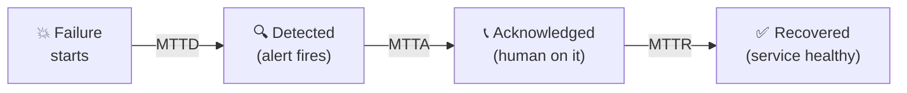
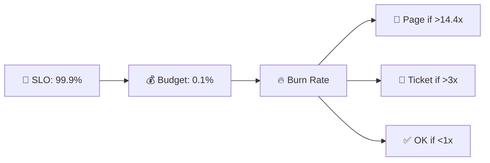
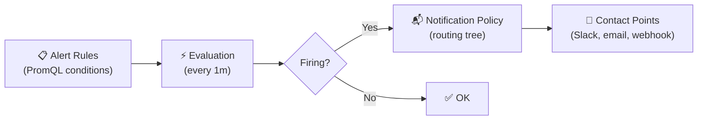
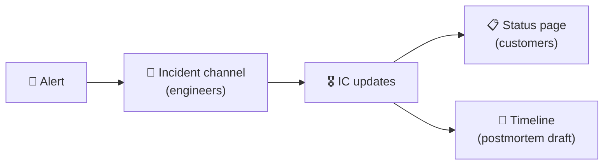
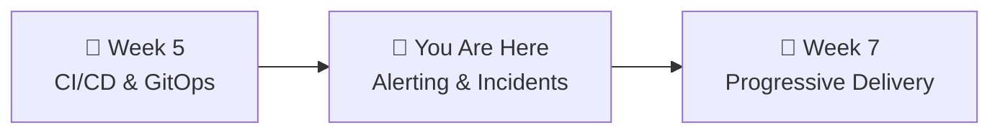

# 📌 Lecture 6 — Alerting & Incident Response

---

## 📍 Slide 1 – 🚨 The Alert That Cried Wolf

* 🔔 Typical on-call team gets **200+ alerts per week** (PagerDuty 2019 report)
* 😴 Engineers create email filters to hide noisy alerts
* 🔥 Real incident happens at 3 AM — nobody responds because "it's probably another false positive"
* 💀 Result: **4-hour outage** that could have been caught in 5 minutes
* 🧑‍⚕️ Long-term: burnout, attrition, 40% on-call-driven turnover in chronic cases

> 💬 *"When everything is urgent, nothing is urgent."*

> 🤔 **Think:** Your smoke detector goes off every time you cook toast. What do you do? (Remove the battery.) That's alert fatigue — and it's exactly why hospitals have a formal "alarm fatigue" problem listed by the Joint Commission as a top patient-safety hazard since 2013.

---

## 📍 Slide 2 – 🎯 Learning Outcomes

| # | 🎓 Outcome |
|---|-----------|
| 1 | ✅ Explain why alert fatigue is dangerous and how to prevent it |
| 2 | ✅ Create SLO-based alerts using multi-window burn rates |
| 3 | ✅ Configure Grafana Alerting with contact points and notification policies |
| 4 | ✅ Describe incident management roles (IC, Comms, Scribe, SME) |
| 5 | ✅ Name and use MTTD / MTTA / MTTR as reliability metrics |
| 6 | ✅ Apply the "5 Whys" to find systemic causes, not blame |
| 7 | ✅ Write a blameless postmortem that drives learning, not punishment |

---

## 📍 Slide 3 – 🔕 Alert Fatigue

From the **Google SRE Book, Chapter 11**:

> 💬 *"Every time the pager goes off, I should be able to react with a sense of urgency. I can only react with a sense of urgency a few times a day before I become fatigued."*

* 📊 Google's target: **max 2 events per 12-hour shift**
* 📋 Three valid monitoring outputs (Ch 6):
  * 🚨 **Page** — needs immediate human action
  * 🎫 **Ticket** — needs action, not immediately
  * 📝 **Log** — for diagnostics only
* ⚠️ Everything else is **noise** — and noise in alerting is a direct tax on your team's reliability

> 💬 *"Every page should be actionable. If a page merely merits a robotic response, it shouldn't be a page."* — Google SRE Book

> 💡 **Fun fact:** The term "alarm fatigue" came from ICU nurses in the 1970s, where research showed **85-99% of clinical alarms do not require intervention**. Software repeated the mistake a decade later.

---

## 📍 Slide 4 – ⏱️ Incident Metrics: MTTD, MTTA, MTTR

Time is the core incident metric. Three precise definitions:



| 🏷️ Metric | 📋 Meaning | 🎯 Good |
|-----------|-----------|--------|
| ⏱️ **MTTD** — Mean Time To Detect | Failure → alert fires | Seconds to a few minutes |
| 📞 **MTTA** — Mean Time To Acknowledge | Alert fires → on-call responds | < 5 minutes |
| 🔧 **MTTR** — Mean Time To Recover | Failure → fully healthy | Varies — elite < 1 hour (DORA) |

* 🔍 **Shrink MTTD** → better monitoring (what Lecture 3 + 6 teach)
* 📞 **Shrink MTTA** → better on-call process, fewer false alerts
* 🔧 **Shrink MTTR** → runbooks, automation, practiced response (GameDays, Week 8)

> 🤔 **Think:** You can detect an issue in 30 seconds (great!) but nobody acknowledges for 40 minutes. Which metric do you work on first?

---

## 📍 Slide 5 – 🎯 SLO-Based Alerting

**The old way:** Alert when error rate > 1% ← arbitrary threshold, constant tuning

**The SRE way:** Alert when you're **burning error budget too fast**

> 💡 From **Google SRE Workbook, Chapter 5**: alert on **burn rate**, not raw thresholds.

* 📊 **Burn rate 1x** = consuming budget at exactly the sustainable pace (30 days)
* 🔥 **Burn rate 14.4x** = will exhaust the entire 30-day budget in ~2 days
* ⚠️ **Burn rate 6x** = will exhaust in ~5 days



> 💬 *"A good alert is one where the receiver would have wanted to know even if nothing else was happening."* — Rob Ewaschuk, Google SRE (*My Philosophy on Alerting*, 2014)

---

## 📍 Slide 6 – 🪟 Multi-Window, Multi-Burn-Rate

| 🚨 Severity | ⏱️ Long Window | ⏱️ Short Window | 🔥 Burn Rate | 💰 Budget Consumed |
|------------|--------------|---------------|-------------|-------------------|
| 🚨 Page (critical) | 1 hour | 5 min | 14.4x | 2% in 1h |
| 🚨 Page | 6 hours | 30 min | 6x | 5% in 6h |
| 🎫 Ticket | 1 day | 2 hours | 3x | 10% in 1d |
| 📝 Log | 3 days | 6 hours | 1x | 10% in 3d |

**Why TWO windows?**
* ⏱️ **Long window** = confirms the problem is real (not a brief spike)
* ⚡ **Short window** = clears quickly once fixed (don't alert for hours after recovery)

```promql
# Alert fires when BOTH are true:
(error_rate[1h] > 14.4 * 0.001)   # Long: sustained problem
AND
(error_rate[5m] > 14.4 * 0.001)   # Short: still happening now
```

> 💡 The 14.4x and 6x numbers aren't magic — they're derived so the alerting budget itself is bounded. See the SRE Workbook "alert-on-burn-rate" table for the math.

---

## 📍 Slide 7 – 📊 Grafana Unified Alerting

Since **Grafana 9 (June 2022)** — unified alerting is the default:



| 🏷️ Component | 📋 What it does |
|-------------|---------------|
| **Alert Rule** | PromQL query + threshold + evaluation interval |
| **Contact Point** | Where notifications go (Slack, webhook, email, Discord) |
| **Notification Policy** | Routes alerts to contact points based on labels |
| **Silences** | Suppress alerts (e.g., during known maintenance) |
| **Mute Timings** | Recurring suppression windows (e.g., deploy freezes) |

* 🔧 Grafana embeds **Alertmanager** internally — no separate deployment needed
* 📊 Rules live alongside dashboards — same Grafana UI
* 🗂️ Labels + annotations → routing + context. Your labels drive **who gets paged**.

---

## 📍 Slide 8 – ❌ Alert Anti-patterns

| ❌ Anti-pattern | 💥 Why it's bad | ✅ Do instead |
|----------------|----------------|--------------|
| Page on CPU > 80% | Symptom, not user impact | Page on SLO burn rate |
| Same alert routed to 5 people | Diffusion of responsibility | Route to single on-call, escalate by time |
| "Check X" with no runbook link | Wastes MTTA searching docs | Annotation with `runbook_url` |
| Alert that auto-resolves silently | Missed a real incident | Require human ack even for self-healing |
| 20 alerts for one incident | Flood drowns the real signal | Group by `alertname` + `cluster` |
| Monitoring gaps hidden in absence-of-data | "No data" = healthy? Probably broken | Alert **on `absent()` of metric** too |

> 💬 *"If there's no action a human can take, it's not a page. It's a graph."*

---

## 📍 Slide 9 – 🚒 Incident Command System

> 💬 Modeled after the **Incident Command System (ICS)** — used by US fire departments since the 1970s wildfires. Adapted to software by Google, PagerDuty, and Etsy.

| 👤 Role | 📋 Responsibility | ❌ Does NOT |
|---------|-------------------|-----------|
| 🎖️ **Incident Commander (IC)** | Coordinates response, makes decisions, delegates | Fix the problem |
| 📢 **Communications Lead** | Updates status page, notifies stakeholders | Debug systems |
| 📝 **Scribe** | Documents timeline in real-time | Make decisions |
| 🔧 **Subject Matter Expert (SME)** | Diagnoses and fixes the actual issue | Coordinate |

> 💡 **Key insight:** The IC doesn't hold the hose. They coordinate the team. Without an IC, everyone debugs different things simultaneously and nobody communicates.

* 📖 Canonical reference: **PagerDuty Incident Response** — [open source](https://response.pagerduty.com/)
* 🪖 US fire services handle fires ranging from a kitchen to 10,000-hectare wildfires with the *same* framework — scale with span-of-control rules.

---

## 📍 Slide 10 – 🏥 Severity Levels

| 🏥 Severity | 📋 Description | 🚨 Response | 📊 Example |
|------------|---------------|------------|-----------|
| **SEV-1** | Critical, revenue impact | All hands, IC immediately | Complete outage, data loss |
| **SEV-2** | Major, many users affected | IC assigned, core team | Degraded for many users |
| **SEV-3** | Minor, limited impact | Team lead notified | Feature partially broken |
| **SEV-4** | Informational | Ticket created | UI glitch, cosmetic bug |

> 🏥 **ER triage analogy:** SEV-1 = cardiac arrest (all hands). SEV-2 = broken arm (urgent, stable). SEV-3 = sprained ankle (can wait). SEV-4 = papercut (next appointment).

**Declaration matters more than labels.** The act of saying "we are now in an incident" engages the process — roles, channel, status page. Most teams over-debate the label and under-practice the declaration.

---

## 📍 Slide 11 – 💬 Incident Channels & Status Pages

Where does the response actually happen?

**📢 Dedicated incident channel** (Slack/Discord/Teams):
* `#incident-2026-04-17-payments-down` — one channel per incident
* Persistent log, easy to find in review
* IC posts updates every 15-30 minutes even if "no change"

**📋 Status page** (for customers, not for you):
* `status.yourcompany.com` — public, customer-facing
* Short, honest, non-technical: *"We are investigating elevated error rates for payments."*
* Tools: Statuspage (Atlassian), Instatus, self-hosted cstate



> 💡 Separate **internal truth** from **customer communication.** The engineer slack is messy; the status page is calm.

---

## 📍 Slide 12 – 🔁 The 5 Whys

> 💬 Invented by **Sakichi Toyoda** (Toyota, ~1930s), embedded in the Toyota Production System. Still the most useful tool for finding *systemic* causes.

**Example: QuickTicket gateway returned 502 for 20 minutes.**

| # | ❓ Why? | 💡 Answer |
|---|---------|-----------|
| 1 | Why did users see 502? | Gateway couldn't reach payments |
| 2 | Why couldn't it reach payments? | Payments pod was OOMKilled |
| 3 | Why OOMKilled? | Memory leak in the PDF library |
| 4 | Why a leak in that library? | We hadn't patched it in 14 months |
| 5 | Why wasn't it patched? | **No dependency update process existed** |

**Root cause: no patch process.** Fixing just "the leak" leaves the same pattern intact.

> ⚠️ **Trap:** Stop at "human error" and you've only gone one why. Keep going.

---

## 📍 Slide 13 – 📝 Blameless Postmortems

> 💬 *"Having a blameless postmortem means engineers can give a detailed account of what actions they took... without fear of punishment or retribution."*
> — **John Allspaw**, then Etsy CTO, 2012

**Sidney Dekker's "New View" of safety** (*The Field Guide to Understanding Human Error*, 2002):
* 🔍 Human error is a **symptom**, not a cause
* 🧠 People's actions made **sense to them at the time** given what they knew
* 🔒 Blame prevents learning — people stop reporting problems
* 🔧 Fix the **system**, not the person

> ❌ "Bob deleted the production database" → Bob gets fired → same thing happens again
> ✅ "Why was it possible to delete production from a dev laptop?" → fix the system → it can't happen again

> 💡 **Fun fact:** Aviation — the industry that reduced fatalities per mile by 99% since 1960 — runs entirely on blameless investigations (NTSB, ICAO). Their mantra: *"The purpose is prevention, not punishment."*

---

## 📍 Slide 14 – 📋 Postmortem Structure

| 📋 Section | 📝 What to write |
|-----------|----------------|
| 📄 **Summary** | What happened, 2-3 sentences, impact (users affected, duration, $$$) |
| ⏱️ **Timeline** | Chronological events with **UTC timestamps** |
| 🔍 **Root Cause** | Systemic issue (use 5 Whys), NOT "person X made a mistake" |
| 📉 **Impact** | Quantified — users, revenue, SLO budget burned |
| ✅ **What Went Well** | Fast detection? Good communication? Runbook worked? |
| ❌ **What Went Wrong** | Slow escalation? Missing runbook? Bad dashboards? |
| 🎓 **Lessons Learned** | What we now know that we didn't |
| 📋 **Action Items** | Specific, assigned, time-bound — each has owner + due date |

> 💬 *"Postmortem action items without owners and dates are wishes, not plans."*

> 📊 **Quantify everything.** "Users were affected" is unreviewable. "~8,400 orders blocked for 22 minutes, ~$12k revenue deferred" is actionable.

---

## 📍 Slide 15 – 🏛️ Organizational Culture: Westrum's Typology

Ron Westrum's research (2004) — later validated in the **DORA / Accelerate** study — identified three org types:

| 🏛️ Type | 📋 Info flow | 💥 When things fail |
|---------|-------------|---------------------|
| 🩸 **Pathological** | Info hoarded, messengers shot | Blame, coverup |
| 🧾 **Bureaucratic** | Rule-driven, departmental | Local fixes, global ignorance |
| 🌱 **Generative** | Info flows freely, bridging encouraged | Learning, systemic improvement |

**Generative cultures correlate with elite DORA performance.** SRE is not just tools — it's the culture that makes tools useful.

> 💬 *"Blame the system, not the person" is not a platitude — it's a hiring and retention strategy.*

---

## 📍 Slide 16 – 📖 Runbooks

A runbook bridges "something is wrong" → "here's what to do":

```
🚨 Alert fires: "Gateway Error Rate > 5%"
         │
         ▼
📖 Runbook: gateway-high-error-rate
         │
    ┌────┼────┐
    ▼    ▼    ▼
🔍 Diagnose  🔧 Mitigate  📞 Escalate
```

| 📋 Section | 📝 Content |
|-----------|-----------|
| 🚨 **Alert** | Which alert, what it means |
| 📊 **Dashboards** | Direct links — don't make on-call search |
| 🔍 **Diagnose** | Which logs, which queries, common causes |
| 🔧 **Mitigate** | Steps to fix (restart, rollback, scale up) |
| 📞 **Escalate** | When + who + how to reach them |
| 🔄 **Related** | Recent deploys, related alerts |

> 💡 **Progression:** Manual runbook → test and refine → automate steps → fully automated. Never automate what you haven't documented first.

> 🤔 **Think:** If you get paged at 3 AM, you should be able to follow the runbook **half-awake**. Test yours by having someone else read it cold.

---

## 📍 Slide 17 – 💥 Real Postmortem #1: Cloudflare 2019

* 🗓️ **July 2, 2019** — one bad regex deployed via WAF rule update
* 💥 **103 characters** of regex caused CPU exhaustion across the **entire** global edge network
* ⏱️ From deployment to global outage: **< 3 minutes**
* 🌐 Cloudflare serves ~10-20% of all HTTP traffic — millions of sites down
* ⏱️ Recovery: **27 minutes** (complicated because their own tools were also affected)

The regex:
```
(?:(?:\"|'|\]|\}|\\|\d|(?:nan|infinity|true|false|null|undefined|symbol|math)|\`|\-|\+)+[)]*;?((?:\s|-|~|!|{}|\|\||\+)*.*(?:.*=.*)))
```

> 🔍 `.*(?:.*=.*)` caused **catastrophic backtracking** — exponential evaluation time on certain inputs.

* ✅ **Great postmortem:** transparent, detailed, published same day by CTO John Graham-Cumming
* 📋 **Action items:** regex complexity analysis, execution time limits, staged rollouts for WAF rules

---

## 📍 Slide 18 – 💥 Real Postmortem #2: Knight Capital 2012

* 🗓️ **August 1, 2012** — Knight Capital Group
* 🛠️ Deploy script failed to remove old code from **one of eight servers**
* 📈 That server executed millions of unintended trades in **45 minutes**
* 💸 Loss: **$460 million** — about **10x** the company's profit the prior year
* ⚰️ Company bankrupt within days; acquired at pennies on the dollar

**What went wrong, systemically:**
* Manual deploy with no verification
* No kill switch for runaway trading
* Alerts existed but were **buried under noise** — the classic alert-fatigue outcome

> 💬 *"It was the most expensive 45 minutes in the history of Wall Street."* — Nanex

> 🧠 **Lesson for you:** This is why "it's only a deploy process" is a lie. Deploy processes are the safety envelope of your business.

---

## 📍 Slide 19 – 🧠 Key Takeaways

1. 🔕 **Alert fatigue kills** — max 2 events per shift, every page must be actionable
2. 🔥 **Alert on burn rate**, not raw thresholds — connect alerts to SLOs (multi-window)
3. ⏱️ **Track MTTD / MTTA / MTTR** separately — they reveal different gaps
4. 🎖️ **IC coordinates, SMEs fix** — defined roles prevent chaos during incidents
5. 🔁 **Use the 5 Whys** — stop at "human error" and you're only 20% done
6. 📝 **Blameless postmortems** — fix systems, not people. Blame prevents learning.
7. 📖 **Runbooks save MTTA** — test them by having a teammate read them cold
8. 🌱 **Culture matters** — generative orgs correlate with elite reliability

> 💬 *"The cost of a postmortem is low. The cost of repeating an incident is very high."*

---

## 📍 Slide 20 – 🚀 What's Next

* 📍 **Next lecture:** Progressive Delivery — Argo Rollouts, canary deployments, auto-rollback
* 🧪 **Lab 6:** Create Grafana alerts, inject failure, follow your runbook, write a postmortem
* 📖 **Reading:** [SRE Workbook, Ch 5 — Alerting on SLOs](https://sre.google/workbook/alerting-on-slos/) + [PagerDuty Incident Response](https://response.pagerduty.com/)



---

## 📚 Resources

* 📖 [Google SRE Book, Ch 6 — Monitoring](https://sre.google/sre-book/monitoring-distributed-systems/)
* 📖 [Google SRE Book, Ch 11 — Being On-Call](https://sre.google/sre-book/being-on-call/)
* 📖 [Google SRE Book, Ch 15 — Postmortem Culture](https://sre.google/sre-book/postmortem-culture/)
* 📖 [Google SRE Workbook, Ch 5 — Alerting on SLOs](https://sre.google/workbook/alerting-on-slos/)
* 📖 [Rob Ewaschuk — My Philosophy on Alerting (2014)](https://docs.google.com/document/d/199PqyG3UsyXlwieHaqbGiWVa8eMWi8zzAn0YfcApr8Q/edit)
* 📖 [PagerDuty Incident Response (open source)](https://response.pagerduty.com/) — the practical playbook
* 📖 *The Field Guide to Understanding Human Error* — Sidney Dekker (2002)
* 📖 *Accelerate* — Forsgren, Humble, Kim (2018) — DORA + Westrum research
* 📝 [John Allspaw — Blameless Postmortems (2012)](https://www.etsy.com/codeascraft/blameless-postmortems) — the origin essay
* 📝 [Cloudflare July 2019 Postmortem](https://blog.cloudflare.com/details-of-the-cloudflare-outage-on-july-2-2019/) — gold standard
* 📝 [Knight Capital 2012 SEC report](https://www.sec.gov/litigation/admin/2013/34-70694.pdf) — the cautionary tale
* 📖 [Dan Luu — Public Postmortem Collection](https://github.com/danluu/post-mortems)
* 📖 [Grafana Alerting docs](https://grafana.com/docs/grafana/latest/alerting/)
