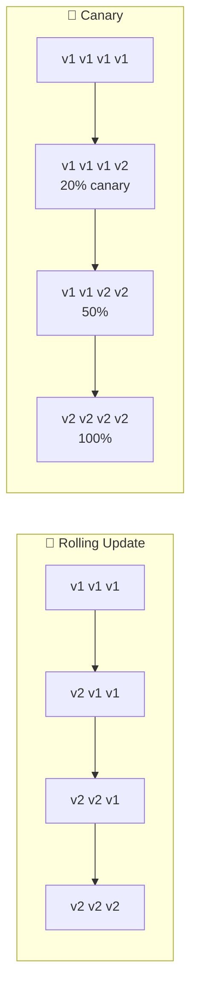
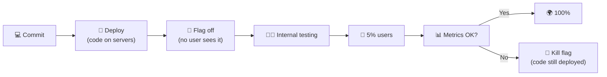
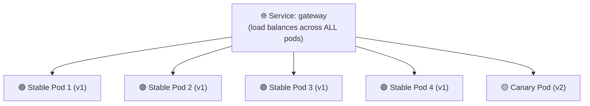
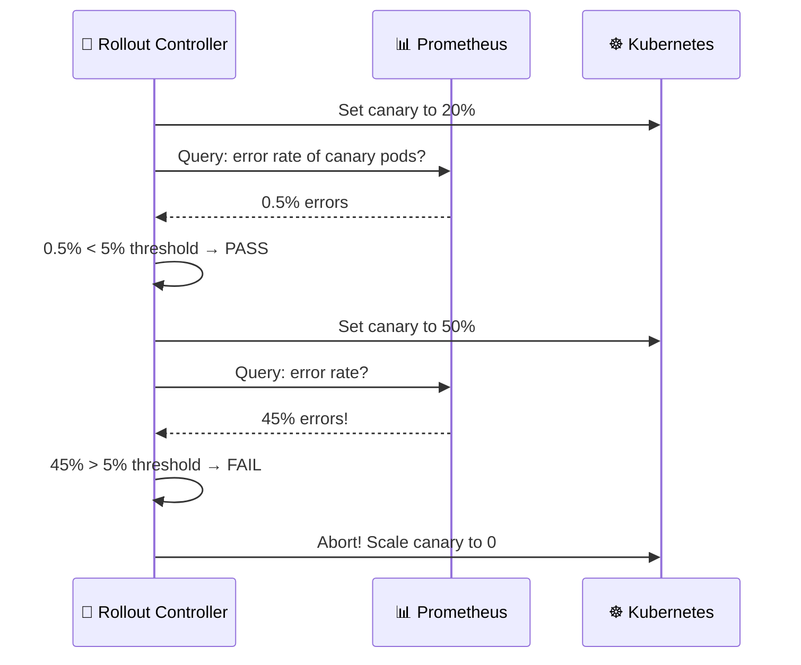
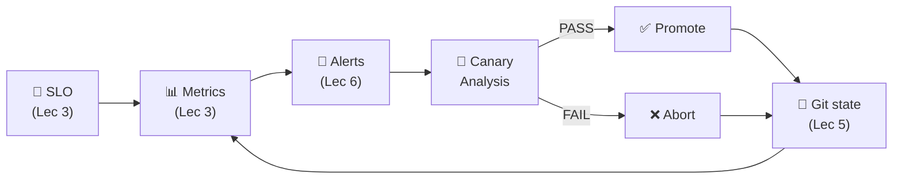
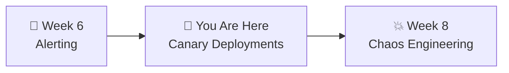

# 📌 Lecture 7 — Progressive Delivery: Canary Deployments

---

## 📍 Slide 1 – 💀 The Big Bang Deploy

* 🚀 You push a new version — 100% of traffic hits it immediately
* 💥 There's a bug — all users see errors
* ⏪ Rolling back takes 5 minutes — 5 minutes of 100% failure
* 💸 Your SLO burn rate hits 50x for that window
* 🤔 What if you could test the new version with just 5% of traffic first?

> 💬 *"Canary in a coal mine"* — miners brought canaries underground. If the bird died, the air was toxic. The canary took the risk so the miners didn't have to.

> 💡 **Fun fact:** The coal-miner canary tradition ended in the UK in **1986** when electronic sensors replaced it. Software canaries started replacing "all-at-once deploys" around the same time Netflix was migrating to AWS (2008-2015).

---

## 📍 Slide 2 – 🎯 Learning Outcomes

| # | 🎓 Outcome |
|---|-----------|
| 1 | ✅ Compare deployment strategies: rolling, blue-green, canary, shadow |
| 2 | ✅ Explain the difference between **deploy** and **release** |
| 3 | ✅ Install Argo Rollouts and convert a Deployment to a Rollout |
| 4 | ✅ Execute a manual canary deployment with step-by-step promotion |
| 5 | ✅ Abort a bad canary and observe automatic rollback |
| 6 | ✅ Understand how automated canary analysis works with Prometheus |
| 7 | ✅ Name the tradeoffs between canary, feature flags, and service-mesh-based progressive delivery |

---

## 📍 Slide 3 – 📜 The Term "Progressive Delivery"

* 🗓️ **2018** — coined by **James Governor** (RedMonk) as an umbrella for techniques that release code **gradually and measurably**
* 🎯 Includes: canary, blue-green, feature flags, dark launches, shadow traffic, rolling updates
* 🧠 Central idea: *deploying code* ≠ *releasing it to users*

> 💬 *"Progressive delivery is a new basket of skills and technologies concerned with modern software development, testing, and deployment."* — James Governor, RedMonk

---

## 📍 Slide 4 – 🔀 Deployment Strategies (Overview)

| 🏷️ Strategy | 📋 How it works | ✅ Pro | ❌ Con |
|-------------|----------------|--------|--------|
| 🔄 **Rolling Update** | Replace pods gradually (K8s default) | Simple, zero config | No traffic control — new pods get full traffic immediately |
| 🔵🟢 **Blue-Green** | Run both versions, switch traffic instantly | Instant rollback, easy testing | 2x resources during deploy |
| 🐤 **Canary** | Send small % of traffic to new version, gradually increase | Controlled blast radius, data-driven | More complex setup |
| 👻 **Shadow / Mirror** | Copy prod traffic to new version, discard responses | Zero user risk | Can't test write paths; doubles load on downstream |
| 🚦 **Feature Flags** | Deploy code to 100%, gate functionality by flag | Deploy ≠ release; instant kill-switch | Requires app-level integration |



> 💡 Canary = **you control the blast radius**. If 5% of traffic hits a bad version, only 5% of users are affected.

---

## 📍 Slide 5 – 🐤 Why Canary Matters for SRE

* 📊 Connects directly to **error budgets** (Lecture 1) — a canary limits how much budget a bad deploy can burn
* ⏪ Connects to **rollback** (Lecture 5) — canary abort is faster than GitOps revert
* 🔥 Connects to **alerting** (Lecture 6) — canary analysis uses the same metrics as your SLO alerts

| 💀 Without Canary | 🐤 With Canary |
|-------------------|----------------|
| Bad deploy → 100% users affected | Bad deploy → 20% users affected |
| Detect via alert → 3 min | Detect via analysis → 30 sec |
| Rollback via git revert → 2 min | Abort → instant (< 10 sec) |
| Error budget: 5 min × 100% = big burn | Error budget: 30s × 20% = tiny burn |

> 🤔 **Think:** Your SLO is 99.5%. A 5-minute 100%-failure outage burns ~0.012% of budget. How much does a 30-second 20%-failure canary burn? (Answer: ~100x less.)

---

## 📍 Slide 6 – 🚦 Deploy vs Release

The key shift in modern delivery thinking:

| 🏷️ Concept | 📋 What it is | 👤 Who decides |
|-----------|-------------|----------------|
| **Deploy** | Running binary is installed on servers | Engineering + CI/CD |
| **Release** | Feature is visible to users | Product + data-driven rollout |

**Old world:** Deploy = release. Every push is scary.
**New world:** Deploy continuously, release progressively with canaries **or** feature flags.



> 💬 *"Separating deploy from release is the single highest-leverage change a team can make to its delivery pipeline."* — Charity Majors, Honeycomb CTO

---

## 📍 Slide 7 – 🏳️ Feature Flags

Complement to canary — **in-app** progressive release:

```python
# Instead of:
return new_algorithm(x)

# Do:
if flags.enabled("new-algorithm", user=current_user):
    return new_algorithm(x)
return old_algorithm(x)
```

| 🏷️ Platform | 🎯 Origin | 📋 Model |
|-------------|-----------|---------|
| **LaunchDarkly** | 2014 — coined "feature flag as a service" | SaaS, rich targeting |
| **Flagsmith** | Open-source, self-hostable | OSS-friendly |
| **Unleash** | Finn.no (2014), GitLab acquired | OSS-friendly, CNCF-adjacent |
| **OpenFeature** | CNCF Incubating (2022) | **Vendor-neutral standard** |
| 🏢 **Facebook Gatekeeper** | 2006 — the first at-scale system | Internal |

> 💡 **Fun fact:** Facebook/Meta runs thousands of simultaneous flagged experiments — most of their "deployments" are **flag flips**, not binary deploys.

---

## 📍 Slide 8 – 🚀 Argo Rollouts

* 🏢 Created by **Argoproj** team at **Intuit** (same as ArgoCD)
* 📦 Adds a **Rollout** CRD — drop-in replacement for Deployment
* 🐤 Supports **canary** and 🔵🟢 **blue-green** strategies
* 🔗 Integrates natively with ArgoCD
* 🌐 Optional: integrates with service meshes (Istio, Linkerd) for request-based traffic splitting

```yaml
# Just change "kind" and add "strategy"!
# Before (standard Deployment):
kind: Deployment

# After (Argo Rollout):
kind: Rollout
spec:
  strategy:
    canary:
      steps:
        - setWeight: 20
        - pause: {}           # Wait for manual promotion
        - setWeight: 50
        - pause: {duration: 30s}
        - setWeight: 100
```

> 💡 The Rollout spec is nearly **identical** to a Deployment. You already know 90% of it from Week 4.

---

## 📍 Slide 9 – 🐤 How Canary Works (Replica-Based)

Without a service mesh, Argo Rollouts uses **pod ratios** for traffic splitting:



* ⚖️ With 5 pods: 4 stable + 1 canary = **20% canary traffic**
* 📈 Promote to 50%: 2 stable + 3 canary
* ✅ Promote to 100%: 0 stable + 5 canary (done!)
* ❌ Abort: scale canary to 0, stable stays at 5

> ⚠️ **Limitation:** Traffic split is **coarse** — 20% means "20% of pods" not "20% of requests." For 1% canaries, you need 100 pods — impractical. That's why real canary at scale uses a **service mesh** (next slide).

---

## 📍 Slide 10 – 🌐 Service-Mesh Canary (Precise Traffic Split)

With Istio, Linkerd, or AWS App Mesh, you can split at the **request** level:

```yaml
# Istio VirtualService — split requests by HTTP header or weight
http:
  - route:
    - destination: { host: gateway, subset: stable }
      weight: 95
    - destination: { host: gateway, subset: canary }
      weight: 5     # ← 5% of REQUESTS, not pods
```

| 🔧 Feature | 🐤 Replica-based | 🌐 Mesh-based |
|-----------|------------------|---------------|
| Granularity | pod count | 1% request-level |
| Extra infra | None | Istio/Linkerd required |
| Sticky sessions | Via Service session affinity | Via mesh routing |
| Header-based routing | ❌ | ✅ (`X-Beta: true` → canary) |

> 💡 **Fun fact:** Istio powers the canary deploys for some of the largest web properties in the world. Linkerd is lighter and is what most smaller teams pick.

---

## 📍 Slide 11 – 🛠️ Argo Rollouts CLI

```bash
# Watch a rollout in real-time (live ASCII visualization!)
kubectl argo rollouts get rollout gateway --watch

# Manually promote to next step
kubectl argo rollouts promote gateway

# Skip all remaining steps (promote to 100% instantly)
kubectl argo rollouts promote gateway --full

# Abort a bad rollout (instant rollback)
kubectl argo rollouts abort gateway

# Retry after abort
kubectl argo rollouts retry rollout gateway

# View history
kubectl argo rollouts list rollouts
```

The `--watch` command shows a live terminal dashboard:
```
Name:            gateway
Status:          ॥ Paused
Strategy:        Canary
  Step:          1/4
  SetWeight:     20
  ActualWeight:  20
Images:          ghcr.io/org/gateway:abc123 (canary)
                 ghcr.io/org/gateway:def456 (stable)
Replicas:
  Desired:       5
  Current:       5
  Updated:       1
  Ready:         5
  Available:     5
```

---

## 📍 Slide 12 – 🔬 Automated Canary Analysis

Argo Rollouts can query Prometheus **during** the canary:



**AnalysisTemplate** defines the metric + success criteria:
```yaml
apiVersion: argoproj.io/v1alpha1
kind: AnalysisTemplate
metadata:
  name: success-rate
spec:
  metrics:
    - name: error-rate
      interval: 30s
      successCondition: result[0] < 0.05   # < 5% errors
      provider:
        prometheus:
          address: http://prometheus:9090
          query: |
            sum(rate(gateway_requests_total{status=~"5.."}[1m]))
            / sum(rate(gateway_requests_total[1m]))
```

---

## 📍 Slide 13 – 🔌 Analysis Providers

Argo Rollouts can consult multiple systems for the promote/abort decision:

| 📊 Provider | 🎯 Use for | 🧠 Strength |
|------------|-----------|------------|
| **Prometheus** | Error rate, latency, saturation | Most common, pull-based |
| **Datadog** | Business metrics + APM | Managed, rich integrations |
| **New Relic / Wavefront** | APM data | Similar to Datadog |
| **CloudWatch** | AWS-native workloads | Already in AWS shops |
| **Graphite / InfluxDB** | Legacy TSDBs | Migration paths |
| **Job** | Run an arbitrary script/test | Escape hatch (e.g., smoke tests) |
| **Web** | Hit an HTTP endpoint | Integrate any system |

> 💡 **Best practice:** Start with 2-3 metrics (error rate, p99 latency, saturation). Adding too many makes analysis flaky and delays promotion.

---

## 📍 Slide 14 – 🌍 Canary in the Real World

* 🎬 **Netflix** — pioneered canary at scale; created **Spinnaker** (2015) and **Kayenta** (2018, automated canary analysis with Mann-Whitney U statistical tests)
* 🏢 **Google** — internal canary is part of their deployment pipeline (Google SRE Book, Ch. 8)
* 🚗 **Lyft** — adopted canary with Envoy, reduced production incidents by ~50% in first year
* 🏦 **Knight Capital (2012)** — lost $460M in 45 min from a bad deploy. A canary would have caught it at 5% traffic.
* 📱 **Facebook/Meta Gatekeeper** — runs thousands of simultaneous flagged experiments; most "deploys" are flag flips

> 💬 *"The term canary release was coined by Jez Humble and David Farley in Continuous Delivery (2010), though the practice existed at Google and Netflix before the term."*

---

## 📍 Slide 15 – ❌ Canary Anti-patterns

| ❌ Anti-pattern | 💥 Why it hurts | ✅ Do instead |
|----------------|----------------|--------------|
| Canary with 1 replica (can't split) | No meaningful canary possible | Scale to 5+ replicas |
| Canary that never gets aborted | Every rollout "succeeds" — analysis is theater | Real thresholds, tested with known-bad deploys |
| Manual canary with 5-minute pauses during SEV-1 | Blocks rollback under pressure | Auto-promote in emergencies with label override |
| Canary without traffic (off-hours deploy) | Canary signal is noise without load | Deploy during traffic or use synthetic load |
| Canary only on "success" metrics | Misses regressions (latency, saturation) | Multi-metric analysis (error, latency, CPU) |
| Long multi-hour canaries | Compounds with peer deploys — noise dominates signal | Minutes, not hours — trust metrics |

> 🤔 **Think:** Your canary has 3 steps: 10%, 50%, 100%, each pausing 1 hour. A bug only surfaces at 100%. What's wrong with the strategy?

---

## 📍 Slide 16 – 🔄 The SRE Loop, Complete



Canary is the first place where **every previous concept** comes together:
* SLOs define "good"
* Metrics measure reality
* Alerts detect drift
* Canary analysis gates promotion on the same signals

> 💬 *"If you can't measure it, you can't canary it."*

---

## 📍 Slide 17 – 🧠 Key Takeaways

1. 🐤 **Canary = controlled blast radius** — test with small traffic %, promote gradually
2. 🚦 **Deploy ≠ release** — feature flags separate "on servers" from "visible to users"
3. 🔧 **Argo Rollouts is a Deployment replacement** — same spec, add `strategy.canary`
4. ⏸️ **Manual canary** = promote/abort by hand — good for learning + low-risk changes
5. 🤖 **Automated canary** = Prometheus analysis decides promote vs abort — production-grade
6. 🌐 **Mesh-based** = precise request-level splits; **replica-based** = coarse but simple
7. 🔗 **Canary + SLOs + alerting** = the full SRE loop — metrics drive deployment decisions

> 💬 *"Progressive delivery isn't about deploying slower. It's about releasing safer — which lets you deploy faster."* — **James Governor**

---

## 📍 Slide 18 – 🚀 What's Next

* 📍 **Next lecture:** Chaos Engineering — break things on purpose, before they break you
* 🧪 **Lab 7:** Install Argo Rollouts, convert gateway to canary, deploy good + bad versions, observe automated analysis
* 📖 **Reading:** [Argo Rollouts docs](https://argoproj.github.io/argo-rollouts/) + [OpenFeature spec](https://openfeature.dev/)



---

## 📚 Resources

* 📖 [Argo Rollouts documentation](https://argoproj.github.io/argo-rollouts/)
* 📖 [Argo Rollouts — Getting Started](https://argoproj.github.io/argo-rollouts/getting-started/)
* 📖 [Argo Rollouts — Analysis & Progressive Delivery](https://argoproj.github.io/argo-rollouts/features/analysis/)
* 📖 *Continuous Delivery* — Humble & Farley (2010) — coined "canary release"
* 📖 [Google SRE Book, Ch 8 — Release Engineering](https://sre.google/sre-book/release-engineering/)
* 📝 [James Governor — Progressive Delivery (RedMonk, 2018)](https://redmonk.com/jgovernor/2018/08/06/towards-progressive-delivery/)
* 📝 [Netflix — Automated Canary Analysis (Kayenta, 2018)](https://netflixtechblog.com/automated-canary-analysis-at-netflix-with-kayenta-3260bc7acc69)
* 📝 [Charity Majors — Deploy ≠ Release](https://charity.wtf/2021/07/08/how-to-escape-the-bog-of-eternal-stench/)
* 📖 [OpenFeature — vendor-neutral feature flag standard](https://openfeature.dev/) (CNCF Incubating)
* 📖 [LaunchDarkly — Effective Feature Management (free e-book)](https://launchdarkly.com/effective-feature-management-ebook/)
* 📖 [Istio Traffic Management](https://istio.io/latest/docs/concepts/traffic-management/)
* 📝 [Knight Capital 2012 SEC report](https://www.sec.gov/litigation/admin/2013/34-70694.pdf)
