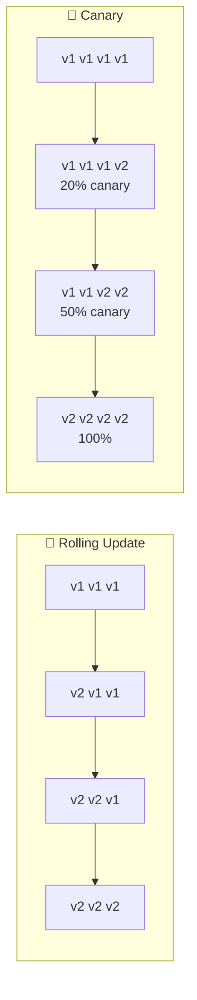
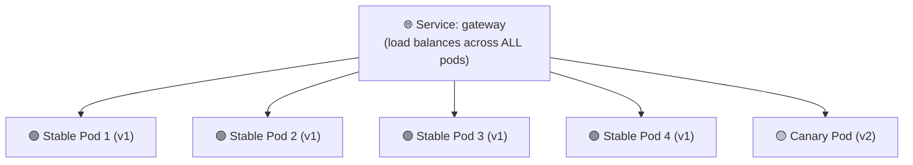
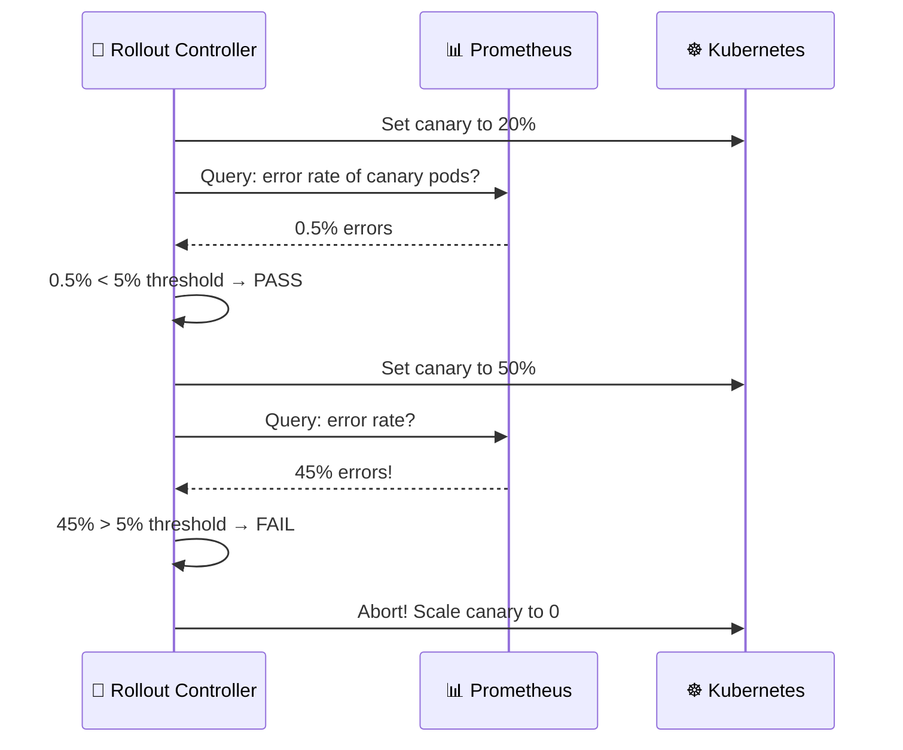
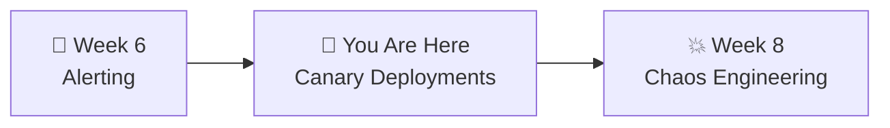

# 📌 Lecture 7 — Progressive Delivery: Canary Deployments

---

## 📍 Slide 1 – 💀 The Big Bang Deploy

* 🚀 You push a new version — 100% of traffic hits it immediately
* 💥 There's a bug — all users see errors
* ⏪ Rolling back takes 5 minutes — 5 minutes of 100% failure
* 🤔 What if you could test the new version with just 5% of traffic first?

> 💬 *"Canary in a coal mine"* — miners brought canaries underground. If the bird died, the air was toxic. The canary took the risk so the miners didn't have to.

---

## 📍 Slide 2 – 🎯 Learning Outcomes

| # | 🎓 Outcome |
|---|-----------|
| 1 | ✅ Compare deployment strategies: rolling, blue-green, canary |
| 2 | ✅ Install Argo Rollouts and convert a Deployment to a Rollout |
| 3 | ✅ Execute a manual canary deployment with step-by-step promotion |
| 4 | ✅ Abort a bad canary and observe automatic rollback |
| 5 | ✅ Explain how automated canary analysis works with Prometheus |

---

## 📍 Slide 3 – 🔀 Deployment Strategies

| 🏷️ Strategy | 📋 How it works | ✅ Pro | ❌ Con |
|-------------|----------------|--------|--------|
| 🔄 **Rolling Update** | Replace pods gradually (K8s default) | Simple, zero config | No traffic control — new pods get full traffic immediately |
| 🔵🟢 **Blue-Green** | Run both versions, switch traffic instantly | Instant rollback | 2x resources during deploy |
| 🐤 **Canary** | Send small % of traffic to new version, gradually increase | Controlled blast radius | More complex setup |



> 💡 Canary = **you control the blast radius**. If 5% of traffic hits a bad version, only 5% of users are affected.

---

## 📍 Slide 4 – 🐤 Why Canary Matters for SRE

* 📊 Connects directly to **error budgets** (Lecture 1) — a canary limits how much budget a bad deploy can burn
* ⏪ Connects to **rollback** (Lecture 5) — canary abort is faster than GitOps revert
* 🔥 Connects to **alerting** (Lecture 6) — canary analysis uses the same metrics as your SLO alerts

| 💀 Without Canary | 🐤 With Canary |
|-------------------|----------------|
| Bad deploy → 100% users affected | Bad deploy → 20% users affected |
| Detect via alert → 3 min | Detect via analysis → 30 sec |
| Rollback via git revert → 2 min | Abort → instant (< 10 sec) |
| Error budget: 5 min × 100% = big burn | Error budget: 30s × 20% = tiny burn |

---

## 📍 Slide 5 – 🚀 Argo Rollouts

* 🏢 Created by **Argoproj** team at **Intuit** (same as ArgoCD)
* 📦 Adds a **Rollout** CRD — drop-in replacement for Deployment
* 🐤 Supports **canary** and 🔵🟢 **blue-green** strategies
* 🔗 Integrates natively with ArgoCD

```yaml
# Just change "kind" and add "strategy"!
# Before (standard Deployment):
kind: Deployment

# After (Argo Rollout):
kind: Rollout
spec:
  strategy:
    canary:
      steps:
        - setWeight: 20
        - pause: {}           # Wait for manual promotion
        - setWeight: 50
        - pause: {duration: 30s}
        - setWeight: 100
```

> 💡 The Rollout spec is nearly **identical** to a Deployment. You already know 90% of it from Week 4.

---

## 📍 Slide 6 – 🐤 How Canary Works (Replica-Based)

Without a service mesh, Argo Rollouts uses **pod ratios** for traffic splitting:



* ⚖️ With 5 pods: 4 stable + 1 canary = **20% canary traffic**
* 📈 Promote to 50%: 2 stable + 3 canary
* ✅ Promote to 100%: 0 stable + 5 canary (done!)
* ❌ Abort: scale canary to 0, stable stays at 5

---

## 📍 Slide 7 – 🛠️ Argo Rollouts CLI

```bash
# Watch a rollout in real-time (live ASCII visualization!)
kubectl argo rollouts get rollout gateway --watch

# Manually promote to next step
kubectl argo rollouts promote gateway

# Abort a bad rollout (instant rollback)
kubectl argo rollouts abort gateway

# Retry after abort
kubectl argo rollouts retry rollout gateway

# View history
kubectl argo rollouts list rollouts
```

The `--watch` command shows a live terminal dashboard:
```
Name:            gateway
Status:          ॥ Paused
Strategy:        Canary
  Step:          1/4
  SetWeight:     20
  ActualWeight:  20
Images:          ghcr.io/org/gateway:abc123 (canary)
                 ghcr.io/org/gateway:def456 (stable)
Replicas:
  Desired:       5
  Current:       5
  Updated:       1
  Ready:         5
  Available:     5
```

---

## 📍 Slide 8 – 🔬 Automated Canary Analysis

For the bonus task — Argo Rollouts can query Prometheus **during** the canary:



**AnalysisTemplate** defines the metric + success criteria:
```yaml
apiVersion: argoproj.io/v1alpha1
kind: AnalysisTemplate
metadata:
  name: success-rate
spec:
  metrics:
    - name: error-rate
      interval: 30s
      successCondition: result[0] < 0.05   # < 5% errors
      provider:
        prometheus:
          address: http://prometheus:9090
          query: |
            sum(rate(gateway_requests_total{status=~"5.."}[1m]))
            / sum(rate(gateway_requests_total[1m]))
```

---

## 📍 Slide 9 – 🌍 Canary in the Real World

* 🎬 **Netflix** — pioneered canary at scale, created **Spinnaker** (2015) + **Kayenta** (automated analysis with statistical tests)
* 🏢 **Google** — internal canary is part of their deployment pipeline, discussed in SRE Book Ch 8
* 💸 **Knight Capital (2012)** — lost $440M in 45 min from a bad deploy. A canary would have caught it at 5% traffic.
* 🚗 **Lyft** — adopted canary with Envoy, reduced production incidents by ~50% in first year

> 💬 *"The term canary release was coined by Jez Humble and David Farley in Continuous Delivery (2010), though the practice existed at Google and Netflix before the term."*

---

## 📍 Slide 10 – 🧠 Key Takeaways

1. 🐤 **Canary = controlled blast radius** — test with small traffic %, promote gradually
2. 🔧 **Argo Rollouts is a Deployment replacement** — same spec, add `strategy.canary`
3. ⏸️ **Manual canary** = promote/abort by hand — good for learning + low-risk changes
4. 🤖 **Automated canary** = Prometheus analysis decides promote vs abort — production-grade
5. 🔗 **Canary + SLOs + alerting** = the full SRE loop — metrics drive deployment decisions

> 💬 *"If you can't measure it, you can't canary it."*

---

## 📍 Slide 11 – 🚀 What's Next

* 📍 **Next lecture:** Chaos Engineering — break things on purpose, before they break you
* 🧪 **Lab 7:** Install Argo Rollouts, convert gateway to canary, deploy good + bad versions
* 📖 **Reading:** [Argo Rollouts docs](https://argoproj.github.io/argo-rollouts/)



---

## 📚 Resources

* 📖 [Argo Rollouts documentation](https://argoproj.github.io/argo-rollouts/)
* 📖 [Argo Rollouts — Getting Started](https://argoproj.github.io/argo-rollouts/getting-started/)
* 📖 *Continuous Delivery* — Humble & Farley (2010) — coined "canary release"
* 📖 [Google SRE Book, Ch 8 — Release Engineering](https://sre.google/sre-book/release-engineering/)
* 📖 [Netflix — Automated Canary Analysis (Kayenta)](https://netflixtechblog.com/automated-canary-analysis-at-netflix-with-kayenta-3260bc7acc69)
