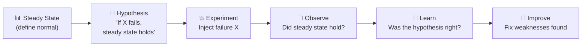
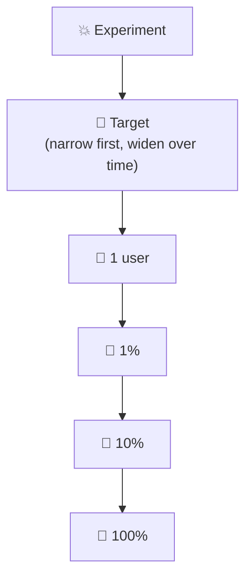
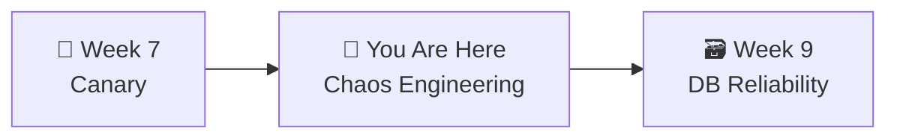

# 📌 Lecture 8 — Chaos Engineering: Break Things on Purpose

---

## 📍 Slide 1 – 🐒 The Netflix Monkey

* 🗓️ **2010** — Netflix migrates to AWS. Engineers build **Chaos Monkey** — a tool that randomly kills production servers during business hours
* 🤔 Why would you intentionally break your own production?
* 💡 Because if your system can't survive a random server dying, you'd rather find out **now** than at 3 AM during a real outage
* 📊 Netflix serves **200+ million subscribers** — Chaos Monkey runs against all of them

> 💬 *"Everything fails all the time."* — **Werner Vogels**, CTO of Amazon

> 💡 **Fun fact:** Chaos Monkey was born out of necessity — Netflix had **no choice** but to embrace AWS's then-flaky instance failures. Instead of fighting the cloud, they tested they could survive it.

---

## 📍 Slide 2 – 🎯 Learning Outcomes

| # | 🎓 Outcome |
|---|-----------|
| 1 | ✅ Explain chaos engineering as a scientific discipline, not random destruction |
| 2 | ✅ Apply the 5 principles from principlesofchaos.org |
| 3 | ✅ Design experiments with **steady-state hypothesis**, method, and abort conditions |
| 4 | ✅ Define and contain **blast radius** |
| 5 | ✅ Inject failures using `kubectl` and environment variables |
| 6 | ✅ Name key resilience patterns: circuit breaker, retry, timeout, bulkhead, fallback |
| 7 | ✅ Compare chaos tool families: Chaos Monkey, Chaos Mesh, LitmusChaos, Gremlin |

---

## 📍 Slide 3 – 🔬 Chaos Engineering Is Science

> 💬 *"Chaos Engineering is the discipline of experimenting on a system to build confidence in its capability to withstand turbulent conditions in production."* — principlesofchaos.org

**NOT random destruction.** It follows the scientific method:



* 📊 **Steady state first** — what does "healthy" look like on the dashboard?
* 📝 **Hypothesis** — "we believe the steady state will continue even if X fails"
* 💥 **Controlled experiment** — specific failure, limited blast radius
* 👀 **Observe with metrics** — dashboards, alerts, SLOs from previous weeks
* 🧠 **Learn** — if the hypothesis failed, you found a weakness before users did

---

## 📍 Slide 4 – 📋 The 5 Advanced Principles (principlesofchaos.org)

1. 📊 **Build a hypothesis around steady-state behavior** — measure user-facing metrics, not "did the service crash"
2. 🌍 **Vary real-world events** — model actual failures: server death, network partition, DNS, clock skew
3. 🏭 **Run experiments in production** — staging is not production; the only way to test production is in production
4. 🤖 **Automate experiments to run continuously** — one-shot chaos is theater; continuous is engineering
5. 🎯 **Minimize blast radius** — limit impact; have an abort button

> 💬 *"Chaos engineering doesn't cause problems, it reveals them."* — **Nora Jones** (formerly Netflix, co-author of *Chaos Engineering*, 2020)

---

## 📍 Slide 5 – 📜 History

| 🗓️ Year | 🏷️ Milestone | 👤 Who |
|---------|-------------|--------|
| ~2004 | 🎮 "Game Days" at Amazon | **Jesse Robbins** ("Master of Disaster") |
| ~2006 | 🏢 DiRT exercises at Google | Google SRE team |
| 2010 | 🐒 Chaos Monkey at Netflix | Netflix Engineering |
| 2011 | 🐵 Simian Army announced | Netflix Tech Blog |
| ~2014 | 🔬 "Chaos Engineering" formalized as a discipline | **Casey Rosenthal** (Netflix) |
| 2015 | 📋 principlesofchaos.org published | Rosenthal et al. |
| 2017 | 🌪️ Gremlin founded (first commercial chaos platform) | Kolton Andrus (ex-Netflix) |
| 2020 | 📖 *Chaos Engineering* book | **Rosenthal & Jones** (O'Reilly) |
| 2021 | 🏆 LitmusChaos → CNCF Incubating | ChaosNative (now Harness) |

> 💡 Google's **DiRT** (Disaster Recovery Testing) discovered that when their internal identity system went down, employees couldn't badge into buildings, log into laptops, or buy food in the cafeteria — dependencies nobody had mapped!

---

## 📍 Slide 6 – 🐵 The Netflix Simian Army

| 🐵 Tool | 💥 What it breaks |
|---------|-----------------|
| 🐒 **Chaos Monkey** | Kills random instances |
| 🐌 **Latency Monkey** | Adds artificial delays |
| 🦍 **Chaos Gorilla** | Simulates entire availability zone outage |
| 🦧 **Chaos Kong** | Simulates entire AWS region outage |
| 🐵 **Security Monkey** | Finds security-configuration violations |
| 🧟 **Conformity Monkey** | Finds instances not following best practices |
| 🧹 **Janitor Monkey** | Cleans up unused resources |

* 🐒 Chaos Monkey runs **Monday-Friday, 9am-3pm** in production
* 📊 No advance warning — if your service can't handle it during peak, you find out now
* 🏥 The analogy: **fire drills** — scheduled, controlled, but realistic

---

## 📍 Slide 7 – 📝 Designing an Experiment

**Template for every chaos experiment:**

```
EXPERIMENT:      [Name]
STEADY STATE:    [Metric + threshold that defines "healthy"]
HYPOTHESIS:      "If [failure], then [steady state still holds]
                  because [resilience mechanism]."
METHOD:          [How to inject the failure]
OBSERVE:         [Which dashboards/metrics to watch]
DURATION:        [How long to run]
BLAST RADIUS:    [% of users / systems affected]
ABORT IF:        [Stop if X happens — safety valve]
ROLLBACK:        [How to undo]
```

**Example:**
```
EXPERIMENT:   Payment service pod kill
STEADY STATE: Gateway p99 latency < 500ms, error rate < 0.5%
HYPOTHESIS:   "If we kill the payments pod, steady state holds
              because K8s restarts it via the Deployment controller
              in under 10 seconds."
METHOD:       kubectl delete pod -l app=payments
OBSERVE:      Gateway error rate on Grafana, pod status
DURATION:     2 minutes
BLAST RADIUS: ~10% of requests (only checkout path)
ABORT IF:     Error rate > 50% for > 30 seconds
ROLLBACK:     K8s auto-heals; no action needed
```

---

## 📍 Slide 8 – 🎯 Blast Radius

The single most important safety concept in chaos engineering:



**Progression strategy:**
1. 🧪 Dev environment
2. 🧪 Staging with synthetic traffic
3. 🏭 Production — single instance / single region
4. 🏭 Production — small % of real users
5. 🏭 Production — full scale

> ⚠️ **Abort criteria must be automated.** If your steady-state metric crosses the threshold, the experiment stops itself. Never "I'll watch the dashboard."

> 💬 *"The minimum viable blast radius is the smallest experiment that still produces useful information."* — Rosenthal & Jones

---

## 📍 Slide 9 – 💥 Types of Failure Injection

| 💥 Failure | 🛠️ How (no extra tools) | 🎯 What it tests |
|-----------|------------------------|------------------|
| 🔪 **Pod kill** | `kubectl delete pod -l app=X` | K8s self-healing, readiness probes |
| 🚫 **Service outage** | `kubectl scale deployment X --replicas=0` | Graceful degradation, fallbacks |
| ❌ **Error injection** | `PAYMENT_FAILURE_RATE=0.5` env var | Error handling, retry logic |
| 🐌 **Latency injection** | `PAYMENT_LATENCY_MS=2000` env var | Timeouts, cascade prevention |
| 🔒 **Resource exhaustion** | `DB_MAX_CONNS=2` env var | Connection pooling, queue behavior |
| ⏱️ **Aggressive timeout** | `GATEWAY_TIMEOUT_MS=500` env var | Fast-fail, user experience |
| 🌐 **Network partition** | NetworkPolicy, `iptables`, `tc` (Linux traffic control) | Split-brain behavior |
| ⏰ **Clock skew** | `date -s ...` inside pod (root-only) | Token expiration, cert validation |
| 💾 **Disk pressure** | `dd if=/dev/zero ...` fills disk | Log rotation, eviction policies |

> 💡 Your QuickTicket app already has env-var-based fault injection built in. Use it. No extra tools needed.

---

## 📍 Slide 10 – 🛡️ Resilience Patterns

| 🛡️ Pattern | 📋 What it does | 📊 QuickTicket Example |
|-----------|----------------|----------------------|
| ⚡ **Circuit Breaker** | After N failures, stop calling the service — fail fast | Gateway stops calling payments after 5 consecutive 500s |
| 🔄 **Retry with Backoff** | Retry failed calls with increasing delays + jitter | 100ms → 200ms → 400ms between retries |
| ⏱️ **Timeout** | Never wait forever — set explicit deadline | `GATEWAY_TIMEOUT_MS=5000` |
| 🚧 **Bulkhead** | Isolate resources per dependency (ship compartments) | `DB_MAX_CONNS` limits blast radius of slow queries |
| 🔄 **Fallback / Graceful Degradation** | Return partial/cached data when a dependency is down | Show cached event list when DB is down |
| 🛑 **Load Shedding** | Reject traffic you can't serve fast rather than queue it | 429 responses above a threshold |

> 📖 Circuit breaker coined by **Michael Nygard** in *Release It!* (2007). Netflix **Hystrix** was the famous implementation (deprecated 2018 in favor of Resilience4j + service meshes).

---

## 📍 Slide 11 – 🌡️ Partial Failure Is Harder

> 💬 Most real incidents are NOT "everything is dead." They are **partial failures** — latency spikes, intermittent errors, resource exhaustion.

| 💀 Total Failure | 🌡️ Partial Failure |
|-----------------|-------------------|
| Easy to detect (service down) | Hard to detect (intermittent) |
| Alerts fire immediately | May not hit alert threshold |
| Users see clear error | Users see "sometimes works, sometimes doesn't" |
| Quick to diagnose | Hard to reproduce |

**This is why chaos engineering focuses on degraded states**, not just "kill everything":
- 30% failure rate + 500ms latency = realistic production scenario
- Tests whether your monitoring can even **detect** it (recall Lab 6 threshold tuning!)

> 🤔 **Think:** Your alert threshold is "error rate > 5% for 2 minutes." A dependency returns 3% errors steadily. How long does this go undetected? (Forever.)

---

## 📍 Slide 12 – 🧰 Chaos Tooling Landscape

| 🏷️ Tool | 🎯 Focus | 💡 Best for |
|---------|---------|------------|
| 🐒 **Chaos Monkey** (Netflix) | Instance kill, AWS-focused | Historical, still useful for AWS |
| 🦎 **Chaos Mesh** (CNCF Incubating, PingCAP) | K8s-native, rich fault types | Modern K8s environments |
| ✨ **LitmusChaos** (CNCF Incubating) | Declarative, "chaos experiments as YAML" | GitOps-friendly teams |
| 👾 **Gremlin** (commercial) | SaaS platform, broadest attacks | Enterprise, regulated industries |
| 🧪 **Chaos Toolkit** | Language-agnostic, open spec | Multi-tool portability |
| 🌍 **AWS Fault Injection Simulator (FIS)** | AWS-native, managed | AWS-only shops |
| 🐍 **Kube-monkey** | Scheduled pod kill | Simple K8s use cases |

> 💡 For this lab, we use **kubectl + env vars** — simpler than installing a tool, and covers 80% of the learning. When you have a stable production system, graduate to Chaos Mesh or Litmus.

---

## 📍 Slide 13 – 🎮 Game Days, DiRT, and Fire Drills

Different names, same idea — **scheduled chaos practice**:

| 🏢 Term | 🏢 Origin | 📋 What |
|---------|-----------|--------|
| 🎮 **Game Day** | Amazon (Jesse Robbins, ~2004) | Team plays a scenario, IC leads response |
| 🏢 **DiRT** (Disaster Recovery Testing) | Google (~2006) | Company-wide, multi-day outages simulated |
| 🚒 **Fire Drill** | PagerDuty, Stripe | Practice paging + runbook, small scope |
| ⚓ **Wheel of Misfortune** | Google (informal) | Interview / training exercise — "pretend there's an outage" |

**Structure:**
1. 📋 **Plan:** Choose scenarios, assign roles (IC, observers), set blast radius limits
2. 💥 **Execute:** Inject failures, observe behavior
3. 📝 **Debrief:** What happened vs what we expected? What to fix?

> 🔗 **Connects to incident response (Lecture 6):** Game Days **practice** the skills you'd need in a real incident — the IC role, the comms lead, the runbook usage.

---

## 📍 Slide 14 – 📋 Prerequisites: Observability First

**You can't do chaos engineering without observability.** Pre-flight checklist:

| ✅ Required | 📋 Reason |
|-----------|-----------|
| Metrics for steady-state | How do you know what "normal" is? |
| Alerts for user-facing symptoms | How do you know *when* to abort? |
| Traces / logs during experiment | How do you diagnose what went wrong? |
| Runbooks | What do on-call do if the experiment stays broken? |
| Stakeholder awareness | Comms + legal may need to approve prod experiments |
| Rollback plan | Can you always undo? |

> 💬 *"Chaos engineering in an un-monitored system is just vandalism."*

> 🤔 **Think:** A team asks "can we chaos-test our database?" but they have no metric for query latency. What's your advice?

---

## 📍 Slide 15 – 💥 Real Incidents Chaos Could Have Caught

| 🗓️ Incident | 💥 What happened | 🧪 Which chaos experiment would catch it |
|-------------|------------------|------------------------------------------|
| **AWS S3, Feb 2017** | Typo in maintenance command took down S3 in us-east-1 | Region-outage chaos ("can we tolerate losing us-east-1?") |
| **Facebook, Oct 2021** | BGP misconfig took down FB + Instagram + WhatsApp for 6 hours | DNS/BGP failure injection — they couldn't even badge into the datacenter |
| **Slack, Jan 2021** | Network / autoscaling incident on a spiky morning | Load-shedding chaos + autoscaler chaos |
| **Knight Capital, 2012** | Bad deploy on 1 of 8 servers → $460M loss in 45 min | Canary + runaway-behavior chaos |
| **GCP, Jun 2019** | Network control plane overloaded itself | Network chaos + control-plane chaos |

> 💬 *"Chaos engineering tests the invisible dependencies you didn't know existed."*

---

## 📍 Slide 16 – ❌ Chaos Anti-patterns

| ❌ Anti-pattern | 💥 Why it's bad |
|----------------|----------------|
| Running chaos without observability | Can't tell if you broke things |
| No abort button | Human-in-the-loop fails during sleep |
| One big scary experiment a year | Muscle atrophies; people panic |
| Chaos only in staging | Staging ≠ production; false confidence |
| Surprise chaos, no advance notice | Violates blast-radius minimization; shatters trust |
| Treating the experiment as a pass/fail exam | Purpose is learning, not scoring |
| Skipping the debrief | The learning **is** the debrief |

> 💬 *"If you're not writing down what you learned, you did an outage, not an experiment."*

---

## 📍 Slide 17 – 🧠 Key Takeaways

1. 🔬 **Chaos engineering = science** — steady state, hypothesis, experiment, learn
2. 🎯 **Blast radius is everything** — narrow first, widen over time, always abortable
3. 💥 **Partial failures matter more than total** — 30% error rate is closer to real incidents than "everything dead"
4. 🛡️ **Resilience patterns exist** — circuit breaker, retry, timeout, bulkhead, fallback, load shedding
5. 🛠️ **No extra tools needed to start** — `kubectl` + env vars = meaningful experiments
6. 🎮 **Game Days build confidence** — practice incident response before real incidents
7. 📊 **Observability is a prerequisite** — you can't do chaos in the dark

> 💬 *"The goal isn't to break things. The goal is to build confidence that your system can handle failure."*

---

## 📍 Slide 18 – 🚀 What's Next

* 📍 **Next lecture:** DB Reliability — migrations, backups, disaster recovery
* 🧪 **Lab 8:** Design and run 3 chaos experiments, document hypotheses vs reality
* 📖 **Reading:** [Principles of Chaos Engineering](https://principlesofchaos.org/) + [*Chaos Engineering* book, O'Reilly 2020](https://www.oreilly.com/library/view/chaos-engineering/9781492043850/)



---

## 📚 Resources

* 📖 *Chaos Engineering: System Resiliency in Practice* — Rosenthal & Jones (O'Reilly, 2020)
* 📖 [Principles of Chaos Engineering](https://principlesofchaos.org/) — the 5 advanced principles
* 📖 *Release It!* — Michael Nygard (2007, 2nd ed. 2018) — coined circuit breaker, the stability patterns bible
* 📖 [Google SRE Book, Ch 17 — Testing for Reliability](https://sre.google/sre-book/testing-reliability/)
* 📖 [Netflix — Chaos Monkey](https://netflix.github.io/chaosmonkey/)
* 📖 [Chaos Mesh (CNCF)](https://chaos-mesh.org/) — K8s-native chaos platform
* 📖 [LitmusChaos (CNCF)](https://litmuschaos.io/) — GitOps-style chaos experiments
* 📖 [Gremlin docs](https://www.gremlin.com/docs) — commercial reference implementation
* 📝 [Netflix Tech Blog — The Netflix Simian Army](https://netflixtechblog.com/the-netflix-simian-army-16e57fbab116)
* 📝 [Facebook Oct 2021 Outage Postmortem](https://engineering.fb.com/2021/10/05/networking-traffic/outage-details/)
* 📝 [AWS S3 Feb 2017 Postmortem](https://aws.amazon.com/message/41926/)
* 🎥 [Casey Rosenthal — The Discipline of Chaos Engineering (QCon)](https://www.infoq.com/presentations/chaos-engineering-discipline/)
