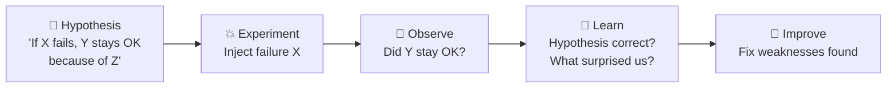
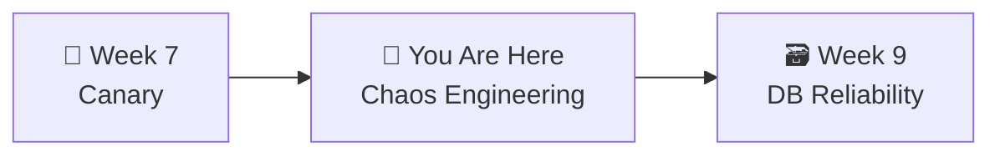

# 📌 Lecture 8 — Chaos Engineering: Break Things on Purpose

---

## 📍 Slide 1 – 🐒 The Netflix Monkey

* 🗓️ **2010** — Netflix migrates to AWS. Engineers build **Chaos Monkey** — a tool that randomly kills production servers during business hours
* 🤔 Why would you intentionally break your own production?
* 💡 Because if your system can't survive a random server dying, you'd rather find out **now** than at 3 AM during a real outage
* 📊 Netflix serves **200+ million subscribers** — Chaos Monkey runs against all of them

> 💬 *"Everything fails all the time."* — Werner Vogels, CTO of Amazon

---

## 📍 Slide 2 – 🎯 Learning Outcomes

| # | 🎓 Outcome |
|---|-----------|
| 1 | ✅ Explain chaos engineering as a scientific discipline, not random destruction |
| 2 | ✅ Design experiments with hypotheses, method, and observation plan |
| 3 | ✅ Inject failures using kubectl and environment variables |
| 4 | ✅ Name key resilience patterns: circuit breaker, retry, timeout, bulkhead |
| 5 | ✅ Compare hypothesis with actual results and draw conclusions |

---

## 📍 Slide 3 – 🔬 Chaos Engineering Is Science

> 💬 *"Chaos Engineering is the discipline of experimenting on a system to build confidence in its capability to withstand turbulent conditions in production."* — principlesofchaos.org

**NOT random destruction.** It follows the scientific method:



* 📝 **Hypothesis first** — what do you expect to happen?
* 💥 **Controlled experiment** — specific failure, limited blast radius
* 👀 **Observe with metrics** — dashboards, alerts, SLOs from previous weeks
* 🧠 **Learn** — if hypothesis failed, you found a weakness before users did

---

## 📍 Slide 4 – 📜 History

| 🗓️ Year | 🏷️ Milestone | 👤 Who |
|---------|-------------|--------|
| ~2004 | 🎮 "Game Days" at Amazon | **Jesse Robbins** ("Master of Disaster") |
| ~2006 | 🏢 DiRT exercises at Google | Google SRE team |
| 2010 | 🐒 Chaos Monkey at Netflix | Netflix Engineering |
| 2011 | 🐵 Simian Army announced | Netflix Tech Blog |
| ~2014 | 🔬 "Chaos Engineering" formalized | **Casey Rosenthal** (Netflix) |
| 2015 | 📋 principlesofchaos.org | Rosenthal et al. |
| 2020 | 📖 *Chaos Engineering* book | **Casey Rosenthal & Nora Jones** (O'Reilly) |

> 💡 Google's DiRT exercise discovered that when their identity system went down, employees couldn't badge into buildings, log into laptops, or buy food in the cafeteria — dependencies nobody had mapped!

---

## 📍 Slide 5 – 🐵 The Netflix Simian Army

| 🐵 Tool | 💥 What it breaks |
|---------|-----------------|
| 🐒 **Chaos Monkey** | Kills random instances |
| 🐌 **Latency Monkey** | Adds artificial delays |
| 🦍 **Chaos Gorilla** | Simulates entire availability zone outage |
| 🦧 **Chaos Kong** | Simulates entire AWS region outage |

* 🐒 Chaos Monkey runs **Monday-Friday, 9am-3pm** in production
* 📊 No advance warning — if your service can't handle it during peak, you find out now
* 🏥 The analogy: **fire drills** — scheduled, controlled, but realistic

---

## 📍 Slide 6 – 📝 Designing an Experiment

**Template for every chaos experiment:**

```
EXPERIMENT: [Name]
HYPOTHESIS: "If [failure], then [expected behavior],
            because [resilience mechanism]."
METHOD:     [How to inject the failure]
OBSERVE:    [Which dashboards/metrics to watch]
DURATION:   [How long to run]
ABORT IF:   [Stop if X happens — safety valve]
```

**Example:**
```
EXPERIMENT: Payment service pod kill
HYPOTHESIS: "If we kill the payments pod, checkout will fail for
            ~10 seconds, then recover automatically because K8s
            restarts the pod via the Deployment controller."
METHOD:     kubectl delete pod -l app=payments
OBSERVE:    Gateway error rate on Grafana, pod status
DURATION:   2 minutes
ABORT IF:   Error rate > 50% for > 30 seconds
```

---

## 📍 Slide 7 – 💥 Types of Failure Injection

| 💥 Failure | 🛠️ How (no extra tools) | 🎯 What it tests |
|-----------|------------------------|------------------|
| 🔪 **Pod kill** | `kubectl delete pod -l app=X` | K8s self-healing, readiness probes |
| 🚫 **Service outage** | `kubectl scale deployment X --replicas=0` | Graceful degradation, fallbacks |
| ❌ **Error injection** | `PAYMENT_FAILURE_RATE=0.5` env var | Error handling, retry logic |
| 🐌 **Latency injection** | `PAYMENT_LATENCY_MS=2000` env var | Timeouts, cascade prevention |
| 🔒 **Resource exhaustion** | `DB_MAX_CONNS=2` env var | Connection pooling, queue behavior |
| ⏱️ **Aggressive timeout** | `GATEWAY_TIMEOUT_MS=500` env var | Fast-fail, user experience |

> 💡 Your QuickTicket app already has these env vars built in. No extra tools needed!

---

## 📍 Slide 8 – 🛡️ Resilience Patterns

| 🛡️ Pattern | 📋 What it does | 📊 QuickTicket Example |
|-----------|----------------|----------------------|
| ⚡ **Circuit Breaker** | After N failures, stop calling the service — fail fast | Gateway stops calling payments after 5 consecutive 500s |
| 🔄 **Retry with Backoff** | Retry failed calls with increasing delays | 100ms → 200ms → 400ms between retries |
| ⏱️ **Timeout** | Never wait forever — set explicit deadline | GATEWAY_TIMEOUT_MS=5000 |
| 🚧 **Bulkhead** | Isolate resources per dependency | DB_MAX_CONNS limits blast radius of slow queries |
| 🔄 **Fallback** | Return degraded but functional response | Show cached data when DB is down |

> 📖 Circuit breaker coined by **Michael Nygard** in *"Release It!"* (2007). Netflix **Hystrix** was the famous implementation.

---

## 📍 Slide 9 – 🌡️ Partial Failure Is Harder

> 💬 Most real incidents are NOT "everything is dead." They are **partial failures** — latency spikes, intermittent errors, resource exhaustion.

| 💀 Total Failure | 🌡️ Partial Failure |
|-----------------|-------------------|
| Easy to detect (service down) | Hard to detect (intermittent) |
| Alerts fire immediately | May not hit alert threshold |
| Users see clear error | Users see "sometimes works, sometimes doesn't" |
| Quick to diagnose | Hard to reproduce |

**This is why chaos engineering focuses on degraded states**, not just "kill everything":
- 30% failure rate + 500ms latency = realistic production scenario
- Tests whether your monitoring can even detect it (recall Lab 6 threshold tuning!)

---

## 📍 Slide 10 – 🎮 Game Days

A **Game Day** is a scheduled chaos exercise:

1. 📋 **Plan:** Choose scenarios, assign roles (IC, observers), set blast radius limits
2. 💥 **Execute:** Inject failures, observe behavior
3. 📝 **Debrief:** What happened vs what we expected? What to fix?

> 🔗 Connects to incident response (Lecture 6): Game Days **practice** the skills you'd need in a real incident

| 🏢 Company | 🎮 Practice |
|-----------|-----------|
| Netflix | Chaos Monkey daily, Chaos Kong quarterly |
| Google | DiRT annually, Wheel of Misfortune for training |
| Amazon | Game Days since ~2004 (Jesse Robbins) |

---

## 📍 Slide 11 – 🧠 Key Takeaways

1. 🔬 **Chaos engineering = science** — hypothesis first, not random destruction
2. 💥 **Partial failures are harder** — 30% error rate is more realistic than "everything dead"
3. 🛡️ **Resilience patterns exist** — circuit breaker, retry, timeout, bulkhead, fallback
4. 🛠️ **No extra tools needed** — kubectl + env vars = meaningful experiments
5. 🎮 **Game Days build confidence** — practice incident response before real incidents

> 💬 *"The goal isn't to break things. The goal is to build confidence that your system can handle failure."*

---

## 📍 Slide 12 – 🚀 What's Next

* 📍 **Next lecture:** DB Reliability — migrations, backups, disaster recovery
* 🧪 **Lab 8:** Design and run 3 chaos experiments, document hypotheses vs reality
* 📖 **Reading:** [Principles of Chaos Engineering](https://principlesofchaos.org/) + [Netflix Chaos Monkey](https://netflix.github.io/chaosmonkey/)



---

## 📚 Resources

* 📖 *Chaos Engineering: System Resiliency in Practice* — Rosenthal & Jones (O'Reilly, 2020)
* 📖 [Principles of Chaos Engineering](https://principlesofchaos.org/)
* 📖 *Release It!* — Michael Nygard (2007, 2nd ed. 2018) — coined circuit breaker
* 📖 [Google SRE Book, Ch 17 — Testing for Reliability](https://sre.google/sre-book/testing-reliability/)
* 📖 [Netflix — Chaos Monkey](https://netflix.github.io/chaosmonkey/)
