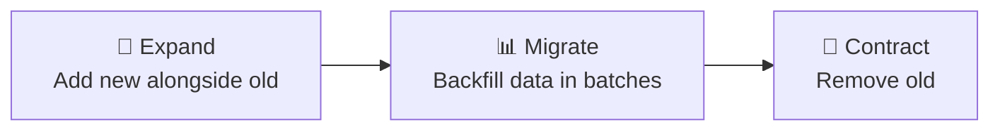
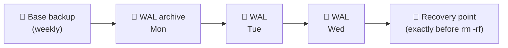
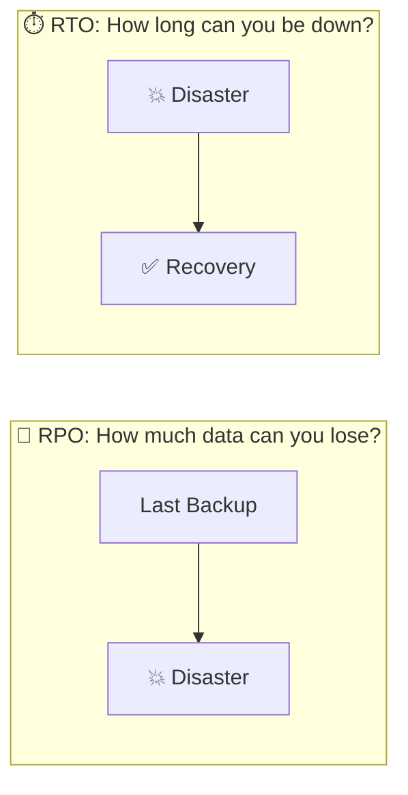
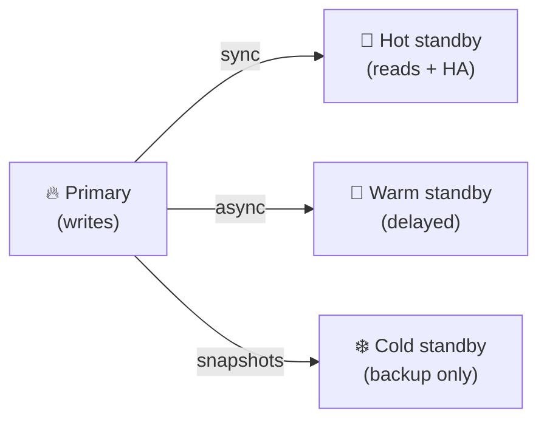
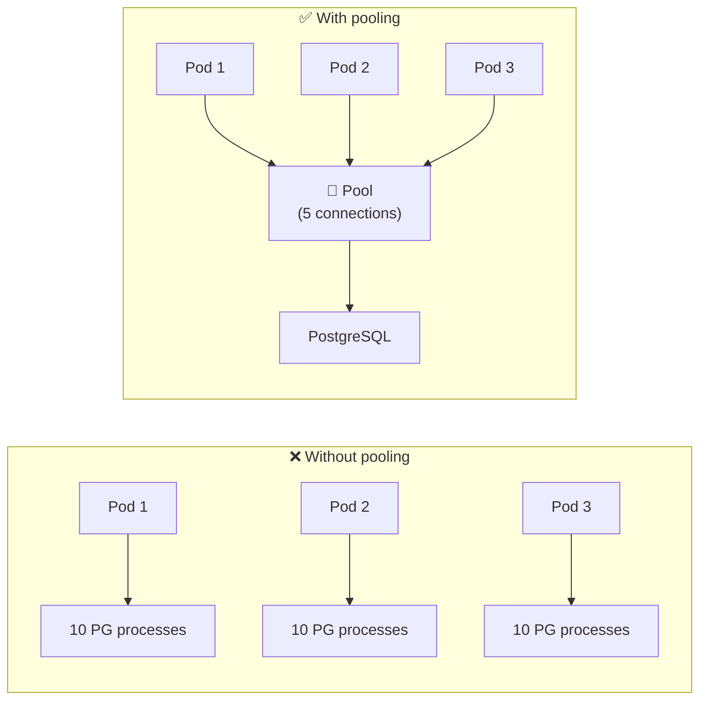
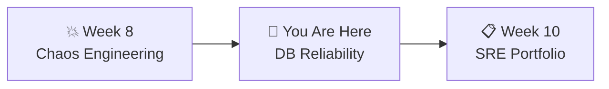

# 📌 Lecture 9 — Stateful Services & DB Reliability

---

## 📍 Slide 1 – 💾 The Data That Didn't Come Back

* 🗓️ **January 31, 2017** — GitLab engineer runs `rm -rf` on the **production** database directory instead of staging
* 💾 **300 GB** of production data — gone in seconds
* 🔧 They had **5 backup methods**. All 5 were broken:
  * 📦 `pg_dump` → version mismatch, silently produced empty files
  * 💿 LVM snapshots → not taken regularly
  * 🔄 Replication → already broken
  * ☁️ Azure snapshots → not enabled
  * 🔔 Backup monitoring → alert emails silently rejected
* ⏱️ Recovery from a 6-hour-old staging copy took **18 hours**
* 🎥 GitLab famously **live-streamed** the recovery on YouTube — radical transparency

> 💬 *"Untested backups don't exist."* — every SRE who's lived through a data loss incident

---

## 📍 Slide 2 – 🎯 Learning Outcomes

| # | 🎓 Outcome |
|---|-----------|
| 1 | ✅ Explain why stateful services are harder than stateless |
| 2 | ✅ Run database migrations safely with Alembic |
| 3 | ✅ Apply the **expand-and-contract** pattern for zero-downtime schema change |
| 4 | ✅ Perform `pg_dump` backup + `pg_restore`, and know the difference from physical backups |
| 5 | ✅ Define RTO and RPO and connect them to SLOs |
| 6 | ✅ Understand connection pooling — in the app and via PgBouncer |
| 7 | ✅ Recognize K8s StatefulSet / PVC concepts and when to use a DB operator |

---

## 📍 Slide 3 – 🐄 Stateful: The Pets in a Cattle World

| 🏷️ Property | 🐄 Stateless (Cattle) | 🐱 Stateful (Pets) |
|-------------|----------------------|---------------------|
| 💀 Failure recovery | Kill and replace | Must recover data first |
| 📈 Scaling | Add more pods | Replication, consensus |
| ☸️ K8s resource | Deployment | StatefulSet + PVC |
| 🏷️ Identity | Doesn't matter | Stable network ID required |
| 💾 Storage | Ephemeral | Persistent Volume Claims |
| ⏪ Rollback | Redeploy previous image | May require restoring data too |

* 🐳 Your QuickTicket gateway + payments = **cattle** (stateless, replaceable)
* 🗃️ Your PostgreSQL = **pet** (has data, can't just kill and replace)

> 🤔 **Think:** In Lab 8 you killed pods with no data loss. What happens if you kill the postgres pod **without** a PVC right now?

---

## 📍 Slide 4 – 🗃️ The Database Landscape

Not all "databases" have the same failure modes. Know what you're running:

| 🏷️ Family | 📋 Examples | 🎯 Strengths | ⚠️ Pitfalls |
|----------|-------------|-------------|-------------|
| Relational (OLTP) | PostgreSQL, MySQL | ACID, mature ecosystem | Schema migrations, scaling writes |
| Columnar (OLAP) | ClickHouse, BigQuery | Analytics, compression | Not for transactional workloads |
| Key-Value | Redis, DynamoDB | Speed, simplicity | Durability tuning, hot keys |
| Document | MongoDB, DocumentDB | Schemaless ergonomics | Consistency trade-offs |
| Search | Elasticsearch, OpenSearch | Full-text, aggregation | Not a source of truth |
| Graph | Neo4j, JanusGraph | Relationships | Niche tooling |
| Time-series | Prometheus, Influx, Timescale | Metric storage | Long-term retention |

> 💡 **Rule of thumb:** Pick **one** system of record (usually relational), and use others as derived stores you can always rebuild from it.

---

## 📍 Slide 5 – 🔄 Database Migrations

* 📋 **What:** Schema changes tracked as versioned scripts (like git for your DB)
* ⬆️ Each migration has `upgrade()` (apply) and `downgrade()` (revert)
* 📊 Applied in order, tracked in a migration history table

**Why they're dangerous:**

| 💥 Dangerous Migration | 😱 What Happens |
|----------------------|----------------|
| `DROP COLUMN` | Permanent data loss — cannot undo |
| `ALTER TYPE` on large table | Full table rewrite, exclusive lock, all queries block |
| Column rename | Every query using the old name breaks instantly |
| Add `NOT NULL` without default | Fails if existing rows have NULL |
| `CREATE INDEX` (non-concurrently) | Blocks writes on PostgreSQL |

> 💬 An engineer ran `ALTER TABLE` on a 40M-row table. It locked for 47 minutes. Every API call timed out. Full outage.

---

## 📍 Slide 6 – 🔀 Safe Migrations: Expand and Contract

**The safe way to change schemas with zero downtime:**



**Example — renaming `username` to `user_name`:**

| 📍 Step | 📋 DB Action | 🔧 Code Change |
|---------|-------------|----------------|
| 1️⃣ Expand | `ALTER TABLE ADD COLUMN user_name` | Write to BOTH columns |
| 2️⃣ Migrate | Batched `UPDATE SET user_name = username` | Read from new column |
| 3️⃣ Contract | `ALTER TABLE DROP COLUMN username` | Remove old code paths |

> 💡 Each step is its own migration. Each step can be rolled back. At no point is the app broken.

> 📖 Martin Fowler calls this **Parallel Change** — the general pattern applies to APIs, queues, and file formats too, not just databases.

---

## 📍 Slide 7 – 🐍 Alembic: Migrations for Python

* 🛠️ Created by **Mike Bayer** (author of SQLAlchemy)
* 📦 Standard migration tool for Python + PostgreSQL projects

```bash
alembic init migrations           # Initialize
alembic revision -m "add email"   # Create migration
alembic upgrade head              # Apply all pending
alembic downgrade -1              # Revert last
alembic current                   # Show current version
alembic history                   # Show all migrations
```

```python
# migrations/versions/001_add_email.py
def upgrade():
    op.add_column('events', sa.Column('email', sa.String(255)))
    op.create_index('idx_events_email', 'events', ['email'],
                    postgresql_concurrently=True)   # ← no write-locking

def downgrade():
    op.drop_index('idx_events_email')
    op.drop_column('events', 'email')
```

> 💡 Equivalent tools: **Flyway** (Java/SQL), **Liquibase** (Java/XML), **goose** (Go), **knex** (Node), **rails db:migrate** (Ruby). Same concepts, different syntax.

---

## 📍 Slide 8 – 🛠️ Online Schema Change at Scale

For tables with **100M+ rows**, even `ALTER TABLE ... CONCURRENTLY` can be too slow. Specialized tools copy the table in the background:

| 🛠️ Tool | 🎯 DB | 📋 How |
|---------|------|--------|
| **gh-ost** (GitHub) | MySQL | Reads the binlog to tail changes into a shadow table |
| **pt-online-schema-change** (Percona) | MySQL | Triggers-based shadow table |
| **pg_repack** | PostgreSQL | Rebuilds tables without long locks |
| **pg-online-schema-change** | PostgreSQL | Shadow table + trigger copy |

**Process (conceptually):**
1. 🧱 Create shadow table with new schema
2. 🔄 Copy existing rows in batches (tiny locks per batch)
3. 📡 Replicate ongoing writes to shadow (via triggers / logical replication)
4. 🔁 Atomic swap (shadow becomes primary; old dropped)

> 🤔 **Think:** A 47-minute `ALTER TABLE` on a 40M-row table becomes a 3-hour **background** job with gh-ost. Trade: longer total time, zero downtime.

---

## 📍 Slide 9 – 💾 Backup & Restore (Logical)

```bash
# Backup (custom compressed format — fastest restore)
pg_dump -U quickticket -Fc quickticket > backup.dump

# Backup (plain SQL — human readable, large)
pg_dump -U quickticket quickticket > backup.sql

# Restore
pg_restore -U quickticket -d quickticket backup.dump
```

* 📊 `pg_dump` does **NOT** lock the database — reads a consistent snapshot via MVCC
* ⚠️ But a backup you never test is **not a backup**

> 💬 GitLab's `pg_dump` was running against PostgreSQL 9.6 with a 9.2 client. It silently produced empty backups for months. Nobody checked.

**The 3-2-1-1-0 Rule (industry standard):**
* 3️⃣ copies of your data
* 2️⃣ different media types
* 1️⃣ offsite copy
* 1️⃣ immutable (WORM / ransomware-proof) copy
* 0️⃣ errors in recovery testing

---

## 📍 Slide 10 – 🗄️ Logical vs Physical Backups

| 🏷️ Type | 📋 How it works | ✅ Strengths | ❌ Tradeoffs |
|---------|----------------|-------------|--------------|
| 🧾 **Logical** (`pg_dump`) | Dumps SQL statements / data | Portable across versions, selective | Slow on large DBs, doesn't include indexes in compact form |
| 📀 **Physical** (`pg_basebackup`, snapshots) | Copies the data files | Fast restore, good for large DBs | Version-locked, usually full-cluster only |
| 🕐 **PITR** (Point-in-Time Recovery) | Physical base backup + WAL replay | Recover to ANY second before disaster | Complex setup, WAL retention costs |
| 🌐 **Logical replication** (subscribers) | Streams changes as SQL | Minor-version-tolerant, selective | Config-heavy |
| 💿 **Volume snapshots** (EBS, PD) | Underlying block storage snapshot | Super fast, infra-level | Crash-consistent, not app-consistent (needs freeze) |

> 💡 Real production setups layer these: daily logical backup + continuous WAL archiving for PITR + monthly restore drills.

---

## 📍 Slide 11 – ⏮️ Point-in-Time Recovery (PITR)

The gold standard for recoverable DBs — "restore to 2026-04-18 14:23:07".



* 📀 **Base backup** (once a week/day) = a starting point
* 📜 **WAL** = Write-Ahead Log, every DB change recorded
* ▶️ **Replay** WAL forward to any moment in time
* ⏰ **RPO** shrinks to **seconds** (not hours)

> 💡 **Fun fact:** The WAL is how PostgreSQL guarantees durability on crash. The same mechanism enables PITR — the log is your time machine.

> 🤔 **Think:** Without PITR, your RPO is "last backup." With PITR, it's "last WAL segment." Which matters more for a ticketing system?

---

## 📍 Slide 12 – ⏱️ RTO & RPO



| 📏 Metric | 📋 Question | 📊 Example |
|----------|-----------|-----------|
| ⏱️ **RTO** | How long can we be down? | 1 hour |
| 💾 **RPO** | How much data can we lose? | 6 hours (last backup) |

**Connection to SLOs:**
* 📊 SLO: 99.9% availability = max 8.76 hours downtime/year
* ⏱️ RTO must fit within that budget
* 💾 RPO defines backup frequency: RPO = 1 hour → at least hourly backups (or PITR)

> 🤔 **Think:** Your current QuickTicket has no backups and no PVC. What's your RPO? (Answer: ∞ — you lose everything on pod restart)

---

## 📍 Slide 13 – 🔁 Replication & Standby Tiers

Replication trades durability for complexity. Three common tiers:



| 🏷️ Tier | ⏱️ Failover | 💾 Data loss | 💰 Cost |
|---------|-------------|-------------|---------|
| 🔥 **Hot / Synchronous** | Seconds | ~0 | High — blocking replication |
| 🧊 **Hot / Async** | Seconds | Seconds of writes | Medium |
| 🥶 **Warm** | Minutes | Minutes | Lower |
| ❄️ **Cold** (restore from backup) | Hours | Hours | Lowest |

**Multi-AZ vs Multi-Region:**
* 🏢 **Multi-AZ** — survive datacenter failure (same region, < 10ms latency)
* 🌍 **Multi-Region** — survive region failure (cross-continent, 50-200ms latency)

> 💡 Managed DBs (AWS RDS, Aurora, Cloud SQL) bundle this. On your own K8s, use an **operator** (see slide 16).

---

## 📍 Slide 14 – 🔌 Connection Pooling

* 🧠 PostgreSQL forks a **new OS process** per connection (~5-10 MB each)
* 📊 Default `max_connections` = 100
* 📈 5 app pods × 10 connections each = 50 connections from one service
* 💥 Exhaustion → `too many clients already` error → **full outage**



* 🔧 QuickTicket uses `DB_MAX_CONNS` env var to limit the per-pod pool
* 💥 In Lab 8 you tested `DB_MAX_CONNS=2` — connection exhaustion under load

---

## 📍 Slide 15 – 🏊 External Poolers: PgBouncer & Odyssey

For real production, an **external pooler** sits between the app and the DB:

| 🏷️ Pooler | 🎯 Origin | 💡 Why it's famous |
|-----------|-----------|--------------------|
| **PgBouncer** | 2007, Skype | Lightweight, single-threaded, rock-solid |
| **Odyssey** | Yandex | Multi-threaded, modern, routing features |
| **pgcat** | 2022, Rust | Modern replacement, shards + read splitting |

**Pooling modes:**
* 💬 **Session** — 1:1 with DB conn for a whole client session (safest, least savings)
* 💼 **Transaction** — one conn per transaction (most common in web apps)
* 📜 **Statement** — one conn per statement (highest density, breaks features like prepared statements)

> 💡 A single PgBouncer can front 10,000 app connections onto 100 real DB connections. It's the single most impactful piece of Postgres infra you'll install.

---

## 📍 Slide 16 – ☸️ Postgres on Kubernetes

You'll hit three questions immediately:

1. 💾 **Storage** — StatefulSet + PVC, use SSD StorageClass, **never** emptyDir for data
2. 🆔 **Identity** — StatefulSet gives pods stable DNS (`pg-0`, `pg-1`) so replicas know who's who
3. ⚙️ **Operator** — don't run Postgres with raw manifests; use an **operator**:

| 🛠️ Operator | 🏢 Maintainer | 💡 Best for |
|-------------|---------------|------------|
| **CloudNativePG (CNPG)** | EDB (CNCF Sandbox, 2022) | Modern, native K8s-first |
| **Zalando Postgres Operator** | Zalando | Battle-tested in production |
| **Crunchy Data PGO** | Crunchy Data | Enterprise support available |

**What an operator does for you:** HA, failover, backups, PITR, version upgrades, certificate rotation — all declaratively via CRDs.

> 💬 *"Managing a production database on Kubernetes without an operator is like flying a plane without a copilot — you technically can, but you shouldn't."*

---

## 📍 Slide 17 – 🎬 More Data Disasters

| 📅 Year | 🏢 Company | 💥 What Happened |
|---------|-----------|-----------------|
| 1998 | 🎬 Pixar | `rm -rf *` deleted 90% of Toy Story 2 — saved by an employee's home backup (for maternity leave) |
| 2011 | 🏥 Journal of Biology | Server RAID failure + no offsite backup → **21 years of research gone** |
| 2017 | 🦊 GitLab | `rm -rf` on wrong server — 5/5 backup methods failed |
| 2018 | 🏦 TSB Bank | DB migration failed — 1.9M customers locked out for weeks, cost £330M + CEO resignation |
| 2019 | 🎵 MySpace | "Server migration" lost 12 years of user music (~50M songs) |
| 2021 | 🔥 OVHcloud fire | Physical DC in Strasbourg burned — customers without offsite backups lost everything |

> 💡 Notice the pattern: most data disasters are **human errors during migrations or maintenance**, not hardware failures. That's why safe processes matter more than redundant hardware.

---

## 📍 Slide 18 – ❌ Data Reliability Anti-patterns

| ❌ Anti-pattern | 💥 Why it's bad |
|----------------|-----------------|
| "We have backups" (never restored one) | GitLab's lesson — 5 broken backup methods |
| Running Postgres on `emptyDir` in K8s | Pod restart = empty DB |
| `ALTER TABLE` on a 50M-row table during business hours | Full-table lock, full outage |
| One DBA who knows the restore runbook | Bus factor of 1 |
| DR plan "we'll figure it out" | MTTR becomes hours-to-days |
| Schema migrations in the same PR as code using new schema | Can't deploy safely |

> 💬 *"The disaster plan you haven't rehearsed will fail."*

---

## 📍 Slide 19 – 🧠 Key Takeaways

1. 🐱 **Stateful services are pets** — PVCs, StatefulSets, operators, tested restores
2. 🔀 **Expand-and-contract** — never do schema change in one step
3. 🧰 **Online schema tools** exist for huge tables — gh-ost, pg_repack, pg-online-schema-change
4. 💾 **Logical + physical + PITR** — layer your backups; test restore quarterly
5. ⏱️ **Know your RTO/RPO** — they define backup frequency and recovery procedures
6. 🔌 **Connection pooling** — in-app and via PgBouncer; otherwise pg FORKS a process per connection
7. ⚙️ **Use an operator** on K8s — don't hand-roll HA

> 💬 *"Everyone has a backup strategy. Very few have a tested restore strategy."*

---

## 📍 Slide 20 – 🚀 What's Next

* 📍 **Next lecture:** SRE Portfolio — bringing it all together, reliability review, career paths
* 🧪 **Lab 9:** Run Alembic migrations, `pg_dump` backup, simulate data loss, restore, verify
* 📖 **Reading:** [Google SRE Book, Ch 26 — Data Integrity](https://sre.google/sre-book/data-integrity/)



---

## 📚 Resources

* 📖 [Google SRE Book, Ch 26 — Data Integrity](https://sre.google/sre-book/data-integrity/) — the definitive chapter
* 📖 [Alembic Tutorial](https://alembic.sqlalchemy.org/en/latest/tutorial.html)
* 📖 [PostgreSQL pg_dump Documentation](https://www.postgresql.org/docs/current/app-pgdump.html)
* 📖 [Martin Fowler — Parallel Change (Expand & Contract)](https://martinfowler.com/bliki/ParallelChange.html)
* 📖 [PostgreSQL — Continuous Archiving & PITR](https://www.postgresql.org/docs/current/continuous-archiving.html)
* 📖 [PgBouncer documentation](https://www.pgbouncer.org/)
* 📖 [CloudNativePG (CNCF)](https://cloudnative-pg.io/)
* 📖 [gh-ost (GitHub)](https://github.com/github/gh-ost) — online schema change for MySQL
* 📝 [GitLab Postmortem — Database Outage Jan 31, 2017](https://about.gitlab.com/blog/postmortem-of-database-outage-of-january-31/)
* 📝 [TSB 2018 migration failure — BBC analysis](https://www.bbc.com/news/business-43880506)
* 📖 *Database Reliability Engineering* — Laine Campbell & Charity Majors (O'Reilly, 2017) — the DBRE bible
* 📖 *Designing Data-Intensive Applications* — Martin Kleppmann (O'Reilly, 2017) — must-read for any SRE touching data
