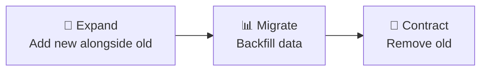
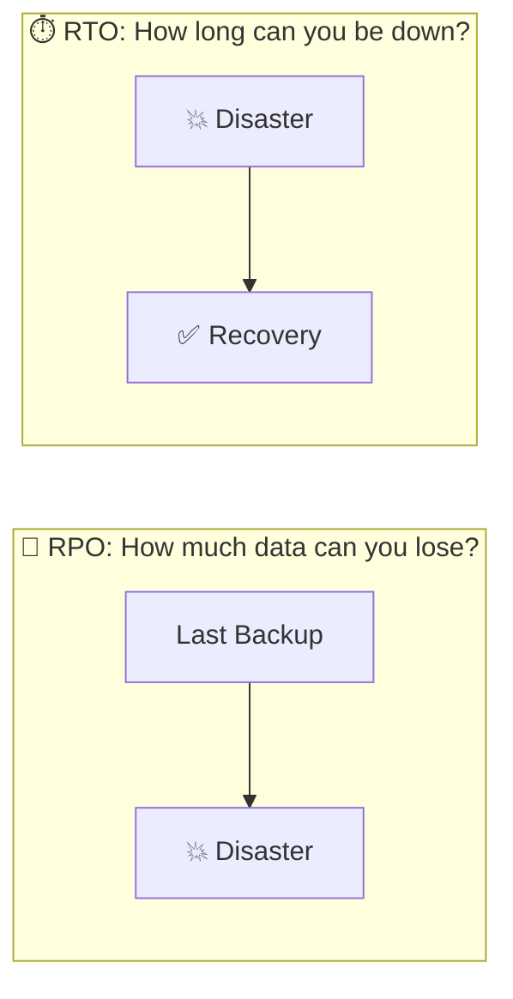
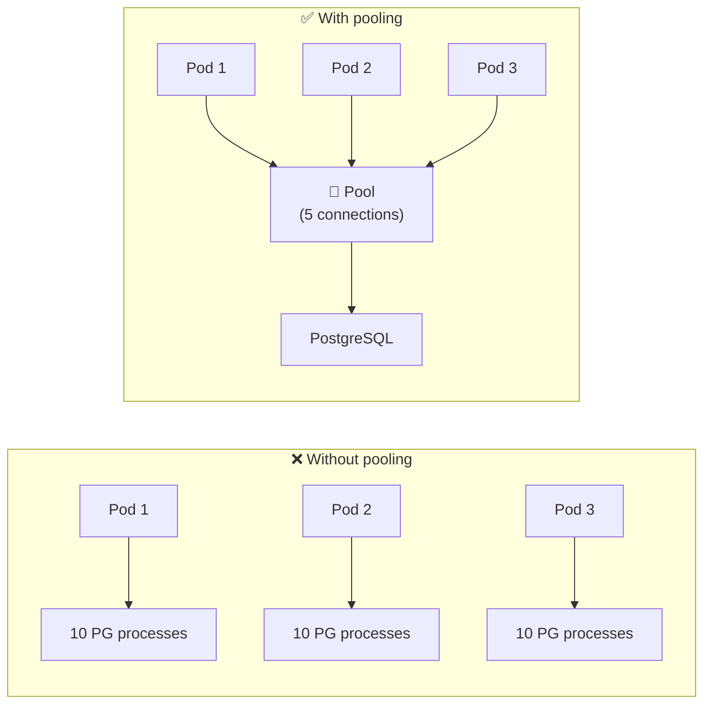
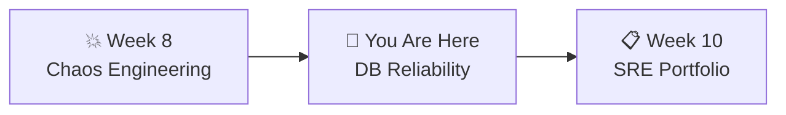

# 📌 Lecture 9 — Stateful Services & DB Reliability

---

## 📍 Slide 1 – 💾 The Data That Didn't Come Back

* 🗓️ **January 31, 2017** — GitLab engineer runs `rm -rf` on the **production** database directory instead of staging
* 💾 **300 GB** of production data — gone in seconds
* 🔧 They had **5 backup methods**. All 5 were broken:
  * 📦 pg_dump → version mismatch, S3 bucket was empty
  * 💿 LVM snapshots → not taken regularly
  * 🔄 Replication → already broken
  * ☁️ Azure snapshots → not enabled
  * 🔔 Backup monitoring → alert emails silently rejected
* ⏱️ Recovery from a 6-hour-old staging copy took **18 hours**

> 💬 *"Untested backups don't exist."* — every SRE who's lived through a data loss incident

---

## 📍 Slide 2 – 🎯 Learning Outcomes

| # | 🎓 Outcome |
|---|-----------|
| 1 | ✅ Explain why stateful services are harder than stateless |
| 2 | ✅ Run database migrations safely with Alembic |
| 3 | ✅ Perform backup (pg_dump) and restore, verify data integrity |
| 4 | ✅ Define RTO and RPO and connect them to SLOs |
| 5 | ✅ Understand connection pooling and resource exhaustion |

---

## 📍 Slide 3 – 🐄 Stateful: The Pets in a Cattle World

| 🏷️ Property | 🐄 Stateless (Cattle) | 🐱 Stateful (Pets) |
|-------------|----------------------|---------------------|
| 💀 Failure recovery | Kill and replace | Must recover data first |
| 📈 Scaling | Add more pods | Replication, consensus |
| ☸️ K8s resource | Deployment | StatefulSet + PVC |
| 🏷️ Identity | Doesn't matter | Stable network ID required |
| 💾 Storage | Ephemeral | Persistent Volume Claims |

* 🐳 Your QuickTicket gateway + payments = **cattle** (stateless, replaceable)
* 🗃️ Your PostgreSQL = **pet** (has data, can't just kill and replace)

> 🤔 **Think:** In Lab 8 you killed pods with no data loss. What happens if you kill the postgres pod right now?

---

## 📍 Slide 4 – 🔄 Database Migrations

* 📋 **What:** Schema changes tracked as versioned scripts (like git for your DB)
* ⬆️ Each migration has `upgrade()` (apply) and `downgrade()` (revert)
* 📊 Applied in order, tracked in a migration history table

**Why they're dangerous:**

| 💥 Dangerous Migration | 😱 What Happens |
|----------------------|----------------|
| `DROP COLUMN` | Permanent data loss — cannot undo |
| `ALTER TYPE` on large table | Full table rewrite, exclusive lock, all queries block |
| Column rename | Every query using the old name breaks instantly |
| Add NOT NULL without default | Fails if existing rows have NULL |

> 💬 An engineer ran `ALTER TABLE` on a 40M-row table. It locked for 47 minutes. Every API call timed out. Full outage.

---

## 📍 Slide 5 – 🔀 Safe Migrations: Expand and Contract

**The safe way to change schemas with zero downtime:**



**Example — renaming `username` to `user_name`:**

| 📍 Step | 📋 Action | 🔧 Code Change |
|---------|----------|----------------|
| 1️⃣ Expand | `ALTER TABLE ADD COLUMN user_name` | Write to BOTH columns |
| 2️⃣ Migrate | `UPDATE SET user_name = username` | Read from new column |
| 3️⃣ Contract | `ALTER TABLE DROP COLUMN username` | Remove old code paths |

> 💡 Each step is its own migration. Each step can be rolled back. At no point is the app broken.

---

## 📍 Slide 6 – 🐍 Alembic: Migrations for Python

* 🛠️ Created by **Mike Bayer** (author of SQLAlchemy)
* 📦 Standard migration tool for Python + PostgreSQL projects

```bash
alembic init migrations           # Initialize
alembic revision -m "add email"   # Create migration
alembic upgrade head              # Apply all pending
alembic downgrade -1              # Revert last
alembic current                   # Show current version
alembic history                   # Show all migrations
```

```python
# migrations/versions/001_add_email.py
def upgrade():
    op.add_column('events', sa.Column('email', sa.String(255)))

def downgrade():
    op.drop_column('events', 'email')
```

---

## 📍 Slide 7 – 💾 Backup & Restore

```bash
# Backup (custom compressed format — fastest restore)
pg_dump -U quickticket -Fc quickticket > backup.dump

# Backup (plain SQL — human readable)
pg_dump -U quickticket quickticket > backup.sql

# Restore
pg_restore -U quickticket -d quickticket backup.dump
```

* 📊 `pg_dump` does **NOT** lock the database — reads a consistent snapshot
* ⚠️ But a backup you never test is **not a backup**

> 💬 GitLab's pg_dump was running against PostgreSQL 9.6 with a 9.2 client. It silently produced empty backups for months. Nobody checked.

**The 3-2-1-1-0 Rule:**
* 3️⃣ copies of your data
* 2️⃣ different media types
* 1️⃣ offsite copy
* 1️⃣ immutable copy
* 0️⃣ errors in recovery testing

---

## 📍 Slide 8 – ⏱️ RTO & RPO



| 📏 Metric | 📋 Question | 📊 Example |
|----------|-----------|-----------|
| ⏱️ **RTO** | How long can we be down? | 1 hour |
| 💾 **RPO** | How much data can we lose? | 6 hours (last backup) |

**Connection to SLOs:**
* 📊 SLO: 99.9% availability = max 8.76 hours downtime/year
* ⏱️ RTO must fit within that budget
* 💾 RPO defines backup frequency: RPO = 1 hour → at least hourly backups

> 🤔 **Think:** Your current QuickTicket has no backups and no PVC. What's your RPO? (Answer: ∞ — you lose everything on pod restart)

---

## 📍 Slide 9 – 🔌 Connection Pooling

* 🧠 PostgreSQL forks a **new OS process** per connection (~5-10 MB each)
* 📊 Default `max_connections` = 100
* 📈 5 app pods × 10 connections each = 50 connections from one service
* 💥 Exhaustion → `too many clients` error → **full outage**



* 🔧 QuickTicket uses `DB_MAX_CONNS` env var to limit the pool
* 💥 In Lab 8 you tested `DB_MAX_CONNS=2` — connection exhaustion under load

---

## 📍 Slide 10 – 🎬 More Data Disasters

| 📅 Year | 🏢 Company | 💥 What Happened |
|---------|-----------|-----------------|
| 1998 | 🎬 Pixar | `rm -rf *` deleted 90% of Toy Story 2 — saved by an employee's home backup |
| 2012 | 💸 Knight Capital | Bad deployment activated dead code — lost $440M in 45 minutes |
| 2017 | 🦊 GitLab | `rm -rf` on wrong server — 5/5 backup methods failed |
| 2018 | 🏦 TSB Bank | DB migration failed — 1.9M customers locked out for weeks, cost £330M |
| 2019 | 🎵 MySpace | "Server migration" lost 12 years of user music (~50M songs) |

> 💡 Notice the pattern: most data disasters are **human errors during migrations or maintenance**, not hardware failures. That's why safe processes matter more than redundant hardware.

---

## 📍 Slide 11 – 🧠 Key Takeaways

1. 🐱 **Stateful services are pets** — they need special care (PVCs, backups, tested restores)
2. 🔀 **Safe migrations** — expand and contract pattern, never drop columns in one step
3. 💾 **Test your backups** — an untested backup is not a backup (GitLab learned this publicly)
4. ⏱️ **Know your RTO/RPO** — they define backup frequency and recovery procedures
5. 🔌 **Connection pooling** prevents resource exhaustion under scale

> 💬 *"Everyone has a backup strategy. Very few have a tested restore strategy."*

---

## 📍 Slide 12 – 🚀 What's Next

* 📍 **Next lecture:** SRE Portfolio — bringing it all together, reliability review
* 🧪 **Lab 9:** Run Alembic migrations, pg_dump backup, simulate data loss, restore, verify
* 📖 **Reading:** [Google SRE Book, Ch 26 — Data Integrity](https://sre.google/sre-book/data-integrity/)



---

## 📚 Resources

* 📖 [Google SRE Book, Ch 26 — Data Integrity](https://sre.google/sre-book/data-integrity/)
* 📖 [Alembic Tutorial](https://alembic.sqlalchemy.org/en/latest/tutorial.html)
* 📖 [PostgreSQL pg_dump Documentation](https://www.postgresql.org/docs/current/app-pgdump.html)
* 📖 [Martin Fowler — Parallel Change (Expand & Contract)](https://martinfowler.com/bliki/ParallelChange.html)
* 📝 [GitLab Postmortem — Database Outage](https://about.gitlab.com/blog/postmortem-of-database-outage-of-january-31/)
