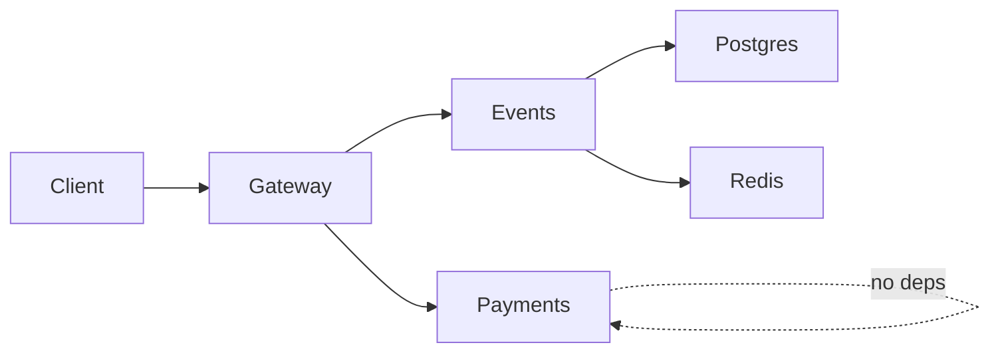

# Lab 1 — Deploy, Break, Understand

**Author:** _(your name)_  
**Date:** 2026-06-12

> Note: Host port `5432` was already in use on this machine, so the `postgres` service runs without a host port mapping. Internal Docker networking is unchanged — all services communicate normally.

---

## Task 1 — Deploy & Break QuickTicket

### 1.1 `docker compose ps` (all 5 services running)

```
NAME             IMAGE                COMMAND                  SERVICE    CREATED         STATUS                    PORTS
app-events-1     app-events           "uvicorn main:app --…"   events     ...             Up ...                    0.0.0.0:8081->8081/tcp
app-gateway-1    app-gateway          "uvicorn main:app --…"   gateway    ...             Up ...                    0.0.0.0:3080->8080/tcp
app-payments-1   app-payments         "uvicorn main:app --…"   payments   ...             Up ...                    0.0.0.0:8082->8082/tcp
app-postgres-1   postgres:17-alpine   "docker-entrypoint.s…"   postgres   ...             Up ... (healthy)          5432/tcp
app-redis-1      redis:7-alpine       "docker-entrypoint.s…"   redis      ...             Up ... (healthy)          0.0.0.0:6379->6379/tcp
```

### 1.2 Critical path (list → reserve → pay)

**List events:**
```json
[
    {"id": 1, "name": "Go Conference 2026", "venue": "Main Hall A", "available": 100, "price_cents": 5000},
    {"id": 4, "name": "Python Workshop", "venue": "Lab 301", "available": 25, "price_cents": 2000},
    {"id": 2, "name": "SRE Meetup", "venue": "Room 204", "available": 30, "price_cents": 0},
    {"id": 5, "name": "Kubernetes Deep Dive", "venue": "Auditorium B", "available": 80, "price_cents": 8000},
    {"id": 3, "name": "Cloud Native Summit", "venue": "Expo Center", "available": 500, "price_cents": 15000}
]
```

**Reserve (event 1):**
```json
{
    "reservation_id": "1d39c970-c707-4d25-8277-edacc5ea1014",
    "event_id": 1,
    "quantity": 1,
    "total_cents": 5000,
    "expires_in_seconds": 300
}
```

**Pay:**
```json
{
    "order_id": "1d39c970-c707-4d25-8277-edacc5ea1014",
    "event_id": 1,
    "quantity": 1,
    "total_cents": 5000,
    "status": "confirmed"
}
```

### 1.3 Health (all services healthy)

```json
{
    "status": "healthy",
    "checks": {
        "events": "ok",
        "payments": "ok",
        "circuit_payments": "CLOSED"
    }
}
```

### 1.4 Dependency map



Text summary:
```
Client → gateway
gateway → events → postgres   (read/write event catalog, orders)
gateway → events → redis      (hold reservations with TTL)
gateway → payments            (charge on /pay)
```

**Key insight:** `reserve` only touches `events` (and its dependencies). `pay` touches both `payments` and `events` (confirm order after charge).

### 1.5 Failure table

| Component Killed | Events List | Reserve | Pay | Health Check | User Impact |
|-----------------|-------------|---------|-----|--------------|-------------|
| payments | ✅ 200 | ✅ 200 | ❌ 502 `"Payment service unavailable"` | ⚠️ 503 degraded (`payments: down`) | Can browse and reserve tickets, but cannot complete purchase |
| events | ❌ 502 `"Events service unavailable"` | ❌ 502 | ❌ 500 `"Payment succeeded but confirmation failed"` | ⚠️ 503 degraded (`events: down`) | Entire ticket flow broken; pay may charge without confirming order |
| redis | ✅ 200 | ❌ 504 `"Events service timeout"` | ❌ 500 confirmation failed | ✅ 200 healthy* | Listing works; reservations fail (Redis holds are required) |
| postgres | ❌ 502 `"Events service unavailable"` | ❌ 500 Internal Server Error | ❌ 500 confirmation failed | ⚠️ 503 degraded (`events: degraded`) | Complete outage for catalog and reservations |

\* Health still reports `healthy` when Redis is down because the events service caches Redis status for 5 seconds — a monitoring blind spot.

### 1.6 Load generator (payments killed at ~12s)

```
QuickTicket Load Generator
Target: http://localhost:3080 | RPS: 5 | Duration: 30s
---
[10s] requests=43 success=43 fail=0 error_rate=0%
 Container app-payments-1 Stopping
 Container app-payments-1 Stopped
[20s] requests=85 success=83 fail=2 error_rate=2.3%
---
Done. total=122 success=120 fail=2 error_rate=1.6%
```

Error rate jumped from **0%** to **~2.3%** after killing payments. The spike is modest because only ~10% of load-gen traffic runs the full purchase flow (reserve + pay); most requests are read-only `/events` calls that still succeed.

---

## Task 2 — Graceful Degradation

### Code change (`app/gateway/main.py`)

```diff
     except CircuitOpenError:
         log.error("circuit open, skipping payments call")
         raise HTTPException(503, "Payment service temporarily unavailable (circuit open)")
+    except httpx.ConnectError:
+        log.error("payments service unreachable")
+        return JSONResponse(
+            status_code=503,
+            content={
+                "error": "payments_unavailable",
+                "message": "Payment service is temporarily down. Your reservation is held — try again in a few minutes.",
+                "reservation_id": reservation_id,
+            },
+        )
     except httpx.TimeoutException:
         raise HTTPException(504, "Payment service timeout")
```

### Verification (payments stopped)

**Reserve — still works:**
```json
{
    "reservation_id": "674d5b45-f152-4777-9c54-0d57e0948333",
    "event_id": 1,
    "quantity": 1,
    "total_cents": 5000,
    "expires_in_seconds": 300
}
```

**Pay — clear 503 with actionable message:**
```json
{
    "error": "payments_unavailable",
    "message": "Payment service is temporarily down. Your reservation is held — try again in a few minutes.",
    "reservation_id": "674d5b45-f152-4777-9c54-0d57e0948333"
}
```
HTTP status: **503**

---

## Task 3 — GitHub Community

<!-- TODO: complete after starring/following on GitHub -->

- [ ] Starred the course repository
- [ ] Starred [simple-container-com/api](https://github.com/simple-container-com/api)
- [ ] Following [@Cre-eD](https://github.com/Cre-eD), [@Naghme98](https://github.com/Naghme98), [@pierrepicaud](https://github.com/pierrepicaud)
- [ ] Following 3+ classmates: _(list usernames)_

**Why stars matter:** Starring repositories bookmarks useful projects and signals community trust to maintainers, helping quality open-source tools gain visibility.

**Why following matters:** Following developers surfaces their activity in your feed, helps you discover projects and collaborators, and builds professional connections beyond the classroom.

---

## Bonus Task — Resource Usage Under Load

### B.1 Baseline (idle, no traffic)

```
NAME             CPU %     MEM USAGE / LIMIT     NET I/O           PIDS
app-gateway-1    0.32%     38.97MiB / 7.653GiB   300kB / 295kB     2
app-payments-1   0.32%     33.01MiB / 7.653GiB   872B / 126B       1
app-events-1     0.26%     41.6MiB / 7.653GiB    259kB / 352kB     2
app-postgres-1   0.04%     25.65MiB / 7.653GiB   146kB / 167kB     8
app-redis-1      0.85%     9.719MiB / 7.653GiB   44.6kB / 18.6kB   6
```

### B.2 Under load (`./loadgen/run.sh 10 30`)

```
NAME             CPU %     MEM USAGE / LIMIT     NET I/O           PIDS
app-gateway-1    4.96%     39.01MiB / 7.653GiB   409kB / 403kB     2
app-payments-1   0.22%     33.75MiB / 7.653GiB   4.29kB / 2.54kB   2
app-events-1     2.69%     41.63MiB / 7.653GiB   355kB / 485kB     2
app-postgres-1   0.58%     25.66MiB / 7.653GiB   195kB / 223kB     8
app-redis-1      0.66%     9.473MiB / 7.653GiB   60kB / 25.1kB     6
```

Load generator result: `total=209 success=201 fail=8 error_rate=3.8%` (injected payment failures from normal `PAYMENT_FAILURE_RATE=0.0` — failures are from race conditions / concurrent reserves).

### B.3 Under stress with fault injection

Payments restarted with `PAYMENT_FAILURE_RATE=0.3 PAYMENT_LATENCY_MS=500`:

```
NAME             CPU %     MEM USAGE / LIMIT     NET I/O           PIDS
app-payments-1   0.75%     35.19MiB / 7.653GiB   4.22kB / 2.64kB   2
app-gateway-1    4.79%     39.34MiB / 7.653GiB   696kB / 689kB     2
app-events-1     2.26%     41.93MiB / 7.653GiB   608kB / 823kB     2
app-postgres-1   0.64%     25.7MiB / 7.653GiB    344kB / 393kB     8
app-redis-1      0.77%     9.73MiB / 7.653GiB    93kB / 39.2kB     6
```

Load generator result: `total=164 success=128 fail=36 error_rate=21.9%`

Restored with: `PAYMENT_FAILURE_RATE=0.0 PAYMENT_LATENCY_MS=0 docker compose up -d payments`

### Analysis

| Question | Observation |
|----------|-------------|
| **Most memory at rest?** | **events** (~41.6 MiB) — Python runtime + psycopg2 connection pool + Redis client. Does not change meaningfully under load (+0.3 MiB). |
| **Most CPU under load?** | **gateway** (~5%) — it proxies every request and orchestrates the reserve→pay chain. **events** is second (~2.7%) due to DB queries and Redis writes on reserves. |
| **Memory changes under load?** | Barely. All services stay within ~1 MiB of idle values — this workload is I/O-bound, not memory-hungry. |
| **Fault injection impact on gateway?** | Gateway CPU stays high (~4.8%) but **network I/O nearly doubles** (409 kB → 696 kB) compared to normal load. The 500 ms injected latency in payments means gateway holds HTTP connections open longer per `/pay` request, increasing concurrent in-flight requests and bytes transferred. Payments itself shows low CPU (0.75%) — it's mostly sleeping. |

**Takeaway:** Under chaos, the bottleneck shifts from CPU to **connection duration**. Slow downstream services inflate gateway resource usage without the failing service itself appearing "busy" — a classic symptom to watch for in production SLO monitoring.
