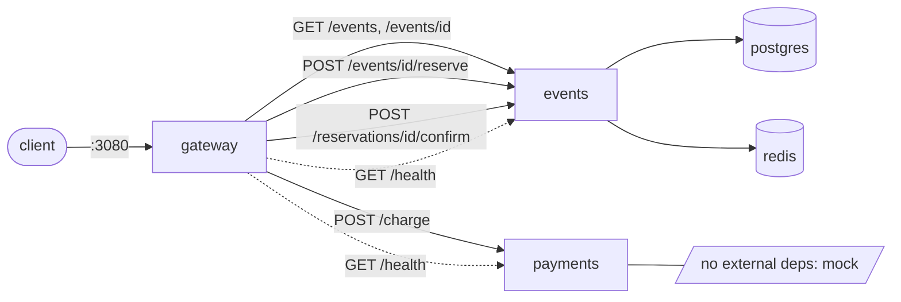

# Lab 1 — SRE Philosophy: Deploy, Break, Understand

> QuickTicket deployment, systematic failure exploration, graceful degradation, and
> resource-usage measurements. All command output below is copied verbatim from the
> terminal. (The raw capture was kept in a local `raw.log` working file that is
> intentionally not committed — it is a local artifact, not an attachment to this PR.)

Environment: Docker Compose, macOS (Darwin), gateway exposed on `localhost:3080`.

---

## Task 1 — Deploy & Break QuickTicket

### 1.1 Deploy — all 5 services running

```
$ docker compose ps
NAME             IMAGE                COMMAND                  SERVICE    CREATED          STATUS                    PORTS
app-events-1     app-events           "uvicorn main:app --…"   events     26 seconds ago   Up 19 seconds             0.0.0.0:8081->8081/tcp
app-gateway-1    app-gateway          "uvicorn main:app --…"   gateway    26 seconds ago   Up 19 seconds             0.0.0.0:3080->8080/tcp
app-payments-1   app-payments         "uvicorn main:app --…"   payments   26 seconds ago   Up 24 seconds             0.0.0.0:8082->8082/tcp
app-postgres-1   postgres:17-alpine   "docker-entrypoint.s…"   postgres   26 seconds ago   Up 24 seconds (healthy)   0.0.0.0:5432->5432/tcp
app-redis-1      redis:7-alpine       "docker-entrypoint.s…"   redis      26 seconds ago   Up 24 seconds (healthy)   0.0.0.0:6379->6379/tcp
```

> **Note (TODO-ME):** Only `postgres` and `redis` declare a `healthcheck` in
> `docker-compose.yaml`, so only they show `(healthy)`. `gateway`, `events`, and
> `payments` have no container-level healthcheck and show plain `Up`. I confirmed
> their real readiness by polling the gateway `/health` endpoint until it returned
> `status: healthy` rather than trusting the `STATUS` column.

### 1.2 Critical path — list → reserve → pay → health

```
$ curl -s -w "\n%{http_code}\n" http://localhost:3080/events
[{"id":1,"name":"Go Conference 2026","venue":"Main Hall A","date":"2026-09-15T09:00:00+00:00","total_tickets":100,"price_cents":5000,"available":100},
 {"id":4,"name":"Python Workshop","venue":"Lab 301","date":"2026-09-22T14:00:00+00:00","total_tickets":25,"price_cents":2000,"available":25},
 {"id":2,"name":"SRE Meetup","venue":"Room 204","date":"2026-10-01T18:00:00+00:00","total_tickets":30,"price_cents":0,"available":30},
 {"id":5,"name":"Kubernetes Deep Dive","venue":"Auditorium B","date":"2026-10-10T10:00:00+00:00","total_tickets":80,"price_cents":8000,"available":80},
 {"id":3,"name":"Cloud Native Summit","venue":"Expo Center","date":"2026-11-20T10:00:00+00:00","total_tickets":500,"price_cents":15000,"available":500}]
200

$ curl -s -X POST http://localhost:3080/events/1/reserve -H "Content-Type: application/json" -d '{"quantity": 1}'
{"reservation_id":"4bb3950f-eb93-4932-9872-88cfb001eee8","event_id":1,"quantity":1,"total_cents":5000,"expires_in_seconds":300}
# reserve_http = 200

$ curl -s -w "\n%{http_code}\n" -X POST http://localhost:3080/reserve/4bb3950f-eb93-4932-9872-88cfb001eee8/pay
{"order_id":"4bb3950f-eb93-4932-9872-88cfb001eee8","event_id":1,"quantity":1,"total_cents":5000,"status":"confirmed"}
200

$ curl -s -w "\n%{http_code}\n" http://localhost:3080/health
{"status":"healthy","checks":{"events":"ok","payments":"ok","circuit_payments":"CLOSED"}}
200
```

### 1.3 Architecture — dependency map (derived from code, not README)

Read from `app/gateway/main.py`, `app/events/main.py`, `app/payments/main.py`:

- `GET /events`, `GET /events/{id}` → gateway → **events** → **postgres**
- `POST /events/{id}/reserve` → gateway → **events** → **postgres** (availability read) + **redis** (`setex` holds the reservation, TTL 300 s)
- `POST /reserve/{id}/pay` → gateway → **payments** `/charge`, then gateway → **events** `/reservations/{id}/confirm` → **redis** (`get` reservation) + **postgres** (`INSERT` order)
- `GET /health` → gateway probes **events** `/health` (which itself checks postgres + redis) and **payments** `/health`; verdict is `healthy` only if `events == ok AND payments == ok`


```mermaid
graph LR
  client([client]) -->|:3080| gateway

  gateway -->|GET /events, /events/id| events
  gateway -->|POST /events/id/reserve| events
  gateway -->|POST /charge| payments
  gateway -->|POST /reservations/id/confirm| events

  gateway -. GET /health .-> events
  gateway -. GET /health .-> payments

  events --> postgres[(postgres)]
  events --> redis[(redis)]

  payments --- nodep[/no external deps: mock/]
```

Key structural facts that shape the failure behavior below:

- **payments has no dependencies** — it is a self-contained mock. Its `/health` **always** returns `200 {"status":"healthy", ...}` regardless of `PAYMENT_FAILURE_RATE`/`PAYMENT_LATENCY_MS`.
- **`/reserve/{id}/pay` is a two-step write**: (1) charge in payments, then (2) confirm the order in events. If step 1 succeeds but step 2 fails, the card is charged but **no order row is written** — an inconsistent state the code surfaces as `500 "Payment succeeded but confirmation failed — contact support"`.

### 1.4 Systematic failure exploration

Method: kill one component, wait ~5 s for the async stop, create a **fresh reservation**
for the round, probe `list / reserve / pay / health` with HTTP codes, then restart and
poll `/health` until `healthy` before the next round. For `events`/`redis`/`postgres` the
reservation used by the `pay` probe was created **while the stack was healthy**, just
before the stop, so the `pay` path had a real reservation to act on.

> This table reflects the **original, unmodified gateway** (before Task 2). After Task 2,
> the `payments`-down `Pay` cell changes from `502` to `503 payments_unavailable` — see Task 2.

| Component Killed | Events List | Reserve | Pay | Health Check | User Impact |
|-----------------|-------------|---------|-----|--------------|-------------|
| **payments** | `200` ✅ | `200` ✅ | `502` `{"detail":"Payment service unavailable"}` | `503` `degraded`, `payments:"down"` | Can browse and reserve; **cannot pay**. Reservation is held in Redis, so it's recoverable. |
| **events** | `502` `{"detail":"Events service unavailable"}` | `502` same | `500` `{"detail":"Payment succeeded but confirmation failed — contact support"}` | `503` `degraded`, `events:"down"` | Catalog + reserve fully down. Pre-existing reservation gets **charged but not recorded** → money-at-risk. |
| **redis** | `200` ✅ (postgres-only read) | `504` `{"detail":"Events service timeout"}` | `500` `{"detail":"Payment succeeded but confirmation failed — contact support"}` | `503` `degraded`, `events:"degraded"` | Can browse; **cannot reserve** (times out) or complete a pay. |
| **postgres** | `502` `{"detail":"Events service unavailable"}` | `500` `Internal Server Error` | `500` `{"detail":"Payment succeeded but confirmation failed — contact support"}` | `503` `degraded`, `events:"degraded"` | Catalog + reserve down. Pay charges but confirm insert fails → money-at-risk. |

Raw evidence per round:

**payments down**
```
events_list_http=200
POST /events/1/reserve -> {"reservation_id":"...","...":...}          # 200
POST /reserve/<RID>/pay -> {"detail":"Payment service unavailable"}   # 502
  gateway log: ERROR payment error: [Errno -2] Name or service not known
GET /health -> {"status":"degraded","checks":{"events":"ok","payments":"down","circuit_payments":"CLOSED"}}  # 503
```

**events down**
```
GET /events              -> {"detail":"Events service unavailable"}   # 502
POST /events/1/reserve   -> {"detail":"Events service unavailable"}   # 502
POST /reserve/<RID>/pay  -> {"detail":"Payment succeeded but confirmation failed — contact support"}  # 500
  gateway log: HTTP Request: POST http://payments:8082/charge "HTTP/1.1 200 OK"   <-- charge SUCCEEDED
  gateway log: ERROR confirm error after payment: [Errno -2] Name or service not known
GET /health -> {"status":"degraded","checks":{"events":"down","payments":"ok","circuit_payments":"CLOSED"}}  # 503
```

**redis down**
```
GET /events              -> [ ...full catalog... ]                    # 200
POST /events/1/reserve   -> {"detail":"Events service timeout"}       # 504
POST /reserve/<RID>/pay  -> {"detail":"Payment succeeded but confirmation failed — contact support"}  # 500
  events log: redis.exceptions.ConnectionError: Error -2 connecting to redis:6379. Name or service not known.
GET /health -> {"status":"degraded","checks":{"events":"degraded","payments":"ok","circuit_payments":"CLOSED"}}  # 503
```

**postgres down**
```
GET /events              -> {"detail":"Events service unavailable"}   # 502
POST /events/1/reserve   -> Internal Server Error                     # 500
POST /reserve/<RID>/pay  -> {"detail":"Payment succeeded but confirmation failed — contact support"}  # 500
  events log: psycopg2.OperationalError: could not translate host name "postgres" to address: Name or service not known
GET /health -> {"status":"degraded","checks":{"events":"degraded","payments":"ok","circuit_payments":"CLOSED"}}  # 503
```

**Observations (TODO-ME — rewrite in my own words):**
- The gateway `/health` reflected **every** failure with a `503 degraded` and the right
  culprit in `checks` — with one nuance: it reports `events:"degraded"` when events is
  reachable but *its* deps (redis/postgres) are broken (events returns `503`), vs
  `events:"down"` when events itself is unreachable. So health is honest here at the
  gateway level, *because* events propagates postgres/redis status up through its own
  `/health`. (Contrast with payments — see Bonus, where health lies.)
- The most dangerous failure mode is **not** the total outage — it's `events`/`postgres`
  down during the pay flow: **payments charges the card, then the confirm write fails**,
  leaving money taken and no order. The `500 "…contact support"` is the symptom.
- `redis` down makes reserve **time out (504)** rather than fail fast — the events service
  blocks on the Redis socket before the gateway's 5 s timeout trips. That's a latency
  amplifier: one dead dependency turns a fast 5xx into a slow 5xx.
- `list events` survives both `payments` down and `redis` down — it only needs postgres.

### 1.5 Load generator — error-rate spike when payments is killed

`./app/loadgen/run.sh 5 30` started; `docker compose stop payments` issued at ~10 s from
a second process. Error rate jumps from `0%` to `6.7%` once payments dies (only the ~10 %
of traffic that is the reserve+pay flow fails; reads and reserves keep succeeding):

```
QuickTicket Load Generator
Target: http://localhost:3080 | RPS: 5 | Duration: 30s
---
[10s] requests=40 success=40 fail=0 error_rate=0%
[10s] requests=43 success=43 fail=0 error_rate=0%
>>> payments stopped here
[20s] requests=80 success=77 fail=3 error_rate=3.7%
[20s] requests=83 success=80 fail=3 error_rate=3.6%
---
Done. total=118 success=110 fail=8 error_rate=6.7%
```

---

## Task 2 — Graceful Degradation

**Change:** in `pay_reservation`, catch the httpx transport-level exceptions that mean
"payments is unreachable" (`ConnectError`, `ConnectTimeout`, `ReadTimeout`) and return a
clear `503 payments_unavailable` with the held `reservation_id`, instead of the opaque
`502`. Placed **before** the `httpx.TimeoutException` branch (since `ConnectTimeout`/
`ReadTimeout` subclass it) and **before** `httpx.HTTPStatusError` — so a genuine `500`
returned *by* payments still maps to `500 "Payment failed"` and is **not** masked as
"unavailable".

### Diff

```diff
diff --git a/app/gateway/main.py b/app/gateway/main.py
index c86db33..3833a27 100644
--- a/app/gateway/main.py
+++ b/app/gateway/main.py
@@ -332,6 +332,22 @@ async def pay_reservation(reservation_id: str):
     except CircuitOpenError:
         log.error("circuit open, skipping payments call")
         raise HTTPException(503, "Payment service temporarily unavailable (circuit open)")
+    except (httpx.ConnectError, httpx.ConnectTimeout, httpx.ReadTimeout) as e:
+        # Payments is unreachable (connection refused / DNS fail / no response).
+        # Degrade gracefully: the reservation is still held in Redis, so tell the
+        # user to retry payment later instead of returning an opaque 502.
+        # NOTE: must precede the httpx.TimeoutException branch below, since
+        # ConnectTimeout/ReadTimeout subclass it. A 500 FROM payments raises
+        # httpx.HTTPStatusError (handled later) and is deliberately NOT masked here.
+        log.warning(f"payments unavailable (graceful degrade): {e}")
+        return JSONResponse(
+            status_code=503,
+            content={
+                "error": "payments_unavailable",
+                "message": "Payment service is temporarily down. Your reservation is held — try again in a few minutes.",
+                "reservation_id": reservation_id,
+            },
+        )
     except httpx.TimeoutException:
         raise HTTPException(504, "Payment service timeout")
     except httpx.HTTPStatusError as e:
```

### Verify — reserve still works, pay returns a clear 503

With `payments` stopped, after rebuilding the gateway:

```
$ curl -s -w "\n%{http_code}\n" -X POST http://localhost:3080/events/1/reserve \
    -H "Content-Type: application/json" -d '{"quantity": 1}'
{"reservation_id":"2183b6ba-3ec6-4f6d-8548-bf612524c89c","event_id":1,"quantity":1,"total_cents":5000,"expires_in_seconds":300}
200

$ curl -s -w "\n%{http_code}\n" -X POST http://localhost:3080/reserve/2183b6ba-3ec6-4f6d-8548-bf612524c89c/pay
{"error":"payments_unavailable","message":"Payment service is temporarily down. Your reservation is held — try again in a few minutes.","reservation_id":"2183b6ba-3ec6-4f6d-8548-bf612524c89c"}
503
```

### Verify — a real payments error is NOT masked

Sanity check that the patch distinguishes "unreachable" from "returned an error". With
payments **up** but injecting failures (`PAYMENT_FAILURE_RATE=0.3`), failed charges return
`500 "Payment failed"` (the `HTTPStatusError` path), never the 503 `payments_unavailable`:

```
pay#1 -> {"order_id":"...","status":"confirmed"}   [http=200]
pay#2 -> {"detail":"Payment failed"}                [http=500]
pay#3 -> {"order_id":"...","status":"confirmed"}   [http=200]
pay#4 -> {"detail":"Payment failed"}                [http=500]
pay#5 -> {"detail":"Payment failed"}                [http=500]
pay#6 -> {"detail":"Payment failed"}                [http=500]
pay#7 -> {"order_id":"...","status":"confirmed"}   [http=200]
pay#8 -> {"order_id":"...","status":"confirmed"}   [http=200]
```

---

## Task 3 — GitHub Community Engagement

<!-- Handled separately by me (stars/follows on GitHub + written blurb). Placeholder. -->

_TODO (self): star course repo + `simple-container-com/api`; follow @Cre-eD, @Naghme98,
@pierrepicaud + 3 classmates; write the 1–2 sentence "why stars / why follow" blurb here._

---

## Bonus Task — Resource Usage Under Load

`docker stats --no-stream` captured in three scenarios. Load = `./app/loadgen/run.sh 10 30`,
stats sampled ~12 s into the run.

### B.1 Idle (no traffic)

```
NAME             CPU %     MEM USAGE / LIMIT     NET I/O           PIDS
app-gateway-1    0.22%     38.16MiB / 7.654GiB   10.8kB / 9.91kB   2
app-payments-1   0.19%     33.48MiB / 7.654GiB   2.18kB / 1.17kB   2
app-events-1     0.23%     40.86MiB / 7.654GiB   10.9kB / 10.5kB   2
app-postgres-1   0.00%     23.47MiB / 7.654GiB   94.1kB / 107kB    8
app-redis-1      1.03%     9.582MiB / 7.654GiB   29.6kB / 10.6kB   6
```

### B.2 Under load (10 rps, normal payments)

```
NAME             CPU %     MEM USAGE / LIMIT     NET I/O           PIDS
app-gateway-1    3.95%     39.21MiB / 7.654GiB   151kB / 146kB     2
app-payments-1   0.17%     34.13MiB / 7.654GiB   8.64kB / 5.53kB   2
app-events-1     2.02%     41.21MiB / 7.654GiB   133kB / 178kB     2
app-postgres-1   0.58%     23.67MiB / 7.654GiB   163kB / 184kB     8
app-redis-1      0.70%     9.59MiB / 7.654GiB    52kB / 20.4kB     6
```
Loadgen summary: `total=206 success=203 fail=3 error_rate=1.4%`

### B.3 Under stress + fault injection (`PAYMENT_FAILURE_RATE=0.3 PAYMENT_LATENCY_MS=500`)

```
NAME             CPU %     MEM USAGE / LIMIT     NET I/O           PIDS
app-payments-1   0.16%     35.43MiB / 7.654GiB   5.27kB / 3.53kB   2
app-gateway-1    3.80%     38.86MiB / 7.654GiB   444kB / 435kB     2
app-events-1     1.84%     41.29MiB / 7.654GiB   385kB / 515kB     2
app-postgres-1   0.98%     23.73MiB / 7.654GiB   302kB / 344kB     8
app-redis-1      0.75%     9.91MiB / 7.654GiB    87.7kB / 36.3kB   6
```
Loadgen summary: `total=174 success=160 fail=14 error_rate=8.0%`

During chaos the gateway `/health` **still reported `healthy`**:
```
$ curl -s http://localhost:8082/health
{"status":"healthy","failure_rate":0.3,"latency_ms":500}      # payments self-report
$ curl -s http://localhost:3080/health
{"status":"healthy","checks":{"events":"ok","payments":"ok","circuit_payments":"CLOSED"}}
```

**Analysis (TODO-ME — rewrite in my own words):**
- **Most memory:** `events` (~41 MiB), just ahead of `gateway` (~38 MiB) and `payments`
  (~33 MiB) — the three Python/FastAPI+uvicorn processes dominate. `postgres` ~23 MiB,
  `redis` the leanest ~9–10 MiB. Memory is essentially **flat across idle → load → chaos**;
  this workload is not memory-bound, footprints are just process baselines.
- **Most CPU under load:** `gateway` (~3.9%), then `events` (~2.0%). Makes sense — the
  gateway touches **every** request (metrics middleware, path normalization, one or two
  downstream httpx calls per request), and `events` runs the SQL. `payments` stays near
  idle (~0.2%) because only ~10 % of traffic reaches it and its work is trivial.
- **Does health lie? YES — for payments.** payments `/health` is hard-coded to
  `{"status":"healthy"}` and never inspects `PAYMENT_FAILURE_RATE`/`PAYMENT_LATENCY_MS`.
  So at 30 % failure + 500 ms latency it still reports healthy, the gateway believes it,
  and the gateway's own `/health` says `healthy` — while real users see `500`s (error rate
  8 %) and slow pays. A liveness-style check that doesn't exercise the real code path gives
  false confidence. (events `/health` is the opposite — it actually pings postgres+redis,
  so it caught those outages in Task 1.)
- **Fault injection → gateway impact:** injecting 500 ms latency into payments dropped
  total throughput from **206 → 174** requests over the same 10 rps / 30 s window. The
  pay-flow requests block on the gateway's httpx client for the full ~500 ms (gateway holds
  the connection open the whole time), so those requests take much longer and the generator
  completes fewer of them. CPU/memory on the gateway barely moved here because concurrency
  was low (10 rps, 10 % pay flow) — but the mechanism (held connections) is exactly what
  would exhaust the gateway's connection pool / worker capacity at higher load.
  (Caveat: the 206 vs 174 figures come from two separate loadgen runs, so this is not a
  strictly controlled A/B comparison — run-to-run jitter, not only the payments config,
  could account for part of the gap.)

Payments restored to normal afterwards (`failure_rate:0.0, latency_ms:0`); gateway `/health` back to `healthy`.
