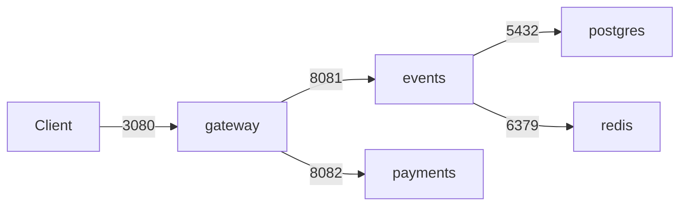

# Lab 1 — SRE Philosophy: Deploy, Break, Understand

## Environment note

Host port `8081` was already taken (bound to `127.0.0.1:8081`) by an unrelated container
(`cluer-demo-1`) on this machine, so `docker compose up` failed the first time with:

```
Error response from daemon: failed to set up container networking: driver failed
programming external connectivity on endpoint app-events-1: Bind for 127.0.0.1:8081
failed: port is already allocated
```

Fix: I remapped the `events` service's **host** port only, in `app/docker-compose.yaml`:
`"8081:8081"` → `"8091:8081"`. The container port (8081) and all internal service-to-service
calls (`EVENTS_URL=http://events:8081`) stay the same, this only changes how you'd reach
`events` directly from the host, and the lab doesn't need that anyway (everything goes through
the gateway on port 3080). No application code was touched for this.

---

## Task 1 — Deploy & Break QuickTicket

### 1.1 / 1.2 — `docker compose ps` (all 5 services running)

```
NAME             IMAGE                COMMAND                  SERVICE    CREATED          STATUS                    PORTS
app-events-1     app-events           "uvicorn main:app --…"   events     14 seconds ago   Up 13 seconds             0.0.0.0:8091->8081/tcp, [::]:8091->8081/tcp
app-gateway-1    app-gateway          "uvicorn main:app --…"   gateway    33 seconds ago   Up 13 seconds             0.0.0.0:3080->8080/tcp, [::]:3080->8080/tcp
app-payments-1   app-payments         "uvicorn main:app --…"   payments   34 seconds ago   Up 33 seconds             0.0.0.0:8082->8082/tcp, [::]:8082->8082/tcp
app-postgres-1   postgres:17-alpine   "docker-entrypoint.s…"   postgres   34 seconds ago   Up 33 seconds (healthy)   0.0.0.0:5432->5432/tcp, [::]:5432->5432/tcp
app-redis-1      redis:7-alpine       "docker-entrypoint.s…"   redis      34 seconds ago   Up 33 seconds (healthy)   0.0.0.0:6379->6379/tcp, [::]:6379->6379/tcp
```

### Critical path (list → reserve → pay), real data

```
$ curl -s http://localhost:3080/events | python3 -m json.tool
[
    {
        "id": 1,
        "name": "Go Conference 2026",
        "venue": "Main Hall A",
        "date": "2026-09-15T09:00:00+00:00",
        "total_tickets": 100,
        "price_cents": 5000,
        "available": 100
    },
    {
        "id": 4,
        "name": "Python Workshop",
        "venue": "Lab 301",
        "date": "2026-09-22T14:00:00+00:00",
        "total_tickets": 25,
        "price_cents": 2000,
        "available": 25
    },
    {
        "id": 2,
        "name": "SRE Meetup",
        "venue": "Room 204",
        "date": "2026-10-01T18:00:00+00:00",
        "total_tickets": 30,
        "price_cents": 0,
        "available": 30
    },
    {
        "id": 5,
        "name": "Kubernetes Deep Dive",
        "venue": "Auditorium B",
        "date": "2026-10-10T10:00:00+00:00",
        "total_tickets": 80,
        "price_cents": 8000,
        "available": 80
    },
    {
        "id": 3,
        "name": "Cloud Native Summit",
        "venue": "Expo Center",
        "date": "2026-11-20T10:00:00+00:00",
        "total_tickets": 500,
        "price_cents": 15000,
        "available": 500
    }
]

$ curl -s -X POST http://localhost:3080/events/1/reserve -H "Content-Type: application/json" -d '{"quantity": 1}' | python3 -m json.tool
{
    "reservation_id": "590b0e28-69d7-411f-9d32-db7a6ff9c9d5",
    "event_id": 1,
    "quantity": 1,
    "total_cents": 5000,
    "expires_in_seconds": 300
}

$ curl -s -X POST http://localhost:3080/reserve/590b0e28-69d7-411f-9d32-db7a6ff9c9d5/pay | python3 -m json.tool
{
    "order_id": "590b0e28-69d7-411f-9d32-db7a6ff9c9d5",
    "event_id": 1,
    "quantity": 1,
    "total_cents": 5000,
    "status": "confirmed"
}
```

### `/health` when everything is healthy

```
$ curl -s http://localhost:3080/health | python3 -m json.tool
{
    "status": "healthy",
    "checks": {
        "events": "ok",
        "payments": "ok",
        "circuit_payments": "CLOSED"
    }
}
```

### 1.3 — Dependency map

```
gateway → events    (list events, get event, reserve, confirm order)
gateway → payments  (charge)
events  → postgres  (events catalog, orders table — source of truth)
events  → redis     (reservation hold + TTL, "held" ticket counters)
```

Read from source:
- `app/gateway/main.py`: every route is a synchronous HTTP call from gateway to either
  `events` or `payments`. Gateway itself holds no state, Redis/Postgres are never touched
  directly by it.
- `app/events/main.py`: `/events`, `/events/{id}` and `_get_available()` read Postgres
  (catalog + confirmed orders). `reserve_tickets()` writes the reservation to Redis (with TTL)
  and decrements a "held" counter in Redis. `confirm_reservation()` reads the reservation back
  from Redis, then writes the final order row to Postgres.
- `app/payments/main.py`: a fully self-contained mock charge processor, no dependency on
  events/redis/postgres at all.

Mermaid:

```mermaid
graph LR
    Client -->|3080| gateway
    gateway -->|8081| events
    gateway -->|8082| payments
    events -->|5432| postgres
    events -->|6379| redis
```

### 1.4 — Systematic Failure Exploration

For every kill I issued three real requests against `http://localhost:3080` and checked
`docker compose logs`. Full raw output lives under
`/tmp/.../scratchpad/lab1/4-kill-payments.txt`, `5-kill-events.txt`,
`6-kill-redis-v2.txt`, `7-kill-postgres.txt`, condensed below.

#### Kill `payments`

```
$ docker compose stop payments
$ curl -s http://localhost:3080/events               → HTTP 200 (unaffected)
$ curl -s -X POST .../events/1/reserve -d '{"quantity":1}'
  → HTTP 200 {"reservation_id":"743df587-...","event_id":1,"quantity":1,"total_cents":5000,"expires_in_seconds":300}
$ curl -s -X POST .../reserve/743df587-.../pay
  → HTTP 502 {"detail":"Payment service unavailable"}
$ curl -s http://localhost:3080/health
  → {"status":"degraded","checks":{"events":"ok","payments":"down","circuit_payments":"CLOSED"}}
```
**Why:** `/events` and `/reserve` never call `PAYMENTS_URL`, they only talk to `events`
(`app/gateway/main.py` `list_events`, `reserve_tickets`). Payments is only reachable from
`/reserve/{id}/pay`. Gateway's generic `except Exception` around the payments call turns the
connection error into a flat `502`, which is exactly what Task 2 below fixes.

#### Kill `events`

```
$ docker compose stop events
$ curl -s http://localhost:3080/events               → HTTP 502 {"detail":"Events service unavailable"}
$ curl -s -X POST .../events/1/reserve -d '{"quantity":1}'
  → HTTP 502 {"detail":"Events service unavailable"}
$ curl -s -X POST .../reserve/bogus-id/pay
  → HTTP 500 {"detail":"Payment succeeded but confirmation failed — contact support"}
$ curl -s http://localhost:3080/health
  → {"status":"degraded","checks":{"events":"down","payments":"ok","circuit_payments":"CLOSED"}}
```
**Why (this one is interesting):** `pay_reservation` in the gateway calls **payments first,
events second** (`app/gateway/main.py` lines ~313-353). So with `events` down, payments still
happily charges a card for a reservation ID that was never validated against `events`/Postgres.
Then the `confirm` call to `events` fails and the gateway just returns a `500`. This looks like
a real bug in the app, not just an expected failure: **money can be taken with no way to
confirm the order**, and there's no refund path to compensate for it. I think this is worth
flagging as a genuine bug rather than a normal failure mode.

#### Kill `redis`

```
$ docker compose stop redis
$ curl -s http://localhost:3080/events               → HTTP 200 (unaffected — list_events only reads Postgres)
$ curl -s -X POST .../events/1/reserve -d '{"quantity":1}'
  → HTTP 504 {"detail":"Events service timeout"}
$ curl -s -X POST .../reserve/<a real, pre-existing reservation id>/pay
  → HTTP 500 {"detail":"Payment succeeded but confirmation failed — contact support"}
$ curl -s http://localhost:3080/health
  → {"status":"degraded","checks":{"events":"down","payments":"ok","circuit_payments":"CLOSED"}}
events logs: "Redis unavailable for availability check: Error -3 connecting to redis:6379.
              Temporary failure in name resolution."
```
**Why:** `list_events()` in `app/events/main.py` only queries Postgres, so it's unaffected.
`reserve_tickets()` calls `redis_client.setex(...)` / `.decrby(...)` with **no try/except**
around those two lines (unlike `_get_available()`, which does wrap its Redis read in
try/except and degrades gracefully). So a Redis outage there is an unhandled exception in
`events`, and it stalls long enough that the gateway's 5s `GATEWAY_TIMEOUT_MS` fires first,
turning it into a `504`. `pay` fails for a different reason: `confirm_reservation()` reads the
reservation back **from Redis**, and with Redis gone there's nothing to confirm against, even
though the charge already went through in payments. Basically the same "charged but not
confirmed" bug as above, just triggered from a different dependency.

#### Kill `postgres`

```
$ docker compose stop postgres
$ curl -s http://localhost:3080/events               → HTTP 502 {"detail":"Events service unavailable"}
$ curl -s -X POST .../events/1/reserve -d '{"quantity":1}'
  → HTTP 500 Internal Server Error
$ curl -s -X POST .../reserve/bogus-id/pay
  → HTTP 500 {"detail":"Payment succeeded but confirmation failed — contact support"}
$ curl -s http://localhost:3080/health
  → {"status":"degraded","checks":{"events":"degraded","payments":"ok","circuit_payments":"CLOSED"}}
events logs: psycopg2.OperationalError: server closed the connection unexpectedly
```
**Why:** Postgres is the source of truth for the catalog and orders, so every `events` route
that touches `db_pool` (`list_events`, `get_event`, `reserve_tickets`) breaks. `reserve_tickets`
raises an unhandled `psycopg2.OperationalError` (500, not caught), same story, no try/except
around the DB call either. `events`'s own `/health` returns `503 degraded` (Postgres check
fails, Redis check still passes), which is why the gateway shows `"events":"degraded"` instead
of `"down"` here. `events`'s process is alive and *responding*, just unhealthy, unlike the
`stop events` case where the whole container (and its TCP listener) is gone.

### Failure table

| Component Killed | Events List | Reserve | Pay | Health Check | User Impact |
|---|---|---|---|---|---|
| **payments** | ✅ 200, unaffected | ✅ 200, unaffected | ❌ 502 `"Payment service unavailable"` | `degraded`, `payments:"down"` | Browsing and reserving work fine; only checkout is blocked. |
| **events** | ❌ 502 `"Events service unavailable"` | ❌ 502 `"Events service unavailable"` | ❌ 500 `"Payment succeeded but confirmation failed"` (charges even with no valid reservation!) | `degraded`, `events:"down"` | Whole app is effectively down for browsing/booking; a stray `pay` call can still charge money with nothing to show for it. |
| **redis** | ✅ 200, unaffected (Postgres-only read) | ❌ 504 `"Events service timeout"` (unhandled exception in an unguarded Redis write stalls until gateway's 5s timeout) | ❌ 500 `"Payment succeeded but confirmation failed"` (charges, then can't find the reservation to confirm) | `degraded`, `events:"down"` (gateway's own `/health` check to `events` also times out) | Users can browse but can't create new reservations; any in-flight `pay` call charges money it can't confirm. |
| **postgres** | ❌ 502 `"Events service unavailable"` | ❌ 500 Internal Server Error (unhandled `psycopg2.OperationalError`) | ❌ 500 `"Payment succeeded but confirmation failed"` | `degraded`, `events:"degraded"` (not `"down"`: the events process is alive, just unhealthy) | Catalog and booking are fully broken; same charge-with-no-confirmation risk on `pay`. |

### 1.5 — Load generator

Baseline, all healthy, 5 rps / 30s:

```
QuickTicket Load Generator
Target: http://localhost:3080 | RPS: 5 | Duration: 30s
---
[10s] requests=44 success=44 fail=0 error_rate=0%
[10s] requests=45 success=45 fail=0 error_rate=0%
[10s] requests=46 success=46 fail=0 error_rate=0%
[10s] requests=47 success=47 fail=0 error_rate=0%
[20s] requests=88 success=88 fail=0 error_rate=0%
[20s] requests=89 success=89 fail=0 error_rate=0%
[20s] requests=90 success=90 fail=0 error_rate=0%
[20s] requests=91 success=91 fail=0 error_rate=0%
---
Done. total=131 success=131 fail=0 error_rate=0%
```

Same run, with `docker compose stop payments` fired ~10s in (`payments` was restarted after the
run finished):

```
QuickTicket Load Generator
Target: http://localhost:3080 | RPS: 5 | Duration: 30s
---
[10s] requests=45 success=45 fail=0 error_rate=0%
[10s] requests=46 success=46 fail=0 error_rate=0%
[10s] requests=47 success=47 fail=0 error_rate=0%
[10s] requests=48 success=47 fail=1 error_rate=2.0%
[10s] requests=49 success=48 fail=1 error_rate=2.0%
[20s] requests=89 success=83 fail=6 error_rate=6.7%
[20s] requests=90 success=84 fail=6 error_rate=6.6%
[20s] requests=91 success=85 fail=6 error_rate=6.5%
[20s] requests=92 success=86 fail=6 error_rate=6.5%
[20s] requests=93 success=87 fail=6 error_rate=6.4%
---
Done. total=133 success=122 fail=11 error_rate=8.2%
```

Error rate climbs from `0%` to `8.2%` right after the kill and keeps climbing as more
"full purchase flow" requests (10% of the traffic mix, per `loadgen/run.sh`) hit the dead
`pay` step. It doesn't spike to ~100% because 90% of the generated traffic (70% list + 20%
reserve) never touches payments at all, which matches the failure table above.

---

## Task 2 — Graceful Degradation

### Diff (`git diff app/gateway/main.py`)

```diff
--- a/app/gateway/main.py
+++ b/app/gateway/main.py
@@ -332,6 +332,16 @@ async def pay_reservation(reservation_id: str):
     except CircuitOpenError:
         log.error("circuit open, skipping payments call")
         raise HTTPException(503, "Payment service temporarily unavailable (circuit open)")
+    except httpx.ConnectError:
+        log.warning(f"payments unreachable, reservation {reservation_id} held for retry")
+        return JSONResponse(
+            status_code=503,
+            content={
+                "error": "payments_unavailable",
+                "message": "Payment service is temporarily down. Your reservation is held — try again in a few minutes.",
+                "reservation_id": reservation_id,
+            },
+        )
     except httpx.TimeoutException:
         raise HTTPException(504, "Payment service timeout")
     except httpx.HTTPStatusError as e:
```

`/events`, `/events/{id}` and `/events/{id}/reserve` needed no change. They already only call
`EVENTS_URL` and never touch payments, so "always works" was already true for them before
this lab's edit.

### Verification, real curl output

```
$ docker compose stop payments

$ curl -s -X POST http://localhost:3080/events/1/reserve -H "Content-Type: application/json" -d '{"quantity": 1}'
{"reservation_id":"4dbd4a64-9260-48cf-a6d8-6401be3b6e22","event_id":1,"quantity":1,"total_cents":5000,"expires_in_seconds":300}
HTTP 200

$ curl -s -X POST http://localhost:3080/reserve/4dbd4a64-9260-48cf-a6d8-6401be3b6e22/pay
{"error":"payments_unavailable","message":"Payment service is temporarily down. Your reservation is held — try again in a few minutes.","reservation_id":"4dbd4a64-9260-48cf-a6d8-6401be3b6e22"}
HTTP 503

$ docker compose start payments
$ curl -s http://localhost:3080/health
{"status":"healthy","checks":{"events":"ok","payments":"ok","circuit_payments":"CLOSED"}}
```

Reserve still returns `200` with payments down, and `pay` now returns a clean `503` with a
useful message and the `reservation_id`, instead of the generic `502` it gave before.

---

## Task 3 — GitHub Community Engagement

**GitHub Community:** Starring a repo is a simple way to bookmark projects you find useful and
show the maintainers (and everyone else) that the project is worth something. Star count is
also one of the first things people look at when they're deciding if a project is active and
trustworthy. Following developers works for a similar reason to why professional networks work
in general, you see what teammates, mentors and classmates are building, it's easier to find
people to collaborate with later, and it keeps some professional presence going after the
course is over.

> ⚠️ **Not run, this needs GitHub account actions and there are no credentials available in
> this environment.** This session has no GitHub authentication and can't click "Star" or
> "Follow" for anyone. Doing that here would also mean typing account credentials into an
> automated tool, which I'm not going to do. **The repo owner still needs to manually complete
> these, from their own GitHub account:**
> 1. Star the course repository.
> 2. Star [simple-container-com/api](https://github.com/simple-container-com/api).
> 3. Follow [@Cre-eD](https://github.com/Cre-eD) (professor), [@Naghme98](https://github.com/Naghme98) (TA), and [@pierrepicaud](https://github.com/pierrepicaud) (TA).
> 4. Follow at least 3 classmates from the course.

---

## Bonus Task — Resource Usage Under Load

### B.1 — Idle baseline

```
NAME             CPU %     MEM USAGE / LIMIT     NET I/O           PIDS
app-gateway-1    0.14%     38.05MiB / 14.86GiB   8.19kB / 5.34kB   2
app-events-1     0.15%     42.86MiB / 14.86GiB   364kB / 487kB     2
app-postgres-1   0.00%     23.84MiB / 14.86GiB   195kB / 228kB     8
app-redis-1      0.59%     3.773MiB / 14.86GiB   52.8kB / 19.8kB   6
app-payments-1   0.14%     33.38MiB / 14.86GiB   3.57kB / 739B     2
```
(other rows are unrelated `cluer-*` containers on the host, out of scope for this lab, omitted)

### B.2 — Under load (`./loadgen/run.sh 10 30`, snapshot taken mid-run)

```
NAME             CPU %     MEM USAGE / LIMIT     NET I/O           PIDS
app-gateway-1    6.55%     39.63MiB / 14.86GiB   203kB / 194kB     2
app-events-1     2.73%     43.92MiB / 14.86GiB   539kB / 724kB     2
app-postgres-1   5.55%     24.13MiB / 14.86GiB   293kB / 342kB     8
app-redis-1      0.79%     4.27MiB / 14.86GiB    76.6kB / 30.7kB   6
app-payments-1   0.37%     33.59MiB / 14.86GiB   12.3kB / 6.53kB   2
```
Loadgen result for this run (all services healthy): `total=228 success=215 fail=13
error_rate=5.7%`. The small nonzero failure rate here is not a system fault, it's `events`
correctly returning `409 Not enough tickets` for lower-stock events (e.g. the 30-ticket "SRE
Meetup") after repeated reserve calls across this lab's test runs used up their available
inventory.

### B.3 — Under stress with fault injection (`PAYMENT_FAILURE_RATE=0.3 PAYMENT_LATENCY_MS=500`)

```
$ curl -s http://localhost:8082/health
{"status":"healthy","failure_rate":0.3,"latency_ms":500}
```

```
NAME             CPU %     MEM USAGE / LIMIT     NET I/O           PIDS
app-payments-1   0.12%     34.83MiB / 14.86GiB   5.24kB / 1.96kB   2
app-gateway-1    4.83%     39.5MiB / 14.86GiB    540kB / 524kB     2
app-events-1     2.06%     43.75MiB / 14.86GiB   822kB / 1.1MB     2
app-postgres-1   0.73%     24MiB / 14.86GiB      450kB / 530kB     8
app-redis-1      0.61%     3.793MiB / 14.86GiB   108kB / 43.4kB    6
```
Loadgen result for this run: `total=205 success=179 fail=26 error_rate=12.6%` (up from the
5.7% baseline, the extra failures are the injected `PAYMENT_FAILURE_RATE=0.3` charges plus a
few more ticket-depletion `409`s).

### Analysis

- **Most memory:** `events` (~43-44MiB) and `gateway` (~38-40MiB) are consistently the
  heaviest, both idle and under load. Makes sense, both are Python/FastAPI processes with
  a psycopg2 connection pool (`events`) or an `httpx.AsyncClient` (`gateway`). `redis` is by
  far the lightest (~4MiB), `postgres` sits in between (~24MiB) since most of its footprint
  for this tiny dataset stays on disk, not in the container's own reported memory. Memory
  usage barely moved between idle and loaded scenarios for any service, so this workload
  isn't memory-bound.
- **Most CPU under load:** `gateway` (6.55% in B.2), because it's on the hot path for every
  single request (100% of traffic passes through it, vs. ~30% that reaches `events`' DB/Redis
  paths and ~10% that reaches `payments`), and does the JSON (de)serialization, routing and
  the outbound HTTP fan-out for each call. `postgres` also shows up at 5.55% in B.2, driven
  by the `list_events` query's `JOIN`+`GROUP BY` running on 70% of requests.
- **Fault injection impact on gateway:** with `PAYMENT_LATENCY_MS=500`, `payments`' own CPU%
  stayed near-zero in the snapshot (`time.sleep()` is I/O-bound waiting, not compute), while
  `gateway`'s CPU (4.83%) and network I/O (540kB, higher than the healthy-load snapshot's
  203kB in the same 15s sampling window) stayed comparable or higher. This fits with a slow
  `payments` making `gateway` hold its `httpx.AsyncClient` connection open for the full
  500ms+ per `pay` call instead of returning right away, so the same request rate keeps more
  concurrent connections/tasks alive on the gateway side. `docker stats`' point-in-time
  CPU/mem sampling doesn't really capture this, request *latency* (visible in the loadgen's
  rising `error_rate`, and would show up in `gateway_request_duration_seconds` from
  `/metrics`) tells you more about latency-injection faults than CPU% does.

---

## PR description

```text
- [x] Task 1 done — deployed QuickTicket, failure exploration complete
- [x] Task 2 done — graceful degradation in gateway
- [x] Task 3 partially done — written section complete, GitHub account actions pending;
      account actions (star/follow) NOT performed by this automated session (no GitHub
      credentials) — see explicit note in submissions/lab1.md, repo owner needs to do these
      4 clicks manually
- [x] Bonus Task done — resource usage under load
```

Note: `app/docker-compose.yaml` has one unrelated line changed (`events` host port
`8081`→`8091`) to work around a port already held by an unrelated container on the dev
machine. Internal service wiring is untouched. See "Environment note" above.
