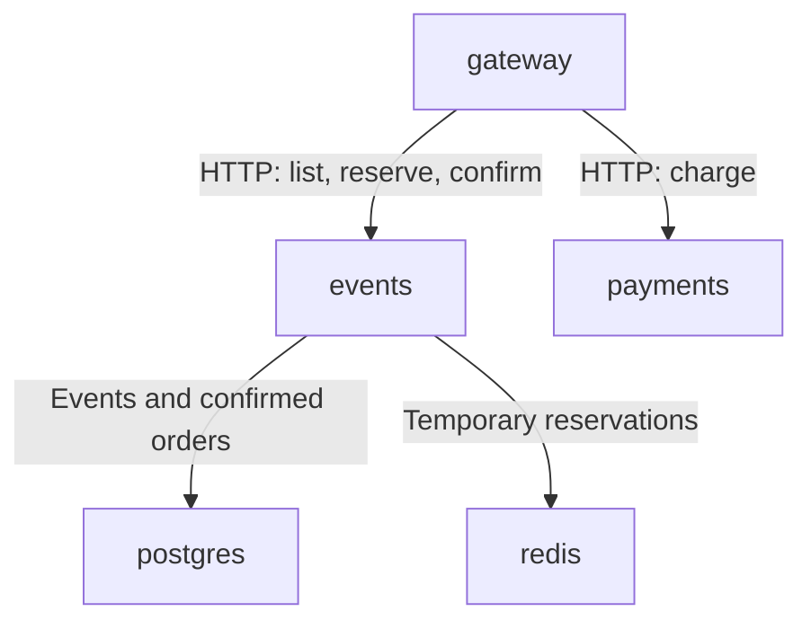

# Lab 1 — SRE Philosophy: Deploy, Break, Understand

## Task 1 — Deploy & Break QuickTicket

### 1.1: Deploy QuickTicket

Command:

```bash
docker compose -f app/docker-compose.yaml up --build -d
```

The initial deployment encountered port conflicts on host ports 6379
and 5432. I changed the Redis port mapping to 6380:6379 and the
PostgreSQL mapping to 5433:5432. Internal service ports remained unchanged.

Verification:

```bash
docker compose -f app/docker-compose.yaml ps
```

Output:

```text
NAME             IMAGE                COMMAND                  SERVICE    CREATED          STATUS                    PORTS
app-events-1     app-events           "uvicorn main:app --…"   events     7 seconds ago    Up 3 seconds              0.0.0.0:8081->8081/tcp, [::]:8081->8081/tcp
app-gateway-1    app-gateway          "uvicorn main:app --…"   gateway    6 seconds ago    Up 2 seconds              0.0.0.0:3080->8080/tcp, [::]:3080->8080/tcp
app-payments-1   app-payments         "uvicorn main:app --…"   payments   7 seconds ago    Up 3 seconds              0.0.0.0:8082->8082/tcp, [::]:8082->8082/tcp
app-postgres-1   postgres:17-alpine   "docker-entrypoint.s…"   postgres   9 minutes ago    Up 9 minutes (healthy)    0.0.0.0:5433->5432/tcp, [::]:5433->5432/tcp
app-redis-1      redis:7-alpine       "docker-entrypoint.s…"   redis      15 minutes ago   Up 15 minutes (healthy)   0.0.0.0:6380->6379/tcp, [::]:6380->6379/tcp

```

All five containers are running. PostgreSQL and Redis report healthy.

### 1.2: Verify the System Works

#### Health check

Command:

```bash
curl -sS -i http://localhost:3080/health
```

Output:

```text
HTTP/1.1 200 OK

{"status":"healthy","checks":{"events":"ok","payments":"ok","circuit_payments":"CLOSED"}}
```

The gateway reports that both events and payments are healthy.

#### List events

Command:

```bash
curl -s http://localhost:3080/events | python3 -m json.tool
```

Output:

```json
[
    {
        "id": 1,
        "name": "Go Conference 2026",
        "venue": "Main Hall A",
        "date": "2026-09-15T09:00:00+00:00",
        "total_tickets": 100,
        "price_cents": 5000,
        "available": 100
    },
    {
        "id": 4,
        "name": "Python Workshop",
        "venue": "Lab 301",
        "date": "2026-09-22T14:00:00+00:00",
        "total_tickets": 25,
        "price_cents": 2000,
        "available": 25
    },
    {
        "id": 2,
        "name": "SRE Meetup",
        "venue": "Room 204",
        "date": "2026-10-01T18:00:00+00:00",
        "total_tickets": 30,
        "price_cents": 0,
        "available": 30
    },
    {
        "id": 5,
        "name": "Kubernetes Deep Dive",
        "venue": "Auditorium B",
        "date": "2026-10-10T10:00:00+00:00",
        "total_tickets": 80,
        "price_cents": 8000,
        "available": 80
    },
    {
        "id": 3,
        "name": "Cloud Native Summit",
        "venue": "Expo Center",
        "date": "2026-11-20T10:00:00+00:00",
        "total_tickets": 500,
        "price_cents": 15000,
        "available": 500
    }
]
```

#### Reserve a ticket

Command:

```bash
RES=$(curl -sS -X POST http://localhost:3080/events/1/reserve \
  -H "Content-Type: application/json" \
  -d '{"quantity": 1}')

printf '%s\n' "$RES" | python3 -m json.tool
```

Output:

```json
{
    "reservation_id": "d6a64632-351a-4579-b0d6-78bffe0ed2e0",
    "event_id": 1,
    "quantity": 1,
    "total_cents": 5000,
    "expires_in_seconds": 300
}
```

#### Pay for the reservation

Command:

```bash
RES_ID=$(printf '%s\n' "$RES" | python3 -c 'import sys,json; print(json.load(sys.stdin)["reservation_id"])')

curl -sS -X POST "http://localhost:3080/reserve/$RES_ID/pay" | python3 -m json.tool
```

Output:

```json
{
    "order_id": "d6a64632-351a-4579-b0d6-78bffe0ed2e0",
    "event_id": 1,
    "quantity": 1,
    "total_cents": 5000,
    "status": "confirmed"
}
```

### 1.3: Read the Architecture


```mermaid
flowchart TD
    gateway -->|HTTP: list, reserve, confirm| events
    gateway -->|HTTP: charge| payments
    events -->|Events and confirmed orders| postgres
    events -->|Temporary reservations| redis
```

The gateway routes requests to events and payments. Events stores
event data and confirmed orders in PostgreSQL, and temporary
reservations in Redis with a 300-second TTL. Payments simulates
charging and does not access either database directly.

For checkout, gateway calls payments first and then asks events to
confirm the reservation. Events reads the reservation from Redis,
writes the order to PostgreSQL, and deletes the reservation.

Expected failure impact based on the code:

- If payments is down, listing events and reserving tickets still
  work, but payment fails.
- If events is down, listing and reserving fail. A charge may succeed,
  but order confirmation fails.
- If Redis is stopped after startup, listing events still works,
  but creating and confirming reservations fail.
- If PostgreSQL is down, listing and reserving fail, and confirmed
  orders cannot be saved.

These predictions were checked experimentally in section 1.4.

### 1.4: Systematic Failure Exploration

#### Failure results

| Component Killed | Events List | Reserve | Pay | Health Check | User Impact |
|-----------------|-------------|---------|-----|--------------|-------------|
| payments | HTTP 200, events returned | Reservation created successfully | HTTP 502: Payment service unavailable | Gateway: HTTP 503, payments: down | Users can browse and reserve tickets, but cannot pay. |
| events | HTTP 502 | HTTP 502: Events service unavailable | HTTP 500: Payment succeeded but confirmation failed — contact support | Gateway: HTTP 503, events: down, payments: ok | Users cannot browse or reserve. Payment processing succeeds, but the order cannot be confirmed. |
| redis | HTTP 200, events returned | HTTP 504: Events service timeout | HTTP 500: Payment succeeded but confirmation failed — contact support | Gateway: HTTP 503, events: down. A subsequent direct events health check unexpectedly returned HTTP 200, redis: ok. | Browsing remains available, but reservations and checkout fail. Health checks give inconsistent results. |
| postgres | HTTP 502: Events service unavailable | HTTP 500: Internal Server Error | HTTP 500: Payment succeeded but confirmation failed — contact support | Gateway: HTTP 503, events: degraded. Direct events health: HTTP 503, postgres: down, redis: ok. | Users cannot browse or reserve. Payment processing succeeds, but the order cannot be saved and confirmed. |

Each component was stopped separately and restarted after testing.
After each recovery, the gateway health endpoint returned HTTP 200
with status healthy.

For the events, Redis, and PostgreSQL failure tests, a fresh reservation
was created before stopping the component and used for the payment test.
For the payments failure test, the reservation was created while
payments was stopped.

The Redis experiment exposed inconsistent health reporting: the gateway
reported events as down, while a subsequent direct events health check
reported Redis as healthy despite its container being stopped.
The cause was not established during this experiment.

The events failure test also showed two successful simulated charges
with different payment references for the same reservation after the
payment request was repeated. Neither attempt could confirm the order.

### 1.5: Run the Load Generator

#### Baseline run

Command (from the repository root):

```bash
./app/loadgen/run.sh 5 30
```

Output (excerpt):

```text
QuickTicket Load Generator
Target: http://localhost:3080 | RPS: 5 | Duration: 30s
[10s] requests=44 success=44 fail=0 error_rate=0%
[20s] requests=89 success=89 fail=0 error_rate=0%
Done. total=133 success=133 fail=0 error_rate=0%
```

#### Payments stopped during load

Commands (from the repository root):

```bash
(
  sleep 10
  date -Is
  docker compose -f app/docker-compose.yaml stop payments
) &

./app/loadgen/run.sh 5 30

wait
docker compose -f app/docker-compose.yaml start payments
```

Output (excerpt):

```text
QuickTicket Load Generator
Target: http://localhost:3080 | RPS: 5 | Duration: 30s
[10s] requests=43 success=39 fail=4 error_rate=9.3%
2026-09-14T07:03:26+03:00
Container app-payments-1 Stopped
[20s] requests=81 success=69 fail=12 error_rate=14.8%
Done. total=121 success=105 fail=16 error_rate=13.2%
Container app-payments-1 Started
```

Recovery check:

```bash
curl -sS -i -w '\n' http://localhost:3080/health
```

Response (HTTP headers omitted except status):

```text
HTTP/1.1 200 OK

{"status":"healthy","checks":{"events":"ok","payments":"ok","circuit_payments":"CLOSED"}}
```

#### Results and analysis

| Scenario | Total operations | Successful | Failed | Error rate |
|----------|-----------------:|-----------:|-------:|-----------:|
| Initial baseline: all services running | 133 | 133 | 0 | 0% |
| Payments stopped during load | 121 | 105 | 16 | 13.2% |

The failure-run logs explain all 16 failed operations:

- 9 reservation requests for event 4 returned HTTP 409 Conflict.
  The application's availability check rejected these reservations.
  Four of these failures occurred before payments was stopped.
- 7 payment requests returned HTTP 502 Bad Gateway after payments
  was stopped. Gateway logs reported payment connection failures.

Payments began shutting down at 04:03:26 UTC. Before shutdown,
payment requests succeeded. The first HTTP 502 payment failure
appeared at 04:03:28 UTC.

The reported 13.2% error rate includes both reservation conflicts
and payment-service failures; it cannot be attributed entirely
to the payments outage. Event listing continued to succeed.

After payments was restarted, the gateway health endpoint returned
HTTP 200 with status healthy.

#### Supporting log excerpts

The following timestamped access-log lines show the nine reservation conflicts,
seven failed payment requests, and payments shutdown (timestamps are UTC).

```text
payments-1  | 2026-09-14T04:03:26.941378255Z INFO:     Shutting down
gateway-1   | 2026-09-14T04:03:21.510929010Z INFO:     151.101.64.223:30613 - "POST /events/4/reserve HTTP/1.1" 409 Conflict
gateway-1   | 2026-09-14T04:03:21.732951043Z INFO:     151.101.64.223:16697 - "POST /events/4/reserve HTTP/1.1" 409 Conflict
gateway-1   | 2026-09-14T04:03:22.173531070Z INFO:     151.101.64.223:22804 - "POST /events/4/reserve HTTP/1.1" 409 Conflict
gateway-1   | 2026-09-14T04:03:25.731971932Z INFO:     151.101.64.223:59587 - "POST /events/4/reserve HTTP/1.1" 409 Conflict
gateway-1   | 2026-09-14T04:03:28.153953846Z INFO:     151.101.64.223:52459 - "POST /reserve/8ca86efc-22ac-4e19-833d-bc0b671be898/pay HTTP/1.1" 502 Bad Gateway
gateway-1   | 2026-09-14T04:03:30.049984842Z INFO:     151.101.64.223:64725 - "POST /reserve/92497526-81be-459f-8375-b8d954038165/pay HTTP/1.1" 502 Bad Gateway
gateway-1   | 2026-09-14T04:03:30.935816772Z INFO:     151.101.64.223:22338 - "POST /events/4/reserve HTTP/1.1" 409 Conflict
gateway-1   | 2026-09-14T04:03:31.516725877Z INFO:     151.101.64.223:54096 - "POST /reserve/e217c4ea-e6e5-4ce6-9167-1f08e60b1ff6/pay HTTP/1.1" 502 Bad Gateway
gateway-1   | 2026-09-14T04:03:31.957433936Z INFO:     151.101.64.223:36608 - "POST /events/4/reserve HTTP/1.1" 409 Conflict
gateway-1   | 2026-09-14T04:03:33.508649772Z INFO:     151.101.64.223:54465 - "POST /events/4/reserve HTTP/1.1" 409 Conflict
gateway-1   | 2026-09-14T04:03:35.417399567Z INFO:     151.101.64.223:30931 - "POST /reserve/dc0efc34-9625-4dda-b7b2-aa51ba240c94/pay HTTP/1.1" 502 Bad Gateway
gateway-1   | 2026-09-14T04:03:36.079357315Z INFO:     151.101.64.223:52346 - "POST /events/4/reserve HTTP/1.1" 409 Conflict
gateway-1   | 2026-09-14T04:03:40.629252747Z INFO:     151.101.64.223:35138 - "POST /reserve/b5ea5d9f-2cbf-4317-95fe-e3138a4bed9c/pay HTTP/1.1" 502 Bad Gateway
gateway-1   | 2026-09-14T04:03:42.093527995Z INFO:     151.101.64.223:55171 - "POST /reserve/21afc680-a753-4a4a-8097-0c38ca931285/pay HTTP/1.1" 502 Bad Gateway
gateway-1   | 2026-09-14T04:03:42.918797452Z INFO:     151.101.64.223:41054 - "POST /reserve/f335ed21-d51a-4548-943b-e688c4c056e4/pay HTTP/1.1" 502 Bad Gateway
gateway-1   | 2026-09-14T04:03:45.338198654Z INFO:     151.101.64.223:32142 - "POST /events/4/reserve HTTP/1.1" 409 Conflict
```

## Task 2 — Graceful Degradation

### 1.7: Implement Graceful Degradation

Previously, the gateway returned HTTP 502 with the message
"Payment service unavailable" when payments could not be reached.

I added a specific handler for httpx.ConnectError in pay_reservation.
It returns HTTP 503 with an actionable message and the reservation ID.
The handler is placed before the generic exception handler.

Listing events and creating reservations do not depend on payments,
so their handlers did not need changes. The reservation TTL remains
300 seconds and is not extended by the new error handler.

Command:

```bash
git diff -- app/gateway/main.py
```

Output:

```diff
diff --git a/app/gateway/main.py b/app/gateway/main.py
index c86db33..22be82e 100644
--- a/app/gateway/main.py
+++ b/app/gateway/main.py
@@ -336,6 +336,19 @@ async def pay_reservation(reservation_id: str):
         raise HTTPException(504, "Payment service timeout")
     except httpx.HTTPStatusError as e:
         raise HTTPException(e.response.status_code, "Payment failed")
+    except httpx.ConnectError as e:
+        log.error(f"payment connection error: {e}")
+        return JSONResponse(
+            status_code=503,
+            content={
+                "error": "payments_unavailable",
+                "message": (
+                    "Payment service is temporarily down. "
+                    "Please retry before your reservation expires."
+                ),
+                "reservation_id": reservation_id,
+            },
+        )
     except Exception as e:
         log.error(f"payment error: {e}")
         raise HTTPException(502, "Payment service unavailable")
```

I rebuilt and recreated the gateway to apply the change:

```bash
docker compose -f app/docker-compose.yaml up -d --build gateway
```

The build completed successfully and the gateway container was recreated.

### 1.8: Verify

All commands below were executed from the repository root.

#### Stop payments

Command:

```bash
docker compose -f app/docker-compose.yaml stop payments
```

Output (excerpt):

```text
Container app-payments-1 Stopped
```

#### Create a reservation while payments is stopped

Commands:

```bash
RES=$(curl -sS -X POST http://localhost:3080/events/1/reserve \
  -H "Content-Type: application/json" \
  -d '{"quantity": 1}')

printf '%s\n' "$RES" | python3 -m json.tool
```

Output:

```json
{
    "reservation_id": "224aa721-afbb-4979-b29d-9c5f125cc0ff",
    "event_id": 1,
    "quantity": 1,
    "total_cents": 5000,
    "expires_in_seconds": 300
}
```

The reservation was created successfully despite payments being unavailable.

#### Attempt payment

Commands:

```bash
RES_ID=$(printf '%s\n' "$RES" | python3 -c 'import sys,json; print(json.load(sys.stdin)["reservation_id"])')

curl -sS -i -w '\n' -X POST "http://localhost:3080/reserve/$RES_ID/pay"
```

Output:

```text
HTTP/1.1 503 Service Unavailable
date: Mon, 14 Sep 2026 04:16:19 GMT
server: uvicorn
content-length: 183
content-type: application/json

{"error":"payments_unavailable","message":"Payment service is temporarily down. Please retry before your reservation expires.","reservation_id":"224aa721-afbb-4979-b29d-9c5f125cc0ff"}
```

The gateway returned HTTP 503 instead of the previous HTTP 502.
The response explains that payments is temporarily unavailable,
tells the user to retry before expiration, and includes the correct
reservation ID.

#### Restore payments and check system health

Command:

```bash
docker compose -f app/docker-compose.yaml start payments
```

Output (excerpt):

```text
Container app-payments-1 Started
```

Command:

```bash
curl -sS -i -w '\n' http://localhost:3080/health
```

Output:

```text
HTTP/1.1 200 OK
date: Mon, 14 Sep 2026 04:16:33 GMT
server: uvicorn
content-length: 89
content-type: application/json

{"status":"healthy","checks":{"events":"ok","payments":"ok","circuit_payments":"CLOSED"}}
```

#### Conclusion

The change improves how the gateway communicates a payments outage.
Users can still create reservations, while payment attempts receive
a clear HTTP 503 response with retry guidance and the reservation ID.

After payments was restarted, the system health check returned
HTTP 200 with status healthy. The HTTP 502 recorded in Task 1
describes the original behavior before this change.

## Task 3 — GitHub Community

Starring repositories helps me bookmark useful projects and gives
visibility and encouragement to open-source maintainers.
Following developers helps me keep up with classmates' work,
discover projects, and find opportunities for collaboration
and professional growth.

## Bonus Task — Resource Usage Under Load

The objective was - compare QuickTicket resource usage at rest, under normal load, and under load with payment failures and latency enabled. All commands below were run from the repository root.

Only the five QuickTicket containers are included in the resource tables. The unrelated container named `postgres` (without the `app-` prefix) was excluded. All five containers showed a memory limit of 3.685 GiB.

### B.1: Baseline (idle)

No load generator was running. The gateway health check returned HTTP 200 with status healthy.

Commands:

```bash
curl -sS -i -w '\n' http://localhost:3080/health
docker stats --no-stream --format "table {{.Name}}\t{{.CPUPerc}}\t{{.MemUsage}}\t{{.NetIO}}\t{{.PIDs}}"
```

Recorded resource usage:

| Container | CPU | Memory usage | NET I/O | PIDS |
|-----------|----:|-------------:|---------|-----:|
| app-gateway-1 | 0.17% | 38.53 MiB | 7.06 kB / 5.91 kB | 2 |
| app-events-1 | 0.18% | 41.37 MiB | 8.07 kB / 7.15 kB | 2 |
| app-payments-1 | 0.14% | 33.91 MiB | 2.27 kB / 1.3 kB | 2 |
| app-postgres-1 | 0.00% | 23.61 MiB | 291 kB / 335 kB | 8 |
| app-redis-1 | 1.25% | 9.188 MiB | 83.7 kB / 35.3 kB | 6 |

### B.2: Under load

The load generator was configured for 10 operations per second for 30 seconds. A background command captured resource usage approximately 10 seconds into the run, ensuring that the measurement occurred while traffic was active.

This normal-load measurement was repeated after B.3, with payment fault injection disabled, because the timing of the earlier manual snapshot was uncertain. The tables are arranged by scenario, not by execution order.

Commands:

```bash
(
  sleep 10
  date -Is
  docker stats --no-stream --format "table {{.Name}}\t{{.CPUPerc}}\t{{.MemUsage}}\t{{.NetIO}}\t{{.PIDs}}"
) &

./app/loadgen/run.sh 10 30

wait
```

The background command printed `2026-09-14T07:31:05+03:00` immediately before collecting the snapshot.

| Container | CPU | Memory usage | NET I/O | PIDS |
|-----------|----:|-------------:|---------|-----:|
| app-gateway-1 | 4.42% | 39.15 MiB | 1.15 MB / 1.12 MB | 2 |
| app-events-1 | 2.17% | 41.93 MiB | 995 kB / 1.32 MB | 2 |
| app-payments-1 | 0.17% | 35.08 MiB | 6.22 kB / 4.18 kB | 2 |
| app-postgres-1 | 0.68% | 24.12 MiB | 848 kB / 988 kB | 8 |
| app-redis-1 | 0.64% | 9.188 MiB | 193 kB / 82 kB | 6 |

Load generator output (excerpt):

```text
QuickTicket Load Generator
Target: http://localhost:3080 | RPS: 10 | Duration: 30s
[10s] requests=77 success=64 fail=13 error_rate=16.8%
[20s] requests=159 success=128 fail=31 error_rate=19.4%
Done. total=239 success=189 fail=50 error_rate=20.9%
```

### B.3: Under stress with fault injection

Payments was configured with a 30% failure probability per charge and a 500 ms delay per charge.

Commands:

```bash
docker compose -f app/docker-compose.yaml stop payments

PAYMENT_FAILURE_RATE=0.3 PAYMENT_LATENCY_MS=500 \
docker compose -f app/docker-compose.yaml up -d payments

curl -sS http://localhost:8082/health | python3 -m json.tool
```

Configuration verification:

```json
{
    "status": "healthy",
    "failure_rate": 0.3,
    "latency_ms": 500
}
```

The payments health endpoint reports service availability even when fault injection is enabled; this does not mean every charge will succeed.

Commands for traffic and resource collection:

```bash
(
  sleep 10
  docker stats --no-stream --format "table {{.Name}}\t{{.CPUPerc}}\t{{.MemUsage}}\t{{.NetIO}}\t{{.PIDs}}"
) &

./app/loadgen/run.sh 10 30

wait
```

The resource table appeared between the 10-second and 20-second progress messages:

| Container | CPU | Memory usage | NET I/O | PIDS |
|-----------|----:|-------------:|---------|-----:|
| app-gateway-1 | 4.09% | 39.58 MiB | 835 kB / 808 kB | 2 |
| app-events-1 | 1.88% | 41.86 MiB | 720 kB / 960 kB | 2 |
| app-payments-1 | 0.15% | 35.06 MiB | 4.73 kB / 3.3 kB | 2 |
| app-postgres-1 | 4.05% | 24.11 MiB | 695 kB / 810 kB | 8 |
| app-redis-1 | 2.92% | 8.945 MiB | 161 kB / 68.4 kB | 6 |

Load generator output (excerpt):

```text
QuickTicket Load Generator
Target: http://localhost:3080 | RPS: 10 | Duration: 30s
[10s] requests=61 success=56 fail=5 error_rate=8.1%
[20s] requests=129 success=118 fail=11 error_rate=8.5%
Done. total=195 success=180 fail=15 error_rate=7.6%
```

#### Restore normal payments

Commands:

```bash
docker compose -f app/docker-compose.yaml stop payments

PAYMENT_FAILURE_RATE=0.0 PAYMENT_LATENCY_MS=0 \
docker compose -f app/docker-compose.yaml up -d payments

curl -sS http://localhost:8082/health | python3 -m json.tool
curl -sS -i -w '\n' http://localhost:3080/health
```

Payments response:

```json
{
    "status": "healthy",
    "failure_rate": 0.0,
    "latency_ms": 0
}
```

Gateway response (nonessential headers omitted):

```text
HTTP/1.1 200 OK
date: Mon, 14 Sep 2026 04:28:42 GMT

{"status":"healthy","checks":{"events":"ok","payments":"ok","circuit_payments":"CLOSED"}}
```

### Comparison and analysis

| Service | Idle CPU | Load CPU | Chaos CPU | Idle memory (MiB) | Load memory (MiB) | Chaos memory (MiB) |
|---------|---------:|---------:|----------:|------------------:|------------------:|-------------------:|
| gateway | 0.17% | 4.42% | 4.09% | 38.53 | 39.15 | 39.58 |
| events | 0.18% | 2.17% | 1.88% | 41.37 | 41.93 | 41.86 |
| payments | 0.14% | 0.17% | 0.15% | 33.91 | 35.08 | 35.06 |
| postgres | 0.00% | 0.68% | 4.05% | 23.61 | 24.12 | 24.11 |
| redis | 1.25% | 0.64% | 2.92% | 9.188 | 9.188 | 8.945 |

#### Which service uses the most memory? Does it change under load?

Events used the most memory among the QuickTicket containers in all three snapshots: 41.37 MiB at rest, 41.93 MiB under normal load, and 41.86 MiB with payment fault injection. Its memory usage changed only slightly, and the identity of the largest memory consumer did not change.

#### Which service uses the most CPU under load? Why?

Gateway had the highest CPU usage in the normal-load snapshot (4.42%), followed by events (2.17%). This is consistent with gateway processing every user request and making downstream HTTP calls, while events performs database and reservation operations. Payments is involved only in the purchase portion of the workload.

In the chaos snapshot, gateway was also highest at 4.09%, narrowly above PostgreSQL at 4.05%. These are individual snapshots, not averages or peak measurements, so they do not establish a persistent bottleneck.

#### How does fault injection affect gateway resources?

Gateway memory was slightly higher in the chaos snapshot: 39.58 MiB versus 39.15 MiB under normal load, a difference of 0.43 MiB. Its CPU was slightly lower, at 4.09% versus 4.42%.

Slow payments keep the gateway's outgoing request and the corresponding incoming request pending longer. Waiting for network responses does not necessarily require more CPU. The memory difference is compatible with additional pending work, but these snapshots alone do not establish that latency caused it. The sequential load generator also limits concurrent user traffic.

#### Load generator results and limitations

| Scenario | Total operations | Successful | Failed | Reported error rate |
|----------|-----------------:|-----------:|-------:|--------------------:|
| Normal load (verified repeat) | 239 | 189 | 50 | 20.9% |
| Payment failures and latency | 195 | 180 | 15 | 7.6% |

The lower operation count with fault injection is consistent with additional waiting: the generator executes operations sequentially and sleeps between them. Its configured RPS is therefore not a guaranteed achieved rate, and a purchase operation makes more than one HTTP request.

The lower error percentage in the chaos run does not demonstrate better reliability. The request mix is random, and the database and reservation state were not reset between runs. Earlier experiments showed that reservation conflicts are counted as failures alongside service errors. The causes of the 50 failures in the final normal-load run were not separately investigated, and the 15 chaos failures were not classified by cause.

The configured 30% failure probability applies only to payment charge requests, not to every operation sent by the generator. Reported percentages are preserved exactly from the script; it truncates the percentage to one decimal place (15/195 is approximately 7.69%, displayed as 7.6%).

NET I/O values are cumulative received/sent bytes rather than transfer rates. Payments was recreated between configurations, and normal load was measured after chaos, so the absolute counters are not directly comparable across scenarios. PIDS remained unchanged for each QuickTicket service in the recorded snapshots.
