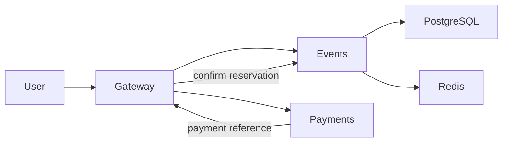

# Lab 1 — Deploy, Break, Understand

## Task 1 — Deploy and explore failures

### Running services

The local Avito Docker environment already used host port `5432`, so I ran the lab with a temporary Compose override that published QuickTicket PostgreSQL on host port `15432`. Inside the Compose network it remained `postgres:5432`, so application behavior was unchanged.

```text
$ docker compose -f app/docker-compose.yaml -f /tmp/sre-intro-lab1.override.yaml ps
NAME             IMAGE                SERVICE    STATUS                    PORTS
app-events-1     app-events           events     Up                        0.0.0.0:8081->8081/tcp
app-gateway-1    app-gateway          gateway    Up                        0.0.0.0:3080->8080/tcp
app-payments-1   app-payments         payments   Up                        0.0.0.0:8082->8082/tcp
app-postgres-1   postgres:17-alpine   postgres   Up (healthy)              0.0.0.0:15432->5432/tcp
app-redis-1      redis:7-alpine       redis      Up (healthy)              0.0.0.0:6379->6379/tcp
```

### Critical path

List events:

```json
[
    {
        "id": 1,
        "name": "Go Conference 2026",
        "venue": "Main Hall A",
        "date": "2026-09-15T09:00:00+00:00",
        "total_tickets": 100,
        "price_cents": 5000,
        "available": 100
    },
    {
        "id": 4,
        "name": "Python Workshop",
        "venue": "Lab 301",
        "date": "2026-09-22T14:00:00+00:00",
        "total_tickets": 25,
        "price_cents": 2000,
        "available": 25
    },
    {
        "id": 2,
        "name": "SRE Meetup",
        "venue": "Room 204",
        "date": "2026-10-01T18:00:00+00:00",
        "total_tickets": 30,
        "price_cents": 0,
        "available": 30
    },
    {
        "id": 5,
        "name": "Kubernetes Deep Dive",
        "venue": "Auditorium B",
        "date": "2026-10-10T10:00:00+00:00",
        "total_tickets": 80,
        "price_cents": 8000,
        "available": 80
    },
    {
        "id": 3,
        "name": "Cloud Native Summit",
        "venue": "Expo Center",
        "date": "2026-11-20T10:00:00+00:00",
        "total_tickets": 500,
        "price_cents": 15000,
        "available": 500
    }
]
```

Reserve one ticket:

```json
{
    "reservation_id": "25e584c5-85d2-4c20-b164-d4d13854acfb",
    "event_id": 1,
    "quantity": 1,
    "total_cents": 5000,
    "expires_in_seconds": 300
}
```

Pay for the reservation:

```json
{
    "order_id": "25e584c5-85d2-4c20-b164-d4d13854acfb",
    "event_id": 1,
    "quantity": 1,
    "total_cents": 5000,
    "status": "confirmed"
}
```

Healthy system:

```json
{
    "status": "healthy",
    "checks": {
        "events": "ok",
        "payments": "ok",
        "circuit_payments": "CLOSED"
    }
}
```

### Dependency map


```mermaid
flowchart LR
    User --> Gateway
    Gateway --> Events
    Gateway --> Payments
    Events --> PostgreSQL
    Events --> Redis
    Payments -->|payment reference| Gateway
    Gateway -->|confirm reservation| Events
```

PostgreSQL stores events and confirmed orders. Redis stores temporary reservations and held ticket counts. Payment succeeds before the gateway asks events to confirm an order, so an events failure at that point creates a partial-success situation.

### Failure exploration

| Component killed | Events list | Reserve | Pay | Health check | User impact |
|---|---|---|---|---|---|
| payments | `200` | `200` | `502 Payment service unavailable` | `503`, payments=`down` | Users can browse and reserve, but cannot pay. |
| events | `502` | `502` | `500` after payment succeeds but confirmation fails | `503`, events=`down` | Almost the whole product is unavailable. A payment can succeed without an order being confirmed. |
| redis | `200` | `504 Events service timeout` | `500` after payment succeeds but confirmation fails | `503`, events=`down` | Browsing continues with degraded availability calculation, but reservations and confirmations fail. |
| postgres | `502` | unhandled `500 Internal Server Error` | `500` after payment succeeds but confirmation fails | `503`, events=`degraded` | Event data and order confirmation are unavailable; temporary reservations can still exist in Redis. |

Each component was restarted after its experiment. After every recovery the gateway health endpoint returned `200` with both critical dependencies marked `ok`.

### Load generator with payments failure

I ran 10 RPS for 40 seconds. Payments was stopped at about 10 seconds and started again at about 30 seconds.

```text
[10s] requests=72  success=72  fail=0  error_rate=0%
--- stopping payments at approximately t=10s ---
[20s] requests=149 success=141 fail=8  error_rate=5.3%
[20s] requests=150 success=141 fail=9  error_rate=6.0%
[30s] requests=226 success=211 fail=15 error_rate=6.6%
[30s] requests=231 success=216 fail=15 error_rate=6.4%
--- starting payments at approximately t=30s ---
```

Only the full purchase requests failed. Reads and reservations continued, so the total error rate was much lower than 100%.

## Task 2 — Graceful degradation

I added specific handling for a connection failure to payments. Other payment errors and timeouts keep their existing behavior.

```diff
 except CircuitOpenError:
     log.error("circuit open, skipping payments call")
     raise HTTPException(503, "Payment service temporarily unavailable (circuit open)")
+except httpx.ConnectError:
+    return JSONResponse(
+        status_code=503,
+        content={
+            "error": "payments_unavailable",
+            "message": (
+                "Payment service is temporarily down. "
+                "Your reservation is held — try again in a few minutes."
+            ),
+            "reservation_id": reservation_id,
+        },
+    )
 except httpx.TimeoutException:
```

With payments stopped, reservation still works:

```json
{
    "reservation_id": "42dd8673-f259-47af-8fc2-2c0b30019d87",
    "event_id": 5,
    "quantity": 1,
    "total_cents": 8000,
    "expires_in_seconds": 300
}
```

Response: `HTTP 200`.

Payment now returns an actionable response:

```json
{
    "error": "payments_unavailable",
    "message": "Payment service is temporarily down. Your reservation is held — try again in a few minutes.",
    "reservation_id": "42dd8673-f259-47af-8fc2-2c0b30019d87"
}
```

Response: `HTTP 503`. After payments was restarted, system health returned to `HTTP 200`.

## Task 3 — GitHub Community

Starring repositories helps useful open-source projects become easier to find and gives maintainers a visible signal that people value their work. Following developers helps me discover their projects and stay connected with classmates and other engineers.

I starred both required repositories and followed the professor, TAs, and at least three classmates.

## Bonus — Resource usage

### Idle

| Service | CPU | Memory | Network I/O | PIDs |
|---|---:|---:|---:|---:|
| gateway | 0.13% | 37.91 MiB | 5.16 kB / 3.66 kB | 2 |
| events | 0.16% | 43.11 MiB | 402 kB / 545 kB | 2 |
| payments | 0.14% | 33.29 MiB | 2.23 kB / 685 B | 2 |
| postgres | 1.36% | 23.60 MiB | 218 kB / 259 kB | 8 |
| redis | 1.45% | 3.72 MiB | 56.1 kB / 21.4 kB | 6 |

### Normal load — 10 RPS

| Service | CPU | Memory | Network I/O | PIDs |
|---|---:|---:|---:|---:|
| gateway | 2.14% | 38.52 MiB | 172 kB / 166 kB | 2 |
| events | 1.20% | 43.38 MiB | 544 kB / 739 kB | 2 |
| payments | 0.12% | 33.46 MiB | 8.89 kB / 5.36 kB | 2 |
| postgres | 0.41% | 23.87 MiB | 298 kB / 351 kB | 8 |
| redis | 0.41% | 3.90 MiB | 76.1 kB / 30.5 kB | 6 |

### Fault injection — 30% payment failures and 500 ms latency

| Service | CPU | Memory | Network I/O | PIDs |
|---|---:|---:|---:|---:|
| gateway | 1.47% | 38.38 MiB | 486 kB / 472 kB | 2 |
| events | 0.81% | 43.18 MiB | 814 kB / 1.10 MB | 2 |
| payments | 0.18% | 34.77 MiB | 4.75 kB / 2.65 kB | 2 |
| postgres | 0.27% | 23.86 MiB | 450 kB / 528 kB | 8 |
| redis | 0.42% | 3.66 MiB | 108 kB / 44.3 kB | 6 |

The chaos run reached about 13–16% total errors. `events` used the most memory in all three samples because it keeps both PostgreSQL and Redis clients and contains most of the application logic. `gateway` used the most application CPU under normal load because every user request passes through it and many requests cause downstream HTTP calls.

The injected payment delay did not cause a large memory jump in this short run. Gateway memory stayed around 38 MiB, but slow payment calls remained in flight longer and reduced completed request throughput. A higher share of payment traffic or more concurrency would make that effect more visible.
