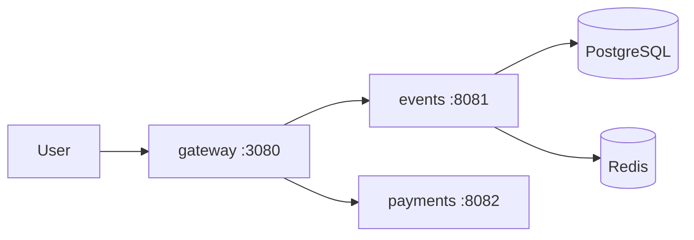

# Lab 1 - SRE Philosophy: Deploy, Break, Understand

## Task 1: Deploy and Break QuickTicket

### 1.1 Deployment proof

Command:

```text
docker compose ps
```

Output:

```text
SERVICE    STATE     PORTS
events     running   0.0.0.0:8081->8081/tcp
gateway    running   0.0.0.0:3080->8080/tcp
payments   running   0.0.0.0:8082->8082/tcp
postgres   running   0.0.0.0:5432->5432/tcp
redis      running   0.0.0.0:6379->6379/tcp
```

All five containers were running after the Compose deployment.

### 1.2 Healthy critical path

List events:

```json
[
	{"id":1,"name":"Go Conference 2026","venue":"Main Hall A","date":"2026-09-15T09:00:00+00:00","total_tickets":100,"price_cents":5000,"available":100},
	{"id":4,"name":"Python Workshop","venue":"Lab 301","date":"2026-09-22T14:00:00+00:00","total_tickets":25,"price_cents":2000,"available":25},
	{"id":2,"name":"SRE Meetup","venue":"Room 204","date":"2026-10-01T18:00:00+00:00","total_tickets":30,"price_cents":0,"available":30},
	{"id":5,"name":"Kubernetes Deep Dive","venue":"Auditorium B","date":"2026-10-10T10:00:00+00:00","total_tickets":80,"price_cents":8000,"available":80},
	{"id":3,"name":"Cloud Native Summit","venue":"Expo Center","date":"2026-11-20T10:00:00+00:00","total_tickets":500,"price_cents":15000,"available":500}
]
```

Reserve one ticket for event 1:

```json
{"reservation_id":"2940332a-8885-43e0-adf3-a796d9bdc0d6","event_id":1,"quantity":1,"total_cents":5000,"expires_in_seconds":300}
```

Pay for the reservation:

```json
{"order_id":"2940332a-8885-43e0-adf3-a796d9bdc0d6","event_id":1,"quantity":1,"total_cents":5000,"status":"confirmed"}
```

Healthy health check:

```json
{"status":"healthy","checks":{"events":"ok","payments":"ok","circuit_payments":"CLOSED"}}
```

### 1.3 Dependency map


```mermaid
graph LR
		U[User] --> GW[gateway :3080]
		GW --> EV[events :8081]
		GW --> PAY[payments :8082]
		EV --> PG[(PostgreSQL)]
		EV --> RD[(Redis)]
```

The gateway routes event reads and reservations to events. The events service reads event data from PostgreSQL and stores temporary reservations in Redis. Payment first calls payments and then calls events again to confirm the reservation, so a successful charge can still be followed by a confirmation failure if events or its database is unavailable.

### 1.4 Failure exploration

| Component killed | Events list | Reserve | Pay | Health check | User impact |
|---|---|---|---|---|---|
| payments | 200 | 200 | 504 `Payment service timeout` | 503, payments `down` | Browsing and holding tickets work; checkout cannot complete. |
| events | 502 `Events service unavailable` | 502 | 500 after payment/confirmation attempt | 503, events `down` | Event browsing, reservations, and confirmation are unavailable. |
| redis | 200 | 504 `Events service timeout` | 500 `Payment succeeded but confirmation failed` | 503, events `down` | Existing database-backed event reads work, but new holds and reservation confirmation fail. |
| postgres | 502 `Events service unavailable` | 500 `Internal Server Error` | 500 `Payment succeeded but confirmation failed` | 503, events `degraded` | Event data and reservation operations fail because events cannot use its database. |

The payments outage is isolated to checkout because listing and reservation do not call payments. Events is the widest dependency because the gateway uses it for both browsing and reservations, and payment confirmation also depends on it. Redis affects temporary reservation state, while PostgreSQL affects durable event and order data.

### 1.5 Load generator

Healthy smoke test:

```text
QuickTicket Load Generator
Target: http://localhost:3080 | RPS: 5 | Duration: 5s
---
---
Done. total=19 success=19 fail=0 error_rate=0%
```

With `payments` stopped during the 30-second run:

```text
QuickTicket Load Generator
Target: http://localhost:3080 | RPS: 5 | Duration: 30s
---
[10s] requests=41 success=41 fail=0 error_rate=0%
[10s] requests=42 success=41 fail=1 error_rate=2.3%
[20s] requests=82 success=78 fail=4 error_rate=4.8%
---
Done. total=122 success=116 fail=6 error_rate=4.9%
```

The error rate rose from 0% before the outage to 4.9% overall. The increase was limited because the generator sends mostly event-list reads, which do not depend on payments.

## Task 2: Graceful Degradation

I updated `app/gateway/main.py` so connection failures and timeouts while calling payments return a structured 503 response. The reservation remains held and the user receives an actionable retry message.

Diff:

```diff
@@ payment exception handling
+    except (httpx.ConnectError, httpx.TimeoutException):
+        return JSONResponse(
+            status_code=503,
+            content={
+                "error": "payments_unavailable",
+                "message": "Payment service is temporarily down. Your reservation is held - try again in a few minutes.",
+                "reservation_id": reservation_id,
+            },
+        )
```

With payments stopped, reserve still worked:

```json
{"reservation_id":"1e86fa47-408a-4ef0-82ec-039f55218bef","event_id":1,"quantity":1,"total_cents":5000,"expires_in_seconds":300}
```

Payment then returned:

```text
{"error":"payments_unavailable","message":"Payment service is temporarily down. Your reservation is held - try again in a few minutes.","reservation_id":"1e86fa47-408a-4ef0-82ec-039f55218bef"} [HTTP 503]
```

## Task 3: 

✅ Starred course repo and simple-container-com/api
✅ Following professor, TAs, and 3+ classmates
✅ GitHub Community section in submission

## GitHub Community


Starring repositories bookmarks useful projects, signals community interest, and increases their visibility to other developers. Following developers helps teammates discover each other's work, track useful projects, and build professional connections for future collaboration.

## Bonus Task: Resource Usage Under Load

The measurements below cover the five QuickTicket containers. 

### B.1 Idle baseline

Captured with `docker stats --no-stream` and no generated traffic:

| Container | CPU | Memory | Network I/O | PIDs |
|---|---:|---:|---:|---:|
| gateway | 0.21% | 40.3 MiB | 9.62 kB / 6.83 kB | 2 |
| events | 0.20% | 49.01 MiB | 208 kB / 275 kB | 2 |
| redis | 1.05% | 3.629 MiB | 34.7 kB / 12.4 kB | 6 |
| postgres | 0.00% | 23.76 MiB | 110 kB / 124 kB | 8 |
| payments | 0.18% | 33.41 MiB | 4.31 kB / 1.36 kB | 2 |

### B.2 Normal load

Captured while `./app/loadgen/run.sh 10 30` was running:

| Container | CPU | Memory | Network I/O | PIDs |
|---|---:|---:|---:|---:|
| gateway | 8.01% | 40.6 MiB | 157 kB / 149 kB | 2 |
| events | 4.14% | 49.04 MiB | 335 kB / 450 kB | 2 |
| redis | 1.09% | 3.391 MiB | 54.9 kB / 20.7 kB | 6 |
| postgres | 0.88% | 23.81 MiB | 182 kB / 206 kB | 8 |
| payments | 0.68% | 33.52 MiB | 8.69 kB / 4.43 kB | 2 |

The load run was mostly successful: the observed partial output reached 144 requests with 143 successes and one failure (`0.6%` error rate) before the scenario was stopped for the chaos test.

### B.3 Fault-injected payments

Payments was restarted with `PAYMENT_FAILURE_RATE=0.3 PAYMENT_LATENCY_MS=500`. The stats snapshot was captured while a second 10 RPS load run was active:

| Container | CPU | Memory | Network I/O | PIDs |
|---|---:|---:|---:|---:|
| gateway | 0.26% | 40.79 MiB | 486 kB / 472 kB | 2 |
| events | 0.20% | 49.12 MiB | 622 kB / 832 kB | 2 |
| redis | 0.97% | 3.434 MiB | 92.4 kB / 36 kB | 6 |
| postgres | 0.00% | 24.44 MiB | 344 kB / 391 kB | 8 |
| payments | 0.21% | 34.98 MiB | 8.85 kB / 4.91 kB | 2 |

The chaos load result was:

```text
Done. total=150 success=123 fail=27 error_rate=18.0%
```

Events used the most memory in all three snapshots, at approximately 49 MiB, because it includes the Python application, database connection pool, and Redis client. Under normal load, gateway used the most CPU at 8.01% because it handled every incoming request and performed the HTTP routing work; events was next at 4.14% because it performed database and reservation operations.

The fault-injection snapshot does not show a large memory increase in gateway: it rose from 40.6 MiB under normal load to 40.79 MiB. Gateway network traffic increased substantially, from 157 kB / 149 kB to 486 kB / 472 kB, while the instantaneous CPU sample was lower at 0.26%. The injected 500 ms payment delay should keep payment requests in flight longer, but only about 10% of the load-generator actions use the full purchase flow and `docker stats --no-stream` is a point-in-time sample. The clearest reliability effect was therefore the error rate, which reached 18.0%, rather than a large observed memory change.
