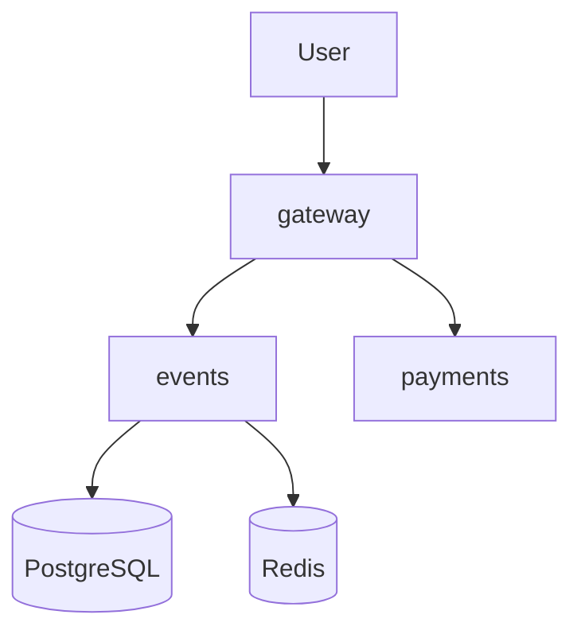

# Lab 1 — SRE Philosophy: Deploy, Break, Understand

## Task 1 — Deploy & Break QuickTicket

### 1.1 Deploy QuickTicket

I deployed the QuickTicket application using Docker Compose:

```bash
cd app
docker compose up --build -d
docker compose ps
```

Output:

```text
NAME             IMAGE                COMMAND                  SERVICE    CREATED          STATUS                    PORTS
app-events-1     app-events           "uvicorn main:app --…"   events     18 seconds ago   Up 12 seconds             0.0.0.0:8081->8081/tcp, [::]:8081->8081/tcp
app-gateway-1    app-gateway          "uvicorn main:app --…"   gateway    18 seconds ago   Up 12 seconds             0.0.0.0:3080->8080/tcp, [::]:3080->8080/tcp
app-payments-1   app-payments         "uvicorn main:app --…"   payments   19 seconds ago   Up 18 seconds             0.0.0.0:8082->8082/tcp, [::]:8082->8082/tcp
app-postgres-1   postgres:17-alpine   "docker-entrypoint.s…"   postgres   19 seconds ago   Up 18 seconds (healthy)   0.0.0.0:5432->5432/tcp, [::]:5432->5432/tcp
app-redis-1      redis:7-alpine       "docker-entrypoint.s…"   redis      19 seconds ago   Up 18 seconds (healthy)   0.0.0.0:6379->6379/tcp, [::]:6379->6379/tcp
```

All five required services were running successfully.

---

### 1.2 Verify the System Works

#### List events

Command:

```bash
curl -s http://localhost:3080/events | python3 -m json.tool
```

Output:

```json
[
    {
        "id": 1,
        "name": "Go Conference 2026",
        "venue": "Main Hall A",
        "date": "2026-09-15T09:00:00+00:00",
        "total_tickets": 100,
        "price_cents": 5000,
        "available": 100
    },
    {
        "id": 4,
        "name": "Python Workshop",
        "venue": "Lab 301",
        "date": "2026-09-22T14:00:00+00:00",
        "total_tickets": 25,
        "price_cents": 2000,
        "available": 25
    },
    {
        "id": 2,
        "name": "SRE Meetup",
        "venue": "Room 204",
        "date": "2026-10-01T18:00:00+00:00",
        "total_tickets": 30,
        "price_cents": 0,
        "available": 30
    },
    {
        "id": 5,
        "name": "Kubernetes Deep Dive",
        "venue": "Auditorium B",
        "date": "2026-10-10T10:00:00+00:00",
        "total_tickets": 80,
        "price_cents": 8000,
        "available": 80
    },
    {
        "id": 3,
        "name": "Cloud Native Summit",
        "venue": "Expo Center",
        "date": "2026-11-20T10:00:00+00:00",
        "total_tickets": 500,
        "price_cents": 15000,
        "available": 500
    }
]
```

#### Reserve a ticket

Command:

```bash
curl -s -X POST http://localhost:3080/events/1/reserve \
  -H "Content-Type: application/json" \
  -d '{"quantity": 1}' | python3 -m json.tool
```

Output:

```json
{
    "reservation_id": "00c309a6-b5fd-4771-bd25-015aca784984",
    "event_id": 1,
    "quantity": 1,
    "total_cents": 5000,
    "expires_in_seconds": 300
}
```

#### Pay for the reservation

Command:

```bash
curl -s -X POST \
  http://localhost:3080/reserve/00c309a6-b5fd-4771-bd25-015aca784984/pay \
  | python3 -m json.tool
```

Output:

```json
{
    "order_id": "00c309a6-b5fd-4771-bd25-015aca784984",
    "event_id": 1,
    "quantity": 1,
    "total_cents": 5000,
    "status": "confirmed"
}
```

The full critical path `list → reserve → pay` completed successfully.

#### Health check

Command:

```bash
curl -s http://localhost:3080/health | python3 -m json.tool
```

Output:

```json
{
    "status": "healthy",
    "checks": {
        "events": "ok",
        "payments": "ok",
        "circuit_payments": "CLOSED"
    }
}
```

---

### 1.3 Architecture and Dependency Map

QuickTicket consists of a gateway, two application services, PostgreSQL, and Redis.


```mermaid
graph TD
    U[User] --> GW[gateway]
    GW --> EV[events]
    GW --> PAY[payments]
    EV --> PG[(PostgreSQL)]
    EV --> RD[(Redis)]
```

Simple dependency map:

```text
gateway → events → postgres
gateway → events → redis
gateway → payments
```

The `gateway` is the public entry point. The `events` service manages events, reservations, and confirmed orders. PostgreSQL stores persistent data, while Redis stores temporary reservations. The `payments` service processes payment requests and is stateless.

A failure in one dependency does not necessarily break the entire system. For example, when `payments` is unavailable, users can still list events and create reservations, while payment operations fail.

---

### 1.4 Systematic Failure Exploration

#### Failure table

| Component Killed | Events List | Reserve | Pay | Health Check | User Impact |
|---|---|---|---|---|---|
| `payments` | ✅ HTTP 200 | ✅ HTTP 200 | ❌ HTTP 502 `Payment service unavailable` | ❌ HTTP 503, `payments: down` | Users can browse events and reserve tickets, but cannot pay |
| `events` | ❌ HTTP 502 | ❌ HTTP 502 | ❌ HTTP 500 after payment succeeded | ❌ HTTP 503, `events: down` | Main functionality is unavailable; payment can succeed while order confirmation fails |
| `redis` | ✅ HTTP 200 | ❌ HTTP 504 `Events service timeout` | ❌ HTTP 500 after payment succeeded | ❌ HTTP 503; direct events health: `postgres: ok`, `redis: down` | Events remain readable, but reservations cannot be created or confirmed |
| `postgres` | ❌ HTTP 502 | ❌ HTTP 500 | ❌ HTTP 500 after payment succeeded | ❌ HTTP 503; direct events health: `postgres: down`, `redis: ok` | Events cannot be read and orders cannot be stored; payment may succeed without order confirmation |

---

#### Payments failure

After stopping payments:

```bash
docker compose stop payments
```

Events still worked:

```text
=== EVENTS LIST ===
HTTP 200
```

Reservations still worked:

```text
=== RESERVE ===
HTTP 200
{
    "reservation_id": "98857197-ac1d-4aa9-ab2f-305079af58ca",
    "event_id": 1,
    "quantity": 1,
    "total_cents": 5000,
    "expires_in_seconds": 300
}
```

Payment failed:

```text
=== PAY ===
HTTP 502
{
    "detail": "Payment service unavailable"
}
```

Health reflected the problem:

```text
=== HEALTH ===
HTTP 503
{
    "status": "degraded",
    "checks": {
        "events": "ok",
        "payments": "down",
        "circuit_payments": "CLOSED"
    }
}
```

This demonstrates a limited blast radius: the payments failure affected payment operations but did not make event browsing or reservation unavailable.

---

#### Events failure

After stopping events:

```bash
docker compose stop events
```

Event listing failed:

```text
=== EVENTS LIST ===
HTTP 502
{
    "detail": "Events service unavailable"
}
```

Reservation failed:

```text
=== RESERVE ===
HTTP 502
{
    "detail": "Events service unavailable"
}
```

Paying an already-created reservation produced:

```text
=== PAY ===
HTTP 500
{
    "detail": "Payment succeeded but confirmation failed — contact support"
}
```

Health output:

```text
=== HEALTH ===
HTTP 503
{
    "status": "degraded",
    "checks": {
        "events": "down",
        "payments": "ok",
        "circuit_payments": "CLOSED"
    }
}
```

This is a partial distributed-system failure: the payment service can successfully process a payment, but the gateway cannot confirm the reservation because the events service is unavailable.

---

#### Redis failure

After stopping Redis:

```bash
docker compose stop redis
```

Event listing continued to work:

```text
=== EVENTS LIST ===
HTTP 200
```

Reservation failed:

```text
=== RESERVE ===
HTTP 504
{
    "detail": "Events service timeout"
}
```

Direct events health showed the exact failed dependency:

```text
=== EVENTS SERVICE DIRECT HEALTH ===
HTTP 503
{
    "status": "degraded",
    "checks": {
        "postgres": "ok",
        "redis": "down"
    }
}
```

Payment for a reservation created before Redis was stopped:

```text
=== PAY WITH REDIS DOWN ===
HTTP 500
{
    "detail": "Payment succeeded but confirmation failed — contact support"
}
```

Redis is required for temporary reservation state. Event listing still works because it mainly depends on PostgreSQL, but reservation and confirmation operations fail without Redis.

This also demonstrates that a container being `Up` does not necessarily mean that its application is healthy.

---

#### PostgreSQL failure

After stopping PostgreSQL:

```bash
docker compose stop postgres
```

Event listing failed:

```text
=== EVENTS LIST ===
HTTP 502
{
    "detail": "Events service unavailable"
}
```

Reservation returned an application error:

```text
=== RESERVE ===
HTTP 500
```

Gateway health:

```text
=== HEALTH ===
HTTP 503
{
    "status": "degraded",
    "checks": {
        "events": "degraded",
        "payments": "ok",
        "circuit_payments": "CLOSED"
    }
}
```

Direct events health:

```text
=== EVENTS SERVICE DIRECT HEALTH ===
HTTP 503
{
    "status": "degraded",
    "checks": {
        "postgres": "down",
        "redis": "ok"
    }
}
```

Payment for an existing reservation:

```text
=== PAY WITH POSTGRES DOWN ===
HTTP 500
{"detail":"Payment succeeded but confirmation failed — contact support"}
```

The events service logs showed the database connection failure:

```text
psycopg2.OperationalError: could not translate host name "postgres" to address: Name or service not known
```

PostgreSQL is required for persistent event and order data. Without it, event retrieval and order confirmation fail even though the `events` container itself remains running.

---

### 1.5 Load Generator

#### Healthy baseline

Command:

```bash
./loadgen/run.sh 5 30
```

Output:

```text
QuickTicket Load Generator
Target: http://localhost:3080 | RPS: 5 | Duration: 30s
---
[10s] requests=37 success=37 fail=0 error_rate=0%
[10s] requests=38 success=38 fail=0 error_rate=0%
[10s] requests=39 success=39 fail=0 error_rate=0%
[20s] requests=75 success=75 fail=0 error_rate=0%
[20s] requests=76 success=76 fail=0 error_rate=0%
[20s] requests=77 success=77 fail=0 error_rate=0%
[20s] requests=78 success=78 fail=0 error_rate=0%
---
Done. total=113 success=113 fail=0 error_rate=0%
```

#### Payments stopped during load

The load generator was started again:

```bash
./loadgen/run.sh 5 30
```

While it was running, payments was stopped from another terminal:

```bash
docker compose stop payments
```

Output:

```text
QuickTicket Load Generator
Target: http://localhost:3080 | RPS: 5 | Duration: 30s
---
[10s] requests=38 success=38 fail=0 error_rate=0%
[10s] requests=39 success=39 fail=0 error_rate=0%
[10s] requests=40 success=40 fail=0 error_rate=0%
[20s] requests=76 success=73 fail=3 error_rate=3.9%
[20s] requests=77 success=73 fail=4 error_rate=5.1%
[20s] requests=78 success=73 fail=5 error_rate=6.4%
---
Done. total=114 success=107 fail=7 error_rate=6.1%
```

The error rate increased from `0%` to `6.1%` after payments was stopped. The system did not fail completely because only requests that require the payments service were affected, while event listing and reservations continued to work.

---

## Task 2 — Graceful Degradation

The gateway originally returned a generic HTTP 502 when the payments service was unavailable.

I modified `app/gateway/main.py` to catch `httpx.ConnectError` specifically and return a clear HTTP 503 response while keeping the reservation intact.

### Code diff

```diff
diff --git a/app/gateway/main.py b/app/gateway/main.py
index c86db33..38fcfff 100644
--- a/app/gateway/main.py
+++ b/app/gateway/main.py
@@ -332,6 +332,16 @@ async def pay_reservation(reservation_id: str):
     except CircuitOpenError:
         log.error("circuit open, skipping payments call")
         raise HTTPException(503, "Payment service temporarily unavailable (circuit open)")
+    except httpx.ConnectError as e:
+        log.error(f"payments connection error: {e}")
+        return JSONResponse(
+            status_code=503,
+            content={
+                "error": "payments_unavailable",
+                "message": "Payment service is temporarily down. Your reservation is held — try again in a few minutes.",
+                "reservation_id": reservation_id,
+            },
+        )
     except httpx.TimeoutException:
         raise HTTPException(504, "Payment service timeout")
     except httpx.HTTPStatusError as e:
```

The gateway was rebuilt:

```bash
docker compose up --build -d gateway
```

### Verification with payments down

Payments was stopped:

```bash
docker compose stop payments
```

A new reservation still worked successfully:

```text
=== RESERVE WITH PAYMENTS DOWN ===
HTTP 200
{
    "reservation_id": "68cbabe8-4810-44de-9abf-4164e8e073a0",
    "event_id": 1,
    "quantity": 1,
    "total_cents": 5000,
    "expires_in_seconds": 300
}
```

Trying to pay returned the new graceful response:

```text
=== PAY WITH PAYMENTS DOWN ===
HTTP 503
{
    "error": "payments_unavailable",
    "message": "Payment service is temporarily down. Your reservation is held — try again in a few minutes.",
    "reservation_id": "68cbabe8-4810-44de-9abf-4164e8e073a0"
}
```

The payment failure is now explicit and actionable. The user is informed that the payment service is temporarily unavailable and that the reservation is still held.

---

## Task 3 — GitHub Community Engagement

Completed the following GitHub community actions:

- Starred the SRE Intro course repository.
- Starred `simple-container-com/api`.
- Followed the professor and TAs:
  - `Cre-eD`
  - `Naghme98`
  - `pierrepicaud`
- Followed at least three classmates.

Starring repositories is useful for bookmarking interesting open-source projects and also helps useful projects gain visibility in the community. Following developers helps track teammates' and other developers' work, discover new projects, and build professional connections.

---

# Bonus Task — Resource Usage Under Load

## B.1 Baseline — Idle

Command:

```bash
docker stats --no-stream \
  --format "table {{.Name}}\t{{.CPUPerc}}\t{{.MemUsage}}\t{{.NetIO}}\t{{.PIDs}}"
```

Output:

```text
NAME             CPU %     MEM USAGE / LIMIT     NET I/O           PIDS
app-gateway-1    0.19%     38.26MiB / 5.784GiB   9.12kB / 8.38kB   2
app-events-1     0.23%     43.42MiB / 5.784GiB   336kB / 438kB     2
app-postgres-1   0.00%     23.9MiB / 5.784GiB    170kB / 197kB     8
app-redis-1      0.63%     4.379MiB / 5.784GiB   56kB / 21.8kB     6
app-payments-1   0.24%     33.48MiB / 5.784GiB   1.55kB / 727B     2
```

---

## B.2 Under Load

Load generator:

```bash
./loadgen/run.sh 10 30
```

Output:

```text
QuickTicket Load Generator
Target: http://localhost:3080 | RPS: 10 | Duration: 30s
---
[10s] requests=64 success=64 fail=0 error_rate=0%
[10s] requests=65 success=65 fail=0 error_rate=0%
[10s] requests=66 success=66 fail=0 error_rate=0%
[10s] requests=67 success=67 fail=0 error_rate=0%
[10s] requests=68 success=68 fail=0 error_rate=0%
[10s] requests=69 success=68 fail=1 error_rate=1.4%
[20s] requests=128 success=124 fail=4 error_rate=3.1%
[20s] requests=129 success=124 fail=5 error_rate=3.8%
[20s] requests=130 success=124 fail=6 error_rate=4.6%
[20s] requests=131 success=125 fail=6 error_rate=4.5%
[20s] requests=132 success=126 fail=6 error_rate=4.5%
[20s] requests=133 success=127 fail=6 error_rate=4.5%
---
Done. total=191 success=181 fail=10 error_rate=5.2%
```

Resource usage during load:

```text
NAME             CPU %     MEM USAGE / LIMIT     NET I/O           PIDS
app-gateway-1    0.35%     38.93MiB / 5.784GiB   290kB / 283kB     2
app-events-1     0.26%     43.53MiB / 5.784GiB   578kB / 768kB     2
app-postgres-1   0.05%     24.04MiB / 5.784GiB   306kB / 360kB     8
app-redis-1      0.80%     4.379MiB / 5.784GiB   84.7kB / 33.9kB   6
app-payments-1   0.27%     33.64MiB / 5.784GiB   7.74kB / 5.16kB   2
```

---

## B.3 Fault Injection

Payments was restarted with injected latency and failures:

```bash
docker compose stop payments

PAYMENT_FAILURE_RATE=0.3 PAYMENT_LATENCY_MS=500 \
docker compose up -d payments
```

The configured values were verified:

```bash
docker compose exec payments env | grep PAYMENT
```

Output:

```text
PAYMENT_FAILURE_RATE=0.3
PAYMENT_LATENCY_MS=500
```

Load generator:

```bash
./loadgen/run.sh 10 30
```

Output:

```text
QuickTicket Load Generator
Target: http://localhost:3080 | RPS: 10 | Duration: 30s
---
[10s] requests=40 success=37 fail=3 error_rate=7.5%
[10s] requests=41 success=38 fail=3 error_rate=7.3%
[10s] requests=42 success=39 fail=3 error_rate=7.1%
[10s] requests=43 success=40 fail=3 error_rate=6.9%
[10s] requests=44 success=41 fail=3 error_rate=6.8%
[10s] requests=45 success=42 fail=3 error_rate=6.6%
[20s] requests=91 success=80 fail=11 error_rate=12.0%
[20s] requests=92 success=81 fail=11 error_rate=11.9%
[20s] requests=93 success=82 fail=11 error_rate=11.8%
---
Done. total=141 success=123 fail=18 error_rate=12.7%
```

Resource usage during fault injection:

```text
NAME             CPU %     MEM USAGE / LIMIT     NET I/O           PIDS
app-payments-1   0.53%     35.01MiB / 5.784GiB   5.88kB / 4.18kB   2
app-gateway-1    3.97%     39.45MiB / 5.784GiB   410kB / 406kB     2
app-events-1     2.43%     44.03MiB / 5.784GiB   699kB / 926kB     2
app-postgres-1   0.68%     24.2MiB / 5.784GiB    374kB / 432kB     8
app-redis-1      0.81%     4.125MiB / 5.784GiB   105kB / 42.3kB    6
```

After the experiment, normal payment behavior was restored:

```bash
docker compose stop payments

PAYMENT_FAILURE_RATE=0.0 PAYMENT_LATENCY_MS=0 \
docker compose up -d payments
```

Final health check:

```json
{
    "status": "healthy",
    "checks": {
        "events": "ok",
        "payments": "ok",
        "circuit_payments": "CLOSED"
    }
}
```

---

## Bonus Analysis

### Which service uses the most memory?

The `events` service used the most memory in all three scenarios:

- Idle: `43.42 MiB`
- Load: `43.53 MiB`
- Fault injection: `44.03 MiB`

Its memory usage remained relatively stable under load.

### Which service uses the most CPU under load?

During the normal-load snapshot, Redis had the highest measured CPU usage at `0.80%`. Because `docker stats --no-stream` captures only a single point in time and the absolute CPU usage was low, these small values can vary between samples.

During fault injection, the gateway became the most CPU-intensive service at `3.97%`, followed by events at `2.43%`.

### How does fault injection affect the gateway?

With `PAYMENT_LATENCY_MS=500`, payment requests remain in the gateway longer while it waits for the payments service. The gateway therefore keeps more requests in progress simultaneously and performs more work handling delayed and failed downstream operations.

Gateway CPU increased from:

```text
0.35% under normal load
```

to:

```text
3.97% during payment fault injection
```

The load generator also showed significantly worse application behavior:

```text
Normal load:
total=191 success=181 fail=10 error_rate=5.2%

Fault injection:
total=141 success=123 fail=18 error_rate=12.7%
```

The injected latency reduced throughput, while the configured 30% payment failure rate increased the observed error rate.

---

## Conclusion

This lab demonstrated that reliability must be analyzed at the system level rather than only at the container level.

The experiments showed that different dependencies have different blast radii:

- `payments` failure affects payment operations while browsing and reservation continue to work.
- `events` is a critical dependency for most user-facing operations.
- `redis` mainly affects temporary reservation state.
- `postgres` is required for persistent event and order data.

The lab also showed an important distributed-system failure mode: payment can succeed while reservation confirmation fails because another downstream service becomes unavailable.

Finally, graceful degradation improved the user experience by replacing a generic HTTP 502 error with an actionable HTTP 503 response while preserving the user's reservation.
