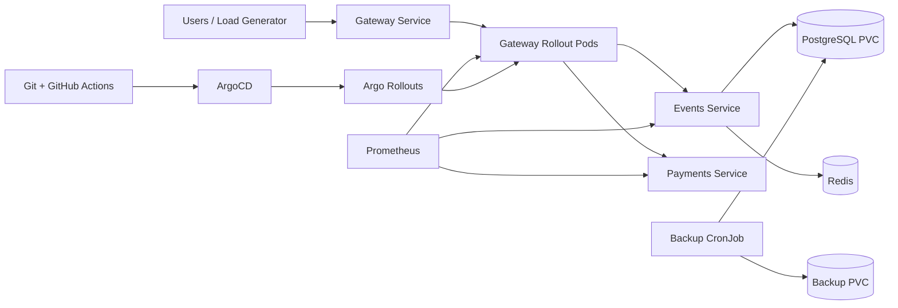

# QuickTicket Reliability Review — Lab 10

## Submission Summary

This document contains all required Lab 10 deliverables:

- Task 1: Load testing and reliability review
- Task 2: Capacity plan with measured resource usage
- Bonus Task: Two-page SRE handbook
- Commands, outputs, calculations, explanations, and evidence references

The Locust scenario used for the tests is committed separately as `locustfile.py` at the repository root.

---

# Task 1 — Load Testing & Reliability Review

## 1. Environment and Test Setup

QuickTicket was deployed on k3d with:

- 5 gateway replicas managed by Argo Rollouts
- 1 events replica
- 1 payments replica
- PostgreSQL backed by a PVC
- Redis for reservation holds
- In-cluster Prometheus in the `monitoring` namespace
- Locust running as a Kubernetes Job inside the cluster

The load generator was deliberately run inside the cluster against:

```text
http://gateway:8080
```

This ensures traffic passes through the Kubernetes Service and kube-proxy, allowing requests to be distributed across all 5 gateway pods.

Using `kubectl port-forward svc/gateway` would have pinned traffic to a single backend endpoint and produced misleading results.

### Cluster Verification

Commands:

```bash
kubectl get pods -A
kubectl get svc -A
kubectl get rollouts -A
```

Relevant observed state:

```text
gateway   DESIRED=5   CURRENT=5   UP-TO-DATE=5   AVAILABLE=5
```

Gateway pods:

```text
gateway-7dddfff9ff-5vf56   1/1 Running
gateway-7dddfff9ff-8w5d4   1/1 Running
gateway-7dddfff9ff-pwjdm   1/1 Running
gateway-7dddfff9ff-sdn8v   1/1 Running
gateway-7dddfff9ff-zpljd   1/1 Running
```

### ConfigMap Setup

The Locust scenario was copied to the repository root:

```bash
cp labs/lab10/locustfile.py locustfile.py
```

ConfigMap creation:

```bash
kubectl create configmap locustfile \
  --from-file=locustfile.py=locustfile.py \
  --dry-run=client -o yaml | kubectl apply -f -
```

Verification:

```bash
kubectl get configmap locustfile
```

Observed result:

```text
NAME         DATA   AGE
locustfile   1      ...
```

### Redis Reset Between Runs

Before every load test:

```bash
kubectl exec -i $(kubectl get pod -l app=redis -o name) -- redis-cli FLUSHDB
```

Observed result:

```text
OK
```

This ensured stale reservation holds did not pollute the next run.

---

## 2. Locust Scenario

The committed `locustfile.py` used this traffic mix:

```python
import random
from locust import HttpUser, task, between


class QuickTicketUser(HttpUser):
    wait_time = between(0.5, 2.0)

    @task(7)
    def list_events(self):
        self.client.get("/events")

    @task(2)
    def reserve(self):
        event = random.choice([3, 3, 3, 5])
        self.client.post(
            f"/events/{event}/reserve",
            json={"quantity": 1},
            headers={"Content-Type": "application/json"},
        )

    @task(1)
    def health(self):
        self.client.get("/health")
```

Traffic distribution:

- 70% `GET /events`
- 20% reservation attempts
- 10% `GET /health`

Reservations were split across events 3 and 5 to reduce the chance that a single event would dominate the results.

---

## 3. Kubernetes Job Pattern

Example `load-10.yaml`:

```yaml
apiVersion: batch/v1
kind: Job
metadata:
  name: load-10
spec:
  backoffLimit: 0
  ttlSecondsAfterFinished: 600
  template:
    spec:
      restartPolicy: Never
      containers:
        - name: locust
          image: locustio/locust:2.43.4
          command: ["locust"]
          args:
            - "-f"
            - "/mnt/locust/locustfile.py"
            - "--host=http://gateway:8080"
            - "--headless"
            - "-u"
            - "10"
            - "-r"
            - "2"
            - "-t"
            - "60s"
            - "--only-summary"
          volumeMounts:
            - name: locustfile
              mountPath: /mnt/locust
      volumes:
        - name: locustfile
          configMap:
            name: locustfile
```

Run commands:

```bash
kubectl apply --dry-run=client -f load-10.yaml
kubectl apply -f load-10.yaml
kubectl logs -f job/load-10
```

Equivalent files were used for 50 and 100 users by changing:

```text
metadata.name
-u
-r
```

---

## 4. Load Test Results

### Important Error Classification

Locust counts both 409 and 5xx as failures by default.

For this lab:

- `409 Conflict` means inventory was exhausted.
- `409` is expected product behavior.
- `409` is excluded from the availability SLO.
- Only HTTP 5xx responses are treated as true system failures.

### 10 Users

Command configuration:

```text
-u 10
-r 2
-t 60s
```

Observed summary:

```text
Aggregated:
463 requests
0 failures
7.73 req/s
p50 = 7 ms
p95 = 14 ms
p99 = 24 ms
```

Result:

| Users | Ramp | RPS | p50 | p95 | p99 | 5xx error rate | 409 |
|---:|---:|---:|---:|---:|---:|---:|---:|
| 10 | 2/s | 7.73 | 7 ms | 14 ms | 24 ms | 0.000% | 0 |

The system was fully healthy at this level.

---

### 50 Users

Command configuration:

```text
-u 50
-r 5
-t 60s
```

Observed summary:

```text
Aggregated:
2212 requests
28 Locust failures
36.94 req/s
p50 = 5 ms
p95 = 16 ms
p99 = 37 ms
```

Error report:

```text
1  POST /events/5/reserve -> 500
1  GET /events            -> 502
1  GET /health            -> 503
25 POST /events/5/reserve -> 409
```

True 5xx:

```text
3
```

Calculation:

```text
3 / 2212 × 100 = 0.136%
```

Result:

| Users | Ramp | RPS | p50 | p95 | p99 | 5xx error rate | 409 |
|---:|---:|---:|---:|---:|---:|---:|---:|
| 50 | 5/s | 36.94 | 5 ms | 16 ms | 37 ms | 0.136% | 25 |

This level remained within both thresholds:

- 5xx below 0.5%
- p99 below 500 ms

---

### 100 Users — First Run

Command configuration:

```text
-u 100
-r 10
-t 60s
```

Observed summary:

```text
Aggregated:
4352 requests
453 Locust failures
72.64 req/s
p50 = 4 ms
p95 = 230 ms
p99 = 430 ms
```

Error report:

```text
22  GET /health              -> 503
55  POST /events/3/reserve   -> 500
121 GET /events              -> 502
14  POST /events/5/reserve   -> 500
7   POST /events/3/reserve   -> 502
1   POST /events/5/reserve   -> 502
135 POST /events/5/reserve   -> 409
98  POST /events/3/reserve   -> 409
```

409 count:

```text
135 + 98 = 233
```

True 5xx count:

```text
453 - 233 = 220
```

Calculation:

```text
220 / 4352 × 100 = 5.055%
```

Result:

| Users | Ramp | RPS | p50 | p95 | p99 | 5xx error rate | 409 |
|---:|---:|---:|---:|---:|---:|---:|---:|
| 100 | 10/s | 72.64 | 4 ms | 230 ms | 430 ms | 5.055% | 233 |

This is the first observed breaking point because the 5xx rate exceeded 0.5%.

---

### 100 Users — Confirmation Run

A second 100-user test was run while collecting resource metrics.

Observed summary:

```text
Aggregated:
4405 requests
332 Locust failures
73.52 req/s
p50 = 4 ms
p95 = 98 ms
p99 = 230 ms
```

Error report:

```text
20  GET /events              -> 502
11  POST /events/3/reserve   -> 500
10  GET /health              -> 503
7   POST /events/5/reserve   -> 500
1   POST /events/5/reserve   -> 502
126 POST /events/5/reserve   -> 409
157 POST /events/3/reserve   -> 409
```

409 count:

```text
126 + 157 = 283
```

True 5xx count:

```text
332 - 283 = 49
```

Calculation:

```text
49 / 4405 × 100 = 1.112%
```

Result:

| Users | RPS | p50 | p95 | p99 | 5xx error rate | 409 |
|---:|---:|---:|---:|---:|---:|---:|
| 100 repeat | 73.52 | 4 ms | 98 ms | 230 ms | 1.112% | 283 |

Both 100-user runs exceeded the 0.5% true 5xx threshold.

---

## 5. Final Load-Test Table

| Users | Ramp | RPS | p50 | p95 | p99 | 5xx error rate | 409 inventory |
|---:|---:|---:|---:|---:|---:|---:|---:|
| 10 | 2/s | 7.73 | 7 ms | 14 ms | 24 ms | 0.000% | 0 |
| 50 | 5/s | 36.94 | 5 ms | 16 ms | 37 ms | 0.136% | 25 |
| 100 | 10/s | 72.64 | 4 ms | 230 ms | 430 ms | 5.055% | 233 |
| 100 repeat | 10/s | 73.52 | 4 ms | 98 ms | 230 ms | 1.112% | 283 |

### Breaking Point

The first observed breaking point was:

```text
100 concurrent users
approximately 73 RPS
```

The system failed the reliability criterion because:

```text
5xx error rate > 0.5%
```

The p99 threshold was not exceeded in the primary run:

```text
430 ms < 500 ms
```

However, the server-error rate alone was enough to classify this level as unacceptable.

### Practical Capacity

```text
Last healthy validated level: 36.94 RPS
First unhealthy validated level: approximately 73 RPS
```

Therefore, the current reliable operating range is below 73 RPS, with 36.94 RPS proven healthy.

---

## 6. SLO Compliance

| SLO | Target | Observed | Status |
|---|---:|---:|---|
| True 5xx error rate | Less than 0.5% | 0.136% at 50 users; 5.055% at first 100-user run | Pass at 50; fail at 100 |
| p99 latency | Less than 500 ms | 37 ms at 50 users; 430 ms at first 100-user run | Pass |
| GitOps rollback | Less than 1 hour | 2m45s | Pass |
| Canary abort | Less than 1 hour | Under 5 seconds | Pass |
| PostgreSQL pod-restart RTO | Less than 5 minutes | 136 seconds | Pass |
| PostgreSQL pod-restart RPO | Zero lost rows | 0 rows lost | Pass |
| Backup RPO | At most 5 minutes | Maximum 5 minutes | Pass |

---

## 7. DORA Metrics

### Deployment Frequency

Git branches showed nine completed lab delivery cycles:

```text
feature/lab1
feature/lab2
feature/lab3
feature/lab4
feature/lab5
feature/lab6
feature/lab7
feature/lab8
feature/lab9
```

Date range:

```text
Lab 1: 2026-06-12
Lab 9: 2026-07-10
```

Approximate period:

```text
29 days
```

Calculation:

```text
9 / 29 × 7 ≈ 2.17
```

Result:

```text
Approximately 2.2 delivery cycles per week
```

---

### Lead Time for Changes

The project used:

```text
git push
→ GitHub Actions build and image push
→ ArgoCD polling/sync
→ Kubernetes rollout
```

The lab instructions allow lead time to be approximated as:

```text
CI build time + up to 3-minute ArgoCD poll interval
```

Observed Lab 5 behavior showed that once ArgoCD saw the change, it applied it within seconds.

Result:

```text
Lead time was on the order of minutes.
Conservative estimate: CI duration + up to 3 minutes for ArgoCD polling.
```

---

### Change Failure Rate

Observed deployment exercises:

1. Successful version-label GitOps deployment.
2. Failed non-existent image deployment.
3. Successful Git revert deployment.
4. Successful manual canary.
5. Failed bad-image canary, manually aborted.
6. Successful multi-step canary.
7. Successful canary with automated AnalysisRun.
8. Failed bad-dependency canary, automatically aborted.

Failed or aborted changes:

```text
3
```

Total observed changes:

```text
8
```

Calculation:

```text
3 / 8 × 100 = 37.5%
```

Result:

```text
Change Failure Rate = 37.5%
```

This value is high because several failures were intentionally introduced as part of the lab. The more important result is that the failures were contained and recovered quickly.

---

### Recovery Time

#### GitOps Revert

Lab 5 observed:

```text
Bad deployment
→ git revert
→ push
→ ArgoCD sync
→ healthy pods
```

Measured recovery:

```text
approximately 2 minutes 45 seconds
```

#### Canary Abort

Lab 7 observed:

```bash
kubectl argo rollouts abort gateway
```

Measured recovery:

```text
under 5 seconds
```

#### Database Pod Failure

Lab 9 observed:

```text
PostgreSQL pod deleted
→ replacement scheduled
→ PVC remounted
→ API healthy
```

Measured RTO:

```text
136 seconds
```

DORA recovery result:

```text
2m45s for GitOps revert
under 5s for canary abort
```

---

## 8. Top 3 Reliability Risks

### Risk 1 — Redis Is a Single Point of Failure

Lab 8 expected partial degradation when Redis failed, but instead observed:

```text
GET /events status: 000
POST /reserve status: 000
GET /health failed
Prometheus error ratio: 1.0
```

The entire gateway became unavailable because the events service treated Redis as a mandatory startup/runtime dependency.

Why it matters:

- Redis failure causes total outage.
- Read-only event browsing cannot continue.
- The system does not degrade gracefully.

Fix:

- Make Redis connection lazy and non-fatal.
- Allow read-only endpoints to continue using PostgreSQL.
- Return a clear 503 only for reservation operations.
- Use Redis Sentinel, replication, or managed Redis in production.
- Add direct Redis dependency alerts.

---

### Risk 2 — Single Events Replica and DB/Concurrency Path

At the 100-user breaking point:

```text
events CPU: 136m
PostgreSQL CPU: 72m
gateway CPU: 32–47m per pod
```

The events service produced 500 responses and the gateway produced 502 responses.

Why it matters:

- Events is the only application tier with one replica handling most business traffic.
- Reservation traffic creates database and Redis work.
- DB pool pressure previously increased reserve p99 from around 25 ms to 71 ms.
- The service can fail before reaching CPU limit due to connection pressure or contention.

Fix:

- Scale events to at least 3 replicas.
- Increase events CPU request/limit.
- Export DB pool metrics.
- Add connection-acquisition timeouts.
- Add queue or overload protection.
- Test reservation contention separately.

---

### Risk 3 — Aggregate Monitoring Hides Path-Specific Failures

Lab 8 showed that 6-second payment latency caused only a small aggregate error rate.

Why it matters:

- Payment requests are a small percentage of total traffic.
- Global error rate may look healthy while payment users are badly affected.
- `/pay` p99 sometimes returned `NaN` because sample volume was low.

Fix:

- Add path-specific p95 and p99 alerts.
- Add direct dependency health alerts.
- Use longer histogram windows.
- Alert on DB pool usage and waiting.
- Separate 409 inventory conflicts from real errors in dashboards.

---

## 9. Toil Identification

| Manual task | Frequency | Automation | Expected saving |
|---|---|---|---|
| Recreating port-forwards for Grafana, Prometheus, ArgoCD, PostgreSQL, and APIs | More than 10 times across Labs 3–9 | `make dev-tunnels` script with PID tracking and health checks | Several minutes per session |
| Resetting test state by flushing Redis, reseeding DB, restoring env vars, and rescaling deployments | More than 3 times | `make test-reset` script | 2–5 minutes per experiment |
| Manually watching, promoting, and aborting canaries | Repeated in Lab 7 | Automated AnalysisTemplate plus notifications | Removes continuous terminal watching and reduces response time |

Additional toil already reduced:

- PostgreSQL PVC removed repeated restore/reseed after pod restart.
- Backup CronJob removed repeated manual backup creation.

---

## 10. Monitoring Gaps

### Gaps Observed During Lab 8

1. No path-specific latency alert.
2. No DB connection-pool metric.
3. No direct Redis dependency alert.
4. Aggregate error rate diluted payment failures.
5. Low-volume endpoints produced `NaN` p99.
6. No metric for connection draining during pod termination.
7. AnalysisRun history disappeared when the cluster was recreated.

### Alerts That Would Have Caught the Real Failures

```text
RedisUnavailable
PaymentP99High
EventsDBPoolSaturation
GatewayTrue5xxHigh
CanaryP99Regression
GatewayReadyReplicasLow
```

Example direct Redis alert:

```promql
up{job="redis"} == 0
```

Example path-specific p99 alert:

```promql
histogram_quantile(
  0.99,
  sum by (le) (
    rate(gateway_request_duration_seconds_bucket{path="/reserve/{id}/pay"}[5m])
  )
) > 1
```

Example 5xx alert excluding 409 naturally by selecting only 5xx:

```promql
sum(rate(gateway_requests_total{status=~"5.."}[5m]))
/
sum(rate(gateway_requests_total[5m]))
> 0.005
```

---

# Task 2 — Capacity Plan with Numbers

## 11. Resource Measurements at Breaking Point

All services were configured with:

```text
requests:
  cpu: 50m
  memory: 64Mi

limits:
  cpu: 200m
  memory: 256Mi
```

Resource measurement command:

```bash
{
  date
  echo "=== Gateway ==="
  kubectl top pods -l app=gateway
  echo "=== Events ==="
  kubectl top pods -l app=events
  echo "=== Payments ==="
  kubectl top pods -l app=payments
  echo "=== PostgreSQL ==="
  kubectl top pods -l app=postgres
  echo "=== Redis ==="
  kubectl top pods -l app=redis
}
```

Peak observed sample:

```text
Gateway:
37m 41Mi
47m 42Mi
36m 41Mi
32m 40Mi
35m 41Mi

Events:
136m 52Mi

Payments:
8m 36Mi

PostgreSQL:
72m 27Mi

Redis:
5m 9Mi
```

### Analysis

| Service | Replicas | CPU | Memory | Assessment |
|---|---:|---:|---:|---|
| Gateway | 5 | 32–47m per pod | 40–42Mi | Balanced and below limit |
| Events | 1 | 136m | 52Mi | Highest application CPU; first scale target |
| Payments | 1 | 8m | 36Mi | Mostly idle in this scenario |
| PostgreSQL | 1 | 72m | 27Mi | Moderate CPU; pool pressure still possible |
| Redis | 1 | 5m | 9Mi | CPU healthy; availability is the real risk |

The events service is the most CPU-constrained application service.

However:

```text
136m < 200m CPU limit
```

Therefore, CPU throttling alone does not explain all failures. Other likely contributors are:

- DB connection acquisition
- reservation contention
- request concurrency
- downstream timeouts
- application error handling

---

## 12. 2× Traffic Target

First unacceptable throughput:

```text
approximately 73 RPS
```

2× target:

```text
2 × 73 ≈ 146 RPS
```

---

## 13. Proposed Replica and Resource Plan

| Service | Current replicas | Proposed replicas | Proposed request | Proposed limit |
|---|---:|---:|---:|---:|
| Gateway | 5 | 8 | 75m CPU / 64Mi | 250m CPU / 256Mi |
| Events | 1 | 3 | 150m CPU / 96Mi | 400m CPU / 384Mi |
| Payments | 1 | 2 | 50m CPU / 64Mi | 200m CPU / 256Mi |
| Redis | 1 | 1 for lab; 3 in production | 50m CPU / 64Mi | 200m CPU / 256Mi |
| PostgreSQL | 1 | 1 primary; optional standby | 150m CPU / 128Mi | 500m CPU / 512Mi |

### Why These Numbers

Gateway:

- Already distributed across 5 pods.
- CPU remained low.
- 8 replicas provide more concurrency and rollout headroom.

Events:

- Highest measured CPU.
- Handles reads, reservation logic, Redis, and DB calls.
- Needs horizontal scaling first.

Payments:

- Mostly idle in this specific Locust scenario.
- Two replicas are still recommended for availability and future full-checkout tests.

Redis:

- CPU is not a capacity problem.
- Availability is the problem.
- Production should use replication or managed Redis.

PostgreSQL:

- Keep a controlled single-writer primary.
- Add PgBouncer.
- Add explicit connection budgets.
- Add standby if higher availability is required.

---

## 14. Database Connection Plan

With three events replicas and approximately 10 connections each:

```text
3 × 10 = approximately 30 application connections
```

Required controls:

- Explicit PostgreSQL `max_connections`
- PgBouncer in transaction mode
- Bounded pool per events replica
- Metrics for used, idle, waiting, and timed-out connections
- Request timeout before indefinite queueing
- Alert when pool usage exceeds 80%

---

## 15. Redis Plan

Lab environment:

```text
single Redis pod is enough for CPU capacity
```

Production reliability:

```text
single Redis pod is not acceptable
```

Recommended:

- 3-node Redis Sentinel or replicated deployment
- Or a managed Redis service
- Direct availability alert
- Graceful read-only operation when Redis is unavailable

---

## 16. Cost Estimate

Lab assumption:

```text
$5 per pod per month
```

Proposed lab topology:

```text
8 gateway
3 events
2 payments
1 Redis
1 PostgreSQL
```

Total:

```text
15 pods
```

Cost:

```text
15 × $5 = $75/month
```

Production-style topology with:

```text
2 additional Redis nodes
1 PostgreSQL standby
```

Total:

```text
18 pods
```

Cost:

```text
18 × $5 = $90/month
```

This excludes:

- storage
- backup storage
- load balancer
- network egress
- managed-service premiums

---

## 17. Validation Plan

After scaling:

```bash
kubectl scale rollout gateway --replicas=8
kubectl scale deployment events --replicas=3
kubectl scale deployment payments --replicas=2
```

Then repeat:

```text
100 users
150 users
200 users
```

Acceptance criteria:

```text
5xx < 0.5%
p99 < 500 ms
DB pool wait near zero
no canary regression
```

A second Locust scenario should include `/pay`, because the current capacity test does not meaningfully stress the payments service.

---

# Bonus Task — QuickTicket SRE Handbook

## 18. Architecture



Architecture summary:

- Gateway is managed by Argo Rollouts.
- Events uses PostgreSQL and Redis.
- Payments is isolated behind the gateway.
- PostgreSQL uses persistent storage.
- Backups run every 5 minutes.
- Prometheus collects golden signals.
- ArgoCD manages desired state from Git.
- Argo Rollouts performs canary delivery and analysis.

---

## 19. How to Deploy

Normal flow:

```text
feature branch
→ commit
→ push
→ pull request
→ merge
→ CI build
→ image push
→ manifest update
→ ArgoCD sync
→ Argo Rollout canary
→ AnalysisRun
→ promote or abort
```

Useful commands:

```bash
kubectl get pods,svc
kubectl get rollout gateway
kubectl argo rollouts get rollout gateway --watch
kubectl get analysisrun
```

Rollback during canary:

```bash
kubectl argo rollouts abort gateway
```

Rollback through Git:

```bash
git revert <bad-commit>
git push
```

Manual `kubectl edit` should not be used for permanent changes because ArgoCD will restore the Git-defined state.

---

## 20. Monitoring Handbook

Check:

- RPS
- true 5xx ratio
- p50/p95/p99
- available replicas
- DB pool usage
- Redis health
- PostgreSQL connection count
- canary metrics by ReplicaSet hash

Core queries:

```promql
sum(rate(gateway_requests_total{status=~"5.."}[5m]))
/
sum(rate(gateway_requests_total[5m]))
```

```promql
histogram_quantile(
  0.99,
  sum by (le, path) (
    rate(gateway_request_duration_seconds_bucket[5m])
  )
)
```

Recommended alerts:

- 5xx > 0.5%
- SLO burn rate > 6
- payment p99 > 1 second
- DB pool > 80%
- Redis unavailable
- ready replicas below desired
- canary p99 > 500 ms
- canary 5xx > threshold

---

## 21. Incident Response Handbook

First actions:

```text
1. Acknowledge the alert.
2. Record start time.
3. Check gateway health.
4. Check ready replicas.
5. Separate 409 from 5xx.
6. Identify failing dependency.
7. Abort unsafe canary.
8. Restore known-good state.
9. Confirm metrics recover.
```

Commands:

```bash
kubectl get pods -o wide
kubectl get rollout gateway
kubectl logs -l app=gateway --tail=100
kubectl logs -l app=events --tail=100
kubectl logs -l app=payments --tail=100
kubectl top pods
```

Common failures:

| Symptom | Likely cause | Action |
|---|---|---|
| Canary 5xx spike | Bad gateway change | Abort rollout |
| `/pay` slow or 504 | Payment latency | Restore payments configuration |
| Reads and reservations fail | Redis or events outage | Restore Redis/events |
| Reserve latency grows | DB pool pressure | Restore pool, scale events |
| Pod never ready | Bad image or probe | Revert or abort |
| Errors during termination | Drain race | Add preStop delay |

Escalate if:

- no mitigation within 10 minutes
- database integrity is uncertain
- backup restore is required
- all gateway/events pods are unavailable
- error rate remains above 0.5%

---

## 22. Backup and Restore Handbook

Current protection:

```text
PostgreSQL PVC
5-minute backup CronJob
5 newest backups retained
136-second observed RTO
0-row pod-restart RPO
maximum 5-minute backup RPO
```

Verify backups:

```bash
kubectl get cronjob postgres-backup
kubectl get jobs --sort-by=.metadata.creationTimestamp
kubectl exec deployment/backup-inspector -- ls -lh /backups
```

Create manual backup:

```bash
POD=$(kubectl get pod -l app=postgres -o jsonpath='{.items[0].metadata.name}')
kubectl exec "$POD" -- pg_dump -U quickticket -Fc quickticket > /tmp/quickticket.dump
```

Restore:

```bash
kubectl exec "$POD" -- pg_restore \
  -U quickticket \
  -d quickticket \
  --clean \
  --if-exists \
  /tmp/backup.dump
```

Validate:

```bash
kubectl exec "$POD" -- psql -U quickticket -d quickticket \
  -c 'SELECT COUNT(*) FROM events;'

kubectl exec "$POD" -- psql -U quickticket -d quickticket \
  -c 'SELECT COUNT(*) FROM orders;'
```

The restore is complete only when:

```text
row counts are correct
API returns 200
health checks pass
Prometheus returns to baseline
```

---

# 23. Evidence Files

```text
submissions/evidence/load-10.txt
submissions/evidence/load-50.txt
submissions/evidence/load-100.txt
submissions/evidence/load-100-repeat.txt
submissions/evidence/breaking-point-resources-sample1.txt
submissions/evidence/breaking-point-resources-sample2.txt
```

---

# 24. Final Assessment

QuickTicket is reliable at 50 concurrent users and approximately 37 RPS.

The first reproducible breaking-point level is:

```text
100 concurrent users
approximately 73 RPS
```

The main priorities are:

1. Scale and instrument the events/database path.
2. Remove Redis as a system-wide single point of failure.
3. Add path-specific latency and dependency alerts.
4. Preserve automated canary analysis.
5. Re-test the proposed 2× topology at approximately 146 RPS.

---

# 25. Submission Checklist

```text
[x] locustfile.py committed at repo root
[x] 10-user test
[x] 50-user test
[x] 100-user test
[x] breaking point identified
[x] 409 separated from 5xx
[x] DORA metrics calculated
[x] 3 toil items
[x] top 3 reliability risks
[x] monitoring gaps
[x] capacity plan
[x] per-pod CPU and memory
[x] replica and resource plan
[x] cost estimate
[x] Bonus Option B handbook included
[x] commands, outputs, calculations, and explanations included
```
