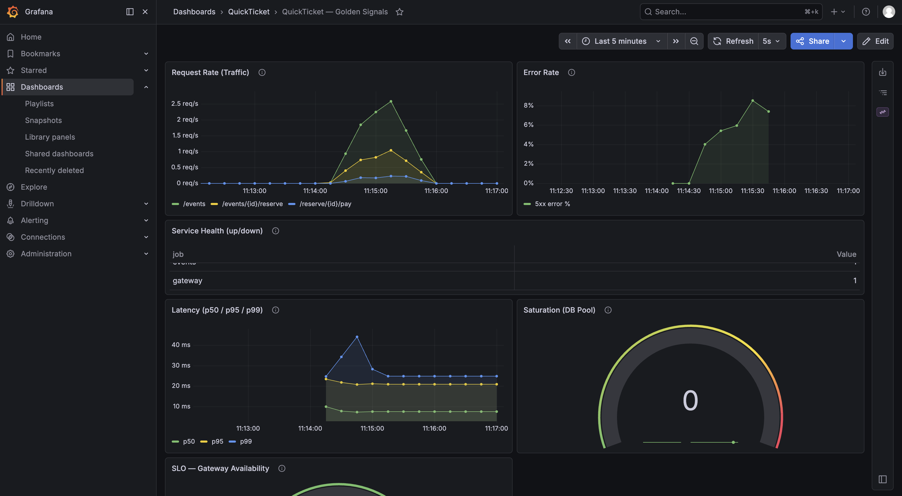
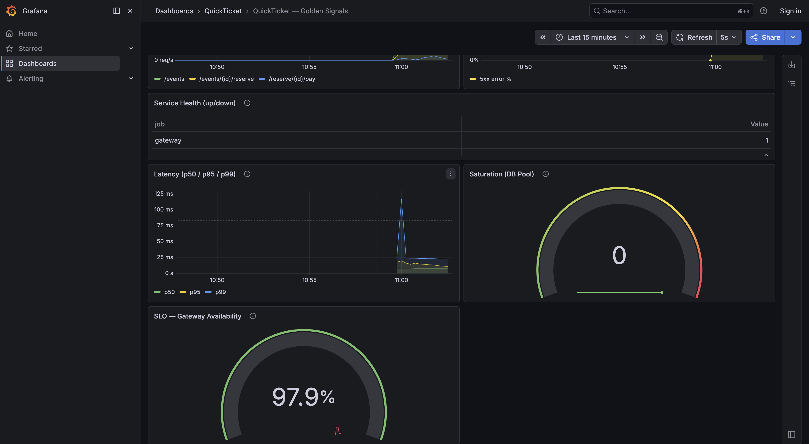
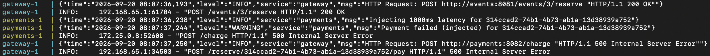

# Lab 3 — Monitoring, Observability & SLOs

## Task 1 — Configure Monitoring & Build Dashboard

**Compose ps (7 services):**
```
app-events-1, app-gateway-1, app-grafana-1, app-payments-1,
app-postgres-1, app-prometheus-1, app-redis-1 — all Up
```

**Prometheus targets:**
```
events       up       http://events:8081/metrics
gateway      up       http://gateway:8080/metrics
payments     up       http://payments:8082/metrics
```

**Load + payments failure (60s run, payments stopped at ~15s):**
```
Done. total=223 success=186 fail=37 error_rate=16.5%
```



**Dashboard observations:**
- Before the failure (up to ~11:14): Request Rate ~2.5 req/s, Error Rate 0%.
- After payments was stopped (~11:15–11:16): Error Rate rose to ~8–9%, Latency p99 showed a brief spike to ~40ms before settling back to a plateau of ~30ms.
- Saturation (DB Pool) stayed at 0 throughout — the payments outage doesn't affect the events service's DB connection pool.

**Which golden signal reacted first, and how quickly:**
Error Rate reacted fastest — a visible increase started almost immediately after payments was stopped (delay of ~15–30 seconds, consistent with the 15s scrape_interval). Latency only showed a brief, temporary spike: the gateway doesn't wait for a timeout, it returns an error right away.

Separate observation: the actual fail_rate reported by the load generator reached 16–25%, while the 5xx error rate shown on the dashboard peaked at only ~8–9%. This means the gateway doesn't always respond with a 5xx status when payments is unavailable — some failed business operations aren't reflected in the HTTP-based error rate metric.

## Task 2 — SLOs & Recording Rules

**Error budget calculation** (99.5% availability SLO, ~1000 req/day → 7000 req/week):
- Allows **35 failed requests per week**.
- Latency SLO 95% <500ms → allows **350 slow requests per week**.

**Recording rules — status after loading:**
```
gateway:sli_availability:ratio_rate5m         = ok
gateway:sli_latency_500ms:ratio_rate5m        = ok
gateway:error_budget_burn_rate:ratio_rate5m   = ok
```



**SLO gauge observation during failure:**
After payments was kept down for a sustained period (~3 minutes under load), the "SLO — Gateway Availability" panel dropped from 100% to **98.3%**, falling below the 99.5% target threshold. After payments recovered, the value started returning to normal. The drop didn't appear immediately — the recording rule is calculated over a 5-minute sliding window with a 30s evaluation interval, so short-lived failures get smoothed out by the window average.

## Bonus Task — Correlate Failure Across Metrics & Logs

**Timeline (from `docker compose logs gateway payments`):**

| Time | Event |
|------|-------|
| ~10:11:09 | Injection: payments container recreated with `PAYMENT_FAILURE_RATE=0.5`, `PAYMENT_LATENCY_MS=1000` |
| 10:11:09.372 | First error in gateway log: `"payments unreachable for reservation=469319af-..."` → 503 Service Unavailable (unavailability window during container recreation) |
| ~10:11:33 | payments fully restarted (`Started server process`) |
| 10:12:20.323 | payments logged: `"Injecting 1000ms latency for 2c3334b1-..."` |
| 10:12:21.324 | payments completed processing: `"Payment success: PAY-B8809BA3"` — the gap between log entries was exactly 1 second, confirming `PAYMENT_LATENCY_MS=1000` took effect |
| Throughout | Error rate from the load generator held at 22–24% (some of these failures were unrelated 409 Conflict responses from concurrent reservation attempts) |
| After the test | payments was reverted to its default environment variables (`up -d payments` with no overrides) |



**Root cause:**
Recreating the payments container caused a brief window of full unavailability (503 from the gateway), which was the first visible error. After restarting with the new environment variables, payments began explicitly logging a 1000ms latency injection before each successful payment — the exact timestamp match (10:12:20 → 10:12:21) confirms the artificial latency worked as intended and matched the configured value precisely.
