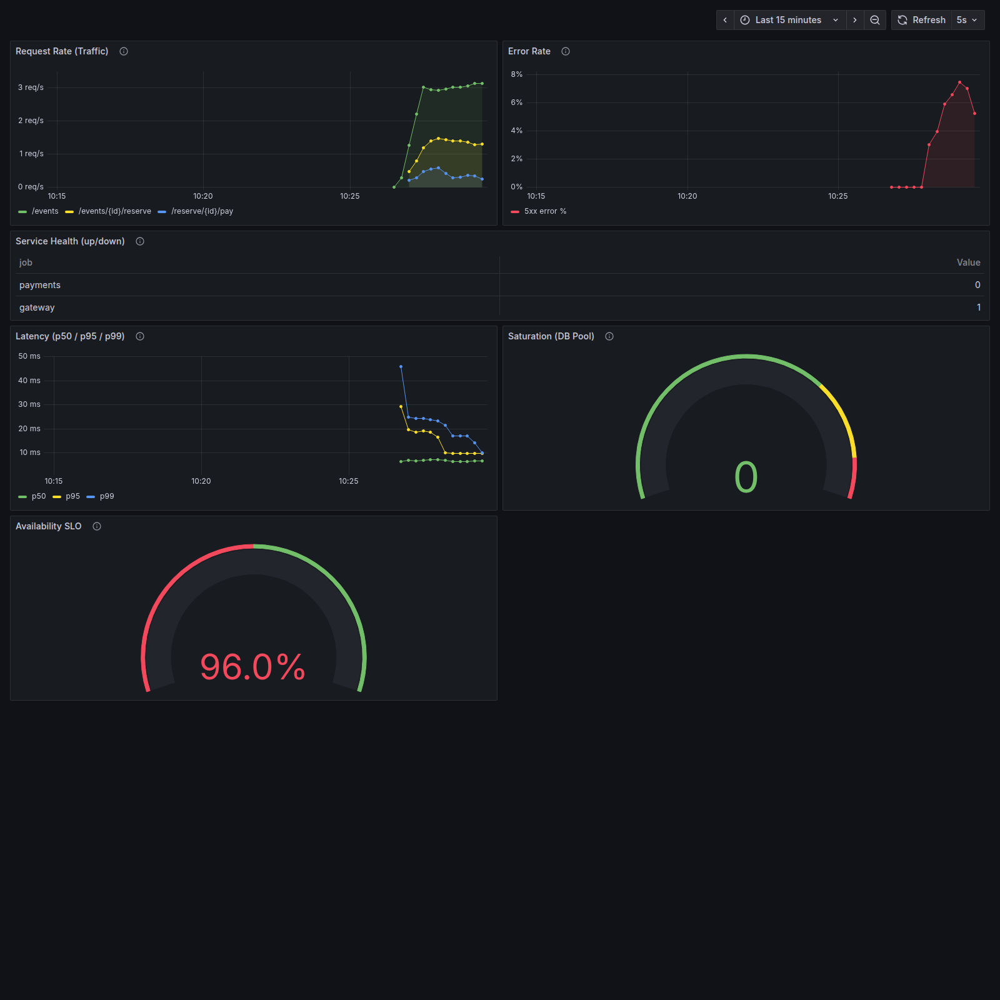
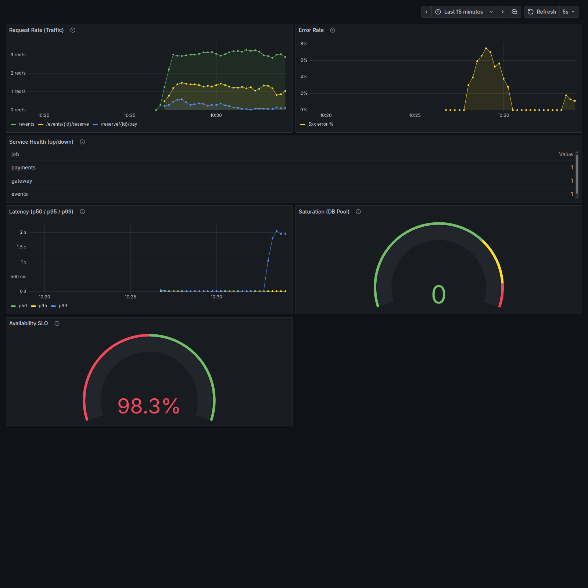
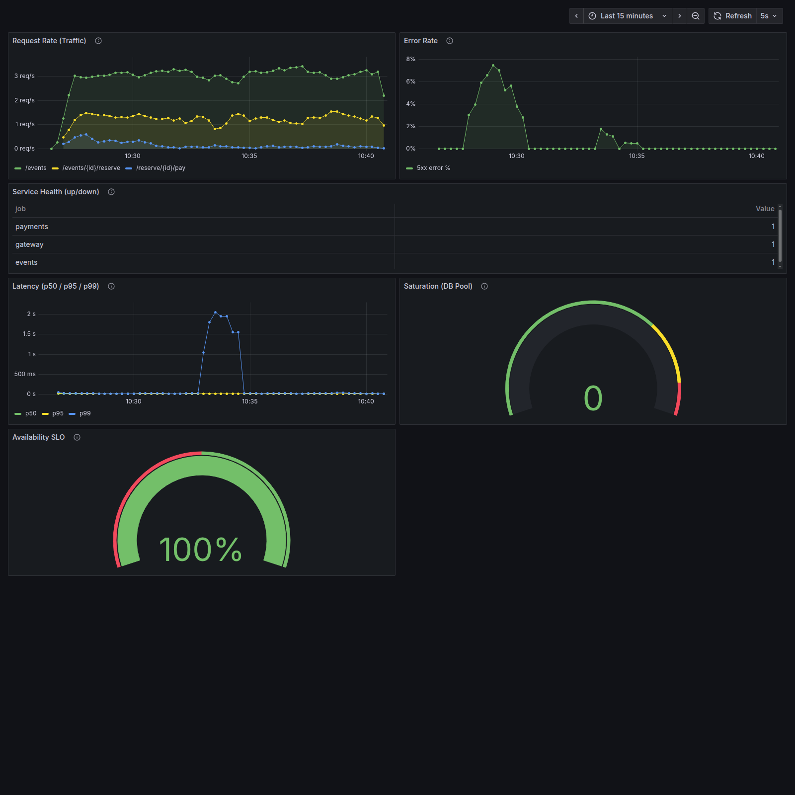

# Lab 3 — Monitoring, Observability & SLOs

## Стенд

Проверка выполнена 21 сентября 2026 года. Время в отчете — UTC (Москва: UTC+3).

Настроены Prometheus, шесть панелей Grafana и три recording rules. Проверены остановка payments и сбой с вероятностью ошибки 50% и задержкой 1000 мс.

Docker Hub при запуске вернул `network is unreachable`. Поэтому для проверки использованы локальные образы Prometheus 2.54.0 и Grafana 12.2.0. Версии из задания в основном compose-файле сохранены; локальные версии указаны в `lab3-results/compose.local.yaml`.

Запуск из корня репозитория:

```bash
docker compose -f app/docker-compose.yaml \
  -f docker-compose.monitoring.yaml \
  -f lab3-results/compose.local.yaml up -d --no-build --pull never
```

Образы приложения уже были собраны в предыдущей лабораторной. Для новой машины сначала нужно собрать приложение. Обычный запуск с версиями из задания:

```bash
cd app
docker compose -f docker-compose.yaml -f ../docker-compose.monitoring.yaml up -d --build
```

## Task 1. Monitoring и Golden Signals

Prometheus опрашивает `gateway:8080`, `events:8081` и `payments:8082` раз в 15 секунд. Конфигурация: [prometheus.yml](../monitoring/prometheus/prometheus.yml).

### Запущенные сервисы

```text
NAME               IMAGE                     COMMAND                  SERVICE      CREATED          STATUS                    PORTS
app-events-1       app-events                "uvicorn main:app --…"   events       7 days ago       Up 14 minutes             0.0.0.0:8081->8081/tcp, [::]:8081->8081/tcp
app-gateway-1      app-gateway               "uvicorn main:app --…"   gateway      7 days ago       Up 14 minutes             0.0.0.0:3080->8080/tcp, [::]:3080->8080/tcp
app-grafana-1      grafana/grafana:12.2.0    "/run.sh"                grafana      14 minutes ago   Up 14 minutes             0.0.0.0:3000->3000/tcp, [::]:3000->3000/tcp
app-payments-1     app-payments              "uvicorn main:app --…"   payments     5 minutes ago    Up 5 minutes              0.0.0.0:8082->8082/tcp, [::]:8082->8082/tcp
app-postgres-1     postgres:17-alpine        "docker-entrypoint.s…"   postgres     7 days ago       Up 14 minutes (healthy)   0.0.0.0:5432->5432/tcp, [::]:5432->5432/tcp
app-prometheus-1   prom/prometheus:v2.54.0   "/bin/prometheus --c…"   prometheus   14 minutes ago   Up 14 minutes             0.0.0.0:9090->9090/tcp, [::]:9090->9090/tcp
app-redis-1        redis:7-alpine            "docker-entrypoint.s…"   redis        7 days ago       Up 14 minutes (healthy)   0.0.0.0:6379->6379/tcp, [::]:6379->6379/tcp
```

### Targets

```text
events       up       http://events:8081/metrics
gateway      up       http://gateway:8080/metrics
payments     up       http://payments:8082/metrics
```

### Метрики

Список метрик приложения из `/api/v1/label/__name__/values` после нагрузки:

```text
events_db_pool_size
events_orders_created
events_orders_total
events_request_duration_seconds_bucket
events_request_duration_seconds_count
events_request_duration_seconds_created
events_request_duration_seconds_sum
events_requests_created
events_requests_total
events_reservations_active
gateway_request_duration_seconds_bucket
gateway_request_duration_seconds_count
gateway_request_duration_seconds_created
gateway_request_duration_seconds_sum
gateway_requests_created
gateway_requests_total
payments_charges_created
payments_charges_total
payments_request_duration_seconds_bucket
payments_request_duration_seconds_count
payments_request_duration_seconds_created
payments_request_duration_seconds_sum
payments_requests_created
payments_requests_total
```

### Нагрузка и запросы

Использован стандартный `app/loadgen/run.sh` с аргументом 5 req/s. Генератор работает последовательно и делает паузу после запроса, поэтому фактическая скорость ниже заданной. Один сценарий покупки включает два HTTP-запроса. При длительной нагрузке появились также 409 из-за нехватки доступных для бронирования билетов. Генератор считает их ошибками, но Error Rate и availability в этой работе учитывают только 5xx; поэтому проценты в выводе генератора и на дашборде различаются.

```promql
sum(rate(gateway_requests_total[5m]))
```

В конце проверки, после прогрева пятиминутного окна:

```text
Request rate: 4.51 req/s
```

Панель Latency: Time series, единица — секунды.

```promql
histogram_quantile(0.50, sum(rate(gateway_request_duration_seconds_bucket[1m])) by (le))
histogram_quantile(0.95, sum(rate(gateway_request_duration_seconds_bucket[1m])) by (le))
histogram_quantile(0.99, sum(rate(gateway_request_duration_seconds_bucket[1m])) by (le))
```

Панель Saturation: Gauge, запрос `events_db_pool_size`, минимум 0, максимум 10. Цвет по умолчанию зеленый, с 7 — желтый, с 9 — красный. Метрика показывает занятые соединения в момент scrape, поэтому при коротких запросах может быть 0.

Панель Error Rate использует `or vector(0)`, чтобы до первой ошибки показывать 0%, а не No data. Конфигурация всех панелей: [golden-signals.json](../monitoring/grafana/dashboards/golden-signals.json).

### Остановка payments

Нагрузка шла 200 секунд. Через 60 секунд payments был остановлен на 120 секунд, затем запущен снова. Более длинная нагрузка позволяет видеть весь сбой.

| Состояние | Error Rate | p50 | p95 | p99 | DB pool |
|---|---:|---:|---:|---:|---:|
| Перед остановкой | 0% | 6.97 мс | 19.13 мс | 24.18 мс | 0 |
| В конце остановки | 5.21% | 6.68 мс | 9.73 мс | 10.00 мс | 0 |

Максимальная доля ошибок во время остановки — 7.44%. Чтение событий продолжало работать. Задержка не выросла: gateway быстро получал ошибку соединения с payments и возвращал 502. Перегрузки пула БД не было.

Payments остановлен в **07:27:33 UTC**. Среди четырех Golden Signals первым сбой показал **Error Rate**: в 07:27:51 (примерно через **18 секунд**) значение стало 2.12%. Отдельная панель Service Health показала `up{job="payments"}=0` уже в 07:27:35, через 2 секунды. Service Health не относится к четырем Golden Signals.

Время зафиксировано опросом тех же PromQL-запросов каждые 2 секунды. Grafana обновляется каждые 5 секунд, поэтому визуальное появление может немного отставать. На задержку влияют scrape раз в 15 секунд и необходимость двух точек для `rate()` новой серии ошибок.

Payments запущен снова в **07:29:34 UTC**.



На скриншотах Grafana время московское (UTC+3).

## Task 2. SLI, SLO и error budget

**Availability SLI:** доля ответов gateway без 5xx. Цель — не менее 99.5% за 7 дней. Ответы 4xx считаются доступными по определению задания.

**Latency SLI:** доля запросов gateway с длительностью до 500 мс (бакет `le="0.5"`, то есть ≤ 500 мс). Цель — не менее 95%; для долгосрочной оценки используется то же окно 7 дней.

При 1000 запросов в день за неделю будет `1000 × 7 = 7000` запросов. Бюджет ошибок availability: `7000 × (1 − 0.995) = 35` ответов 5xx в неделю. Для latency допустимо до `7000 × 0.05 = 350` запросов дольше 500 мс.

Три правила в [rules.yml](../monitoring/prometheus/rules.yml) вычисляются каждые 30 секунд:

```promql
# gateway:sli_availability:ratio_rate5m
sum(rate(gateway_requests_total{status!~"5.."}[5m]))
/ sum(rate(gateway_requests_total[5m]))

# gateway:sli_latency_500ms:ratio_rate5m
sum(rate(gateway_request_duration_seconds_bucket{le="0.5"}[5m]))
/ sum(rate(gateway_request_duration_seconds_count[5m]))

# gateway:error_budget_burn_rate:ratio_rate5m
(1 - gateway:sli_availability:ratio_rate5m) / (1 - 0.995)
```

Burn rate > 1 означает, что при сохранении такой доли ошибок недельный бюджет будет потрачен раньше срока. Эти правила показывают последние 5 минут, а не итог за 7 дней. Короткий эксперимент демонстрирует реакцию SLI на сбой; данных для проверки недельного SLO пока нет.

Правила подключены через `rule_files`, файл смонтирован в контейнер. Проверка `promtool check config /etc/prometheus/prometheus.yml` успешна: конфигурация валидна, найдены три правила.

```text
gateway:sli_availability:ratio_rate5m         = ok
gateway:sli_latency_500ms:ratio_rate5m        = ok
gateway:error_budget_burn_rate:ratio_rate5m   = ok
```

Панель Availability SLO: Gauge, запрос `gateway:sli_availability:ratio_rate5m * 100`, диапазон 99–100%, порог 99.5%. Используется текущее значение. При падении ниже 99% дуга находится на минимуме, но числовое значение показывает реальный процент.

До сбоя availability была 100%, burn rate — 0. В 07:28:07 UTC Gauge впервые опустился ниже цели: 97.59%, через 34 секунды после остановки. За время остановки минимальная availability составила **95.97%**, максимальный burn rate — **8.06**. Latency SLI оставался 100%: быстрые ошибки тоже укладываются в 500 мс. Поэтому проверять только задержку недостаточно.

После запуска payments ошибки перестают поступать, но Gauge возвращается к норме постепенно: в расчете остаются предыдущие пять минут.

## Bonus. Корреляция метрик и логов

Нагрузка: `bash app/loadgen/run.sh 5 180`. Через 30 секунд payments пересоздан с настройками сбоя:

```bash
PAYMENT_FAILURE_RATE=0.5 PAYMENT_LATENCY_MS=1000 \
  docker compose -f app/docker-compose.yaml \
  -f docker-compose.monitoring.yaml -f lab3-results/compose.local.yaml \
  up -d --no-deps --no-build --pull never --force-recreate payments
```

Наблюдение после пересоздания длилось 120 секунд. Именно пересоздание, а не `restart`, применяет новые переменные окружения.

| Время UTC | Событие |
|---|---|
| 07:32:23 | Пересоздание payments с failure rate 0.5 и latency 1000 мс |
| 07:32:45.216 | Первая запись `Injecting 1000ms latency` |
| 07:32:52 | p99 в Prometheus вырос до 1.045 с |
| 07:33:02.685 | Первая искусственная ошибка в payments |
| 07:33:02.689 | Gateway вернул 500 для той же брони |
| 07:33:22 | Error Rate в Prometheus стал 1.34% |
| 07:34:25 | Payments пересоздан с нормальными настройками |
| 07:34:29.345 | Первый успешный платеж после восстановления |
| 07:35:07 | Error Rate вернулся к 0% |

Фрагмент `docker compose logs --timestamps`:

```text
payments 2026-09-21T07:33:01.685004258Z Injecting 1000ms latency for 1d3578f9-ed0b-4380-a084-5e28546b1e7f
payments 2026-09-21T07:33:02.685446647Z Payment failed (injected) for 1d3578f9-ed0b-4380-a084-5e28546b1e7f
payments 2026-09-21T07:33:02.686361322Z POST /charge HTTP/1.1 500 Internal Server Error
gateway  2026-09-21T07:33:02.687519041Z HTTP Request: POST http://payments:8082/charge HTTP/1.1 500 Internal Server Error
gateway  2026-09-21T07:33:02.689340366Z POST /reserve/1d3578f9-ed0b-4380-a084-5e28546b1e7f/pay HTTP/1.1 500 Internal Server Error
```

Для читаемости убраны служебные поля; [исходный фрагмент](../lab3-results/failure-excerpt.txt) сохранен отдельно.

Причина сбоя — настройки payments. Сервис сначала задержал обработку на секунду, затем вернул 500. Gateway передал эту ошибку клиенту. Одинаковый идентификатор брони связывает оба лога. Позже ошибка попала в scrape и стала видна в Error Rate. Перед первой ошибкой уже были успешные, но медленные платежи, поэтому p99 вырос раньше Error Rate.

В этом опыте Error Rate достиг 2.01%, p99 — 2.053 с, а p95 оставался ниже 10 мс: платежей было мало относительно всех запросов. `histogram_quantile` оценивает перцентиль по бакетам; для задержек чуть выше 1 с широкий бакет до 2.5 с дает завышенную оценку p99. Это не означает, что настроенная задержка стала 2 секунды.

Все targets оставались `up`: `/metrics` был доступен даже при ошибках бизнес-запросов. Минимальный latency SLI за этот этап — 99.28%, выше цели 95%. Общий SLI может скрывать проблему редкого платежного маршрута. Availability в начале бонуса еще учитывала ошибки предыдущего опыта, поэтому ее изменение нельзя целиком приписывать бонусному сбою.



После эксперимента payments пересоздан с `PAYMENT_FAILURE_RATE=0` и `PAYMENT_LATENCY_MS=0`. Затем нагрузка продолжалась еще 330 секунд для выхода ошибок из пятиминутного окна.

Итоговая проверка: все 7 контейнеров работают, все 3 targets — `up`, правила — `ok`. Payments сообщает `failure_rate: 0.0`, `latency_ms: 0`.

| Метрика | После восстановления |
|---|---:|
| Error Rate | 0.00% |
| Availability SLI | 100.00% |
| Latency SLI ≤ 500 мс | 100.00% |
| Burn rate | 0.00 |
| p99 | 17.35 мс |



[Замеры раз в 2 секунды](../lab3-results/measurements.csv), [время действий](../lab3-results/timeline.jsonl) и [вывод проверки конфигурации](../lab3-results/promtool.txt) сохранены вместе с отчетом. `NaN` в начале замеров означает, что еще не было двух scrape для расчета скорости.

## Результат

- [x] Task 1: Prometheus, три targets, Golden Signals, проверка остановки payments.
- [x] Task 2: SLI/SLO, error budget, три recording rules и SLO Gauge.
- [x] Bonus: управляемые ошибки и задержка, сопоставление времени в метриках и логах.
