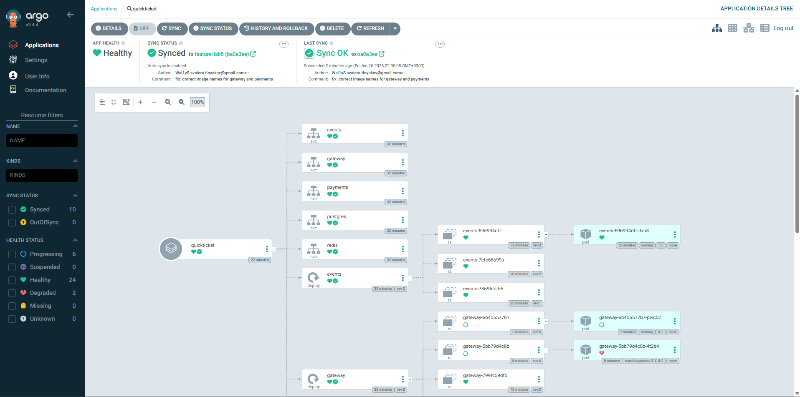

# Lab 5 — CI/CD & GitOps
**Student:** Valerii Tiniakov
**Group:** B24-SD-03

## Task 1 — CI Pipeline + ArgoCD Setup (6 pts)

### 5.1 & 5.2: CI Pipeline and Pushed Images
* **Link to GitHub Actions run:** `https://github.com/Wal1yS/SRE-Intro/actions/runs/28256609077`
* **Output of `gh api user/packages?package_type=container --jq '.[].name'`:**
```text
quickticket-payments
quickticket-gateway
quickticket-events
```

### 5.5: ArgoCD Application
* **Output of `argocd app get quickticket`:**
```text
NAME          SYNC STATUS   HEALTH
quickticket   Synced        Healthy
```

* **Output of `kubectl get pods` (All services running):**
```text
valer@VTLaptop MINGW64 ~/OneDrive/Рабочий стол/SRE-Intro (feature/lab5)
$ kubectl get pods
NAME                       READY   STATUS    RESTARTS   AGE
events-696994dff-rlxh8     1/1     Running   0          10m
gateway-6b455577b7-pwc52   1/1     Running   0          31s
payments-cdcff55d6-d5dn8   1/1     Running   0          31s
postgres-7c7ffc4b-v9q8m    1/1     Running   0          30m
redis-c46d5dffc-pzncv      1/1     Running   0          30m
```
* **ArgoCD Application Status (Synced + Healthy):**
.

### 5.6: Verify the GitOps loop
* **Output proving a Git change was synced:**
```text
valer@VTLaptop MINGW64 ~/OneDrive/Рабочий стол/SRE-Intro (feature/lab5)
$ kubectl get deployment gateway -o jsonpath='{.metadata.labels.version}'
v2
```

**Answer:** 
* **What happens if someone manually runs `kubectl edit` on a resource managed by ArgoCD?**
ArgoCD continuously monitors the live state of the cluster and compares it to the desired state defined in Git. If someone manually edits a resource via `kubectl edit`, ArgoCD will immediately detect this as an "OutOfSync" condition. Because our application is set with `--sync-policy automated`, ArgoCD will automatically override the manual changes and revert the resource back to the state defined in the Git repository, ensuring Git remains the single source of truth.

---

## Task 2 — Rollback via GitOps (4 pts)

### 5.8: Deploy a bad version
* **`argocd app get quickticket` showing Degraded:**
```text
NAME          SYNC STATUS   HEALTH
quickticket   Synced        Degraded
```
* **`kubectl get pods` showing ImagePullBackOff:**
```text
valer@VTLaptop MINGW64 ~/OneDrive/Рабочий стол/SRE-Intro (feature/lab5)
$kƒƒƒkubectl get pods
NAME                       READY   STATUS             RESTARTS   AGE
events-696994dff-rlxh8     1/1     Running            0          38m
gateway-6b455577b7-pwc52   1/1     Running            0          29m
gateway-6b57df584f-jxqxb   0/1     ImagePullBackOff   0          12m
payments-cdcff55d6-d5dn8   1/1     Running            0          29m
postgres-7c7ffc4b-v9q8m    1/1     Running            0          58m
redis-c46d5dffc-pzncv      1/1     Running            0          58m
```

### 5.9: Rollback via git revert
* **`git log --oneline -3`:**
```text
valer@VTLaptop MINGW64 ~/OneDrive/Рабочий стол/SRE-Intro (feature/lab5)
$ git log --oneline -3
19bb09e (HEAD -> feature/lab5) Revert "feat: deploy new SUPER AWESOME gateway version"
df49292 (origin/feature/lab5) feat: deploy new SUPER AWESOME gateway version
85af0ef feat: add version label to gateway
```
* **`argocd app get quickticket` showing Healthy after revert:**
```text
NAME          SYNC STATUS   HEALTH
quickticket   Synced        Healthy
```

**Answer:**
* **How long from `git revert` + push to pods being healthy again?** Approximately 15 seconds after the push, ArgoCD detected the change, synced the previous image tag, and Kubernetes spun up the healthy pods.]

---

