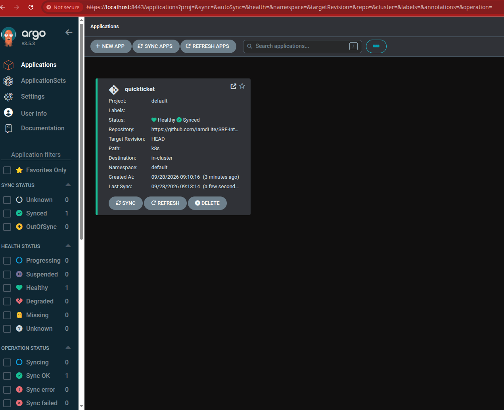

deployment "events" successfully rolled out
deployment "payments" successfully rolled out
gateway-6c4f86cf7d-w84kb    1/1     Running   0             7m52s
# Lab 5 Submission

## Task 1 — CI Pipeline and ArgoCD GitOps

### Proof of work checklist

#### 1. GitHub Actions run

Workflow run: [CI run 36384541531](https://github.com/IamdLite/SRE-Intro/actions/runs/36384541531)

#### 2. GHCR packages published

The authenticated `gh` request returned the three QuickTicket container package names:

```text
$ gh api 'user/packages?package_type=container' --jq '.[].name'
quickticket-gateway
quickticket-events
quickticket-payments
```

#### 3. ArgoCD application status

```text
$ argocd app get quickticket
Name:               argocd/quickticket
Project:            default
Server:             https://kubernetes.default.svc
Namespace:          default
URL:                https://localhost:8443/applications/quickticket
Source:
- Repo:             https://github.com/IamdLite/SRE-Intro.git
  Target:           
  Path:             k8s
SyncWindow:         Sync Allowed
Sync Policy:        Automated
Sync Status:        Synced to  (a4582c0)
Health Status:      Healthy

GROUP  KIND        NAMESPACE  NAME      STATUS  HEALTH   HOOK  MESSAGE
       Service     default    gateway   Synced  Healthy        service/gateway configured
       Service     default    payments  Synced  Healthy        service/payments configured
       Service     default    redis     Synced  Healthy        service/redis configured
       Service     default    postgres  Synced  Healthy        service/postgres configured
       Service     default    events    Synced  Healthy        service/events configured
apps   Deployment  default    payments  Synced  Healthy        deployment.apps/payments configured
apps   Deployment  default    gateway   Synced  Healthy        deployment.apps/gateway configured
apps   Deployment  default    redis     Synced  Healthy        deployment.apps/redis configured
apps   Deployment  default    postgres  Synced  Healthy        deployment.apps/postgres configured
apps   Deployment  default    events    Synced  Healthy        deployment.apps/events configured
```

The final status after the CI-generated image-tag commit was `Synced` and `Healthy`.



#### 4. Git change synced to the cluster

```text
$ kubectl get deployment gateway -n default -o jsonpath='version={.metadata.labels.version}{"\n"}image={.spec.template.spec.containers[0].image}{"\n"}'
version=v2
image=ghcr.io/iamdlite/quickticket-gateway:e3447e625ffc603fec1a38df20a075003378a9e2
```

#### 5. Effect of manually running `kubectl edit`

ArgoCD treats Git as the desired state. A direct `kubectl edit` creates drift from that state; ArgoCD detects it and marks the application `OutOfSync`. With automated sync enabled, ArgoCD reconciles the resource back to the version defined in Git. Manual changes are not durable unless committed and pushed to the repository.

### Additional local deployment validation

The local cluster initially had `ErrImageNeverPull` because the images had not been imported into k3d. Importing them allowed the deployments to recover:

```text
$ k3d image import quickticket-gateway:v1 quickticket-events:v1 quickticket-payments:v1 -c quickticket
INFO[0000] Importing image(s) into cluster 'quickticket'
INFO[0024] Successfully imported 3 image(s) into 1 cluster(s)

$ kubectl rollout status deployment/gateway deployment/events deployment/payments -n default --timeout=180s
deployment "gateway" successfully rolled out
deployment "events" successfully rolled out
deployment "payments" successfully rolled out

$ kubectl get pods -n default -o wide
NAME                        READY   STATUS    RESTARTS      AGE
events-6b55dd5c9-d8vnv      1/1     Running   0             7m52s
gateway-6c4f86cf7d-w84kb    1/1     Running   0             7m52s
payments-5d47dd69f9-w52wz   1/1     Running   0             7m52s
postgres-78489d7f5f-hdb82   1/1     Running   3 (32m ago)   36h
redis-6fcfb5475d-dmhbd      1/1     Running   3 (32m ago)   36h

$ curl -sS http://localhost:3080/health
{"status":"healthy","checks":{"events":"ok","payments":"ok","circuit_payments":"CLOSED"}}
```

## Optional Task 2 — Rollback via GitOps

### Bad image deploy

Pushed commit `a6542a0` with the intentionally nonexistent gateway tag. The CI run was skipped because the commit message starts with `ci:`; this let ArgoCD test the bad manifest without CI replacing it first.

```text
$ argocd app get quickticket
Sync Status:        Synced to  (a6542a0)
Health Status:      Progressing
apps  Deployment  default  gateway  Synced  Progressing

$ kubectl get pods -n default -o wide
gateway-6c4f86cf7d-w84kb  1/1  Running             # previous replica
gateway-77b649cd97-dt967  0/1  ErrImageNeverPull   # new replica using bad tag
```

The manifest had `imagePullPolicy: Never`, so Kubernetes reported `ErrImageNeverPull` (rather than `ImagePullBackOff`/`ErrImagePull`): the requested image was not available locally and Kubernetes was instructed not to pull it.

### Git revert and recovery

```text
$ git log --oneline -2
58ea04a Revert "ci: lab5 task2 deploy nonexistent gateway image"
a6542a0 ci: lab5 task2 deploy nonexistent gateway image

$ kubectl rollout status deployment/gateway -n default --timeout=180s
deployment "gateway" successfully rolled out

$ argocd app get quickticket
Sync Status:        Synced to  (58ea04a)
Health Status:      Healthy
```

The revert push began at **2026-09-28 07:07:24 UTC** and the restored rollout was verified healthy at **07:07:50 UTC**: approximately **26 seconds** from revert push to healthy pods.

## Bonus Task — Automated image tag update

The three Deployments now use public GHCR images with `imagePullPolicy: Always`. The successful CI run built and pushed all three images, rewrote all three manifest tags to the triggering commit SHA, and pushed the manifest-update commit.

- CI run: [36390450760 — successful](https://github.com/IamdLite/SRE-Intro/actions/runs/36390450760)
- Source commit: `e3447e6` (`feat(lab5): configure GHCR images for events and payments`)
- CI-generated manifest commit: `a4582c0` (`ci: update image tags to e3447e625ffc603fec1a38df20a075003378a9e2`)

```text
$ git show refs/remotes/origin/main:k8s/gateway.yaml | grep -E 'image:|imagePullPolicy'
image: ghcr.io/iamdlite/quickticket-gateway:e3447e625ffc603fec1a38df20a075003378a9e2
imagePullPolicy: Always

$ git show refs/remotes/origin/main:k8s/events.yaml | grep -E 'image:|imagePullPolicy'
image: ghcr.io/iamdlite/quickticket-events:e3447e625ffc603fec1a38df20a075003378a9e2
imagePullPolicy: Always

$ git show refs/remotes/origin/main:k8s/payments.yaml | grep -E 'image:|imagePullPolicy'
image: ghcr.io/iamdlite/quickticket-payments:e3447e625ffc603fec1a38df20a075003378a9e2
imagePullPolicy: Always

$ argocd app get quickticket
Sync Status:        Synced to  (a4582c0)
Health Status:      Healthy

$ kubectl get pods -n default
events-86bf4bf977-7vhmt    1/1  Running
gateway-79784fbcb-pnxvr    1/1  Running
payments-584b5bcc87-9858k  1/1  Running
```

The workflow’s `ci:` commit-message guard prevents the tag-update commit from starting another image-build cycle.
