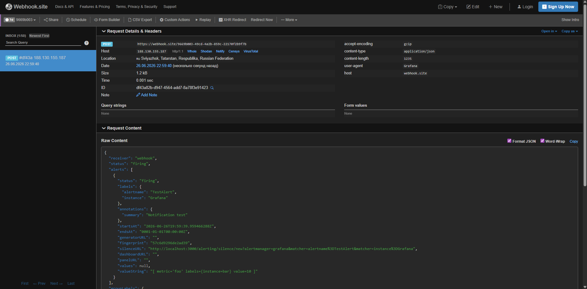
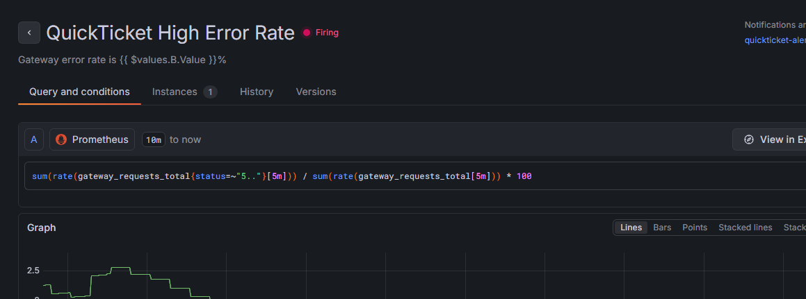

# Lab 6 — Alerting & Incident Response
**Student:** Valerii Tiniakov
**Group:** B24-SD-03

## Task 1 — Create Alerts & Respond to an Incident (6 pts)

### 6.3: Alert Rules
* **Alert 1 (QuickTicket High Error Rate) PromQL:**
  ```promql
  sum(rate(gateway_requests_total{status=~"5.."}[5m])) / sum(rate(gateway_requests_total[5m])) * 100
  ```
* **Alert 2 (QuickTicket SLO Burn Rate) PromQL:**
  ```promql
  (1 - (sum(rate(gateway_requests_total{status!~"5.."}[30m])) / sum(rate(gateway_requests_total[30m])))) / (1 - 0.995)
  ```

### 6.2: Contact Point
* **Type:** Webhook
* **Evidence of notification received:**
  .

### 6.5: Runbook
# Runbook: QuickTicket High Error Rate

## Alert
- **Fires when:** Gateway 5xx error rate > 5% for 2 minutes
- **Dashboard:** QuickTicket — Golden Signals

## Diagnosis
1. Check which service is failing:
   - `curl -s http://localhost:3080/health | python3 -m json.tool`
2. Check payments service directly:
   - `curl -s http://localhost:8082/health`
3. Check events service:
   - `curl -s http://localhost:8081/health`
4. Check logs for errors:
   - `docker compose logs gateway --tail=20 --since=5m`
   - `docker compose logs payments --tail=20 --since=5m`

## Common Causes
| Cause | How to identify | Fix |
|-------|----------------|-----|
| Payments service down | health shows payments: down | Restart: `docker compose start payments` |
| Payments high failure rate | health OK but errors in logs | Check PAYMENT_FAILURE_RATE env var |
| Events service down | health shows events: down | Restart: `docker compose start events` |
| Database connection exhausted | events logs show pool errors | Restart events, check DB_MAX_CONNS |

## Escalation
- If not resolved in 10 minutes, escalate to: [instructor/TA]

### 6.6 & 6.7: Incident Response Evidence
* **Alert firing evidence:**
  .
* **Timeline:**
  * **[23:30]** — Failure injected (`PAYMENT_FAILURE_RATE=0.5`)
  * **[23:35]** — Alert fired in Grafana / Webhook received
  * **[23:36]** — Investigation started
  * **[23:38]** — Fix applied (`PAYMENT_FAILURE_RATE=0.0`)
  * **[23:40]** — Alert resolved (status "Normal")
* **Answer (How long from failure injection to alert firing? Why the delay?):** The delay was 5 minutes. This was caused by the combination of the Prometheus scrape interval and the 2-minute Pending period configured in the alert rule to prevent false positives from transient network fluctuations.

---

## Task 2 — Blameless Postmortem (4 pts)

### 6.8: Postmortem Document

# Postmortem: Payments Service High Error Rate Outage

**Date:** 2026-06-26

**Duration:** 23:30 → 23:40

**Severity:** SEV-2

**Author:** Valerii Tiniakov

## Summary
The payments service experienced a spike in 5xx errors due to an injected configuration error. This resulted in approximately 30% of user payment requests failing during the 10-minute window, impacting checkout availability.

## Timeline
| Time | Event |
|------|-------|
| [23:30] | Failure injected (Payments error rate increased to 50%) |
| [23:35] | Alert 'QuickTicket High Error Rate' fired |
| [23:36] | Investigation started using Runbook |
| [23:37] | Root cause identified as misconfigured PAYMENT_FAILURE_RATE |
| [23:38] | Fix applied (env var reset to 0.0) |
| [23:40] | Alert resolved and service recovered |

## Root Cause
The PAYMENT_FAILURE_RATE environment variable was set to 0.5, forcing the payments service to return HTTP 500 errors. This exceeded the 5% SLO threshold monitored by our alert rule.

## What Went Well
- Alert fired successfully and notified us via Webhook.
- The Runbook provided clear steps to identify the configuration issue in the container environment.

## What Went Wrong
- Monitoring displayed a slight lag in data processing during the initial incident ramp-up.
- Manual intervention was required to stop and recreate the container to apply the fix.

## Action Items
| Action | Owner | Priority |
|--------|-------|----------|
| Automate environment validation to reject invalid failure rate configs | Valerii | High |
| Implement auto-remediation script to reset env vars on detected config drift | Valerii | Medium |

* **Answer (What is the most important action item from your postmortem? Why?):**
  The most important action item is automating environment validation. This prevents the configuration error from reaching production in the first place, shifting our defense to a proactive rather than reactive posture.

