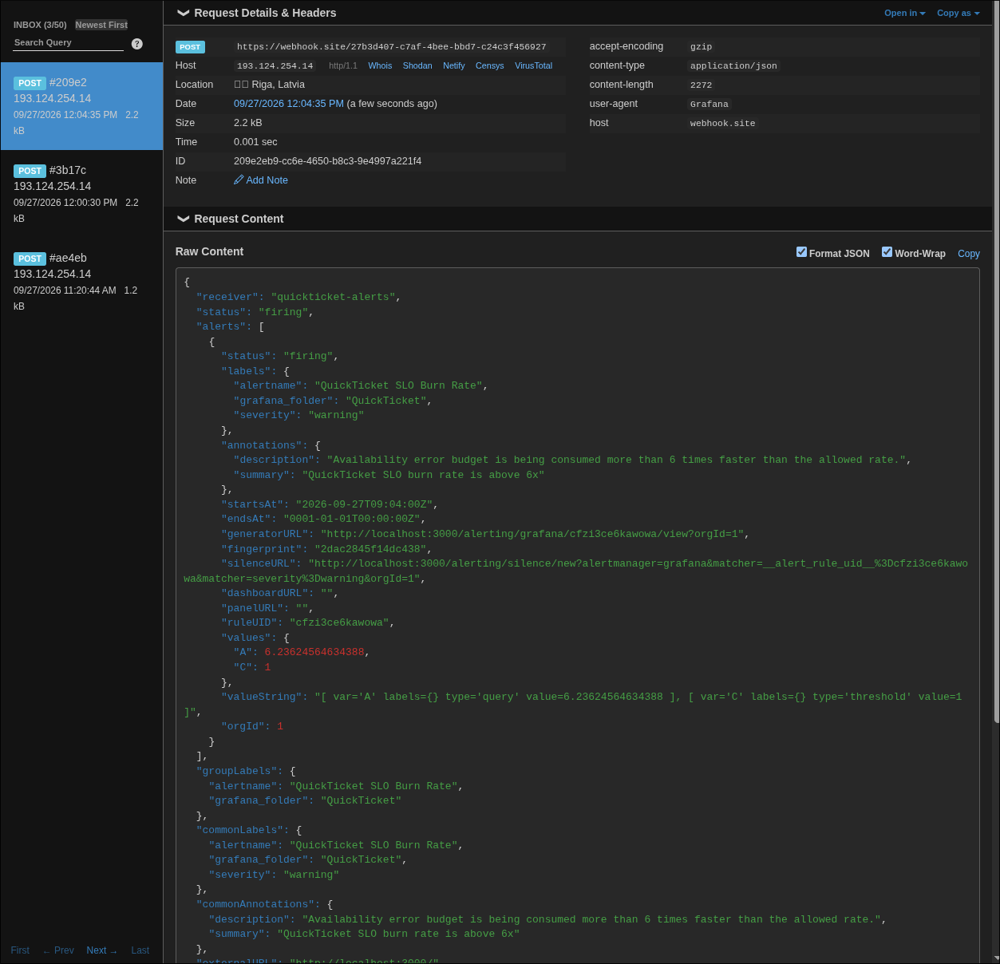
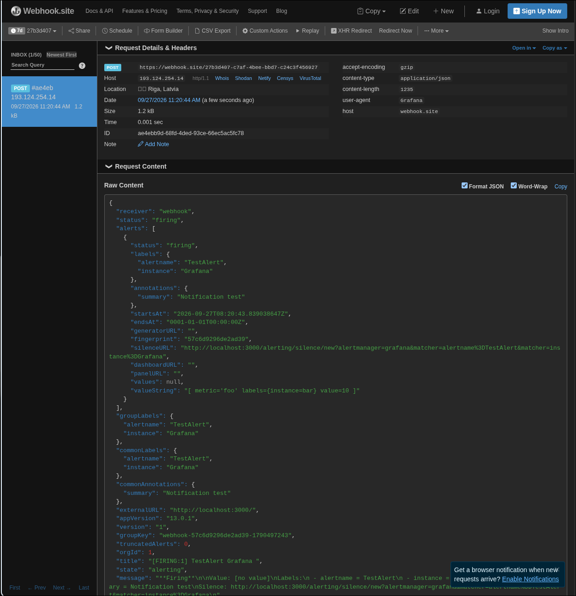
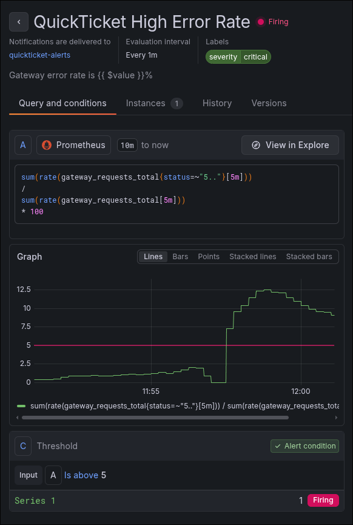
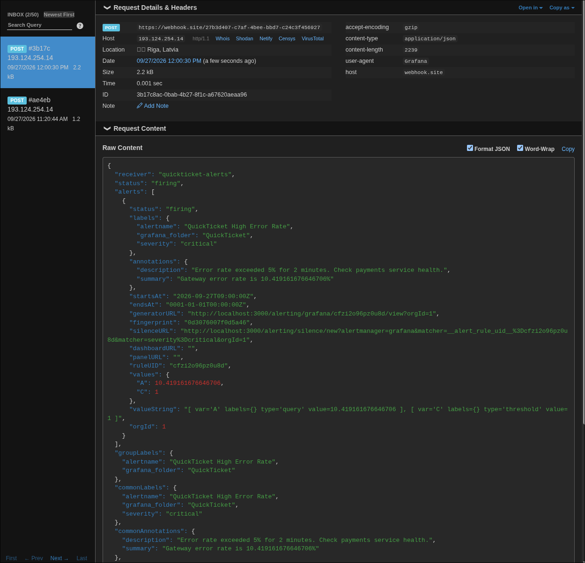
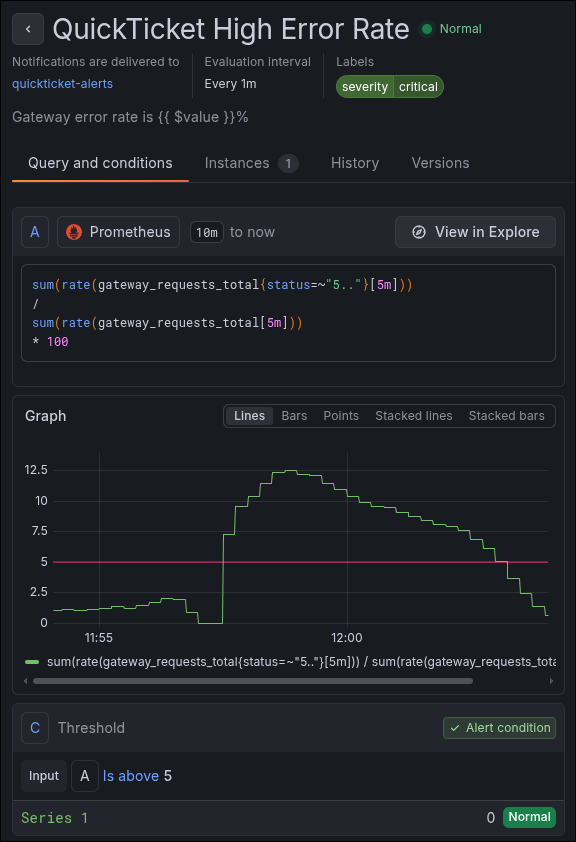

# Lab 6 — Alerting & Incident Response

## Task 1 — Alerts & Incident Response

### Alert 1 — QuickTicket High Error Rate

**PromQL:**

```promql
sum(rate(gateway_requests_total{status=~"5.."}[5m]))
/
sum(rate(gateway_requests_total[5m]))
* 100
```

Configuration:

```text
Condition: IS ABOVE 5
Evaluation interval: 1m
Pending period: 2m
Label: severity=critical
```

Annotations:

```text
Summary: Gateway error rate is {{ $value }}%
Description: Error rate exceeded 5% for 2 minutes. Check payments service health.
```

### Alert 2 — QuickTicket SLO Burn Rate

**PromQL:**

```promql
(
  1 -
  (
    sum(rate(gateway_requests_total{status!~"5.."}[30m]))
    /
    sum(rate(gateway_requests_total[30m]))
  )
)
/
(1 - 0.995)
```

Configuration:

```text
Condition: IS ABOVE 6
Evaluation interval: 1m
Pending period: 5m
Label: severity=warning
```

During the incident this alert also fired with a burn rate of approximately `6.2x`.



---

## Contact Point

Grafana contact point:

```text
Name: quickticket-alerts
Type: Webhook
Receiver: webhook.site
```

The test notification was successfully received.



Notification policy:

```text
Default contact point: quickticket-alerts
Group by: alertname
Group wait: 30s
Repeat interval: 5m
```

---

# Runbook: QuickTicket High Error Rate

## Alert

- **Fires when:** Gateway 5xx error rate > 5% for 2 minutes
- **Dashboard:** QuickTicket — Golden Signals

## Diagnosis

1. Check gateway:

```bash
curl -s http://localhost:3080/health | python3 -m json.tool
```

2. Check payments:

```bash
curl -s http://localhost:8082/health | python3 -m json.tool
```

3. Check events:

```bash
curl -s http://localhost:8081/health | python3 -m json.tool
```

4. Check gateway logs:

```bash
docker compose \
  -f docker-compose.yaml \
  -f ../docker-compose.monitoring.yaml \
  logs gateway --tail=20 --since=5m
```

5. Check payments logs:

```bash
docker compose \
  -f docker-compose.yaml \
  -f ../docker-compose.monitoring.yaml \
  logs payments --tail=20 --since=5m
```

## Common Causes

| Cause | How to identify | Fix |
|---|---|---|
| Payments down | Payments health is unavailable | Restart payments |
| High payment failure rate | `failure_rate` elevated, HTTP 500 in logs | Restore `PAYMENT_FAILURE_RATE` |
| Events down | Events health degraded/down | Restart events |
| DB problems | Events logs show DB errors | Check DB and restart events |

## Escalation

If not resolved within 10 minutes, escalate to instructor/TA with health outputs and logs.

---

## Incident Simulation

Failure injected:

```bash
docker compose \
  -f docker-compose.yaml \
  -f ../docker-compose.monitoring.yaml \
  stop payments

PAYMENT_FAILURE_RATE=0.5 docker compose \
  -f docker-compose.yaml \
  -f ../docker-compose.monitoring.yaml \
  up -d payments
```

Payments health:

```json
{
    "status": "healthy",
    "failure_rate": 0.5,
    "latency_ms": 0
}
```

After sufficient payment traffic, the gateway 5xx rate exceeded 5% and the alert transitioned:

```text
Normal → Pending → Firing
```



The webhook received the firing notification:

```text
alertname = QuickTicket High Error Rate
severity = critical
status = firing
```



### Diagnosis

Gateway:

```text
events: ok
payments: ok
circuit_payments: CLOSED
```

Events:

```text
postgres: ok
redis: ok
```

Payments:

```text
failure_rate: 0.5
```

Payments logs contained:

```text
Payment failed (injected)
POST /charge HTTP/1.1" 500 Internal Server Error
```

The root cause was therefore functional payment degradation rather than process unavailability.

### Fix

```bash
docker compose \
  -f docker-compose.yaml \
  -f ../docker-compose.monitoring.yaml \
  stop payments

PAYMENT_FAILURE_RATE=0.0 docker compose \
  -f docker-compose.yaml \
  -f ../docker-compose.monitoring.yaml \
  up -d payments
```

After recovery:

```json
{
    "status": "healthy",
    "failure_rate": 0.0,
    "latency_ms": 0
}
```

The High Error Rate alert returned to `Normal`.



---

## Incident Timeline

| Time | Event |
|---|---|
| 11:46:46 | Payment failure rate increased to 50% |
| 12:00:00 | High Error Rate alert fired |
| 12:00:30 | Webhook notification received |
| 12:00:50 | Investigation started |
| 12:01:22 | Root cause identified |
| 12:01:46 | Failure rate restored to 0 |
| 12:04:17 | Alert returned to Normal |

**Incident duration:** 17 min 31 sec

### How long from failure injection to alert firing? Why the delay?

The alert fired **13 min 14 sec** after failure injection.

The payment service failure affected only payment requests, while the alert measured the 5xx rate across all gateway traffic. Payment requests were only a small part of the workload, so the overall gateway 5xx rate initially remained below 5%.

The load generator also counted non-5xx errors such as HTTP 409 as failures, while the Grafana alert only counted HTTP 5xx.

After the gateway 5xx rate exceeded 5%, Grafana still had:

- a 1-minute evaluation interval;
- a 2-minute pending period.

---

# Task 2 — Blameless Postmortem

# Postmortem: Elevated Payment Failure Rate

**Date:** 2026-09-27  
**Duration:** 11:46:46 → 12:04:17 MSK  
**Severity:** SEV-3  
**Author:** Pavel

## Summary

The payments service experienced a 50% transaction failure rate, causing intermittent HTTP 5xx responses during purchases.

Other QuickTicket components remained available, but payment functionality was significantly degraded.

## Timeline

| Time | Event |
|---|---|
| 11:46:46 | Failure rate increased to 50% |
| 12:00:00 | High Error Rate alert fired |
| 12:00:30 | Notification received |
| 12:00:50 | Investigation started |
| 12:01:22 | Root cause identified |
| 12:01:46 | Normal payment configuration restored |
| 12:04:17 | Alert resolved |

## Root Cause

The payments service was configured with a 50% failure rate, causing payment requests to return HTTP 500 responses.

The service remained reachable and its `/health` endpoint still reported the process as healthy. The incident therefore affected functional correctness rather than process availability.

Detection was delayed because payment requests represented only a small part of total gateway traffic, so the gateway-wide 5xx rate initially remained below the alert threshold.

## What Went Well

- Grafana detected the problem after the SLO threshold was exceeded.
- Webhook notifications worked.
- The runbook led directly to the affected service.
- Payments health exposed `failure_rate`.
- Payments logs clearly showed HTTP 500 failures.
- The SLO Burn Rate alert also fired.
- The alert automatically resolved after recovery.

## What Went Wrong

- Gateway-wide detection took more than 13 minutes.
- Process health did not reflect functional payment degradation.
- Default load generation produced too little payment traffic.
- Load-generator failure rate included non-5xx responses such as HTTP 409.
- The runbook initially did not explicitly distinguish process health from functional health.

## Action Items

| Action | Owner | Priority |
|---|---|---|
| Add payment-specific failure-rate alert | Pavel | High |
| Add functional payment health monitoring | Pavel | High |
| Add `failure_rate` check to runbook | Pavel | Medium |
| Add payment success/error Grafana panels | Pavel | Medium |
| Improve payment traffic generation | Pavel | Medium |

## Most Important Action Item

The most important action item is to add a **payment-specific failure-rate alert**.

The current gateway alert aggregates all requests. A critical low-volume operation such as payment can therefore fail frequently without immediately pushing the total gateway 5xx rate above 5%.

A payment-specific alert would detect checkout degradation much earlier.

---

# Bonus Task — Cross-Test Runbook

**Classmate:** e.neialov@innopolis.university

## Second Failure Mode

The selected scenario was:

```text
Redis down → reservation functionality degraded
```

# Runbook: QuickTicket Reservation Failure

## Diagnosis

1. Check gateway:

```bash
curl -s http://localhost:3080/health | python3 -m json.tool
```

2. Check events:

```bash
curl -s http://localhost:8081/health | python3 -m json.tool
```

3. Check container state:

```bash
docker compose \
  -f docker-compose.yaml \
  -f ../docker-compose.monitoring.yaml \
  ps
```

4. If Redis is running, test it:

```bash
docker compose \
  -f docker-compose.yaml \
  -f ../docker-compose.monitoring.yaml \
  exec redis redis-cli ping
```

Expected:

```text
PONG
```

5. Check events logs:

```bash
docker compose \
  -f docker-compose.yaml \
  -f ../docker-compose.monitoring.yaml \
  logs events --tail=50 --since=5m
```

6. Test reservation:

```bash
curl -i -X POST \
  -H "Content-Type: application/json" \
  -d '{"quantity":1}' \
  http://localhost:3080/events/3/reserve
```

## Common Causes

| Cause | How to identify | Fix |
|---|---|---|
| Redis stopped | Redis missing/stopped in `docker compose ps` | Start Redis |
| Redis unavailable | `redis-cli ping` fails | Restart Redis |
| Events lost Redis | Events health shows `redis: down` | Restore Redis |
| Events remains degraded | Redis works but events is still degraded | Restart events |

## Mitigation

```bash
docker compose \
  -f docker-compose.yaml \
  -f ../docker-compose.monitoring.yaml \
  start redis
```

Verify:

```bash
docker compose \
  -f docker-compose.yaml \
  -f ../docker-compose.monitoring.yaml \
  exec redis redis-cli ping
```

Expected:

```text
PONG
```

Then:

```bash
curl -s http://localhost:8081/health | python3 -m json.tool
curl -s http://localhost:3080/health | python3 -m json.tool
```

Restart events only if it remains degraded:

```bash
docker compose \
  -f docker-compose.yaml \
  -f ../docker-compose.monitoring.yaml \
  restart events
```

---

## Cross-Test Results

The classmate received only the runbook and was not told that Redis had been stopped.

Initial gateway health:

```json
{
    "status": "degraded",
    "checks": {
        "events": "down",
        "payments": "ok",
        "circuit_payments": "CLOSED"
    }
}
```

Events health:

```json
{
    "status": "degraded",
    "checks": {
        "postgres": "ok",
        "redis": "down"
    }
}
```

Redis check:

```text
service "redis" is not running
```

Reservation test:

```text
HTTP/1.1 504 Gateway Timeout

{"detail":"Events service timeout"}
```

The classmate restored Redis:

```bash
docker compose \
  -f docker-compose.yaml \
  -f ../docker-compose.monitoring.yaml \
  start redis
```

Verification:

```text
PONG
```

Events recovered:

```json
{
    "status": "healthy",
    "checks": {
        "postgres": "ok",
        "redis": "ok"
    }
}
```

Gateway recovered:

```json
{
    "status": "healthy",
    "checks": {
        "events": "ok",
        "payments": "ok",
        "circuit_payments": "CLOSED"
    }
}
```

Final recovery was recorded at:

```text
2026-09-27 13:49:33 MSK
```

### Result

- **Resolved using only the runbook:** Yes
- **Resolution time:** approximately 1–2 minutes
- **Peer feedback:** The runbook was clear; no blocking or unclear steps were found.

### Runbook Update

After the test, the container-state check was explicitly placed before `redis-cli ping`.

This avoids attempting:

```bash
docker compose exec redis redis-cli ping
```

when the Redis container is stopped.

The events restart was also clarified as a fallback action only if the service remains degraded after Redis has recovered.
