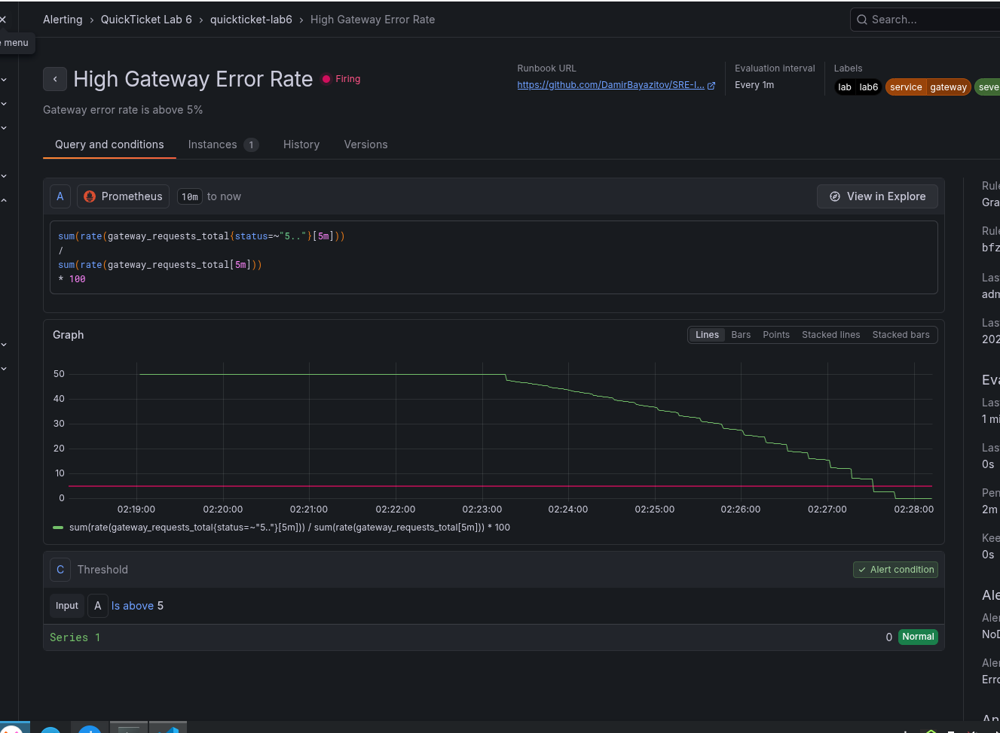
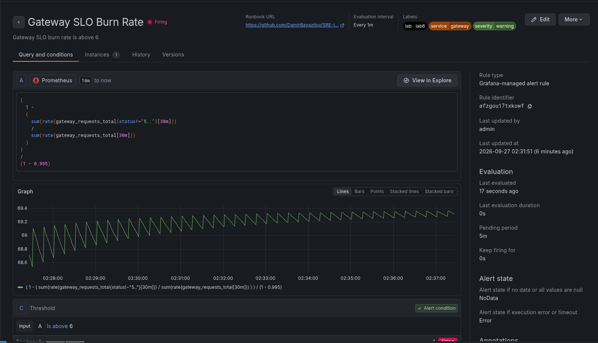
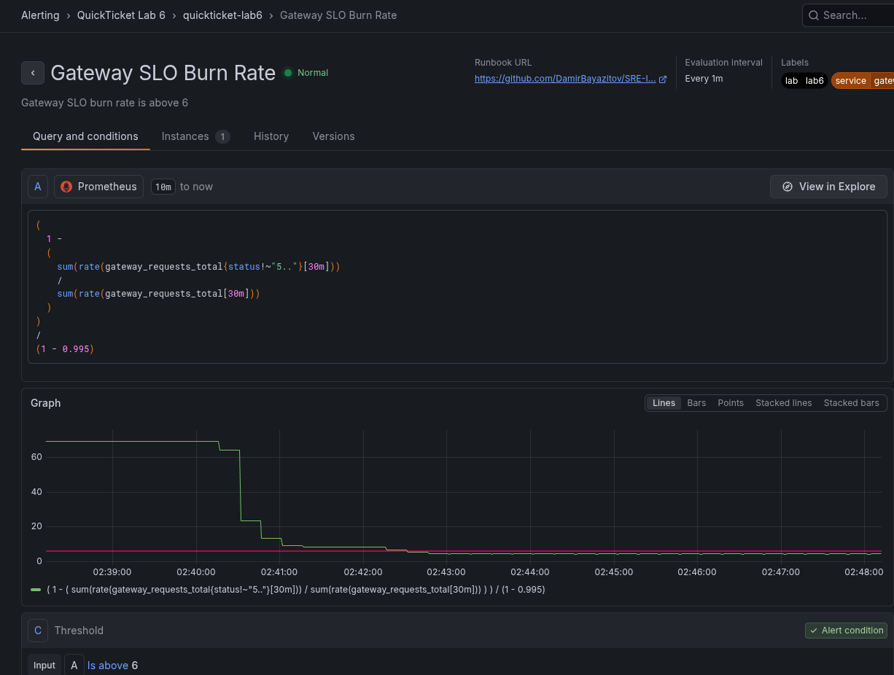
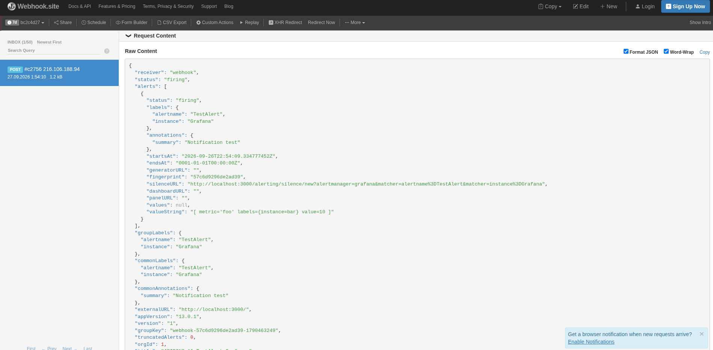
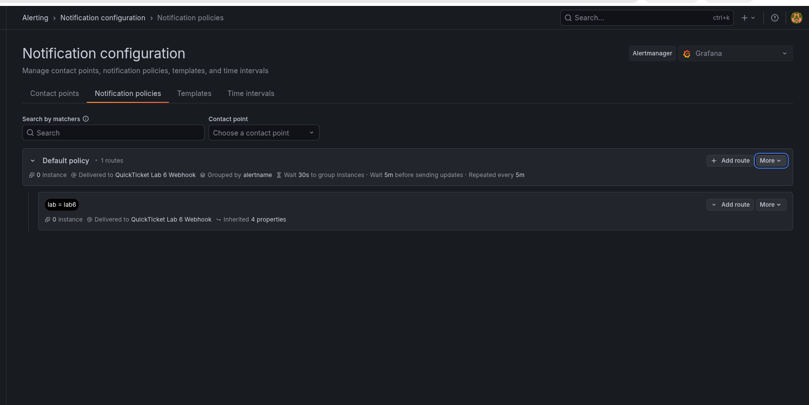

# Lab 6 — Alerting & Incident Response

**Student:** Damir Bayazitov

**Branch:** `feature/lab6`

**Date:** 27 September 2026

**Result:** Task 1 and Task 2 completed; bonus cross-test is not claimed.

## Completion summary

| Requirement | Result |
|---|---|
| Grafana high-error-rate alert | Completed and tested |
| Grafana SLO burn-rate alert | Completed and tested |
| Webhook contact point | Configured and tested |
| Notification policy | Configured with the required grouping and intervals |
| Controlled incident | Injected and detected |
| Runbook | Written and followed |
| Recovery | Completed; both rules returned to `Normal` |
| Blameless postmortem | Completed |
| Bonus cross-test with a classmate | Not claimed |

## Task 1 — Create Alerts and Respond to an Incident

### 1. Monitoring stack

The QuickTicket application and monitoring stack were started with both Compose files:

```bash
docker compose \
  -f app/docker-compose.yaml \
  -f docker-compose.monitoring.yaml \
  up -d
```

Because ports `5432` and `6379` were already occupied on the host, only the host-side mappings were changed:

```text
PostgreSQL: 5433:5432
Redis:      6380:6379
```

Container-to-container ports and service names were not changed. The final stack contained Gateway, Events, Payments, PostgreSQL, Redis, Prometheus, and Grafana, all running successfully.

### 2. Alert rule configuration

#### Alert 1 — High Gateway Error Rate

| Setting | Value |
|---|---|
| Grafana rule name | `High Gateway Error Rate` |
| Rule type | Grafana-managed |
| Evaluation interval | 1 minute |
| Pending period | 2 minutes |
| Condition | Above 5 |
| Labels | `lab=lab6`, `service=gateway`, `severity=critical` |

PromQL query:

```promql
sum(rate(gateway_requests_total{status=~"5.."}[5m]))
/
sum(rate(gateway_requests_total[5m]))
*
100
```

Annotations:

```text
Summary: Gateway error rate is above 5%
Description: More than 5% of Gateway requests returned HTTP 5xx responses
during the last 5 minutes. Check the Gateway, Events, and Payments service
logs and verify the current deployment state.
```

Firing evidence:



#### Alert 2 — Gateway SLO Burn Rate

| Setting | Value |
|---|---|
| Grafana rule name | `Gateway SLO Burn Rate` |
| Rule type | Grafana-managed |
| Evaluation interval | 1 minute |
| Pending period | 5 minutes |
| Condition | Above 6 |
| Labels | `lab=lab6`, `service=gateway`, `severity=warning` |

PromQL query:

```promql
(
  1 -
  (
    sum(rate(gateway_requests_total{status!~"5.."}[30m]))
    /
    sum(rate(gateway_requests_total[30m]))
  )
)
/
(1 - 0.995)
```

The rule represents the rate at which the 0.5% error budget of the 99.5% availability SLO is being consumed. A value greater than 6 means that the service is consuming the budget more than six times faster than allowed.

Firing evidence with the corrected threshold of 6:



Final normal state:



### 3. Contact point and notification policy

The Grafana contact point was configured as follows:

| Setting | Value |
|---|---|
| Name | `QuickTicket Lab 6 Webhook` |
| Type | Webhook |
| Receiver | A temporary webhook.site endpoint |

The Grafana test notification produced an HTTP POST containing a firing test alert:



The final notification policy configuration was:

| Setting | Value |
|---|---|
| Default contact point | `QuickTicket Lab 6 Webhook` |
| Group by | `alertname` |
| Group wait | 30 seconds |
| Group interval | 5 minutes |
| Repeat interval | 5 minutes |
| Additional route | `lab=lab6` to `QuickTicket Lab 6 Webhook` |



### 4. Notification evidence

Webhook.site received real incident notifications from both rules.

| Rule | Notification | Value | Time, UTC |
|---|---|---:|---:|
| High Gateway Error Rate | `FIRING` | 50% | 23:21:10 |
| High Gateway Error Rate | `RESOLVED` | 0% | 23:28:10 |
| Gateway SLO Burn Rate | `FIRING` after threshold correction | 69.318 | 23:37:10 |
| Gateway SLO Burn Rate | `RESOLVED` | 4.424 | 23:43:10 |

Relevant fields from the high-error notification:

```json
{
  "status": "firing",
  "labels": {
    "alertname": "High Gateway Error Rate",
    "lab": "lab6",
    "service": "gateway",
    "severity": "critical"
  },
  "values": {
    "A": 50,
    "C": 1
  },
  "title": "[FIRING:1] High Gateway Error Rate QuickTicket Lab 6"
}
```

Relevant fields from the final SLO recovery notification:

```json
{
  "status": "resolved",
  "labels": {
    "alertname": "Gateway SLO Burn Rate",
    "lab": "lab6",
    "service": "gateway",
    "severity": "warning"
  },
  "values": {
    "A": 4.4235531629727785,
    "C": 0
  },
  "title": "[RESOLVED] Gateway SLO Burn Rate QuickTicket Lab 6"
}
```

During configuration, editing the SLO rule produced an additional resolved notification containing `grafana_state_reason=Updated`. This was a configuration lifecycle event, not recovery evidence, and was excluded from the recovery measurement.

## Runbook: High Gateway Error Rate

### Alert

- **Fires when:** Gateway HTTP 5xx error rate is greater than 5% for 2 minutes.
- **Dashboard:** QuickTicket — Golden Signals.
- **Severity:** Critical.
- **Primary impact:** Clients receive failed Gateway requests; reservation payment may be unavailable.

### Diagnosis

1. Check the aggregate Gateway health:

   ```bash
   curl -sS http://localhost:3080/health |
   python3 -m json.tool
   ```

2. Check Payments directly:

   ```bash
   curl -sS http://localhost:8082/health |
   python3 -m json.tool
   ```

3. Check Events directly:

   ```bash
   curl -sS http://localhost:8081/health |
   python3 -m json.tool
   ```

4. Inspect recent Gateway, Payments, and Events logs:

   ```bash
   docker compose \
     -f app/docker-compose.yaml \
     -f docker-compose.monitoring.yaml \
     logs --since=10m --tail=100 \
     gateway payments events
   ```

5. Inspect the active Payments failure-injection settings:

   ```bash
   docker compose \
     -f app/docker-compose.yaml \
     -f docker-compose.monitoring.yaml \
     exec payments env |
   grep -E 'PAYMENT_FAILURE_RATE|PAYMENT_LATENCY_MS'
   ```

6. Verify the current error-rate value in Prometheus:

   ```promql
   sum(rate(gateway_requests_total{status=~"5.."}[5m]))
   /
   sum(rate(gateway_requests_total[5m]))
   * 100
   ```

### Common causes and mitigation

| Cause | How to identify it | Mitigation |
|---|---|---|
| Payments unavailable | Gateway health reports Payments down; connection errors in Gateway logs | Recreate or start Payments and verify `/health` |
| Payments failure injection enabled | Payments health is reachable but reports non-zero `failure_rate` | Restore `PAYMENT_FAILURE_RATE=0.0` and force-recreate Payments |
| Events unavailable | Gateway health reports Events down | Start or recreate Events, then check PostgreSQL and Redis |
| PostgreSQL connection problem | Events logs contain connection or pool errors | Verify PostgreSQL health and `DB_MAX_CONNS`; restart Events only after the dependency is healthy |
| Redis unavailable | Events health reports Redis down; reservation operations fail | Restore Redis and verify Events readiness |

Payments recovery command:

```bash
export PAYMENT_FAILURE_RATE=0.0
export PAYMENT_LATENCY_MS=0

docker compose \
  -f app/docker-compose.yaml \
  -f docker-compose.monitoring.yaml \
  up -d --force-recreate payments
```

### Validation

```bash
curl -fsS http://localhost:8082/health |
python3 -m json.tool

curl -fsS http://localhost:3080/health |
python3 -m json.tool
```

Expected Payments values:

```json
{
  "status": "healthy",
  "failure_rate": 0.0,
  "latency_ms": 0
}
```

Expected Gateway values include `events=ok`, `payments=ok`, and `circuit_payments=CLOSED`.

### Escalation

- If the cause is not identified within 5 minutes, notify the project owner and begin preserving logs and metric snapshots.
- If service is not restored within 10 minutes, escalate to the instructor or TA.
- Report the current error rate, affected dependency, actions already attempted, and links to relevant logs and dashboards.

## Runbook: Gateway SLO Burn Rate

This supplementary runbook backs the URL stored in the SLO alert annotation. It is not claimed as the bonus cross-test.

### Alert

- **Fires when:** the 30-minute burn rate for the 99.5% availability SLO remains above 6 for 5 minutes.
- **Severity:** Warning.
- **Meaning:** the service is consuming its error budget significantly faster than allowed.

### Diagnosis and response

1. Open the Golden Signals dashboard and compare error rate, request rate, and latency.
2. Check whether the high-error-rate alert is firing or recently fired.
3. Inspect Gateway status distribution and determine which route is returning 5xx responses.
4. Check Gateway, Events, and Payments health and logs using the commands in the high-error-rate runbook.
5. Remove the active failure condition and verify successful application traffic.
6. Continue observing the 30-minute window. The burn-rate rule can remain firing after the service is healthy because earlier failures remain in the range vector.
7. Confirm recovery only after the value is below 6 and Grafana sends a genuine resolved notification without `grafana_state_reason=Updated`.

### Escalation

If the burn rate remains above 6 after the underlying service is restored, check whether new 5xx errors are still being produced. Escalate after 10 minutes if the metric does not decline or if the error budget continues to be consumed.

### 5. Controlled failure experiment

The Payments service was recreated with deterministic payment failure injection:

```bash
export PAYMENT_FAILURE_RATE=1.0
export PAYMENT_LATENCY_MS=0

docker compose \
  -f app/docker-compose.yaml \
  -f docker-compose.monitoring.yaml \
  up -d --force-recreate payments
```

The value was increased to 100% for a controlled and deterministic experiment because only a fraction of the default load-generator traffic reaches the payment endpoint. A repeated reserve-and-pay flow generated successful reservations followed by failed payment requests, producing an overall Gateway 5xx rate of approximately 50%.

### 6. Incident timeline

All times below use UTC+03:00.

| Time | Event |
|---:|---|
| 02:18:35.943 | Controlled Payments failure started |
| 02:21:10 | High Gateway Error Rate entered `Firing`; webhook received with `A=50` |
| 02:21–02:22 | Gateway, Payments, and Events health and logs checked; non-zero Payments failure injection confirmed |
| 02:24:10 | Initial SLO burn notification received during rule tuning |
| 02:28:10 | High-error rule resolved after 5xx-producing traffic stopped and the 5-minute window cleared |
| 02:31:51 | SLO threshold configuration corrected to the required value of 6 |
| 02:37:10 | Correct SLO burn rule entered `Firing` after its 5-minute pending period; `A=69.318` |
| 02:39:30.819 | Recovery procedure started |
| 02:39:50.894 | Payments restored with `failure_rate=0.0` and `latency_ms=0` |
| 02:40:15.783 | First successful recovery-traffic batch started |
| 02:41:06.995 | First recovery-traffic batch completed |
| 02:42:04.848 | Second successful recovery-traffic batch started |
| 02:42:51.756 | Second recovery-traffic batch completed |
| 02:43:10 | Genuine SLO `RESOLVED` notification received with `A=4.424` |
| 02:50:06 | Final health verification completed |

### 7. Detection-delay analysis

The controlled failure started at `02:18:35.943`, and the high-error alert fired at `02:21:10`. The detection delay was therefore approximately **2 minutes 34 seconds**.

The delay is expected because:

1. the rule evaluates only once per minute;
2. the condition must remain true for a 2-minute pending period;
3. failure injection can occur between two evaluation boundaries;
4. Prometheus must scrape the new counter samples before Grafana can evaluate them.

The theoretical delay is approximately 2–3 minutes depending on alignment with scrape and evaluation intervals. The measured 2 minutes 34 seconds is consistent with this configuration.

### 8. Recovery result

The final service state was:

```json
{
  "payments": {
    "status": "healthy",
    "failure_rate": 0.0,
    "latency_ms": 0
  },
  "gateway": {
    "status": "healthy",
    "events": "ok",
    "payments": "ok",
    "circuit_payments": "CLOSED"
  }
}
```

Final Prometheus values:

```text
Gateway 5xx error rate over 5m: 0%
Gateway SLO burn rate over 30m: 2.5765
```

Both values were below their thresholds. Recovery duration measurements:

- recovery procedure start to SLO resolved: approximately **3 minutes 39 seconds**;
- Payments restored to SLO resolved: approximately **3 minutes 19 seconds**;
- second recovery-traffic batch start to SLO resolved: approximately **65 seconds**.

## Task 2 — Blameless Postmortem

# Postmortem: Payment Failure Injection Caused Elevated Gateway 5xx Rate

**Date:** 27 September 2026

**Duration:** 02:18:35–02:43:10 UTC+03:00, approximately 24 minutes 34 seconds

**Severity:** SEV-3

**Author:** Damir Bayazitov

### Summary

The Payments service was started with deterministic failure injection enabled. Reservation requests continued to succeed, but payment requests returned HTTP 500 responses, which the Gateway exposed as 5xx failures. The Gateway error rate reached approximately 50%, and the 99.5% SLO burn rate rose above 69. The incident was detected by both Grafana-managed rules and delivered to the configured webhook. Payments was restored with failure injection disabled, successful traffic was generated, and both rules returned to normal.

### Impact

- Payment attempts during the controlled failure could not complete.
- Read-only event listing and reservation creation remained available.
- Gateway aggregate health could still appear healthy because dependency health endpoints were reachable even though payment operations were failing.
- The measured Gateway error rate reached 50% for the deterministic reserve-and-pay workload.
- No persistent production data loss occurred; this was an isolated local lab environment.

### Timeline

| Time | Event |
|---:|---|
| 02:18:35 | Payments failure injection enabled; incident began |
| 02:21:10 | Critical high-error alert fired and webhook notification arrived |
| 02:21–02:22 | Health, environment, and logs checked; failure mode confirmed |
| 02:24:10 | SLO burn notification observed during initial configuration |
| 02:31:51 | SLO threshold corrected and saved as 6 |
| 02:37:10 | Correct warning SLO rule fired after its 5-minute pending period |
| 02:39:30 | Mitigation started |
| 02:39:50 | Payments recreated with failure rate 0.0 |
| 02:40:15 | Successful recovery traffic started |
| 02:43:10 | Burn rate fell below 6; genuine resolved notification received |
| 02:50:06 | Final service health and metrics verified |

### Root cause

The immediate technical cause was a runtime Payments configuration that forced every payment operation to fail. The systemic cause was that the same service image accepts fault-injection environment variables without an environment-level guardrail separating chaos-testing configuration from normal operation. A service can therefore remain reachable and pass its basic health endpoint while its primary business operation fails.

### Contributing factors

- Dependency health checks verified reachability but did not execute a representative payment transaction.
- Only a subset of normal traffic reaches the payment endpoint, so the relationship between Payments failure rate and aggregate Gateway error rate is indirect.
- The 30-minute SLO window intentionally retains historical failures after the immediate cause is removed.
- Alert rules and notification settings were initially configured manually in the UI, making threshold and lifecycle-event interpretation more error-prone.

### Detection

The high-error rule detected the incident approximately 2 minutes 34 seconds after injection. This matched the configured 2-minute pending period plus scrape and evaluation alignment. The SLO burn alert provided slower but broader confirmation that the availability error budget was being consumed rapidly.

### Resolution

Payments was force-recreated with `PAYMENT_FAILURE_RATE=0.0` and `PAYMENT_LATENCY_MS=0`. Health checks confirmed that Payments and Gateway were healthy. Successful requests were then generated to validate recovery and provide new samples. The high-error metric reached 0%, the burn rate fell below 6, Grafana returned the rules to `Normal`, and webhook.site received a genuine resolved event.

### What went well

- The high-error alert fired within the expected detection window.
- Webhook delivery worked for test, firing, and resolved events.
- Labels clearly identified the lab, service, and severity.
- The runbook checks quickly distinguished service reachability from operation-level failure injection.
- Immutable timestamps, Prometheus values, health output, and Grafana screenshots were collected.
- Recovery was verified at the application, metric, alert-state, and notification layers.

### What went wrong

- The Payments health endpoint remained healthy while all payment operations failed.
- The first SLO threshold was entered incorrectly and required correction to 6.
- Editing the rule emitted a resolved event with `grafana_state_reason=Updated`, which could have been mistaken for service recovery without inspecting its annotations.
- The long SLO window made alert recovery slower than service recovery and required explicit explanation.
- Alerting configuration existed only in the Grafana UI and was not version-controlled.

### Action items

| Action | Owner | Priority |
|---|---|---:|
| Restrict payment fault-injection variables to an explicit test or chaos profile and reject them in normal deployments | Damir Bayazitov | High |
| Provision Grafana rules and notification policies as code and validate thresholds before deployment | Damir Bayazitov | High |
| Add a synthetic payment canary or operation-level Payments readiness signal | Damir Bayazitov | High |
| Add a dedicated alert for payment-operation failure rate and latency | Damir Bayazitov | Medium |
| Update the runbook to distinguish configuration-update resolution from genuine recovery | Damir Bayazitov | Medium |
| Document expected recovery behavior for 5-minute and 30-minute metric windows | Damir Bayazitov | Medium |

### Most important action item

The most important action item is to **restrict fault-injection configuration to an explicit test or chaos profile**. This addresses the incident at its source: a normally reachable service could be started with a configuration that intentionally breaks its primary operation. Preventing that configuration from reaching a normal deployment reduces the probability of recurrence, while alerts and runbooks primarily reduce detection and recovery time after an incident has already begun.

## Bonus Task

The classmate cross-test was not performed, so the bonus task is not claimed. No peer result or feedback is fabricated in this submission.

## Final checklist

- [x] Two Grafana-managed alert rules created.
- [x] Webhook contact point configured and tested.
- [x] Notification policy configured.
- [x] High-error alert fired during controlled failure.
- [x] SLO burn-rate alert fired with the correct threshold.
- [x] Firing and resolved webhook notifications received.
- [x] Runbook written and followed.
- [x] Failure-to-alert delay calculated and explained.
- [x] Blameless postmortem written.
- [x] Concrete action items assigned.
- [ ] Bonus classmate cross-test — not claimed.
