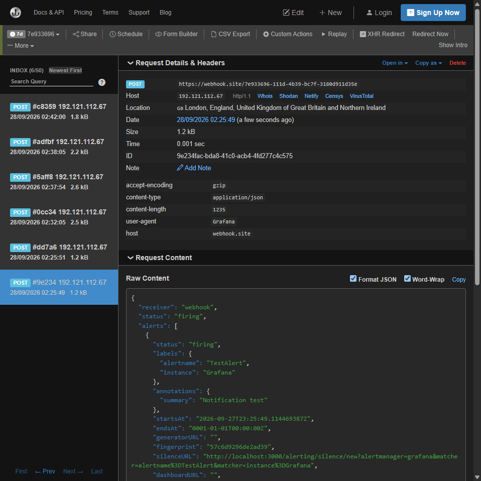
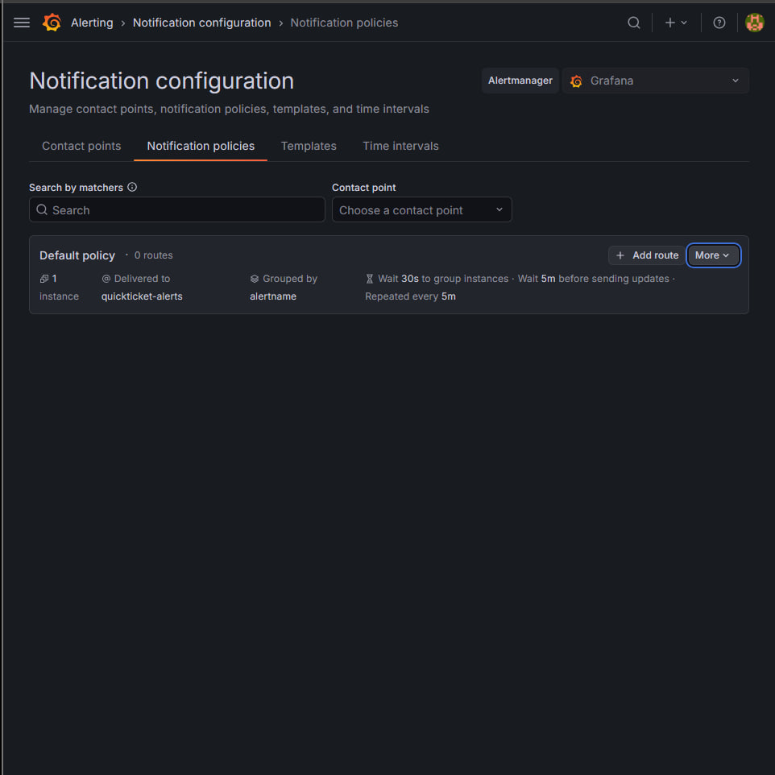
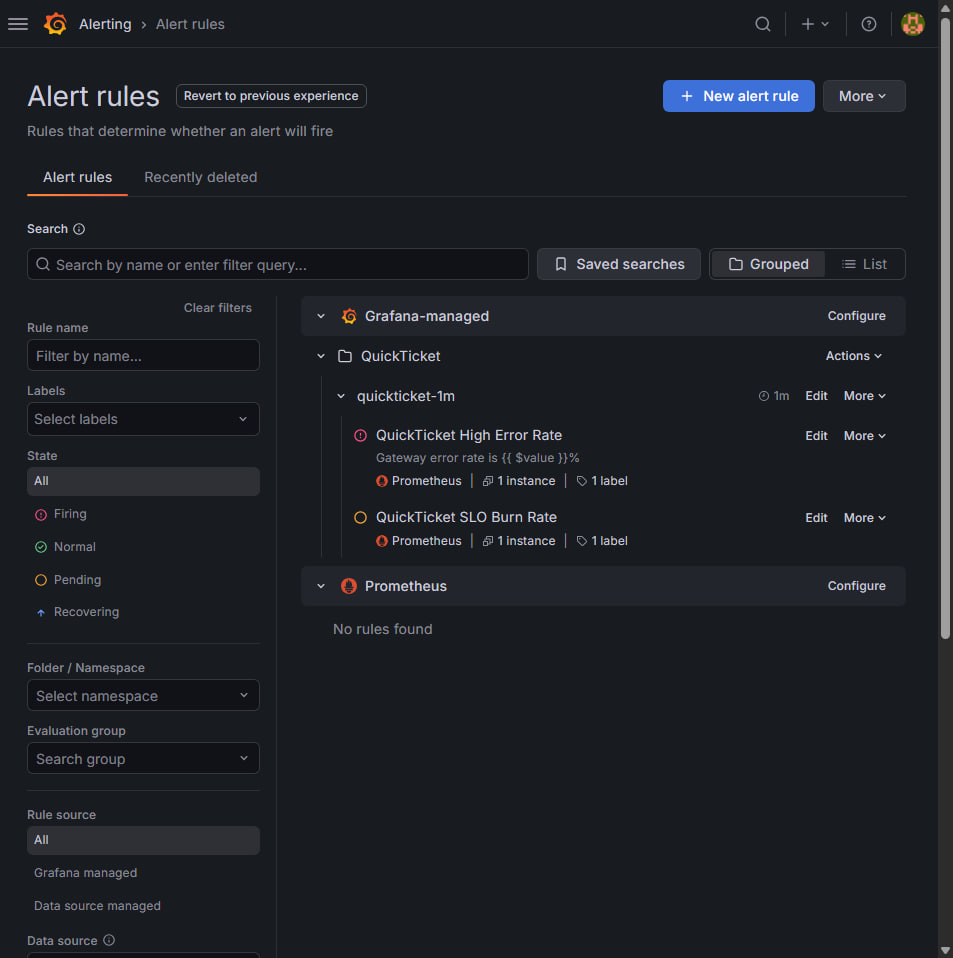
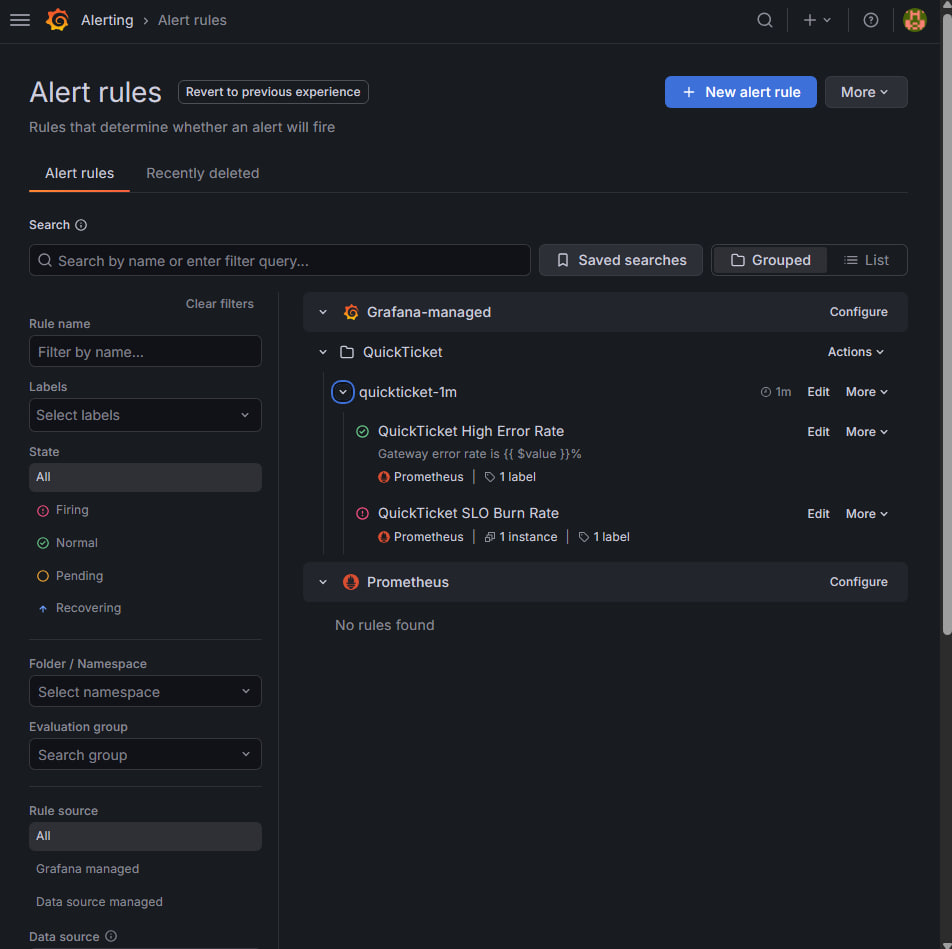

# Lab 6 — Alerting & Incident Response

## Alert Rules

### QuickTicket High Error Rate

PromQL:

    sum(rate(gateway_requests_total{status=~"5.."}[5m])) / sum(rate(gateway_requests_total[5m])) * 100

- Threshold: above 5%
- Evaluation interval: 1m
- Pending period: 2m
- Severity: critical

### QuickTicket SLO Burn Rate

PromQL:

    (1 - (sum(rate(gateway_requests_total{status!~"5.."}[30m])) / sum(rate(gateway_requests_total[30m])))) / (1 - 0.995)

- Threshold: above 6
- Evaluation interval: 1m
- Pending period: 5m
- Severity: warning

## Contact Point

- Name: `quickticket-alerts`
- Type: Webhook
- Group by: `alertname`
- Group wait: `30s`
- Repeat interval: `5m`

# Runbook: QuickTicket High Error Rate

## Alert

- Fires when: Gateway 5xx error rate > 5% for 2 minutes
- Dashboard: QuickTicket — Golden Signals

## Diagnosis

1. Check gateway health:

       curl -s http://localhost:3080/health | python3 -m json.tool

2. Check payments:

       curl -s http://localhost:8082/health

3. Check events:

       curl -s http://localhost:8081/health

4. Check recent logs:

       docker compose -f docker-compose.yaml -f ../docker-compose.monitoring.yaml logs gateway --tail=20 --since=5m
       docker compose -f docker-compose.yaml -f ../docker-compose.monitoring.yaml logs payments --tail=20 --since=5m

## Common Causes

| Cause | How to identify | Fix |
|---|---|---|
| Payments service down | Gateway health shows payments down | Restart payments |
| Payments high failure rate | Health OK but payment errors appear in logs | Restore `PAYMENT_FAILURE_RATE=0.0` |
| Events service down | Gateway health shows events down | Restart events |
| Database connection exhausted | Events logs show DB pool errors | Restart events and inspect DB connection limits |

## Escalation

- If not resolved within 10 minutes, escalate to the instructor/TA.


## Incident Timeline

| Time | Event |
|---|---|
| 02:34:44 | Payments service stopped; incident injected |
| 02:37:30 | QuickTicket High Error Rate entered Firing |
| 02:38:05 | Grafana webhook notification received |
| 02:38:46 | Alert manually confirmed in Grafana |
| 02:40:50 | Diagnosis completed; payments confirmed unavailable |
| 02:40:56 | Payments service restarted |
| ~02:41:00 | Gateway returned to healthy state |
| 02:46:34 | High Error Rate alert returned to Normal |

### Alert Delay

The High Error Rate alert fired approximately **2 minutes 46 seconds** after the
failure was injected.

The delay was expected because the rule was evaluated every 1 minute and required
the threshold to remain above 5% for a 2-minute pending period. The PromQL query
also uses a 5-minute rolling rate, so healthy requests from before the incident
initially diluted the error percentage.

The webhook notification arrived approximately **3 minutes 21 seconds** after
failure injection.

## Incident Evidence

During the incident, Prometheus measured a gateway 5xx error rate of approximately:

```text
7.94%
```

The Grafana webhook reported:

```text
Alert: QuickTicket High Error Rate
Status: firing
Severity: critical
Error rate: 8.005469601451404%
```

Gateway health during diagnosis showed:

```text
status: degraded
events: ok
payments: down
```

Gateway logs contained repeated payment failures followed by HTTP 502 responses.

After the payments service was restarted, gateway health returned to:

```text
status: healthy
events: ok
payments: ok
```

# Postmortem: QuickTicket Payments Service Outage

**Date:** 2026-09-28
**Duration:** 02:34:44 to approximately 02:41:00 service recovery
**Severity:** SEV-3
**Author:** MiniMaxC

## Summary

The QuickTicket payments service became unavailable during the simulated incident.
Payment requests through the gateway returned HTTP 502 responses, increasing the
gateway 5xx error rate above the configured 5% alert threshold.

The incident affected payment operations while non-payment event operations
continued to function normally.

## Timeline

| Time | Event |
|---|---|
| 02:34:44 | Payments service became unavailable |
| 02:37:30 | High Error Rate alert entered Firing |
| 02:38:05 | Webhook notification received |
| 02:38:46 | Alert observed in Grafana |
| 02:40:50 | Health checks and logs identified payments as the failed dependency |
| 02:40:56 | Payments service restarted |
| ~02:41:00 | Gateway health returned to healthy |
| 02:46:34 | High Error Rate alert returned to Normal |

## Root Cause

The payments dependency was unavailable, so gateway payment requests could not
reach the payments service. The gateway returned HTTP 502 responses for affected
payment requests.

The monitoring system correctly detected the resulting increase in 5xx responses.
Because the alert used a 5-minute rate window and a 2-minute pending period, alert
state changes occurred after the underlying service state changed.

## What Went Well

- The High Error Rate alert detected the incident automatically.
- The webhook notification was delivered successfully.
- The runbook directed the investigation toward gateway health and dependency checks.
- Gateway health clearly identified the payments dependency as down.
- Gateway logs showed payment errors and HTTP 502 responses.
- Restarting the payments service restored application health within seconds.

## What Went Wrong

- Detection was intentionally delayed by the alert evaluation and pending periods.
- The 5-minute rolling query caused the alert to remain firing several minutes after
  the service itself had recovered.
- The load generator had previously produced unrelated non-5xx failures, which made
  initial baseline validation more difficult.
- The monitoring configuration from the earlier lab required repair before the
  incident exercise could begin.

## Action Items

| Action | Owner | Priority |
|---|---|---|
| Add a direct payments availability alert using `up` or service health metrics | MiniMaxC | High |
| Keep the 5xx alert for user-impact detection alongside dependency alerts | MiniMaxC | High |
| Update the runbook to distinguish service recovery from alert recovery | MiniMaxC | Medium |
| Add a baseline validation step before incident injection | MiniMaxC | Medium |
| Improve load-generator reporting to separate 4xx and 5xx failures | MiniMaxC | Medium |

## Most Important Action Item

The most important action item is to add a direct payments availability alert.

The existing gateway 5xx alert detects user-visible impact, but it requires enough
failed requests to raise the rolling error rate above the threshold. A direct
dependency availability alert could identify the payments outage sooner while the
gateway error-rate alert continues to measure actual user impact.

## Screenshots

### High Error Rate Alert Firing



### Notification Policy



### Webhook Notification



### Alert Recovered


