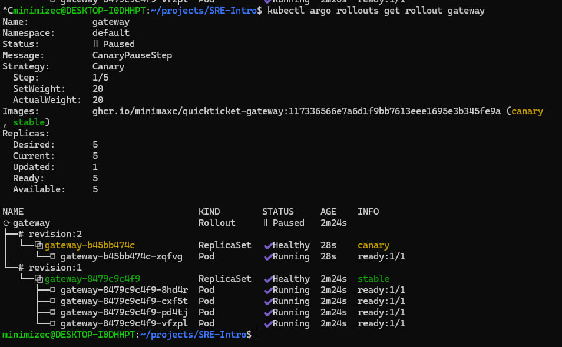
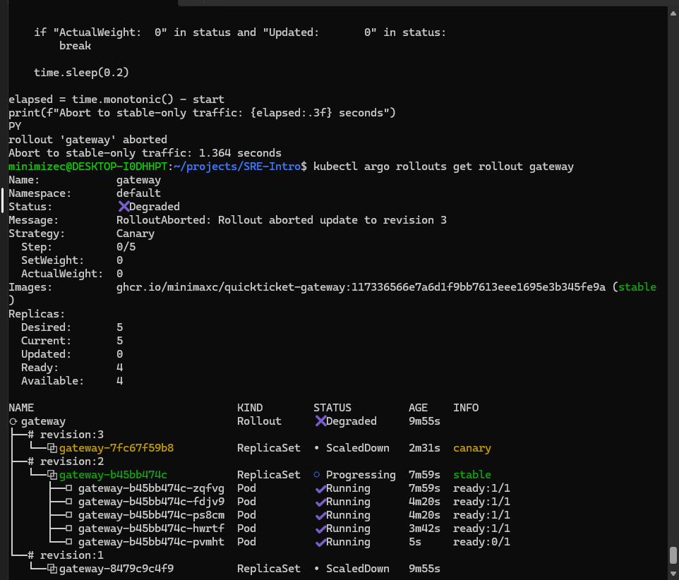
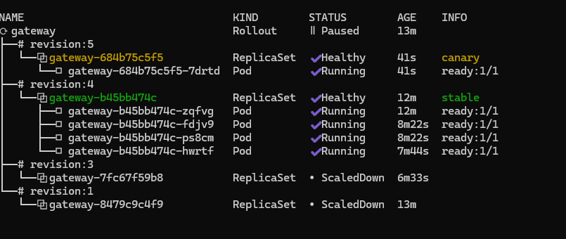
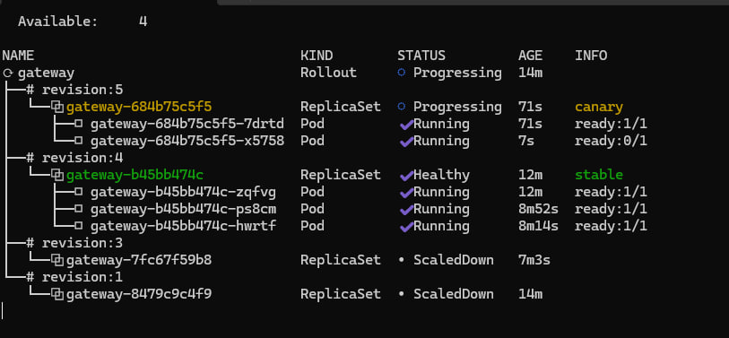
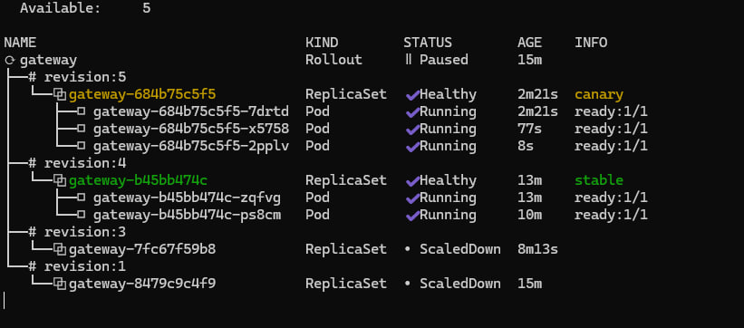
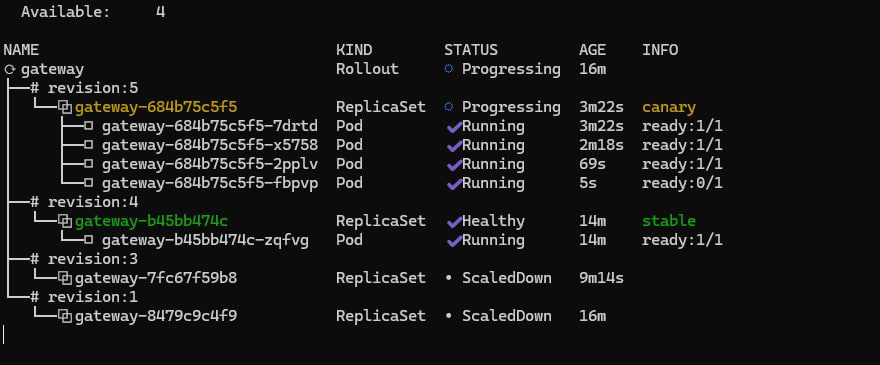
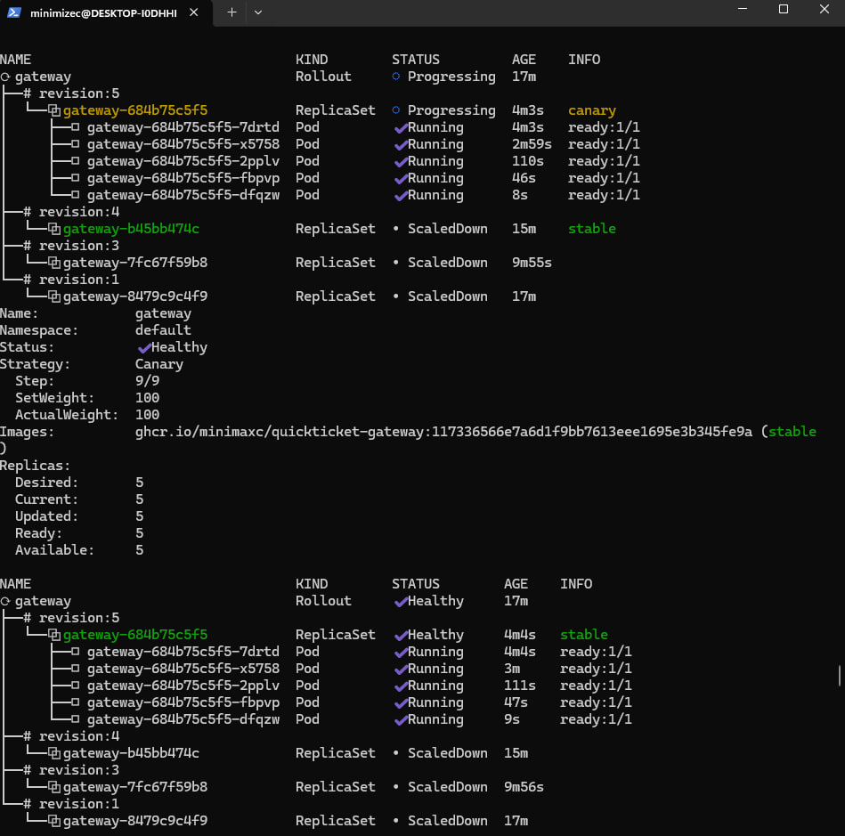

# Lab 7 — Progressive Delivery: Canary Deployments

## Task 1 — Manual Canary Deployment

### Argo Rollouts Version

```text
kubectl-argo-rollouts: v1.10.0+d90700a
BuildDate: 2026-08-27T15:22:01Z
GitCommit: d90700ae8d71d141561f0c546e19f999bb335cbd
Platform: linux/amd64
```

The Argo Rollouts controller was installed in the `argo-rollouts` namespace and
the `kubectl argo rollouts` plugin was installed successfully.

## Gateway Rollout

The gateway was converted from a Kubernetes `Deployment` to an Argo Rollout.

The initial strategy was:

```yaml
strategy:
  canary:
    steps:
      - setWeight: 20
      - pause: {}
      - setWeight: 60
      - pause:
          duration: 30s
      - setWeight: 100
```

The gateway uses five replicas so each replica represents approximately 20% of
traffic.

## Canary at 20%

After changing the pod template, Argo Rollouts created a new revision and paused
at the first canary step.

Observed state:

```text
Status: Paused
Step: 1/5
SetWeight: 20
ActualWeight: 20
Desired: 5
Updated: 1
Ready: 5
Available: 5
```

This consisted of one canary pod and four stable pods.

## Traffic Split Verification

An in-cluster load generator was used so traffic passed through the Kubernetes
Service and kube-proxy.

Observed request counts:

```text
gateway-8479c9c4f9-8hd4r  events_requests=15
gateway-8479c9c4f9-cxf5t  events_requests=12
gateway-8479c9c4f9-pd4tj  events_requests=19
gateway-8479c9c4f9-vfzpl  events_requests=25
gateway-b45bb474c-zqfvg   events_requests=17
```

The stable replicas received:

```text
15 + 12 + 19 + 25 = 71 requests
```

The canary replica received:

```text
17 requests
```

Total requests:

```text
88
```

Therefore the canary received:

```text
17 / 88 × 100 ≈ 19.3%
```

This closely matches the configured 20% canary weight.

## Manual Promotion

The canary was manually promoted using:

```text
kubectl argo rollouts promote gateway
```

It progressed from 20% to 60%, waited for the configured 30-second pause, and
then automatically completed at 100%.

Final state:

```text
Status: Healthy
Step: 5/5
SetWeight: 100
ActualWeight: 100
Desired: 5
Updated: 5
Ready: 5
Available: 5
```

## Bad Version and Abort

A new revision was created using:

```text
APP_VERSION=v3-bad
```

The rollout paused at 20% with one canary pod and four stable pods.

The rollout was then aborted:

```text
kubectl argo rollouts abort gateway
```

After abort:

```text
Status: Degraded
Message: RolloutAborted: Rollout aborted update to revision 3
SetWeight: 0
ActualWeight: 0
Updated: 0
```

The canary ReplicaSet was scaled down and the previous stable ReplicaSet
continued serving traffic.

## Abort Recovery Time

The abort was timed using a monotonic timer.

Measured result:

```text
Abort to stable-only traffic: 1.364 seconds
```

### Comparison with Lab 5

In Lab 5, the Git revert-based rollback took approximately 25 seconds.

Argo Rollouts returned traffic to the stable version in approximately 1.364
seconds.

The Rollout abort was significantly faster because the previous stable
ReplicaSet was already available. Argo Rollouts only needed to remove traffic
from the canary and scale it down.

The Git revert workflow required a source-control change followed by GitOps
synchronization and Kubernetes reconciliation before the previous version was
restored.

---

# Task 2 — Multi-Step Canary with Observation

## Multi-Step Strategy

The gateway Rollout was updated to:

```yaml
strategy:
  canary:
    steps:
      - setWeight: 20
      - pause:
          duration: 60s
      - setWeight: 40
      - pause:
          duration: 60s
      - setWeight: 60
      - pause:
          duration: 60s
      - setWeight: 80
      - pause:
          duration: 30s
      - setWeight: 100
```

## Rollout Observation

The rollout was observed using:

```text
kubectl argo rollouts get rollout gateway --watch
```

The updated replica count increased as expected:

| Canary Weight | Canary Replicas | Stable Replicas |
|---|---:|---:|
| 20% | 1 | 4 |
| 40% | 2 | 3 |
| 60% | 3 | 2 |
| 80% | 4 | 1 |
| 100% | 5 | 0 |

Traffic remained available while the canary was progressively scaled.

The final rollout state was:

```text
Status: Healthy
Step: 9/9
SetWeight: 100
ActualWeight: 100
Desired: 5
Current: 5
Updated: 5
Ready: 5
Available: 5
```

## Automated Abort Threshold

I would configure an automated abort at the first measurable canary stage,
20%, if the canary shows a significant increase in error rate.

At 20%, enough traffic reaches the new version to detect obvious failures while
80% of traffic is still served by the stable version. Aborting at this stage
limits the number of affected users and prevents a faulty version from
progressing to 40%, 60%, or higher traffic percentages.

## Summary

Task 1 demonstrated manual progressive delivery using Argo Rollouts, including
20% canary traffic, manual promotion, and rapid abort.

Task 2 demonstrated a five-stage progressive deployment with observation at
20%, 40%, 60%, 80%, and 100%.

The experiment showed that keeping the previous stable ReplicaSet available
allows Argo Rollouts to return traffic to a known-good version much faster than
a Git revert-based deployment workflow.

---

# Screenshots

## Task 1 Evidence

### Canary Paused at 20%



This shows the gateway Rollout paused at 20% with one canary replica and four
stable replicas.

### Abort and Recovery Timing



The bad canary was aborted and traffic returned to the stable revision in
approximately **1.364 seconds**. The canary ReplicaSet was scaled down and the
Rollout entered the expected `Degraded` state after abort.

## Task 2 Evidence

### 20% Canary



One of five replicas was running the canary revision.

### 40% Canary



Two of five replicas were running the canary revision.

### 60% Canary



Three of five replicas were running the canary revision.

### 80% Canary



Four of five replicas were running the canary revision.

### 100% and Healthy



The rollout completed successfully with all five replicas on the new revision
and the Rollout reporting `Healthy`.
