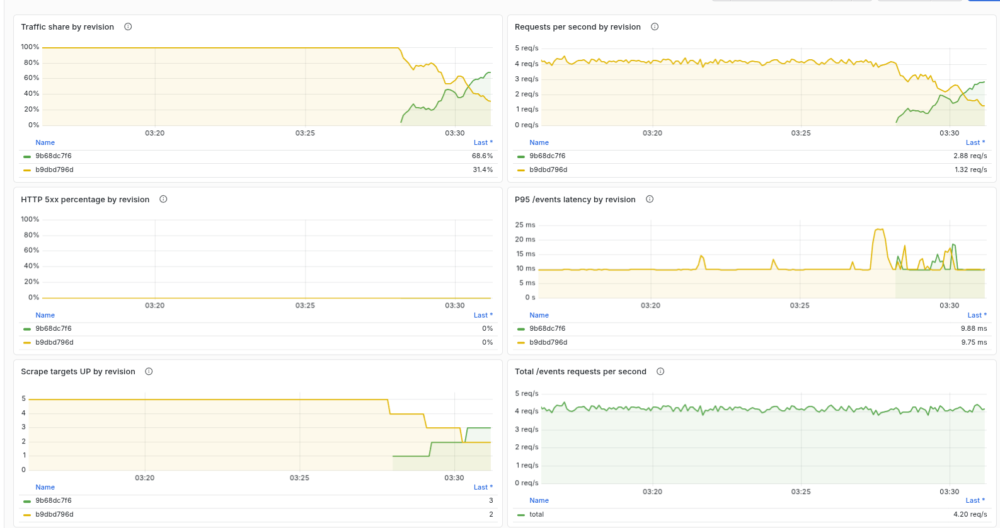

# Lab 7 — Progressive Delivery: Canary Deployments

**Student:** Damir Bayazitov  
**Branch:** `feature/lab7`  
**Date:** 2026-10-05

## Task 1 — Manual canary deployment

### Argo Rollouts installation

Installed Argo Rollouts controller and kubectl plugin **v1.10.0**. The controller ran in the `argo-rollouts` namespace.

The gateway manifest was converted from a Kubernetes Deployment to an Argo Rollout with five replicas. I used an `APP_VERSION` environment variable to distinguish revisions while keeping the same application image. Canary weights were 20%, 60%, and 100%.

### Canary traffic split and promotion

At the 20% step, the stable revision had four pods and the canary had one. During an in-cluster load test, Prometheus per-pod request counts showed:

| Revision | `/events` requests | Share | Non-200 responses |
|---|---:|---:|---:|
| Stable (`7d798c7b65`) | 232 | 76.82% | 0 |
| Canary (`b9dbd796d`) | 70 | 23.18% | 0 |
| **Total** | **302** | **100%** | **0** |

The canary was manually promoted. The Rollout reached `Healthy` with five ready replicas at 100%.

### Manual failure and abort

I introduced a broken Events URL in a test revision and kept the canary probes on `/metrics`, allowing the process to become ready while `/events` returned errors. I aborted that canary. The Rollout set its canary weight to 0 and scaled down the bad ReplicaSet. The measured time from the abort command to observing only stable pods in the ready gateway endpoints was **0.741 seconds**. At that observation, four stable endpoints were ready; the fifth stable pod became ready shortly afterwards. A subsequent sample of 100 requests to `/events` returned HTTP 200 after the abort.

For comparison, the Lab 5 GitOps revert took **330.057 seconds** from the recorded rollback start to observing Argo CD `Synced` and `Healthy` on the revert revision. That duration includes Git push, Argo CD refresh/reconciliation, and waiting for application health. The canary measurement is the time to observe stable-only ready endpoints, so the two measurements describe different completion conditions.

## Task 2 — Multi-step canary and Grafana observation

I configured five canary weights: 20%, 40%, 60%, 80%, and 100%, with pauses between steps. At the 20%, 40%, and 60% observations, the canary's replica count increased while the stable ReplicaSet scaled down. The dashboard showed both ReplicaSets receiving traffic; observed HTTP 5xx remained at 0% for both. Request latency stayed low during the observed rollout.

The rollout completed automatically at step 9/9, weight 100%, with all five replicas updated and ready (`Healthy`).

At what percentage should an automated abort happen? I would start evaluating at 20%, because that limits early exposure while still sending enough requests to measure the canary. I would abort as soon as the canary exceeds the error-rate or latency threshold; I would not wait for a later weight step after a clear regression.

## Bonus — Automated canary analysis with Prometheus

Prometheus discovered all five gateway pods and exposed each pod-template hash as `rs_hash`. The `gateway-error-rate` AnalysisTemplate used that hash to measure only the canary's HTTP 5xx ratio. It waited 60 seconds before measurement, queried a 60-second rate window every 20 seconds, and required the measured ratio to remain below 5%. The numerator maps a genuine zero-error result to zero; the denominator remains strict so missing traffic does not look like a successful canary.

### Good canary: automatic promotion

For revision `7d79dcbb87`, the AnalysisRun `gateway-7d79dcbb87-6-2` completed `Successful` with three measurements of `[0]`. No manual promotion was issued for this test. The Rollout reached `Healthy`, step 10/10, weight 100%, with five ready replicas.

### Bad canary: automatic abort

For revision `5bcbd9ff4`, I pointed `EVENTS_URL` at `http://127.0.0.1:9`. The canary still passed its `/metrics` probes, while `/events` requests failed. AnalysisRun `gateway-5bcbd9ff4-7-2` completed `Failed` after two failed measurements of `[1]` (100% errors), exceeding `failureLimit: 1`. Argo Rollouts automatically aborted the update: status `Degraded`, step 0/10, canary weight 0%, bad ReplicaSet scaled down. The stable revision remained active; after restoring the good manifest, the Rollout returned to `Healthy` with five ready replicas.

A further metric I would add is **canary p95 request latency**. A revision can return successful responses while becoming much slower. Tracking p95 alongside the 5xx ratio can prevent promoting a functionally correct version that degrades user experience or approaches the request timeout.

## Evidence

The accompanying `lab7-evidence/` directory contains the Rollouts version, paused/promoted/aborted and final states, per-pod traffic split, abort timing, Grafana screenshot, AnalysisTemplate, successful and failed AnalysisRuns, and final HTTP responses.
