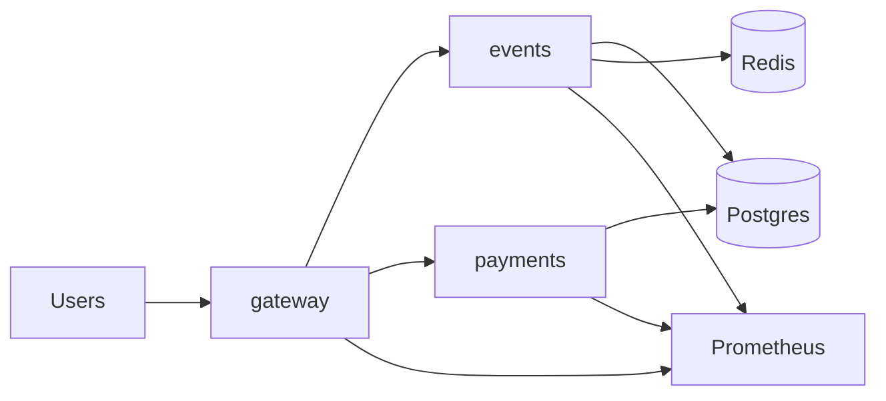

# QuickTicket SRE Handbook

## Architecture



QuickTicket is a small GitOps-managed app running on k3d.

- `gateway` is the entry point and load-balances traffic across replicas.
- `events` owns read paths and reservation logic.
- `payments` simulates downstream payment processing.
- `postgres` stores application state.
- `redis` is used for reservation/session-like coordination.
- `Prometheus` is the main observability source for SLO and chaos checks.

## How To Deploy

1. Make the change in the repo.
2. Push to the feature branch.
3. Apply or sync the manifests used by the lab.
4. Confirm pods are Ready and the rollout is healthy.
5. Verify with a quick smoke check against `gateway:8080`.

Practical commands:

```bash
kubectl get pods,svc,rollouts
kubectl rollout status deployment/gateway --timeout=60s
kubectl rollout status deployment/events --timeout=60s
kubectl rollout status deployment/payments --timeout=60s
```

If the app uses a new config map or env var, always confirm the rollout has actually picked up the change before testing again.

## Monitoring

What to check first:

- `gateway` 5xx rate and p99 latency.
- `/events` and `/events/{id}/reserve` latency, because `events` is the usual bottleneck.
- `payments` failure rate and artificial latency.
- Redis health when reserve calls start failing.
- Postgres availability and connection pool pressure when 500s increase without a gateway deployment.

Useful rule of thumb:

- If latency rises first, look for saturation or a slow dependency.
- If 5xx rises first, check the failing downstream service and recent rollout changes.
- If 409s rise, inventory contention is probably expected behavior, not an outage.

## Incident Response

1. Check whether this is a deployment issue, dependency issue, or pure load issue.
2. Look at the last known-good rollout state.
3. Compare 5xx, p99 latency, and service CPU.
4. If a single service is clearly bad, roll it back or remove the injected fault.
5. Re-run a small smoke test before declaring recovery.

Simple recovery pattern:

```bash
kubectl get pods -l app=gateway
kubectl get pods -l app=events
kubectl get pods -l app=payments
kubectl top pods -l app=gateway
kubectl top pods -l app=events
kubectl top pods -l app=payments
```

If the system is partially down but still serving, capture timestamps before changing anything. That makes RTO and postmortem analysis much easier.

## Backup / Restore

Lab 9 established the basic recovery flow:

- Use `pg_dump -Fc` for backups.
- Verify backup validity with `pg_restore --list`.
- Restore with `pg_restore --clean --if-exists`.
- Add a PVC if you want pod restarts to stop erasing state.

Operational checklist:

1. Confirm the backup file exists and is non-empty.
2. Test restore in a controlled way before a real incident.
3. Keep the restore steps scripted so they are repeatable.
4. Reconnect or restart the app if it holds stale DB connections after restore.

## Notes

- The biggest recurring risk in QuickTicket is not a hard crash; it is slow degradation that looks like "the app is mostly alive".
- When in doubt, measure before and after the change.
- Keep the load generator inside the cluster when testing capacity.
