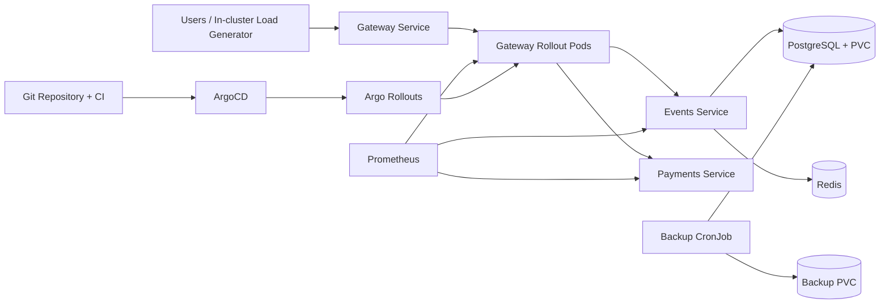

# QuickTicket SRE Handbook

## 1. Architecture



- The gateway is an Argo Rollout with five replicas in the validated lab topology.
- The gateway sends event reads and reservations to the events service and payment requests to the payments service.
- Events uses PostgreSQL for durable data and Redis for reservation holds.
- PostgreSQL data is stored on a PVC.
- A CronJob creates a custom-format PostgreSQL backup every five minutes and retains the five newest files.
- In-cluster Prometheus discovers and scrapes application pods.
- ArgoCD reconciles Kubernetes manifests from Git.
- Argo Rollouts performs weighted canary delivery and can run Prometheus-based analysis.

## 2. How to Deploy

### Normal GitOps flow

1. Create a feature branch.
2. Change application code or Kubernetes manifests.
3. Run local validation and tests.
4. Commit and push the branch.
5. Open and merge the pull request to the deployment branch.
6. GitHub Actions builds immutable images tagged with the commit SHA and pushes them to GHCR.
7. Update the manifest to the intended immutable image tag.
8. ArgoCD detects the Git change and reconciles the cluster.
9. For the gateway, Argo Rollouts creates a canary ReplicaSet and follows the configured weight steps.
10. Prometheus-based AnalysisRuns approve or reject the canary.

Useful checks:

```bash
kubectl get pods,svc
kubectl get rollout gateway
kubectl argo rollouts get rollout gateway --watch
kubectl get analysisrun
```

### Rollback

For a canary that is still progressing:

```bash
kubectl argo rollouts abort gateway
```

This restores traffic to the stable ReplicaSet in under five seconds in the observed lab.

For a GitOps deployment already committed to Git:

```bash
git revert <bad-commit>
git push
```

ArgoCD reconciles the reverted desired state. The observed full GitOps recovery took about 2 minutes 45 seconds.

Never rely on `kubectl edit` for persistent changes. ArgoCD treats manual edits as drift and restores the Git version.

## 3. Monitoring

### Golden signals

Check:

- Request rate by path and service.
- True 5xx ratio, excluding 409 inventory conflicts.
- p50, p95, and p99 latency.
- Gateway available replicas.
- Events database-pool usage and acquisition wait.
- Redis availability and command latency.
- PostgreSQL connections, locks, query latency, and storage.
- Canary metrics separated by ReplicaSet hash.

Core PromQL examples:

```promql
sum(rate(gateway_requests_total{status=~"5.."}[5m]))
/
sum(rate(gateway_requests_total[5m]))
```

```promql
histogram_quantile(
  0.99,
  sum by (le, path) (
    rate(gateway_request_duration_seconds_bucket[5m])
  )
)
```

```promql
kube_deployment_status_replicas_available{deployment="events"}
```

### Important alerts

- Gateway true 5xx greater than 0.5% for 2 minutes.
- SLO burn rate greater than 6.
- Payment p99 greater than 1 second.
- Events DB pool greater than 80% used or any waiting requests.
- Redis unavailable for 30 seconds.
- Gateway ready replicas below desired for 1 minute.
- Canary p99 greater than 500 ms or canary 5xx greater than 5%.

### Known observability limitations

- Aggregate gateway error rate can hide payment-only failures.
- Low-volume endpoints can produce `NaN` p99 values over short windows.
- AnalysisRun history disappears when the cluster is recreated unless exported.
- CPU alone does not prove saturation; connection pools and queues must also be monitored.

## 4. Incident Response

### First five minutes

1. Acknowledge the alert and record the start time.
2. Check gateway health and ready replicas.
3. Check the golden-signals dashboard.
4. Separate 409 conflicts from true 5xx.
5. Identify whether the fault is gateway, events, payments, Redis, or PostgreSQL.
6. Stop an unsafe canary immediately.
7. Restore the last known-good configuration.
8. Confirm error rate and latency return to baseline.

Commands:

```bash
kubectl get pods -o wide
kubectl get rollout gateway
kubectl logs -l app=gateway --tail=100
kubectl logs -l app=events --tail=100
kubectl logs -l app=payments --tail=100
kubectl top pods
```

### Common failure patterns

| Symptom | Likely cause | Immediate action |
|---|---|---|
| Canary 5xx spike | Bad gateway image or dependency configuration | Abort rollout |
| `/pay` slow or 504 | Payment latency above gateway timeout | Restore payment latency/failure settings |
| Reads and reservations both fail | Redis caused events service failure, or events unavailable | Restore Redis/events and inspect startup dependency handling |
| Reservation latency grows | DB pool pressure | Scale events, restore pool size, inspect waiting connections |
| New pod never becomes ready | Bad image tag or failing readiness probe | Revert Git change or abort canary |
| Brief errors during pod termination | Endpoint drain race | Add preStop delay and termination grace period |

### Escalation

Escalate if:

- The incident is not mitigated within 10 minutes.
- PostgreSQL data integrity is uncertain.
- A backup restore is required.
- All gateway or events replicas are unavailable.
- Error rate remains above 0.5% after rollback.

Keep a timeline, preserve logs, record commands, and write a blameless postmortem for material incidents.

## 5. Backup and Restore

### Current protection

- PostgreSQL data is stored on a PVC.
- Pod restarts preserve data.
- Observed pod-restart recovery time: 136 seconds.
- Observed row loss during pod restart: zero.
- A CronJob runs every five minutes.
- The backup job keeps the five newest custom-format dumps.
- Maximum backup-based RPO: five minutes.

### Verify backups

```bash
kubectl get cronjob postgres-backup
kubectl get jobs --sort-by=.metadata.creationTimestamp
kubectl exec deployment/backup-inspector -- ls -lh /backups
```

### Create an immediate backup

```bash
POD=$(kubectl get pod -l app=postgres -o jsonpath='{.items[0].metadata.name}')
kubectl exec "$POD" -- pg_dump -U quickticket -Fc quickticket > /tmp/quickticket.dump
```

### Restore procedure

1. Announce maintenance and stop write traffic.
2. Verify the selected backup timestamp.
3. Take a final backup if the database is still readable.
4. Restore into a clean database.
5. Verify schema and row counts.
6. Start application traffic.
7. Smoke-test `/events`, reservation, payment, and `/health`.
8. Confirm Prometheus signals are normal.

Example:

```bash
kubectl exec "$POD" -- pg_restore \
  -U quickticket \
  -d quickticket \
  --clean \
  --if-exists \
  /tmp/backup.dump
```

Validation:

```bash
kubectl exec "$POD" -- psql -U quickticket -d quickticket \
  -c 'SELECT COUNT(*) FROM events;'

kubectl exec "$POD" -- psql -U quickticket -d quickticket \
  -c 'SELECT COUNT(*) FROM orders;'
```

The restore is complete only after the API returns 200 and expected row counts are present.

## 6. Capacity and Reliability Notes

- Validated healthy load: 36.94 RPS at 50 users.
- First unreliable level: approximately 73 RPS at 100 users.
- The events service is the first scaling target.
- A preliminary 2× plan uses 8 gateway replicas, 3 events replicas, and 2 payments replicas.
- Redis CPU is low, but a production deployment still needs replication because availability, not CPU, is the risk.
- PostgreSQL should remain a controlled single-writer path with PgBouncer, explicit connection budgets, backups, and optionally a standby.
- Every scaling change must be validated with the same in-cluster Locust scenario and a separate full-checkout scenario that exercises payments.
