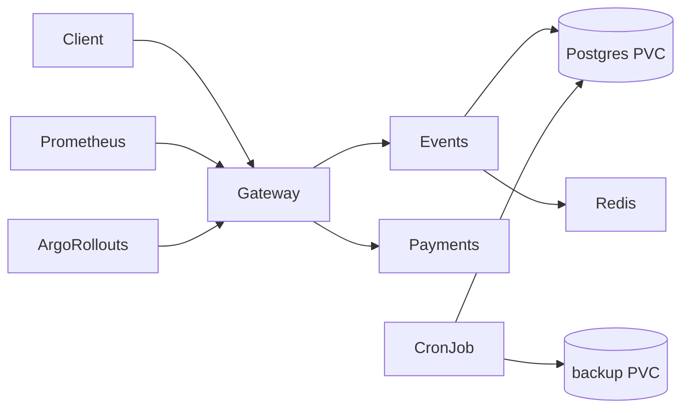

# QuickTicket SRE Handbook

Condensed operational guide for the k3d QuickTicket stack.

---

## Architecture



| Service | Role | Replicas | Notes |
|---------|------|----------|-------|
| **gateway** | API edge, routing, timeouts | 5 (Rollout) | Canary via Argo Rollouts |
| **events** | Ticket inventory, reservations | 1 | Postgres + Redis; bottleneck under load |
| **payments** | Payment processing | 1 | Fault injection via env vars |
| **postgres** | Persistent orders/events | 1 | `postgres-data` PVC |
| **redis** | Reservation holds | 1 | Ephemeral holds, `FLUSHDB` before load tests |
| **prometheus** | In-cluster metrics | 1 | `monitoring` namespace |

**Request flow:** `GET /events` → events/Postgres. `POST /reserve` → events/Redis+Postgres. `POST /pay` → payments → events confirm.

---

## How to Deploy

GitOps flow (Lab 5):

1. Push code to `main` → GitHub Actions builds images to `ghcr.io/<user>/quickticket-*:<sha>`
2. CI updates image tags in `k8s/*.yaml` and commits back
3. ArgoCD syncs cluster state from the repo (~3 min poll)

**Manual deploy (first time / local):**

```bash
k3d cluster create quickticket
k3d image import ghcr.io/<user>/quickticket-gateway:<tag> ... -c quickticket
kubectl apply -f k8s/postgres.yaml -f k8s/redis.yaml -f k8s/events.yaml \
               -f k8s/payments.yaml -f k8s/gateway.yaml -f k8s/analysis-template.yaml
kubectl apply -f labs/lab7/prometheus.yaml
kubectl exec -i $(kubectl get pod -l app=postgres -o name) -- \
  psql -U quickticket -d quickticket < app/seed.sql
```

**Canary rollout:** change `APP_VERSION` in `k8s/gateway.yaml` → Argo Rollouts steps 20%→50%→100% with AnalysisTemplate error-rate check.

**Rollback:** `kubectl argo rollouts abort gateway` (~2–3s) or `git revert` + push (~2–5 min).

---

## Monitoring

**Port-forward Prometheus UI:**

```bash
kubectl port-forward -n monitoring svc/prometheus 9091:9090
```

| Check | Query / command | When to use |
|-------|-----------------|-------------|
| Traffic | `sum(rate(gateway_requests_total[1m]))` | Baseline RPS |
| Error rate | `sum(rate(gateway_requests_total{status=~"5.."}[5m])) / sum(rate(gateway_requests_total[5m]))` | Incident triage |
| p99 latency | `histogram_quantile(0.99, sum by (le,path)(rate(gateway_request_duration_seconds_bucket[5m])))` | Slow-but-successful deps |
| SLO burn | `gateway:error_budget_burn_rate:ratio_rate5m` | Budget exhaustion |
| Per-pod | `sum by (pod)(rate(gateway_requests_total[1m]))` | Canary traffic split |
| Rollout | `kubectl argo rollouts get rollout gateway` | Deploy status |

**SLO targets:** 99.5% availability, 95% requests < 500ms (Lab 3).

**Alerts (Grafana, Lab 6):** error rate > 5% (critical), SLO burn rate > 6× (warning).

---

## Incident Response

### High error rate (5xx > 5%)

1. `curl -s http://gateway:8080/health | python3 -m json.tool` — which dependency is down?
2. Check pods: `kubectl get pods -l app=gateway,events,payments`
3. Logs: `kubectl logs deployment/events --tail=30`, `kubectl logs deployment/payments --tail=30`
4. Common fixes:

| Symptom | Cause | Fix |
|---------|-------|-----|
| `events: down` | Postgres/Redis unreachable | Restart dependency; `kubectl rollout restart deployment/events` |
| `payments: down` | Payments pod crash | `kubectl rollout restart deployment/payments` |
| High latency, 0% 5xx | Slow dependency (Lab 8) | Check `PAYMENT_LATENCY_MS`; add latency alert |
| 502 on `/events` | Events CPU/pool saturated | Scale events replicas; raise `DB_MAX_CONNS` |

5. **Escalation:** unresolved after 10 min → page instructor / platform team.

### Redis down

- Reads (`GET /events`) still work; reserves fail with 504.
- Fix: `kubectl scale deployment/redis --replicas=1`

### Postgres pod crash (with PVC)

- Data survives on PV; restart events pool: `kubectl rollout restart deployment/events`
- Without PVC: restore from latest CronJob dump (see below).

---

## Backup / Restore

**Automated backups** (Lab 9 Bonus): CronJob `postgres-backup` every 5 min → `postgres-backups` PVC, keeps 5 newest dumps.

```bash
kubectl apply -f labs/lab9/backup-storage.yaml -f k8s/backup-cronjob.yaml
kubectl exec deployment/backup-inspector -- ls -la /backups
```

**Manual backup:**

```bash
kubectl exec -i $(kubectl get pod -l app=postgres -o name) -- \
  pg_dump -U quickticket -Fc quickticket > /tmp/quickticket.dump
```

**Restore after data loss:**

```bash
POD=$(kubectl get pod -l app=postgres -o name | cut -d/ -f2)
kubectl cp /tmp/quickticket.dump $POD:/tmp/backup.dump
kubectl exec $POD -- pg_restore -U quickticket -d quickticket --clean --if-exists /tmp/backup.dump
kubectl rollout restart deployment/events
```

**RPO:** time since last dump (~5 min with CronJob). **RTO with PVC:** ~10s (pod restart). **RTO without PVC:** ~9s + manual restore.

**Migrations:** `alembic upgrade head` (nullable columns safe under load).
