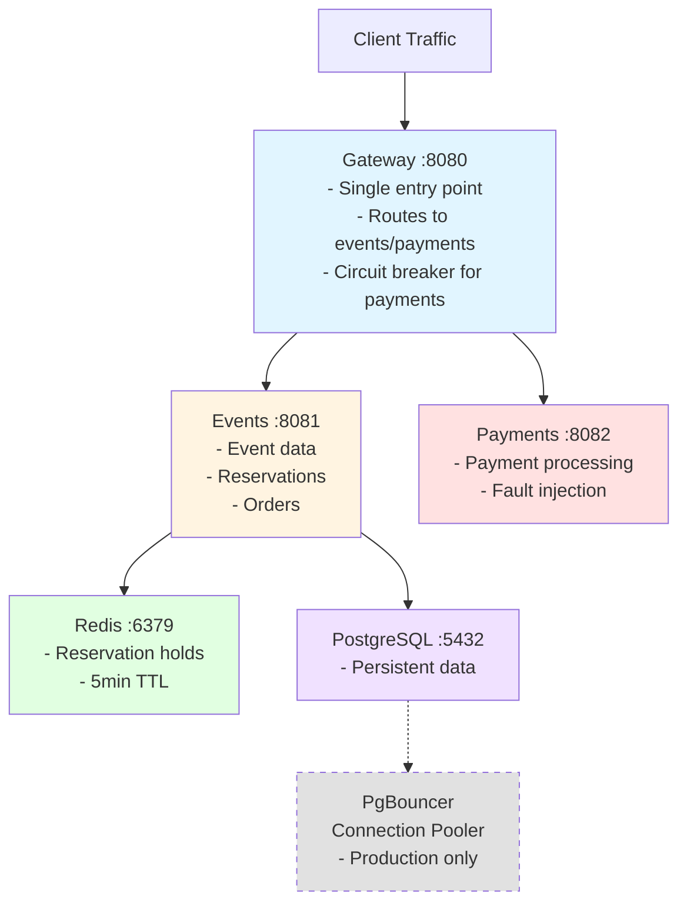

# QuickTicket SRE Handbook

## Architecture

QuickTicket is a ticketing platform with a microservices architecture deployed on Kubernetes:



**Key Components:**
- **Gateway:** FastAPI service, routes requests, implements graceful degradation
- **Events:** FastAPI service, manages events, reservations, orders
- **Payments:** FastAPI service, processes payments, supports fault injection
- **Redis:** Stores reservation holds (5-minute TTL)
- **PostgreSQL:** Persistent event and order data
- **PgBouncer:** Connection pooler for PostgreSQL (production)

**Monitoring Stack:**
- Prometheus: Metrics collection (15s scrape interval)
- Grafana: Dashboards and alerting
- Custom metrics: Request duration, error rates, DB pool size

## How to Deploy

### Prerequisites
- k3d cluster running
- kubectl configured
- GitHub repository with ArgoCD access

### GitOps Deployment Flow

1. **Push code changes to GitHub**
   ```bash
   git add .
   git commit -m "feat: your change description" # or fix:, docs:
   git push origin main
   ```

2. **GitHub Actions CI automatically:**
   - Builds container images for gateway, events, payments
   - Pushes images to ghcr.io with SHA tags
   - Updates k8s manifests with new image tags
   - Commits and pushes manifest updates

3. **ArgoCD detects Git changes:**
   - Polls repository every 3 minutes (automated sync policy)
   - Applies new manifests to cluster
   - Rolls out changes with zero-downtime deployments

4. **Verify deployment:**
   ```bash
   kubectl get pods -l app=gateway
   kubectl get pods -l app=events
   kubectl get pods -l app=payments
   kubectl argocd app get quickticket
   ```

### Manual Rollback

If a deployment causes issues:

1. **Revert the Git commit:**
   ```bash
   git revert <bad-commit-sha>
   git push origin main
   ```

2. **ArgoCD will automatically sync the revert** (~40 seconds to healthy)

3. **For immediate rollback without Git:**
   ```bash
   kubectl rollout undo deployment gateway
   kubectl rollout undo deployment events
   kubectl rollout undo deployment payments
   ```

### Canary Rollouts (Lab 7+)

For gateway deployments, Argo Rollouts provides canary releases:

1. **Update gateway image tag in k8s/gateway.yaml**
2. **Argo Rollouts automatically:**
   - Deploys canary with 20% traffic
   - Runs AnalysisTemplate metrics checks (error rate, latency)
   - Promotes to 100% if metrics pass
   - Auto-rolls back if metrics fail

3. **Monitor canary progress:**
   ```bash
   kubectl argo rollouts get rollout gateway --watch
   kubectl get analysisrun
   ```

**Manual canary abort (if needed):**
```bash
kubectl argo rollouts abort gateway
```

**Canary abort vs git revert:**
- Canary abort: 5-10 seconds (kills canary pods, keeps stable)
- Git revert: ~40 seconds (requires rebuild and redeploy)
- Use canary abort for quick rollback during canary phase

## Monitoring

### Key Dashboards

**QuickTicket — Golden Signals** (Grafana)
- Request rate (RPS)
- Error rate (5xx percentage)
- Latency (p50, p95, p99)
- Saturation (DB pool size)

**QuickTicket — SLO Status**
- Availability gauge (target: 99.5%)
- Latency gauge (target: 95% under 500ms)
- Error budget burn rate

### Critical PromQL Queries

**Error Rate Alert:**
```promql
sum(rate(gateway_requests_total{status=~"5.."}[5m])) / sum(rate(gateway_requests_total[5m])) * 100 > 5
```

**SLO Burn Rate:**
```promql
(1 - (sum(rate(gateway_requests_total{status!~"5.."}[30m])) / sum(rate(gateway_requests_total[30m])))) / (1 - 0.995) > 1
```

**DB Pool Saturation:**
```promql
events_db_pool_size > 8
```

**Latency SLO:**
```promql
histogram_quantile(0.95, sum(rate(gateway_request_duration_seconds_bucket[5m])) by (le)) > 0.5
```

### Alert Thresholds

- **Critical:** Error rate > 5% for 2 minutes
- **Warning:** SLO burn rate > 1 for 5 minutes
- **Warning:** DB pool size > 8 (80% of max)
- **Warning:** p95 latency > 500ms for 5 minutes
- **Warning:** Redis connectivity failures (from Lab 8 chaos experiments)

## Incident Response

### High Error Rate Alert

**Severity:** SEV-2
**Escalation:** SRE Team → Platform Lead (10 min if unresolved)

**Diagnosis Steps:**
1. Check health endpoint: `curl -s http://localhost:3080/health | python3 -m json.tool`
2. Check payments health: `kubectl exec -it <payments-pod> -- curl http://localhost:8082/health`
3. Check events health: `kubectl exec -it <events-pod> -- curl http://localhost:8081/health`
4. Check recent logs:
   ```bash
   kubectl logs -l app=gateway --tail=100 --since=5m
   kubectl logs -l app=payments --tail=100 --since=5m
   kubectl logs -l app=events --tail=100 --since=5m
   ```

**Common Causes & Fixes:**

| Cause                      | Identification                      | Fix                                                  |
|----------------------------|-------------------------------------|------------------------------------------------------|
| Payments service down      | health shows payments: down         | `kubectl rollout restart deployment payments`        |
| Payments high failure rate | health shows failure_rate > 0       | Check/set PAYMENT_FAILURE_RATE env var               |
| Events service down        | health shows events: down           | `kubectl rollout restart deployment events`          |
| Redis connection refused   | events logs show Redis errors       | `kubectl rollout restart deployment redis`           |
| DB pool exhausted          | events_db_pool_size = 10            | Scale events deployment, add PgBouncer               |
| Redis hard dependency      | /events returns 502 when Redis down | Implement cache-aside fallback to DB (Lab 8 finding) |

**Escalation Path:**
1. On-call SRE (immediate)
2. SRE Team Lead (5 min if unresolved)
3. Platform Engineering (10 min if unresolved)

### Reservation Failures Alert

**Severity:** SEV-3
**Escalation:** SRE Team (15 min if unresolved)

**Diagnosis Steps:**
1. Check Redis connectivity: `kubectl exec -it <redis-pod> -- redis-cli ping`
2. Check Redis memory: `kubectl exec -it <redis-pod> -- redis-cli INFO memory`
3. Check events logs for Redis errors
4. Test reservation endpoint directly

**Common Causes & Fixes:**

| Cause                    | Identification                                    | Fix                                        |
|--------------------------|---------------------------------------------------|--------------------------------------------|
| Redis container stopped  | `kubectl get pods` shows redis not running        | `kubectl rollout restart deployment redis` |
| Redis out of memory      | Redis logs show OOM, INFO memory shows high usage | Increase Redis memory limit in deployment  |
| Redis connection refused | `redis-cli ping` fails                            | Check Redis service, restart if needed     |

### Post-Incident Actions

1. **Write blameless postmortem** (template in Lab 6)
2. **Create action items** with owners and priorities
3. **Update runbooks** based on learnings
4. **Review alert thresholds** if detection was delayed

## Backup/Restore

### PostgreSQL Backups

**Automated Backups:**
- CronJob runs daily at 2 AM UTC
- Backup stored as PVC snapshot
- Retention: 7 days

**Manual Backup:**
```bash
kubectl exec -it <postgres-pod> -- pg_dump -U quickticket quickticket > backup.sql
kubectl cp backup.sql <backup-inspector-pod>:/tmp/
```

**Restore from Backup:**
1. Scale down events deployment: `kubectl scale deployment events --replicas=0`
2. Restore to postgres: `kubectl exec -i <postgres-pod> -- psql -U quickticket -d quickticket < backup.sql`
3. Scale up events: `kubectl scale deployment events --replicas=1`
4. Verify: `curl -s http://localhost:3080/events`

### Backup Inspector

Lab 9 provides a backup inspector pod to verify backups:

```bash
kubectl exec -it backup-inspector-<hash> -- psql -U quickticket -d quickticket -c "SELECT COUNT(*) FROM events;"
```

### Disaster Recovery

**If cluster is lost:**
1. Restore k3d cluster from backup
2. Re-apply k8s manifests: `kubectl apply -f k8s/`
3. Restore PostgreSQL from latest backup
4. Verify all services: `kubectl get pods`

**If data is corrupted:**
1. Identify last good backup timestamp
2. Restore PostgreSQL from that backup
3. Replay any missed transactions from logs (if available)

## Load Testing

### Running Locust Tests

**Setup:**
```bash
cp labs/lab10/locustfile.py locustfile.py
kubectl create configmap locustfile --from-file=locustfile.py=locustfile.py --dry-run=client -o yaml | kubectl apply -f -
```

**Flush Redis before testing:**
```bash
kubectl exec -i $(kubectl get pod -l app=redis -o name) -- redis-cli FLUSHDB
```

**Run load test (example: 25 users):**
```bash
kubectl apply -f load-25.yaml
kubectl logs job/load-25 -f
```

**Known Breaking Point:**
- 25 users (17.57 RPS) - 5xx error rate exceeds 0.5%
- System is not CPU-bound; failures due to connection limits

### Capacity Planning

**Current capacity:** 17.57 RPS (25 users)
**For 2x traffic (35 RPS):**
- Gateway: 3 replicas
- Events: 2 replicas
- Payments: 1 replica
- Add PgBouncer for connection pooling
- Estimated cost: $45/month

## SRE Principles Applied

1. **Error Budgets:** SLO targets with 99.5% availability, 95% latency
2. **Blameless Culture:** Postmortems focus on system improvement, not individual blame
3. **Automation:** CI/CD pipeline, automated rollbacks, GitOps deployment
4. **Monitoring:** Golden signals, SLO tracking, proactive alerting
5. **Capacity Planning:** Load testing, horizontal scaling, cost optimization
6. **Toil Reduction:** Automated image tagging, GitOps sync, self-healing deployments
7. **Chaos Engineering:** Proactive failure injection to test resilience
8. **Progressive Delivery:** Canary deployments with automated analysis