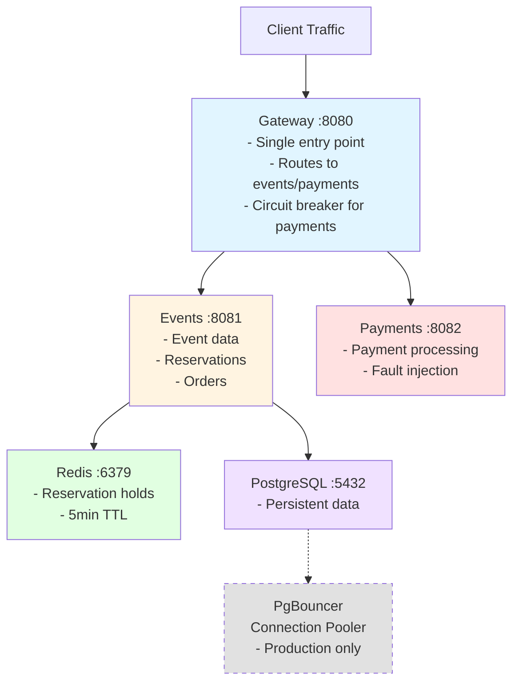

# QuickTicket SRE Handbook

## Architecture



**Components:** Gateway (routes, circuit breaker), Events (data, reservations), Payments (processing), Redis (holds), PostgreSQL (persistent), PgBouncer (pooler). **Monitoring:** Prometheus (15s scrape), Grafana dashboards.

## How to Deploy

**GitOps Flow:** Push to GitHub → CI builds images → updates manifests → ArgoCD syncs to cluster (~40s).

   ```bash
   git add .
   git commit -m "feat: your change description" # or fix:, docs:
   git push origin main
   ```

**Canary abort vs git revert:**
- Canary abort: 5-10 seconds (kills canary pods, keeps stable)
- Git revert: ~40 seconds (requires rebuild and redeploy)
- Use canary abort for quick rollback during canary phase

## Monitoring

**Dashboards:** Golden Signals (RPS, error rate, latency, DB pool), SLO Status (99.5% availability, 95% latency).

**Key Queries:**
- Error rate: `sum(rate(gateway_requests_total{status=~"5.."}[5m])) / sum(rate(gateway_requests_total[5m])) * 100 > 5`
- SLO burn: `(1 - sum(rate(gateway_requests_total{status!~"5.."}[30m])) / sum(rate(gateway_requests_total[30m]))) / (1 - 0.995) > 1`
- DB pool: `events_db_pool_size > 8`
- Latency: `histogram_quantile(0.95, sum(rate(gateway_request_duration_seconds_bucket[5m])) by (le)) > 0.5`

**Alerts:** Critical: error rate > 5% (2m). Warning: SLO burn > 1 (5m), DB pool > 8, p95 > 500ms, Redis failures.

## Incident Response

**SEV-2 High Error Rate:** Check `/health` → payments/events health → logs. Fixes: restart payments/service, set PAYMENT_FAILURE_RATE=0, restart Redis, scale events + PgBouncer. Escalate: SRE → Lead (10m).

**SEV-3 Reservation Failures:** Check `redis-cli ping` → memory → logs. Fixes: restart Redis, increase memory limit. Escalate: SRE (15m).

**Post-Incident:** Write blameless postmortem, create action items, update runbooks, review thresholds.

## Backup/Restore

**Automated:** Daily CronJob at 2 AM UTC, PVC snapshot, 7-day retention.

**Manual:** `kubectl exec -it <postgres> -- pg_dump -U quickticket quickticket > backup.sql`

**Restore:** `kubectl scale deployment events --replicas=0` → `kubectl exec -i <postgres> -- psql -U quickticket -d quickticket < backup.sql` → scale up → verify.

**Verify:** `kubectl exec -it backup-inspector-<hash> -- psql -U quickticket -d quickticket -c "SELECT COUNT(*) FROM events;"`

**Disaster Recovery:** Cluster lost → restore k3d → `kubectl apply -f k8s/` → restore Postgres → verify. Data corrupted → identify good backup → restore → replay logs.