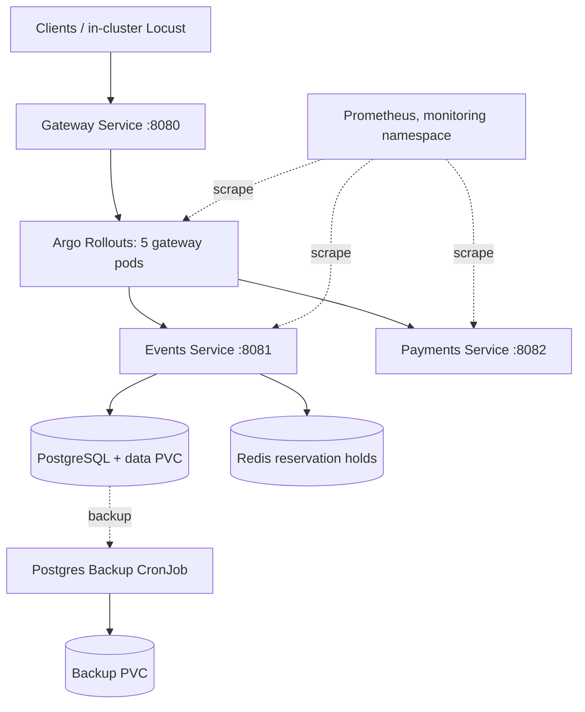

# QuickTicket — SRE Operations Handbook

**Lab 10 Bonus (Option B)** · **Environment:** k3d / Kubernetes · **Updated:** 2026-10-09

## 1. Architecture


```mermaid
flowchart TD
    U[Clients / in-cluster Locust] --> S[Gateway Service :8080]
    S --> G[Argo Rollouts: 5 gateway pods]
    G --> E[Events Service :8081]
    G --> P[Payments Service :8082]
    E --> DB[(PostgreSQL + data PVC)]
    E --> R[(Redis reservation holds)]
    B[Postgres Backup CronJob] --> BP[(Backup PVC)]
    DB -. backup .-> B
    M[Prometheus, monitoring namespace] -. scrape .-> G
    M -. scrape .-> E
    M -. scrape .-> P
```

- **Gateway** routes user requests and checks dependencies; **Events** handles listings/reservations; **Payments** models payment calls; **PostgreSQL** stores durable records; **Redis** stores temporary reservation holds.
- **Argo Rollouts** implements canary analysis and abort. The latest inspected state was `Degraded` after a failed canary, but five stable gateway replicas were available.
- **Monitoring** uses Prometheus and the golden-signals work from prior labs. Database storage and backup archives use separate PVCs.
- **Ownership rule:** do not run a standalone `Deployment/gateway` alongside `Rollout/gateway` with the same Service selector. Lab 10 found six backend endpoints until the older Deployment was scaled to zero.

## 2. Deploy with GitOps

1. Make the change in a feature branch; run local unit/static checks and verify Kubernetes YAML. Open a PR and merge to `main` after review.
2. The repository `.github/workflows/ci.yml` runs on pushes to `main` (except auto-generated `ci:` commits): builds and pushes three images to GHCR, updates the tags in `k8s/*.yaml`, commits and pushes the manifest changes.
3. Verify your Argo CD Application actually tracks the expected path and branch and has synced the new manifests. Do not equate a manifest commit with a successful deployment.
4. Observe the canary: `kubectl argo rollouts get rollout gateway --watch`; confirm AnalysisRuns and that the rollout reaches `Healthy`. If analysis fails, inspect the cause before retrying; stable traffic should remain on the previous healthy ReplicaSet.

```bash
kubectl get pods,svc,rollouts
kubectl get analysisruns.argoproj.io
kubectl argo rollouts get rollout gateway
kubectl get endpointslices -l kubernetes.io/service-name=gateway -o wide
```

For a stuck or aborted rollout, inspect `kubectl describe rollout gateway` and the associated AnalysisRun. Coordinate fixes through the GitOps source; do not use an untracked manual image change as a permanent solution.

## 3. Monitoring and everyday checks

```bash
kubectl get pods -o wide
kubectl get pods -n monitoring
kubectl top pods -l app=gateway
kubectl top pods -l app=events
kubectl logs deployment/events --since=15m --tail=100
kubectl get pvc
```

Use Prometheus / Grafana to check: **traffic (RPS)**, **errors (5xx separately from expected 409)**, **latency (p50/p95/p99)**, and **saturation** (CPU/memory, DB pool and connections). Example metric names in this lab include `gateway_requests_total` and golden-signal dashboard latency metrics. Verify actual histogram names/labels in Prometheus before writing PromQL; do not assume missing metrics exist.

**Useful alert candidates:** sustained p99 > 500 ms; 5xx > 0.5% with sufficient traffic; restart counter growth; fewer than five ready gateway endpoints; failed or stale backup. Lab 10 found that p99 can violate its target even with zero HTTP errors.

## 4. Incident response (compact runbook)

1. **Detect / assess:** record UTC start time, affected routes, observed error rate, latency and whether customer traffic is impaired. Confirm Prometheus alert, service endpoints and Kubernetes pod status.
2. **Triage:** check gateway `/health`, downstream `events` / `payments`, then Redis/PostgreSQL. Compare `kubectl logs` with metric spikes and recent deployment/AnalysisRun changes.
3. **Mitigate:** stop nonessential generators (e.g. `kubectl scale deployment/mixedload --replicas=0`); for a bad canary, rely on Argo Rollouts abort and preserve stable replicas. If a dependency is failing, restore that dependency before increasing traffic. Avoid deleting the database PVC or flushing production Redis.
4. **Recover / validate:** check five stable ready gateway endpoints, healthy dependencies, falling 5xx and p99, and no new restart increments. Record the time of verified recovery.
5. **Communicate / learn:** maintain an incident timeline, affected user impact, mitigation, and follow-up owners. Write a blameless postmortem when appropriate.

**Known Lab 10 failure modes:** gateway liveness probe checks dependencies and returned 503 under load, triggering kubelet restarts; gateway `reserve_tickets` attempted `e.response.json()` on a non-JSON downstream failure and raised `JSONDecodeError`. Separate `/live` and `/ready`, handle non-JSON errors, and test these fixes before asserting resolution.

## 5. PostgreSQL backup and restore

**Current lab arrangement:** PostgreSQL data PVC `postgres-data`; backup PVC `postgres-backups`; CronJob `postgres-backup` using a `*/5 * * * *` **lab-only** schedule; backup rotation retained the last five dumps during Lab 9 validation. The `backup-inspector` Deployment mounts the backup volume for inspection. Always confirm the deployed CronJob manifest and storage paths before acting.

```bash
kubectl get cronjob postgres-backup
kubectl get jobs
kubectl get pvc postgres-data postgres-backups
kubectl logs job/<specific-backup-job>
kubectl exec deployment/backup-inspector -- ls -lh /backups
```

**Restore procedure (controlled maintenance):**

1. Announce maintenance and stop application writes; take an additional pre-restore backup if possible. Identify a known-good timestamped `quickticket_*.dump` and verify that it is readable and suitable for `pg_restore`.
2. Prefer restoring into a **separate disposable database first**, rather than overwriting a running production database. Ensure the backup is accessible to a PostgreSQL client container (the inspector can list it but is not necessarily a PostgreSQL restore client).
3. In a properly provisioned restore environment, a typical custom-format dump command is `pg_restore -U quickticket -d <empty-restore-db> --no-owner /backups/<selected-file>.dump`. Adapt paths, credentials, format and schema ownership to the actual environment; avoid destructive `--clean` until verified and approved.
4. Verify table counts, a representative event listing, reservations and application health. Only then plan controlled cutover. Keep a rollback plan and preserve both PVCs until recovery is confirmed.
5. Record backup age, recovery point (RPO), restore duration (RTO), verification evidence and any failed steps. Schedule periodic restore drills; **backup success alone does not demonstrate restorability**.

**Operational reminder:** Redis `FLUSHDB` in the load-testing instructions is destructive and suitable only for the isolated lab test database, not for a real production incident.
