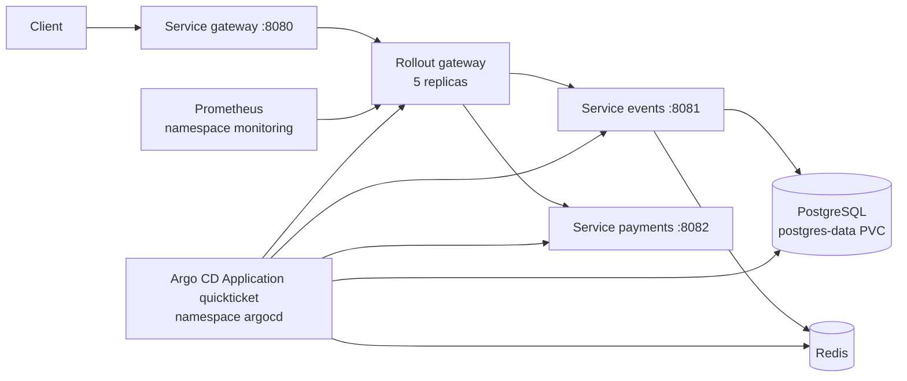

# QuickTicket SRE Handbook

## Architecture


```mermaid
flowchart LR
  U[Client] --> GS[Service gateway :8080]
  GS --> GR[Rollout gateway<br/>5 replicas]
  GR --> ES[Service events :8081]
  GR --> PS[Service payments :8082]
  ES --> PG[(PostgreSQL<br/>postgres-data PVC)]
  ES --> R[(Redis)]
  PR[Prometheus<br/>namespace monitoring] --> GR
  A[Argo CD Application quickticket<br/>namespace argocd] --> GR
  A --> ES
  A --> PS
  A --> PG
  A --> R
```

- Gateway is an Argo Rollouts resource named `gateway`; its Service is also `gateway`.
- Events owns event reads, reservations, PostgreSQL orders, and temporary Redis reservations.
- Gateway calls Payments, then Events confirms the order after a successful charge.
- PostgreSQL uses the `postgres-data` ReadWriteOnce PVC. Redis is still a single dependency.

## How to deploy

1. Work on the branch that Argo CD tracks. The current branch is `feature/lab10`.
2. Change tracked manifests in `k8s/`, inspect `git diff`, then commit and push to the fork:

   ```powershell
   git add k8s
   git commit -m "feat(scope): describe change"
   git push fork feature/lab10
   ```

3. Do not use `kubectl set image` as the final deployment method: Argo CD self-heal returns managed resources to Git.
4. Check GitOps and rollout state:

   ```powershell
   kubectl get application quickticket -n argocd
   kubectl get rollout gateway
   kubectl get pods -l app=gateway
   ```

5. Require `Synced`, `Healthy`, and five Ready gateway pods before declaring the deploy complete. Verify a health request and one reserve → pay → confirmed order afterwards.

## Monitoring

Use the in-cluster Prometheus service in namespace `monitoring`. These queries use the real gateway metric names:

```promql
# Traffic
sum(rate(gateway_requests_total[5m]))

# 5xx ratio
sum(rate(gateway_requests_total{status=~"5.."}[5m]))
/ sum(rate(gateway_requests_total[5m]))

# Gateway p99 latency in seconds
histogram_quantile(0.99,
  sum by (le) (rate(gateway_request_duration_seconds_bucket[5m])))

# Individual gateway target reachability
up{job="gateway"}
```

The Golden Signals dashboard has traffic, error, latency, dependency health, database-pool saturation, and SLO availability panels. Treat a missing `events_db_pool_size` series as an observability gap, not a zero value. During a high-load Lab 10 test, Events logged `PoolError: connection pool exhausted`; inspect Events logs and PostgreSQL connection pressure when gateway 502/503 rises.

## Incident response

1. Record the UTC start time and user impact. Check the customer entry point and dependencies:

   ```powershell
   kubectl get pods,svc
   kubectl get rollout gateway
   kubectl logs -l app=gateway --all-containers=true --since=10m --prefix=true
   kubectl logs deployment/events --since=10m
   kubectl logs deployment/payments --since=10m
   ```

2. Query gateway 5xx ratio and p99. Check `kubectl top pods` while the issue is active, not afterwards.
3. For payment failures, inspect the Payments `/health` response for `failure_rate` and `latency_ms`. For reservation/read failures, inspect Events and Redis; distinguish a dependency outage from an Events process failure.
4. Mitigate through Git for Argo-managed manifests: revert the faulty commit, push it, and wait for `quickticket` to become `Synced/Healthy`. Do not make a manual cluster change that self-heal will undo.
5. Verify recovery with gateway, Events, and Payments health responses plus a confirmed checkout. Escalate through the team's normal incident path if customer impact persists for 10 minutes or data integrity is uncertain; this handbook intentionally names no imaginary contacts.

## Backup and restore

`quickticket-backup` is a CronJob in `default`, scheduled every five minutes and writing custom-format dumps to the `postgres-backups` PVC. `backup-inspector` mounts that same PVC for inspection.

```powershell
kubectl get cronjob quickticket-backup
kubectl get jobs
kubectl exec deployment/backup-inspector -- ls -lt /backups
```

Before any restore:

1. Identify and confirm the target database and that writers are stopped or a maintenance boundary is agreed.
2. Validate the selected dump with `pg_restore --list`; never restore an unverified file.
3. Preserve a fresh backup of the current target if the action is destructive.

For the Lab 9 recovery procedure, copy the validated dump into the PostgreSQL pod and run `pg_restore --clean --if-exists` against `quickticket`. If PostgreSQL was replaced, wait for `pg_isready`; restart Events only when its existing connection pool cannot reconnect. Then confirm the Alembic revision, tables/counts appropriate to the snapshot, service health, and a complete checkout.

The `postgres-data` PVC preserves the database across an ordinary PostgreSQL pod restart and avoided a restore in the Lab 9 PVC drill. It is not a backup: it does not protect against PVC/node loss, corruption, or a destructive SQL change. Scheduled verified dumps and restore drills cover those separate failure modes.
