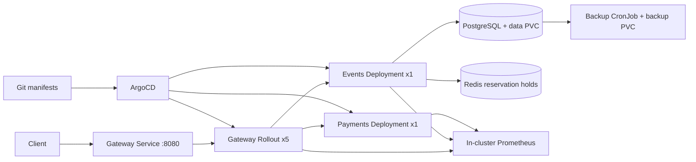

# QuickTicket SRE handbook

## Architecture


```mermaid
flowchart LR
  Client --> Svc[Gateway Service :8080]
  Svc --> G[Gateway Rollout x5]
  G --> E[Events Deployment x1]
  G --> P[Payments Deployment x1]
  E --> PG[(PostgreSQL + data PVC)]
  E --> R[(Redis reservation holds)]
  PG --> B[Backup CronJob + backup PVC]
  G --> M[In-cluster Prometheus]
  E --> M
  P --> M
  Git[Git manifests] --> CD[ArgoCD]
  CD --> G
  CD --> E
  CD --> P
```

The gateway exposes reads, reservations and payment checkout. Events reads PostgreSQL and uses Redis for time-limited reservation holds; payments handles charges. Gateway has five replicas; events, payments, Redis and PostgreSQL each have one in the current local k3d cluster. The two PostgreSQL PVCs use single-node `local-path` storage, so neither protects against node/disk loss. The diagram shows the intended GitOps path; see the deployment note below for its current limitation.

## Deploy and roll back

1. Check `kubectl config current-context` and `kubectl get pods,svc,rollouts,pvc -n default`. Confirm `kubectl -n monitoring get pods` and `kubectl -n argocd get application quickticket`.
2. Change application code and the matching `k8s/` manifest in a branch. The CI workflow from Lab 5 builds three GHCR images tagged by commit SHA and updates the manifest image tags. Review the exact SHA and `kubectl apply --dry-run=server -f k8s/` before integrating the change.
3. After the manifest reaches the Application's tracked `main` branch, ArgoCD should sync it. Check `kubectl -n argocd get application quickticket -o wide`, `kubectl get rollout gateway`, `kubectl get analysisruns`, and `kubectl get pods -l app=gateway`. For the Lab 7 canary, the sequence is 20%, analysis, 50%, then 100%; a failed analysis aborts the update while stable pods continue serving.
4. Verify `GET /health`, a real `/events` request, and gateway 5xx and latency metrics. If the canary fails, inspect `kubectl describe analysisrun <name>` and `kubectl argo rollouts get rollout gateway`. Restore the last known good manifest/image and sync; verify five stable endpoints before closing the change.

**Current repository state:** `main` does not contain the student `k8s/` manifests. They are on prior lab branches, while the live cluster was configured during those labs. ArgoCD currently reports `Unknown` sync status for `quickticket`; publishing only this Lab 10 branch will not activate the GitOps flow. Integrate the prior manifests into the tracked branch before relying on automatic sync. Do not treat `Healthy` alone as proof that Git and the cluster match.

## Monitor

Use `kubectl -n monitoring port-forward svc/prometheus 9091:9090` for the Prometheus UI. In-cluster Prometheus scrapes gateway, events and payments. Useful queries:

```promql
sum(rate(gateway_requests_total[5m]))
sum(rate(gateway_requests_total{status=~"5.."}[5m])) / sum(rate(gateway_requests_total[5m]))
histogram_quantile(0.99, sum by (le,path) (rate(gateway_request_duration_seconds_bucket[5m])))
events_db_pool_size
up{job=~"gateway|events|payments"}
```

Inspect rates by `path` and `status`; HTTP 409 indicates sold-out inventory and must not be mixed with 5xx. The Lab 3 availability objective is 99.5% over seven days; its latency objective is 95% of requests under 500 ms. Lab 8 added a payment p99 alert above one second for 30 seconds. The local Prometheus rule can fire, but no Alertmanager notification route is configured. Check `kubectl top pods` for CPU and memory during degradation and `kubectl get endpointslices -l kubernetes.io/service-name=gateway` for routing.

## Incident response

1. Record UTC start time and symptom. Check `kubectl get pods,svc,rollouts,analysisruns -n default` and the gateway 5xx, per-path latency, and request-rate queries. Keep the incident timeline in UTC.
2. Check gateway, events and payments logs (`kubectl logs deployment/events --since=10m`, similarly for payments; use `kubectl logs <gateway-pod>` for Rollout pods). Check `kubectl get endpointslices` and the Redis/PostgreSQL pod state.
3. If a new canary is responsible, `kubectl argo rollouts abort gateway`, then restore the known-good manifest. If a dependency is down, restore that dependency and verify application readiness. Lab 8 showed Redis failure cascading through health probes until all gateway endpoints vanished; a `200` on `/events` during early degradation does not prove the service will remain available.
4. Verify a real read and reservation, five Ready gateway pods, stable 5xx and latency windows, and endpoint recovery. Record detection, mitigation, recovery times and affected paths. Escalate to the instructor/TA if recovery has not started within ten minutes, with timestamps, pod states and logs.

## Backup and restore

Lab 9's `postgres-backup` CronJob writes PostgreSQL custom-format dumps every five minutes to `postgres-backups`, retaining the newest five. Check `kubectl get cronjob postgres-backup`, `kubectl get jobs`, and `kubectl exec deployment/backup-inspector -- ls -lt /backups`. Validate a candidate dump with `pg_restore --list` before using it.

For data loss, stop writes, record the last good order/event counts and backup timestamp, and copy the chosen dump into the PostgreSQL pod. Restore with `pg_restore -U quickticket -d quickticket --clean --if-exists --exit-on-error /tmp/backup.dump`; restart events if its DB pool retains broken connections. Verify schema, counts, migration revision and gateway API response before reopening writes. A pod replacement with the data PVC needed no restore in Lab 9 and recovered at the API in 15 seconds. Backup-only RPO is roughly the five-minute schedule plus delay; off-node copies and restore drills are still required for node loss.
