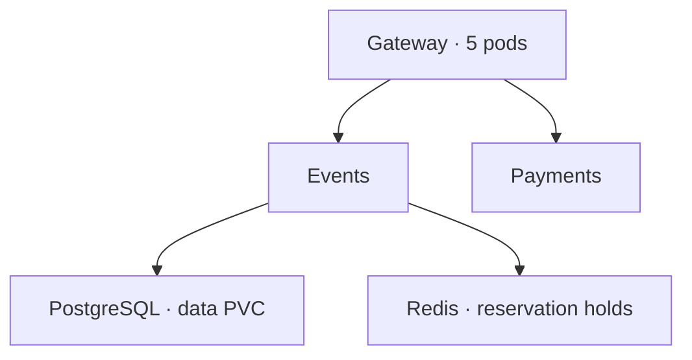

# QuickTicket SRE Handbook

Scope: local k3d `quickticket`, context `k3d-quickticket`, namespace `default`.
Operational GitOps source: `Esqavator/SRE-Intro`, `feature/lab9`, path `k8s`.
This compact handbook covers deployment, monitoring, response and recovery.

## Architecture


```mermaid
flowchart TD
    G["Gateway · 5 pods"] --> E["Events"]
    G --> P["Payments"]
    E --> D["PostgreSQL · data PVC"]
    E --> R["Redis · reservation holds"]
```

- In-cluster clients use `gateway:8080`; Prometheus scrapes gateway pod IPs.
- Gateway calls Events and Payments; Events owns inventory/orders and Redis holds.
- PostgreSQL is a single instance with `Recreate` and persistent data.
- Redis and the single k3d node remain failure domains. This is a lab, not HA.

## How to deploy

Existing image-build work ran on `feature/lab5` using “QuickTicket CI”.
For a new application release, commit code to the CI-enabled branch, push,
and verify the successful Actions run and published immutable image tag.
Confirm workflow triggers before using a different branch.

For the manifest change, start from the operational configuration:

```bash
git fetch origin
git switch -c release/quickticket-change origin/feature/lab9
# Edit k8s/<service>.yaml to the successfully built image tag.
kubectl --context k3d-quickticket -n default apply --dry-run=server -f k8s/
git add k8s/<service>.yaml
git commit -m "deploy: update QuickTicket image"
git push -u origin release/quickticket-change
gh pr create --repo Esqavator/SRE-Intro --base feature/lab9 \
  --head release/quickticket-change
```

After review, merge into `feature/lab9`. ArgoCD watches that branch and applies
the manifest. A gateway template change starts the 20% canary, timed pause,
Prometheus AnalysisRun, 50% stage and completion. Verify:

```bash
kubectl --context k3d-quickticket -n argocd get application quickticket
kubectl --context k3d-quickticket -n default get rollouts,analysisruns,pods
```

Require `Synced`, `Healthy`, five Ready gateway pods, successful analysis and
a health/list/reserve/pay smoke check. The current analysis threshold is
5% canary errors, looser than the 0.5% availability budget; align it before
treating it as an SLO deployment gate. If a canary fails, preserve evidence
and revert its manifest commit in the operational Git branch.

## Monitoring

Use in-cluster Prometheus, not the old Compose monitoring stack.
Existing Grafana dashboard: “QuickTicket Canary”. A Prometheus UI port-forward
is for observation; load tests must use the ClusterIP from inside Kubernetes.

Check gateway traffic, errors, latency and per-pod distribution:

```promql
sum(rate(gateway_requests_total[1m]))
sum(rate(gateway_requests_total{status=~"5.."}[1m]))
  / sum(rate(gateway_requests_total[1m]))
histogram_quantile(0.99,
  sum by (le,path) (rate(gateway_request_duration_seconds_bucket[1m])))
sum by (pod) (rate(gateway_requests_total[1m]))
```

Empty vectors or NaN require checking traffic and scrape targets.
The payment latency rule exists; external paging was not demonstrated.
Also inspect Events endpoints, pool errors, DB connections and CPU.
Lab 10 first breached at 50u/35.16 RPS; 25u/19.48 RPS passed.
These figures describe the read/reserve/health mix, not payment capacity.

## Incident response and escalation

1. Record UTC start time, affected paths and recent revision. Preserve logs.
2. Inspect pods, EndpointSlices, dependency health, AnalysisRuns and error rates.
3. If Events logs show `connection pool exhausted`, reduce offered load and
   inspect connection reuse/pool occupancy. Do not blindly increase every pool.
4. For Redis failure, expect reservation impact and potentially Events
   readiness removal. Restore Redis and verify reads plus checkout.
5. For a bad deployment, revert the manifest in Git; confirm ArgoCD applies
   the known-good state. Avoid untracked changes under auto-sync.
6. After DB recovery, restart Events if its pool retains broken connections.
   Confirm health, listing and a complete checkout, then watch the error window.

The sole lab maintainer is the first responder. In a team, escalate data-loss
risk immediately to the database owner and persistent SLO impact to the
on-call/service owner; maintain incident updates with measured scope and times.
No external on-call contact or notification route is configured in this lab.

## Backup and restore

The data PVC survives pod replacement; it does not replace independent backups.
Lab 9's optional five-minute CronJob and backup PVC were removed after testing.
To enable them again from `feature/lab9`, apply backup storage first:

```bash
kubectl --context k3d-quickticket apply -f labs/lab9/backup-storage.yaml
kubectl --context k3d-quickticket apply -f k8s/backup-cronjob.yaml
```

The CronJob retains five validated dumps; ArgoCD excludes this optional file.
Copy a trusted backup to the selected Postgres pod and compare host/pod SHA-256
before restoring. Check its TOC with `pg_restore --list`.

For a destructive restore, first disable automatic reconciliation temporarily,
quiesce Events writes, and preserve current data if recoverable. Restore using
`pg_restore -U quickticket -d quickticket --clean --if-exists --exit-on-error
--single-transaction <verified-dump>`. Verify events/orders counts and Alembic
revision before restoring Events replicas. Reconnect Events, run checkout
smoke checks, restore the saved GitOps policy, and record RTO and lost records.

Never delete `postgres-data` during routine cleanup. A truncated transfer
caused a real Lab 9 restore failure; checksum validation prevented recurrence.
A backup is useful only when its restore procedure has been tested.
