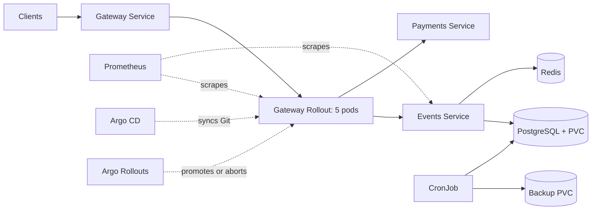

# QuickTicket SRE Handbook

## Architecture


```mermaid
flowchart LR
    U[Clients] --> S[Gateway Service]
    S --> G[Gateway Rollout: 5 pods]
    G --> E[Events Service]
    G --> P[Payments Service]
    E --> DB[(PostgreSQL + PVC)]
    E --> R[(Redis)]
    M[Prometheus] -. scrapes .-> G
    M -. scrapes .-> E
    A[Argo CD] -. syncs Git .-> G
    AR[Argo Rollouts] -. promotes or aborts .-> G
    C[CronJob] --> B[(Backup PVC)]
    C --> DB
```

- Gateway is exposed through a Kubernetes Service and deployed as a five-pod
  Argo Rollout.
- Events owns event listing and reservations. It uses PostgreSQL for durable
  data and Redis for temporary ticket holds.
- Payments handles charges and supports controlled failure/latency injection.
- Argo CD reconciles Git with the cluster. Argo Rollouts performs canary steps
  and Prometheus-backed analysis.
- PostgreSQL uses a PVC. A CronJob writes custom-format dumps to a separate
  backup PVC and keeps the five newest files.

## How to deploy

1. Create a feature branch from the current upstream `main`.
2. Change application code or Kubernetes manifests and run local validation.
3. Commit and push the feature branch, then open a pull request to upstream
   `main`.
4. After review and merge, CI builds immutable container images and updates the
   declared image reference.
5. Argo CD detects the Git change and reconciles the `k8s/` manifests.
6. For Gateway changes, Argo Rollouts creates a canary. Prometheus analysis
   decides whether it can continue. A failed analysis aborts to the existing
   stable ReplicaSet.
7. Verify the Argo CD application is `Synced/Healthy`, the Rollout is `Healthy`,
   all pods are Ready, and Gateway `/health` returns HTTP 200.

Useful verification:

```bash
kubectl get pods,svc -n default
kubectl argo rollouts get rollout gateway
kubectl get application quickticket -n argocd
kubectl run smoke --image=curlimages/curl:latest --rm -i --restart=Never \
  -- curl -sS -w '\n%{http_code}\n' http://gateway:8080/health
```

Never promote a canary using only pod readiness. Confirm request success,
latency, error rate, and dependency health.

## Monitoring

Start with the golden signals:

```promql
# Request rate
sum(rate(gateway_requests_total[5m]))

# 5xx ratio; keep 409 separate
sum(rate(gateway_requests_total{status=~"5.."}[5m]))
/
sum(rate(gateway_requests_total[5m]))

# p99 by route
histogram_quantile(
  0.99,
  sum by (le, path) (rate(gateway_request_duration_seconds_bucket[5m]))
)
```

Check:

- Gateway 5xx ratio and p95/p99 by path;
- Events and Payments health, CPU, restarts, and dependency timeouts;
- Argo Rollout phase, weight, current step, and AnalysisRun phase;
- PostgreSQL connection-pool wait time, storage, backup age, and restore tests;
- Redis availability and hold-related errors;
- 409 inventory conflicts as a business-capacity signal, not a 5xx SLO failure.

Escalate when 5xx exceeds 5% for two minutes, p99 exceeds the route objective,
the error-budget burn alert fires, or a stateful dependency risks data loss.

## Incident response

1. Record the UTC start time and current alert state.
2. Check Gateway health, then Events and Payments health directly.
3. Inspect Rollout, pods, endpoints, restarts, and recent logs.
4. Query request rate, 5xx ratio, p99, and dependency-specific errors.
5. Mitigate the smallest reversible scope:
   - abort a bad canary;
   - restore a safe failure-injection value;
   - start Redis or recover PostgreSQL;
   - scale only the saturated dependency.
6. Verify recovery with a real event listing, reservation, and payment request.
7. Confirm alerts resolve and capture the timeline, commands, metrics, and root
   cause for the postmortem.

For a bad Gateway canary:

```bash
kubectl argo rollouts abort gateway
kubectl argo rollouts get rollout gateway
```

For Redis failure, confirm both direct state and user impact:

```bash
kubectl get deployment,pods -l app=redis
kubectl exec deployment/redis -- redis-cli PING
curl -sS http://localhost:3080/health
```

Do not delete PVCs or volumes during diagnosis. Escalate to the instructor or
service owner if a stateful dependency cannot be restored within 10 minutes,
if recovery risks overwriting newer data, or if credentials may be exposed.

## Backup and restore

The `postgres-backup` CronJob runs every five minutes, creates a custom-format
dump, and retains the five newest files on the `postgres-backups` PVC. Confirm
the CronJob, latest Job, and files:

```bash
kubectl get cronjob postgres-backup
kubectl get jobs --sort-by=.metadata.creationTimestamp
kubectl exec deployment/backup-inspector -- ls -lht /backups
```

Restore procedure:

1. Stop write-producing load and record the incident time.
2. Select the newest valid dump and copy it into the active Postgres pod.
3. Inspect its table of contents with `pg_restore --list`.
4. Restore with `--clean --if-exists` only after confirming the target database.
5. Restart Events so its pool reconnects.
6. Verify row counts, schema migration revision, Gateway health, and one complete
   checkout flow.

```bash
POD=$(kubectl get pod -l app=postgres -o name | cut -d/ -f2)
kubectl cp /path/to/quickticket.dump "$POD:/tmp/restore.dump"
kubectl exec "$POD" -- pg_restore --list /tmp/restore.dump | head
kubectl exec "$POD" -- pg_restore -U quickticket -d quickticket \
  --clean --if-exists /tmp/restore.dump
kubectl rollout restart deployment/events
kubectl rollout status deployment/events --timeout=60s
```

The PVC handles a pod restart but is not a backup. Continue testing scheduled
restore procedures and move copies off-cluster so a node or volume failure does
not remove both the database and its recovery data.
